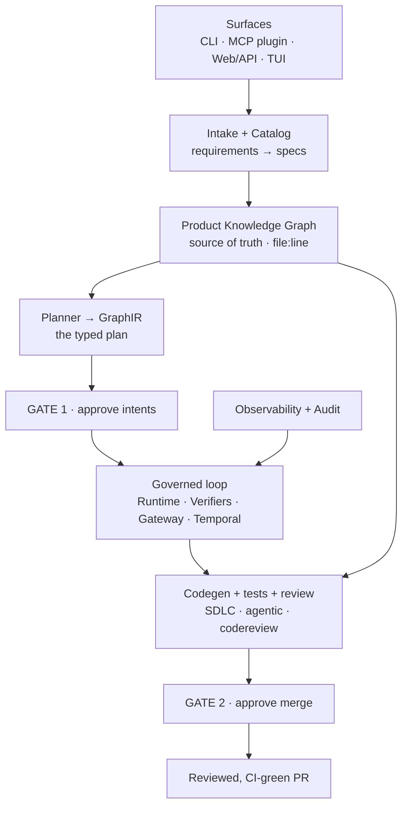

# Architecture

How Spine is put together, end to end. For *using* it see [USER_GUIDE.md](USER_GUIDE.md); for the
knowledge graph specifically see [KNOWLEDGE_GRAPH.md](KNOWLEDGE_GRAPH.md); for working on the code
see [CLAUDE.md](CLAUDE.md).

  

> **▶ [Open the interactive diagram](https://raw.githubusercontent.com/synaptixs/spine/main/assets/spine-architecture-diagram.html)**
> — animated, self-contained (no network), with a "step the flow" control that pauses on each gate.
> Download it and open in a browser.

---

## The one-sentence version

A request flows **top to bottom** — from a human surface, through comprehension and planning, into a
**governed execution loop that pauses at two human gates** — and comes out as a reviewed, CI-green
pull request. Two things cut across every layer: the **Product Knowledge Graph** as the source of
truth, and an **observability + audit** rail that records every step.

## The layers

### A · Surfaces — how you talk to it
| Component | Package | Role |
|---|---|---|
| CLI | `cli.py` | 41 commands — the primary surface |
| MCP plugin server | `plugin/` | Spine *as* an MCP server, so Claude Code / Codex call its tools |
| Web UI + REST API | `registry/` | FastAPI service + the operator web inbox at `/app` |
| Terminal UI | `tui/` | Keyboard-driven run watcher over the same API |

### B · Intake & comprehension — understand before acting *(deterministic, no LLM)*
| Component | Package | Role |
|---|---|---|
| Intake | `intake/` | Requirements sources (Confluence / Jira / Notion / OpenSpec / files) → intents → specs |
| Catalog / profile | `catalog/` | Detect languages, framework, task type; choose the capability plan |
| Knowledge synthesis | `knowledge/` | `understand` (→ committed `episteme/`) and `state`, built on top of the graph |

### The Product Knowledge Graph — the substrate, not a box
`pkg/` turns code **and** docs into a deterministic, `file:line`-grounded graph — **7 node kinds**
(Module, Type, Function, Field, Endpoint, Entity, Doc) and **9 edge kinds** (IMPORTS, CONTAINS,
CALLS, IMPLEMENTS, READS, WRITES, EXPOSES, REFERENCES, MENTIONS). It is the **source of truth** every
comprehension and delivery surface reads from — so in the diagram it's drawn as a foundation band
spanning the middle, not a peer in a row.

### C · Planning — the plan as a typed artifact
| Component | Package | Role |
|---|---|---|
| Planner | `planner/` | Objective → picks agent templates → emits a GraphIR |
| GraphIR | `ir/` | Typed intermediate representation of the workflow — a validated plan, not free-form |
| Registry | `registry/` | Reusable agent templates + tool contracts, versioned |

### D · Governed execution loop — the engine
| Component | Package | Role |
|---|---|---|
| Runtime | `runtime/` | The perceive → plan → act → observe loop; one node = one contract-checked LLM call |
| Verifier chain | `runtime/` | Schema · Confidence · Evidence · Policy · Glossary checks on every step |
| Gateway | `gateway/` | Resolves per-tool credentials at call time; sandboxed tool execution |
| Approval gates | `approval/` | The **two human bookends** — approve intents, approve merge |
| Durable execution | `temporal/` | Temporal workflows, resumable across the gate pauses |

### E · SDLC delivery — turn the plan into a PR
| Component | Package | Role |
|---|---|---|
| SDLC pipeline | `sdlc/` | spec → grounded codegen → tests → refine → PR (the largest package) |
| Agentic codegen | `agentic/` | The ReAct write / test / submit in-loop tool set |
| Code review | `codereview/` | GitHub App auth, PR review, secret / security / style verifiers |
| Personas | `personas/` | The same machinery, different jobs — PR reviewer, codebase auditor |

### F · Shared services & cross-cutting
| Component | Package | Role |
|---|---|---|
| Core | `core/` | LLM client (LiteLLM), env, structured Claim / Evidence types |
| MCP client | `mcp/` | *Consume* external MCP servers (DBs, Atlassian) as governed tools |
| Storage | `storage/` | Async S3-compatible object store (Postgres via the API layer) |
| Observability | `obs/` | Live OpenTelemetry tracing over every run |
| Notify | `notify/` | Slack notifications on gates |
| Evals | `evals/` | Measurement harness |
| Semantic spine | `spine/` | ontomesh × infodrift seams — domain grounding, drift → remediation. **Gated, optional.** |

## The two gates

Nothing crosses a gate without a human. **Gate 1** approves the derived intents before any code is
written; **Gate 2** approves the merge before the PR lands. Between them the loop runs autonomously;
outside them nothing is pushed, merged, or written to your tracker. The pipeline **ends at a reviewed
PR** — deployment is out of scope by design.

## Two properties worth calling out

- **Comprehension is deterministic and no-LLM.** `understand` / `state` and the PKG produce
  byte-identical output for the same commit. The LLM lives in the *execution loop* (codegen) and
  *intake* extraction — never in comprehension.
- **Everything is grounded and audited.** Every fact carries `file:line` provenance; every tool
  call, approval and decision is recorded in an append-only audit trail.

---

## Diagram (renders on GitHub and in Spine's own web UI)

