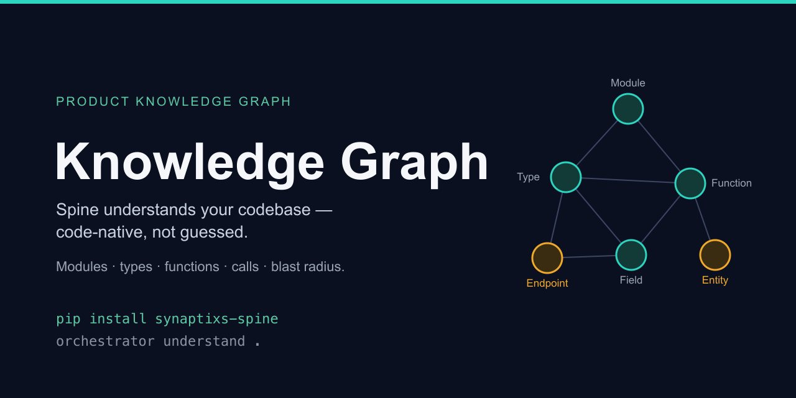
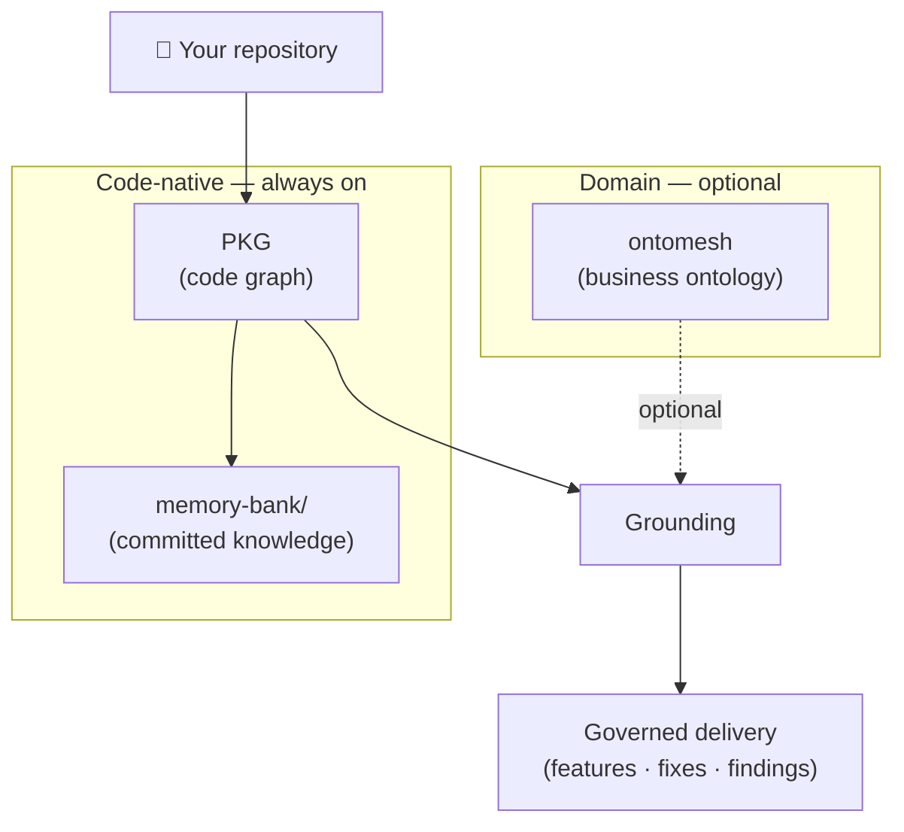
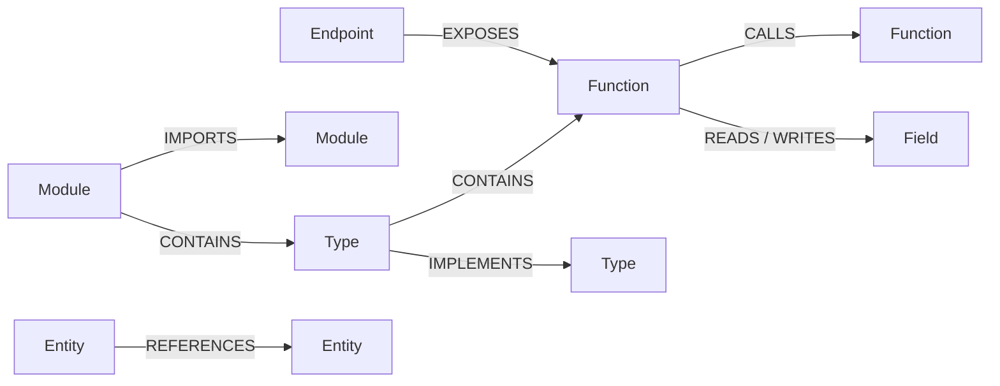
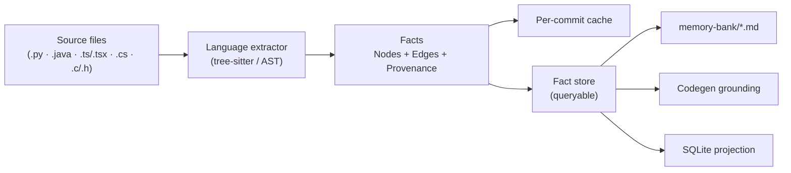
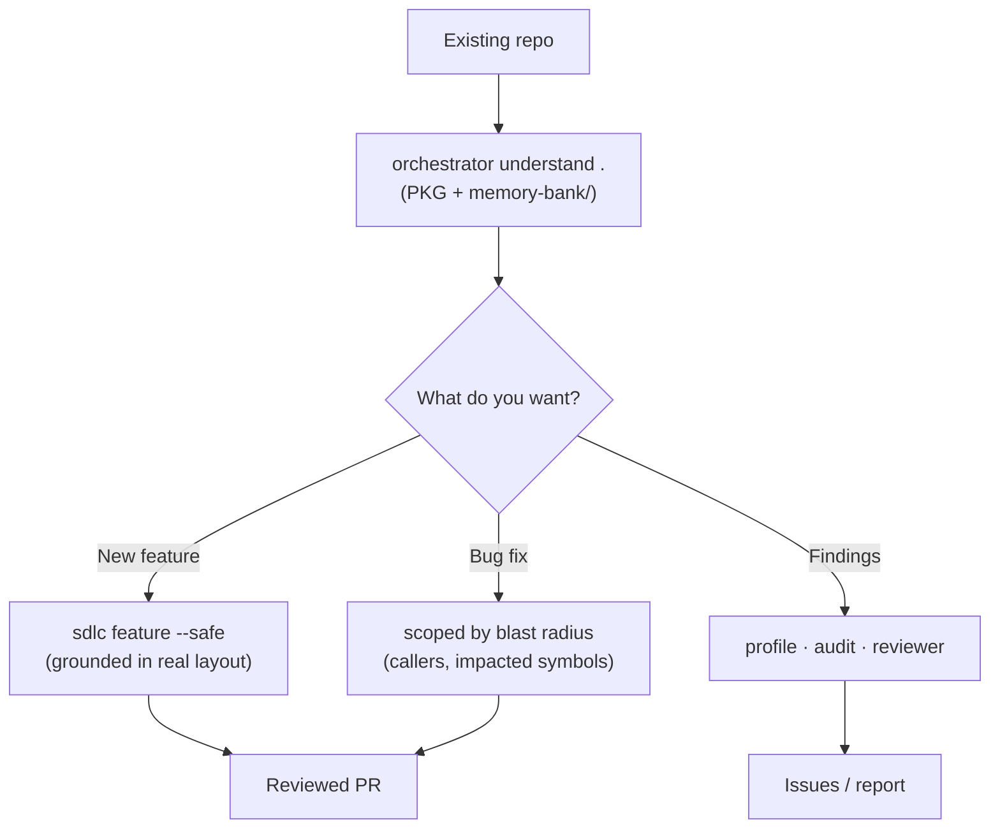
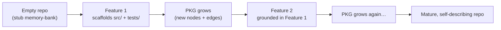

<p align="center">
  
</p>

# The Product Knowledge Graph (PKG)

> How Spine *understands your codebase* — a code-native knowledge graph that grounds
> every feature, fix, and review in what your repo actually contains.

This is the single guide to the PKG: what it is, the model it builds, how to use it,
and how it powers both **brownfield** (existing code) and **greenfield** (new) projects.

---

## TL;DR

```bash
pip install synaptixs-spine

orchestrator understand .          # build the PKG → write a committed memory-bank/
orchestrator pkg extract . -q User # inspect: callers + blast radius of a symbol
```

The PKG is built **from your code** (deterministic, no LLM). Spine reads it before it
writes anything, so generated code matches your repo's real structure and conventions.

---

## 1. What the PKG is (and isn't)

The PKG is a **graph of your code** — the modules, types, functions, fields, endpoints,
and data entities in your repo, plus the relationships between them (calls, imports,
implements, reads/writes, foreign keys). It is extracted directly from source via
language-native parsers, so it's **accurate, not guessed**.

> **It is not ontomesh.** A common confusion: the PKG understands *code structure*;
> ontomesh (optional) understands the *business domain*. The PKG is always-on and
> required; ontomesh is an optional layer that composes on top. See
> [§7](#7-how-grounding-uses-the-pkg) and [OPERATIONS.md](OPERATIONS.md#the-semantic-spine).



---

## 2. The data model

Everything in the PKG is one of six **node kinds**, connected by eight **edge kinds**.
Every node and edge carries **provenance** — the exact `file:line` it came from — so any
claim is traceable back to source.

### Node kinds

| Node | Represents |
|---|---|
| `Module` | A file / module |
| `Type` | A class, struct, interface, or enum |
| `Function` | A function, method, or procedure |
| `Field` | An attribute, property, or column |
| `Endpoint` | An HTTP route or RPC |
| `Entity` | An ORM model / data entity |

Each node has a stable, language-prefixed id (e.g. `py:billing.invoice.Invoice`), a
`name`, its `language`, and `provenance` (`file:line`). Nodes referenced but not defined
in-repo (e.g. a third-party class) are marked `external`.

### Edge kinds

| Edge | Meaning |
|---|---|
| `CONTAINS` | module → type, type → method |
| `IMPORTS` | module → module |
| `CALLS` | function → function |
| `IMPLEMENTS` | subclass / interface implementation |
| `READS` / `WRITES` | function → field/column |
| `EXPOSES` | endpoint → handler |
| `REFERENCES` | entity → entity (foreign key) |

### How it fits together



This is what lets Spine answer questions like *"what calls this function?"*, *"what's the
blast radius of changing this type?"*, and *"which endpoints touch this table?"* — by
walking edges, not by guessing.

---

## 3. How the PKG is built



- **Deterministic, no LLM.** Extraction is pure parsing — same code in, same facts out.
- **Per-language front-ends.** A common schema with pluggable parsers:
  | Language | Status | Enable with |
  |---|---|---|
  | Python | ✅ built-in | (default) |
  | Java | ✅ | `pip install 'synaptixs-spine[java]'` |
  | TypeScript / TSX | ✅ | `pip install 'synaptixs-spine[typescript]'` |
  | C# | ✅ + framework edges | `pip install 'synaptixs-spine[csharp]'` |
  | C | ✅ + `#include` graph | `pip install 'synaptixs-spine[c]'` |

  C# additionally lifts **framework edges** into the graph: ASP.NET Core controllers
  and Minimal-API routes become `Endpoint` nodes with `EXPOSES` edges to their
  handlers, and EF Core entities (`DbSet<T>` / `[Table]`) become `Entity` nodes with
  `REFERENCES` edges following navigation properties.

  C uses the **translation unit (file)** as the module and builds the **`#include`
  graph** (`IMPORTS`); a function prototype in a `.h` and its definition in a `.c`
  **merge onto one node** (the definition wins), `CALLS` resolve across files by name,
  and a struct member whose type is another struct becomes a `REFERENCES` data edge.
- **Cached per commit.** Re-running on an unchanged tree reuses the cache; `--refresh`
  forces a re-extract. So `understand` is cheap to re-run as the code evolves.

---

## 4. Using the PKG — CLI reference

### `orchestrator understand` — the everyday entry point
Builds the PKG and renders a committed, human- and AI-readable **memory bank**:

```bash
orchestrator understand .                 # writes ./memory-bank/*.md
orchestrator understand . --refresh       # re-extract instead of using the commit cache
```

It produces: `architecture.md`, `domain-model.md`, `tech-context.md`, `conventions.md`,
`glossary.md`, and `progress.md`. **Commit `memory-bank/`** so your whole team — and any
AI tool — reads the same code-true project truth.

### `orchestrator state` — the team-facing current-state report
A higher-level view rendered from the same graph (deterministic, no LLM) — *what the repo
is today and how healthy it looks*:

```bash
orchestrator state .                       # developer view (architecture, components, hotspots)
orchestrator state . --lens stakeholder    # plain-language view
orchestrator state . --out STATE.md        # write to a file (otherwise printed)
```

It renders a plain-language **overview**, an **infrastructure & runtime** breakdown (the
datastores, queues, cloud, container services and external APIs the repo *declares* it
needs — read from manifests, build files, and `docker-compose`), a **code-structure** map
(layout by component + entry points), a **system-architecture diagram** (components grouped
into zones with weighted dependency arrows from the import/`#include` graph), a
**component-dependency** table, **call-graph hotspots**, complexity / god-components,
test-coverage and recent-activity signals, a name-based security surface, and prioritized
recommendations. A report is a *view* — re-run to refresh.

### `orchestrator pkg extract` — inspect the raw graph
```bash
orchestrator pkg extract .                # summary of nodes/edges by kind
orchestrator pkg extract . -q Invoice     # callers + blast radius of a symbol
orchestrator pkg extract . --json         # dump all facts as JSON
```

### `orchestrator pkg export` — the queryable projection
```bash
orchestrator pkg export . --db pkg-facts.db   # a kind-per-table SQLite database
```
Query it with any SQLite tool — one table per node/edge kind, provenance included. (This
is also the "ontomesh-ready" projection that bridges code facts to the domain layer.)

### `orchestrator pkg docs` — catch stale docs
```bash
orchestrator pkg docs . -d README.md -d ARCHITECTURE.md
```
Reconciles documentation claims against the actual fact graph and flags drift (docs that
describe code that no longer exists, etc.).

---

## 5. Brownfield projects — comprehend, then deliver

For an **existing** repo, the PKG gives Spine an instant, accurate map so new work fits in.



1. **Comprehend** — `orchestrator understand .` builds the graph; `profile`/`audit`
   surface a map and findings. No LLM, so it's fast and deterministic.
2. **Deliver, grounded** — `orchestrator sdlc feature --source <spec> --safe`. Codegen
   uses `--layout auto`, which **follows the repo's existing structure and never
   scaffolds**. The run prints `[grounding] target-KG context: N chars` — that's the PKG
   feeding real symbols and conventions into generation, so new code reuses what's there.
3. **Fix & review** — the same graph powers **blast-radius**-scoped fixes (it knows the
   callers of what you change) and the reviewer/auditor passes.

> **Why it matters:** on a large unfamiliar codebase, the PKG is the difference between
> "an agent guessing from a few files" and "an agent that knows the call graph, the blast
> radius, and your conventions."

---

## 6. Greenfield projects — knowledge that grows with the code

For a **new** repo, there's little to extract at first — so the PKG **accumulates as you
build**. Knowledge isn't a one-time scan; it compounds.



1. The first `understand` writes a **stub** (there's barely any code yet).
2. The first `sdlc feature` run **scaffolds** `src/<package>/` + `tests/` and a
   pytest-ready layout, then generates into it.
3. As each feature lands, the PKG gains nodes and edges — and the **next** feature is
   grounded in everything built so far. Re-run `orchestrator understand . --refresh` (or
   it refreshes on the next run) to keep `memory-bank/` in step.
4. Over time the repo **builds its own code-true memory**, so even a brand-new project
   quickly becomes one an agent (or a new teammate) can navigate.

So: **brownfield** starts with a full map; **greenfield** grows one. Either way, by the
time Spine writes code, it's grounded in the current truth of the repo.

---

## 7. How grounding uses the PKG

Before generating, Spine retrieves the **relevant slice** of the PKG for the task and
prepends it to the model's context (the `PKGCodegenGrounder`). That slice includes:

- the **relevant existing symbols** (so new code reuses them, matching conventions),
- the **API surface** around the change,
- the **blast radius** — callers and impacted symbols of what's changing,

and a **verifier** checks the generated code's claims back against the graph. When
ontomesh is configured, its cited *domain* knowledge composes with this *code-true*
context (`CompositeGrounder([PKG, ontomesh])`) — code structure **and** business meaning.

The headline retrieval query is **blast radius**: *given the lines I'm about to change,
what's impacted and where do I look for breakage?* That's what keeps changes scoped and
reviews honest.

---

## 8. Inspecting & querying

- **Quick CLI:** `orchestrator pkg extract . -q <Symbol>` → callers + blast radius.
- **Full graph:** `orchestrator pkg extract . --json` → every node and edge.
- **SQL:** `orchestrator pkg export . --db pkg-facts.db` → a kind-per-table SQLite DB you
  can query directly, e.g.:
  ```sql
  -- which endpoints expose handlers that write to a given column's table?
  SELECT * FROM edge_EXPOSES;     -- one table per edge kind
  SELECT * FROM node_Function;    -- one table per node kind, with file:line provenance
  ```
- **Committed prose:** `memory-bank/*.md` — the human-readable rendering of the graph.

---

## 9. Honest limits

- **Static, not runtime.** The PKG is built from source structure; it doesn't capture
  runtime behavior, dynamic dispatch it can't see, or values only known at execution.
- **Parser coverage.** Python/Java/TypeScript/C#/C today. Other languages aren't
  extracted yet (their files are simply not represented). For C, parsing is
  pre-preprocessor — heavy macro use yields partial facts (we never run `cpp`).
- **Heuristic edges.** Some edges (e.g. data-layer foreign keys) are inferred and improve
  over time; treat them as strong hints, not proofs.
- **Domain meaning is separate.** The PKG knows *structure*, not business intent — that's
  ontomesh's job, and it's optional.

---

## See also

- [USER_GUIDE.md](USER_GUIDE.md) — the everyday workflow (the Understand step uses the PKG).
- [FEATURES.md](FEATURES.md) — where the PKG sits among Spine's capabilities.
- [OPERATIONS.md](OPERATIONS.md#the-semantic-spine) — the optional ontomesh domain layer.
</content>
