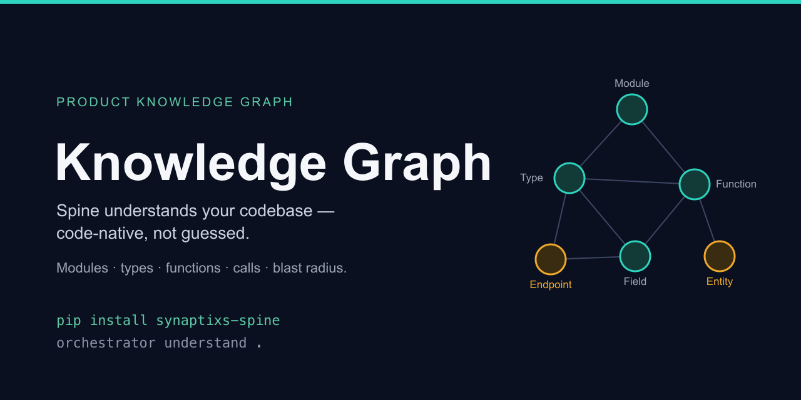
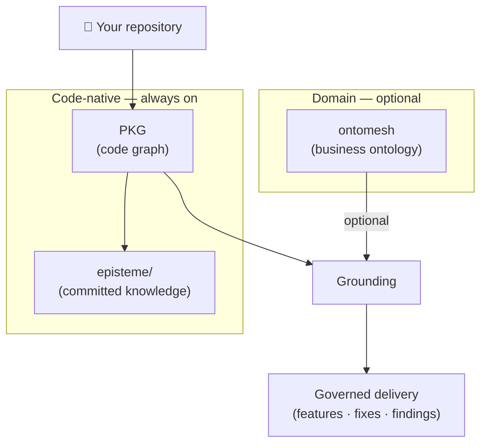
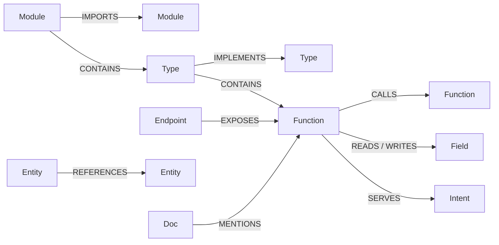
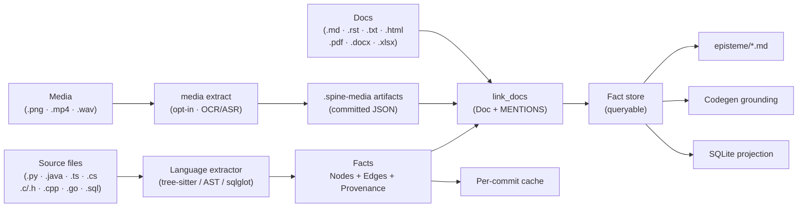
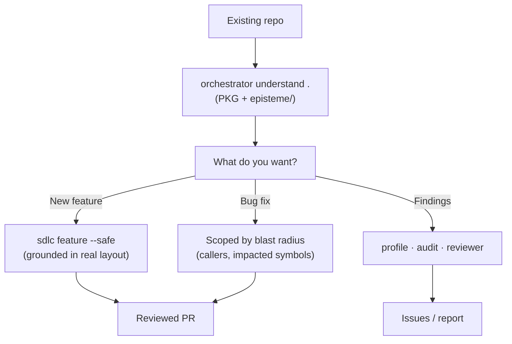
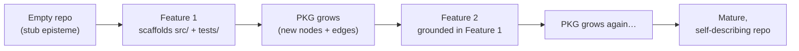

<p align="center">
  
</p>

# The Product Knowledge Graph (PKG)

> How Spine *understands your codebase* — a code-native knowledge graph that grounds
> every feature, fix, and review in what your repo actually contains.

This is the single guide to the PKG: what it is, the model it builds, how to use it,
and how it powers both **brownfield** (existing code) and **greenfield** (new) projects.

---

## TL;DR

```bash
pip install synaptixs-spine

orchestrator understand .          # build the PKG → write a committed episteme/
orchestrator pkg extract . -q User # inspect: callers + blast radius of a symbol
orchestrator pkg accuracy          # how right is it? precision & recall, per kind, per language
```

The PKG is built **from your code** (deterministic, no LLM). Spine reads it before it
writes anything, so generated code matches your repo's real structure and conventions.

Its accuracy is measured rather than asserted: **precision 1.00 on every node and edge kind
across all 8 front-ends** — nothing in the graph is invented — with the remaining gap being
missing `CALLS` edges, not wrong ones (§10).

---

## 1. What the PKG is (and isn't)

The PKG is a **graph of your code** — the modules, types, functions, fields, endpoints,
and data entities in your repo, plus the relationships between them (calls, imports,
implements, reads/writes, foreign keys). It is extracted directly from source via
language-native parsers, so it's **accurate, not guessed**.

> **It is not ontomesh.** A common confusion: the PKG understands *code structure*;
> ontomesh (optional) understands the *business domain*. The PKG is always-on and
> required; ontomesh is an optional layer that composes on top. See
> [§7](#7-how-grounding-uses-the-pkg) and [OPERATIONS.md](OPERATIONS.md#the-semantic-spine).


```mermaid
flowchart TB
    repo["📁 Your repository"]
    subgraph code["Code-native — always on"]
    pkg["PKG<br/>(code graph)"]
    mb["episteme/<br/>(committed knowledge)"]
    end
    subgraph dom["Domain — optional"]
    onto["ontomesh<br/>(business ontology)"]
    end
    ground["Grounding"]
    deliver["Governed delivery<br/>(features · fixes · findings)"]
    repo --> pkg
    pkg --> mb
    pkg --> ground
    onto -->|optional| ground
    ground --> deliver
```

---

## 2. The data model

Everything in the PKG is one of seven **node kinds**, connected by nine **edge kinds**.
Every node and edge carries **provenance** — the exact `file:line` it came from — so any
claim is traceable back to source.

### Node kinds

| Node | Represents |
|---|---|
| `Module` | A file / module |
| `Type` | A class, struct, interface, or enum |
| `Function` | A function, method, or procedure |
| `Field` | An attribute, property, or column |
| `Endpoint` | An HTTP route or RPC |
| `Entity` | An ORM model / data entity |
| `Doc` | A documentation page or section (README, design doc, PDF) — section-granular, e.g. `doc:README.md#usage`, with provenance at the heading line |
| `Intent` | A ticket a symbol was changed for, e.g. `intent:SSPN-49`. The one node kind that is a *reason* rather than an artefact, so it carries **no provenance** — an intent is not a place in a file |

Each node has a stable, language-prefixed id (e.g. `py:billing.invoice.Invoice`), a
`name`, its `language`, and `provenance` (`file:line`). Nodes referenced but not defined
in-repo (e.g. a third-party class) are marked `external`.

### Edge kinds

| Edge | Meaning |
|---|---|
| `CONTAINS` | module → type, type → method |
| `IMPORTS` | module → module |
| `CALLS` | function → function |
| `IMPLEMENTS` | subclass / interface implementation |
| `READS` / `WRITES` | function → field/column |
| `EXPOSES` | endpoint → handler (the server half of an HTTP route) |
| `CONSUMES` | caller → the endpoint it calls (the client half) |
| `REFERENCES` | entity → entity (foreign key) |
| `MENTIONS` | doc → the code symbol/module it describes (bound, `file:line`-grounded) |
| `SERVES` | symbol → the intent it was last changed for (from git blame + the commit's issue key) |

### Front-end capability matrix

Nine of the ten edge kinds are **mechanical** — they say what calls what, what contains what.
`MENTIONS` and `SERVES` are the two that carry *meaning*: what a symbol is documented by, and
what it was built for. Everything else in the graph answers *"what happens"*; those two answer
*"why"*.

The vocabulary above is universal; the **front-ends are not**. Python emits four of the seven
node kinds, C# emits six. That gap changes how an answer should be read: `impact_of(handler)`
returning `[]` means *"nothing calls this"* only if the front-end has an `EXPOSES` edge to
offer in the first place.

`EXPOSES` and `CONSUMES` are two halves of one join, and a repo shipping both a service and
its client needs both to answer "what breaks if I change this handler". `impact_of` follows
them in sequence — handler → the endpoint it serves → the code that calls it. Only Python
emits `CONSUMES` today, and only for **literal** paths: a request built from an f-string or
a variable yields no edge, because a wrong edge is worse than an absent one.

<!-- BEGIN capability-matrix — generated by `orchestrator pkg capabilities`; do not edit by hand -->
**Nodes**

| Front-end | `Module` | `Type` | `Function` | `Field` | `Endpoint` | `Entity` | `Doc` | `Intent` |
|---|---|---|---|---|---|---|---|---|
| `python` | ✓ | ✓ | ✓ | ✓ | ✓ | ✓ | · | · |
| `java` | ✓ | ✓ | ✓ | ✓ | ✓ | · | · | · |
| `typescript` | ✓ | ✓ | ✓ | ✓ | · | · | · | · |
| `csharp` | ✓ | ✓ | ✓ | ✓ | ✓ | ✓ | · | · |
| `c` | ✓ | ✓ | ✓ | ✓ | · | · | · | · |
| `cpp` | ✓ | ✓ | ✓ | ✓ | · | · | · | · |
| `go` | ✓ | ✓ | ✓ | ✓ | · | · | · | · |
| `sql` | ✓ | · | ✓ | ✓ | · | ✓ | · | · |

**Edges**

| Front-end | `IMPORTS` | `CONTAINS` | `CALLS` | `IMPLEMENTS` | `READS` | `WRITES` | `EXPOSES` | `CONSUMES` | `REFERENCES` | `MENTIONS` | `SERVES` |
|---|---|---|---|---|---|---|---|---|---|---|---|
| `python` | ✓ | ✓ | ✓ | ✓ | ✓ | ✓ | ✓ | ✓ | ✓ | · | · |
| `java` | ✓ | ✓ | ✓ | ✓ | · | · | ✓ | · | · | · | · |
| `typescript` | ✓ | ✓ | ✓ | ✓ | · | · | · | · | · | · | · |
| `csharp` | ✓ | ✓ | ✓ | ✓ | · | · | ✓ | · | ✓ | · | · |
| `c` | ✓ | ✓ | ✓ | · | · | · | · | · | ✓ | · | · |
| `cpp` | ✓ | ✓ | ✓ | ✓ | · | · | · | · | ✓ | · | · |
| `go` | ✓ | ✓ | ✓ | ✓ | · | · | · | · | ✓ | · | · |
| `sql` | · | ✓ | ✓ | · | ✓ | ✓ | · | · | ✓ | · | · |

Read a `·` as *this front-end has no code that emits that kind* — not as *your repo
has none*. A front-end that can emit `Endpoint` still emits none for a repo without
routes; `pkg verify`'s `source-parity` check is what answers that question.

`Doc` is empty down the whole column because no *language* produces it. These passes
do, for every language, and they are why the matrix is not the full picture:

| Pass | Runs for | Emits |
|---|---|---|
| `pkg/doc_link.py` | documentation ingestion — runs for every language | `Doc`, `MENTIONS` |
| `pkg/import_link.py` | the whole-repo import join | `Module`, `IMPORTS` |
| `pkg/data_layer_link.py` | a live database, via `mcp ingest-db` | `Entity`, `CONTAINS`, `REFERENCES` |
| `pkg/intent_link.py` | git history — blame joined to the commit's issue key | `Intent`, `SERVES` |
<!-- END capability-matrix -->

The table is generated from the front-ends' own source and checked by
`tests/pkg/test_capabilities.py`, so it fails the build rather than drifting. Regenerate it
with `orchestrator pkg capabilities`.

### How it fits together


```mermaid
flowchart LR
    M["Module"]
    M2["Module"]
    T["Type"]
    T2["Type"]
    F["Function"]
    F2["Function"]
    FL["Field"]
    EP["Endpoint"]
    EN["Entity"]
    EN2["Entity"]
    D["Doc"]
    I["Intent"]
    M -->|CONTAINS| T
    M -->|IMPORTS| M2
    T -->|CONTAINS| F
    T -->|IMPLEMENTS| T2
    F -->|CALLS| F2
    F -->|READS / WRITES| FL
    EP -->|EXPOSES| F
    EN -->|REFERENCES| EN2
    D -->|MENTIONS| F
    F -->|SERVES| I
```

This is what lets Spine answer questions like *"what calls this function?"*, *"what's the
blast radius of changing this type?"*, and *"which endpoints touch this table?"* — by
walking edges, not by guessing.

---

## 3. How the PKG is built


```mermaid
flowchart LR
    src["Source files<br/>(.py · .java · .ts · .cs<br/>.c/.h · .cpp · .go · .sql)"]
    docs["Docs<br/>(.md · .rst · .txt · .html<br/>.pdf · .docx · .xlsx)"]
    media["Media<br/>(.png · .mp4 · .wav)"]
    mex["media extract<br/>(opt-in · OCR/ASR)"]
    art[".spine-media artifacts<br/>(committed JSON)"]
    ext["Language extractor<br/>(tree-sitter / AST / sqlglot)"]
    facts["Facts<br/>Nodes + Edges + Provenance"]
    link["link_docs<br/>(Doc + MENTIONS)"]
    cache["Per-commit cache"]
    store["Fact store<br/>(queryable)"]
    mb["episteme/*.md"]
    grd["Codegen grounding"]
    db["SQLite projection"]
    src --> ext
    ext --> facts
    facts --> cache
    docs --> link
    media --> mex
    mex --> art
    art --> link
    facts --> link
    link --> store
    store --> mb
    store --> grd
    store --> db
```

- **Deterministic, no LLM.** Extraction is pure parsing — same code in, same facts out.
- **Per-language front-ends.** A common schema with pluggable parsers:
  | Language | Status | Enable with |
  |---|---|---|
  | Python | ✅ built-in | (default) |
  | Java | ✅ + JAX-RS endpoints | `pip install 'synaptixs-spine[java]'` |
  | TypeScript / TSX | ✅ | `pip install 'synaptixs-spine[typescript]'` |
  | C# | ✅ + framework edges | `pip install 'synaptixs-spine[csharp]'` |
  | C | ✅ + `#include` graph | `pip install 'synaptixs-spine[c]'` |
  | C++ | ✅ classes/namespaces/inheritance | `pip install 'synaptixs-spine[cpp]'` |
  | Go | ✅ + interface satisfaction (`IMPLEMENTS`) | `pip install 'synaptixs-spine[go]'` |

  Java lifts JAX-RS / Jakarta REST resource methods into `Endpoint` nodes with
  `EXPOSES` edges to their handlers. Both `javax.ws.rs` and `jakarta.ws.rs`
  annotations are recognized.

  C# additionally lifts **framework edges** into the graph: ASP.NET Core controllers
  and Minimal-API routes become `Endpoint` nodes with `EXPOSES` edges to their
  handlers, and EF Core entities (`DbSet<T>` / `[Table]`) become `Entity` nodes with
  `REFERENCES` edges following navigation properties.

  C uses the **translation unit (file)** as the module and builds the **`#include`
  graph** (`IMPORTS`); a function prototype in a `.h` and its definition in a `.c`
  **merge onto one node** (the definition wins), `CALLS` resolve across files by name,
  and a struct member whose type is another struct becomes a `REFERENCES` data edge.

  C++ is a **superset of the C front-end** — it reuses the include graph and the
  header/source merge, then adds the object model: `class`/`struct`/`union`/`enum`
  become namespace-qualified `Type` nodes, base classes become `IMPLEMENTS` edges
  (multiple inheritance → multiple edges), member functions merge an in-class
  declaration with an out-of-line `Class::method` definition, templates emit their
  `Type`/`Function`, and `CALLS`/`REFERENCES` carry over.

  Go's module unit is the **package (its directory)** — every `.go` file in a dir merges
  onto one `Module`. Structs/interfaces/aliases become `Type` nodes, funcs and receiver
  methods become `Function`s, and struct fields become `Field`s. Its distinctive edge is
  **interface satisfaction** (`IMPLEMENTS`): because Go has no `implements` keyword, a
  concrete type is matched to each in-repo interface by **method set** — name + arity over
  value **and** pointer receivers — so a type that structurally satisfies an interface is
  linked to it. `CALLS` resolve same-package functions and receiver-method calls, and a
  struct field whose type is another same-package type becomes a `REFERENCES` edge.
- **Cached per commit.** Re-running on an unchanged tree reuses the cache; `--refresh`
  forces a re-extract. So `understand` is cheap to re-run as the code evolves.

---

## 4. Using the PKG — CLI reference

### `orchestrator understand` — the everyday entry point
Builds the PKG and renders a committed, human- and AI-readable **episteme**:

```bash
orchestrator understand .                 # writes ./episteme/*.md
orchestrator understand . --refresh       # re-extract instead of using the commit cache
orchestrator understand . --check         # writes nothing; non-zero exit if episteme is stale
orchestrator understand . --intents       # opt-in: also record Intent/SERVES (see §10 caveat)
```

It produces: `architecture.md`, `domain-model.md`, `tech-context.md`, `conventions.md`,
`glossary.md`, and `progress.md`. **Commit `episteme/`** so your whole team — and any
AI tool — reads the same code-true project truth.

A **doc-ingestion post-pass** folds the repo's own documentation (Markdown, reST, plain
text, **HTML**, and — with extras — **PDF** (`[docs]`) and **Word/Excel** (`[office]`))
into the same graph: a `Doc` node per doc
section, `MENTIONS`-linked to each code symbol it names. Nothing to configure; a repo with
no docs is unaffected. This is what lets `state` report doc coverage and the `docs_for`
`/spine` tool answer *"which docs describe this symbol?"*.

**Media** (architecture diagrams, screenshots, recorded design reviews) join the graph the
same way — as `Doc` nodes + `MENTIONS` — but through one extra, deliberate step. Because OCR
and speech-to-text are model inference (non-deterministic, slow, sometimes networked), they
are kept **out** of the deterministic build: you run `orchestrator media extract` once (opt-in,
may use a model), which writes a committed transcript artifact under `.spine-media/`; the build
then reads that plain-JSON artifact like any other doc and **never runs a model**. A media file
with no artifact is skipped, so a repo that never runs `media extract` builds byte-identically to
one with no media at all. See the [CLI reference](CLI_REFERENCE.md) for `media extract`.

### `orchestrator state` — the team-facing current-state report
A higher-level view rendered from the same graph (deterministic, no LLM) — *what the repo
is today and how healthy it looks*:

```bash
orchestrator state .                       # developer view (architecture, components, hotspots)
orchestrator state . --lens stakeholder    # plain-language view
orchestrator state . --out STATE.md        # write to a file (otherwise printed)
orchestrator state . --out report.html     # one self-contained, shareable HTML file
orchestrator state . --no-timestamp        # omit generated-at, for byte-stable CI diffs
```

With `--no-timestamp`, two runs of the same commit produce identical bytes — the report is
diffable and safe to check into CI.
> `understand` is unaffected.

It renders a plain-language **overview**, an **infrastructure & runtime** breakdown (the
datastores, queues, cloud, container services and external APIs the repo *declares* it
needs — read from manifests, build files, and `docker-compose`), a **code-structure** map
(layout by component + entry points), a **system-architecture diagram** (components grouped
into zones with weighted dependency arrows from the import/`#include` graph), a
**component-dependency** table, **call-graph hotspots**, complexity / god-components,
test-coverage and recent-activity signals, a **Documentation** section (how much of the code
the docs describe — symbol coverage % — and the top **doc drift**: doc claims about code the
graph can't resolve), a name-based security surface, and prioritized recommendations. A
report is a *view* — re-run to refresh.

### `orchestrator pkg extract` — inspect the raw graph
```bash
orchestrator pkg extract .                # summary of nodes/edges by kind
orchestrator pkg extract . -q Invoice     # callers + blast radius of a symbol
orchestrator pkg extract . --json         # dump all facts as JSON
```

### `orchestrator pkg export` — the queryable projection
```bash
orchestrator pkg export . --db pkg-facts.db   # a kind-per-table SQLite database
```
Query it with any SQLite tool — one table per node/edge kind, provenance included. (This
is also the "ontomesh-ready" projection that bridges code facts to the domain layer.)

### `orchestrator pkg docs` — reconcile specific docs on demand
```bash
orchestrator pkg docs . -d README.md -d ARCHITECTURE.md
```
Reconciles the documentation claims in the docs you *name* against the actual fact graph and
flags drift (docs that describe code that no longer exists, etc.). This is the **targeted,
read-only** counterpart to whole-repo ingestion: `understand`/`state` fold **all** the repo's
docs into the graph as `Doc` nodes + `MENTIONS` edges automatically, whereas this command
checks a specific file (or two) and prints the binding/drift summary without touching the graph.

### SQL — the data layer, extracted from source

`.sql` files are a first-class language (install the **`sql`** extra —
`pip install 'synaptixs-spine[sql]'`; parsing is [`sqlglot`](https://github.com/tobymao/sqlglot),
pure-Python, multi-dialect). Unlike the *live-DB* introspector (which needs a running
database), this reads your schema **from source**, so every table and column is grounded to
a `file:line` you can jump to:

| SQL | PKG |
|---|---|
| `CREATE TABLE` / column | `Entity` / `Field` |
| `FOREIGN KEY … REFERENCES` | `REFERENCES` edge (**ground truth**) |
| `CREATE VIEW … AS SELECT` | `Entity` + `READS` its base tables |
| `SELECT` / `INSERT` / `UPDATE` / `DELETE` | `READS` / `WRITES` |
| `CREATE FUNCTION` / `PROCEDURE` | `Function` + body `READS` / `WRITES` / `CALLS` |

Three things make it more than a table dump:

- **Migration-aware.** A `migrations/` directory of ordered `.sql` files is *folded in order*
  (applying `ADD` / `DROP` / `RENAME` / `DROP TABLE`), so `understand` / `state` show the
  **current** schema — not every column that ever existed.
- **Cross-language authoritative.** When a repo has both a `.sql` schema and an ORM model
  (e.g. C# EF Core), the two are reconciled onto one entity per table and the **schema's**
  foreign keys win over the ORM's inferred ones.
- **Grounded like code.** Data-shaped tickets ("add a column to `orders`", "who writes to
  `sessions`?") retrieve the real schema and blast-radius, instead of the agent guessing.

**Multi-dialect.** The dialect is **auto-detected per file** (PostgreSQL, MySQL, SQL Server /
T-SQL, Oracle, SQLite, …) from distinctive syntax — so T-SQL `[bracketed]` identifiers, MySQL
back-ticks, and Oracle `VARCHAR2` parse under their own grammar instead of degrading as
Postgres. Portable DDL with no tell-tale falls back to Postgres. Pin it with `--dialect`
(on `pkg extract` / `understand` / `state`) when detection can't tell.

**SQL Server database projects read as-scripted.** A `.Database` project scripted out of SSMS
is not plain UTF-8 T-SQL: SSMS writes **UTF-16** by default, and it separates statements with
**`GO`**, a client batch separator that is not valid T-SQL and makes a whole file unparseable if
fed through as one statement. Both are handled — encoding is sniffed from the BOM, and files
are split on `GO` and parsed batch by batch — so a scripted database project is extracted
rather than skipped. Neither is a dialect problem, so `--dialect tsql` never fixed them. On one
real SQL Server project this was the difference between **676 of 709 `.sql` files silently
skipped** and none, taking `READS` from 2 to 186 and `WRITES` from 0 to 26.

**Greenfield too.** SQL isn't only read — `sdlc feature --language sql` *generates* the data
layer: it scaffolds a `migrations/` directory, writes a DDL migration for the intent, and
validates it by **applying it to an ephemeral database** — in-memory SQLite by default (zero
toolchain), or a throwaway Postgres (`SDLC_SQL_ENGINE=postgres`, the `sql-postgres` extra +
Docker) for dialect fidelity. A failed apply is the refine signal, exactly like a failing
test; the applied schema is introspected back through this same model to confirm it matches
the intent.

### Where each artifact is persisted

Knowledge lives in **four layers**, each with a different lifecycle. The **source of truth
is always your code** — everything else is either a regenerable cache, a committed
rendering, or a durable store that accumulates over time. Nothing can silently drift,
because the graph is rebuilt from source whenever the commit changes.

| Layer | Location | Committed? | Lifecycle |
|---|---|---|---|
| **PKG (the graph)** | `~/.cache/orchestrator/pkg/<repo-hash>-<HEAD-sha>.json` | No | **Regenerable cache.** Commit-keyed and used only on a *clean* tree at the exact HEAD SHA; a dirty tree or new commit triggers a fresh, deterministic re-extraction. Delete it anytime — it rebuilds from code. |
| **`episteme/`** | `<repo>/episteme/*.md` | **Yes** — commit it | **Durable, versioned doc.** The human- and AI-readable rendering of the graph. Travels with the code, shows up in diffs/PRs, and is the one artifact meant to live in version control. Refresh with `understand --refresh`. |
| **Current-state report** | stdout, or `--out <file>` | No | **Ephemeral view.** A point-in-time snapshot for a person/audience; nothing is written unless you pass `--out`. Re-run to refresh. |
| **Cross-run memory** | Registry DB (`MemoryRow`, keyed per repo), via `ORCHESTRATOR_DATABASE_URL` | Durable DB | **Accumulating.** Learned conventions and abstractions distilled *across* runs, surfaced to codegen as a `recall_memory` tool. Active only when the full pipeline's database is configured (see [USER_GUIDE Step 7](USER_GUIDE.md)). |

**In practice:** run `understand` and **commit `episteme/`** — that's the durable,
team-visible "what's already in place." The PKG cache regenerates per commit under the
hood (this is what blast-radius and grounding read from — see §7). The current-state
report is a view you regenerate on demand; cross-run memory compounds automatically once
the pipeline DB is on.

---

## 5. Brownfield projects — comprehend, then deliver

For an **existing** repo, the PKG gives Spine an instant, accurate map so new work fits in.


```mermaid
flowchart TD
    A["Existing repo"]
    B["orchestrator understand .<br/>(PKG + episteme/)"]
    C["What do you want?"]
    D["sdlc feature --safe<br/>(grounded in real layout)"]
    E["Scoped by blast radius<br/>(callers, impacted symbols)"]
    F["profile · audit · reviewer"]
    G["Reviewed PR"]
    H["Issues / report"]
    A --> B
    B --> C
    C -->|New feature| D
    C -->|Bug fix| E
    C -->|Findings| F
    D --> G
    E --> G
    F --> H
```

1. **Comprehend** — `orchestrator understand .` builds the graph; `profile`/`audit`
   surface a map and findings. No LLM, so it's fast and deterministic.
2. **Deliver, grounded** — `orchestrator sdlc feature --source <spec> --safe`. Codegen
   uses `--layout auto`, which **follows the repo's existing structure and never
   scaffolds**. The run prints `[grounding] target-KG context: N chars` — that's the PKG
   feeding real symbols and conventions into generation, so new code reuses what's there.
3. **Fix & review** — the same graph powers **blast-radius**-scoped fixes (it knows the
   callers of what you change) and the reviewer/auditor passes.

> **Why it matters:** on a large unfamiliar codebase, the PKG is the difference between
> "an agent guessing from a few files" and "an agent that knows the call graph, the blast
> radius, and your conventions."

---

## 6. Greenfield projects — knowledge that grows with the code

For a **new** repo, there's little to extract at first — so the PKG **accumulates as you
build**. Knowledge isn't a one-time scan; it compounds.


```mermaid
flowchart LR
    s0["Empty repo<br/>(stub episteme)"]
    s1["Feature 1<br/>scaffolds src/ + tests/"]
    s2["PKG grows<br/>(new nodes + edges)"]
    s3["Feature 2<br/>grounded in Feature 1"]
    s4["PKG grows again…"]
    s5["Mature,<br/>self-describing repo"]
    s0 --> s1
    s1 --> s2
    s2 --> s3
    s3 --> s4
    s4 --> s5
```

1. The first `understand` writes a **stub** (there's barely any code yet).
2. The first `sdlc feature` run **scaffolds** `src/<package>/` + `tests/` and a
   pytest-ready layout, then generates into it.
3. As each feature lands, the PKG gains nodes and edges — and the **next** feature is
   grounded in everything built so far. Re-run `orchestrator understand . --refresh` (or
   it refreshes on the next run) to keep `episteme/` in step.
4. Over time the repo **builds its own code-true memory**, so even a brand-new project
   quickly becomes one an agent (or a new teammate) can navigate.

So: **brownfield** starts with a full map; **greenfield** grows one. Either way, by the
time Spine writes code, it's grounded in the current truth of the repo.

---

## 7. How grounding uses the PKG

Before generating, Spine retrieves the **relevant slice** of the PKG for the task and
prepends it to the model's context (the `PKGCodegenGrounder`). That slice includes:

- the **relevant existing symbols** (so new code reuses them, matching conventions),
- the **API surface** around the change,
- the **blast radius** — callers and impacted symbols of what's changing,

and a **verifier** checks the generated code's claims back against the graph. When
ontomesh is configured, its cited *domain* knowledge composes with this *code-true*
context (`CompositeGrounder([PKG, ontomesh])`) — code structure **and** business meaning.

The headline retrieval query is **blast radius**: *given the lines I'm about to change,
what's impacted and where do I look for breakage?* That's what keeps changes scoped and
reviews honest.

---

## 8. Inspecting & querying

- **Quick CLI:** `orchestrator pkg extract . -q <Symbol>` → callers + blast radius.
- **Full graph:** `orchestrator pkg extract . --json` → every node and edge.
- **SQL:** `orchestrator pkg export . --out pkg-facts.db` → a kind-per-table SQLite DB you
  can query directly, e.g.:
  ```sql
  -- which endpoints expose handlers that write to a given column's table?
  SELECT * FROM edge_EXPOSES;     -- one table per edge kind
  SELECT * FROM node_Function;    -- one table per node kind, with file:line provenance
  ```
- **Committed prose:** `episteme/*.md` — the human-readable rendering of the graph.

---

## 9. Honest limits

- **Static, not runtime.** The PKG is built from source structure; it doesn't capture
  runtime behavior, dynamic dispatch it can't see, or values only known at execution.
- **Parser coverage.** Python/Java/TypeScript/C#/C/C++/**Go** and **SQL** today — eight
  front-ends. Other languages aren't extracted yet (their files are simply not
  represented). For C, parsing is
  pre-preprocessor — heavy macro use yields partial facts (we never run `cpp`). For SQL, the
  dialect is auto-detected (override with `--dialect`); UTF-16 and `GO`-separated SQL Server
  scripts are handled (see §4). Stored-procedure bodies are re-parsed
  best-effort — exotic procedural PL/pgSQL / T-SQL constructs degrade to partial facts;
  migration folding assumes linearly-ordered files.
- **Heuristic edges.** Some edges (e.g. ORM-inferred foreign keys) are inferred and improve
  over time; treat them as strong hints, not proofs. When a repo ships a `.sql` schema, it
  is treated as **authoritative** and those FKs become ground truth (see §4).
- **Domain meaning is separate.** The PKG knows *structure*, not business intent — that's
  ontomesh's job, and it's optional.
- **The `Intent` tier is read by two surfaces, not by the comprehension pages.** `Intent`
  nodes and `SERVES` edges are produced only under the opt-in `--intents` flag. Since 3.27.0
  `investigate --intents` names the ticket each landing symbol was last changed for and
  `pkg export --intents` writes them out; `understand`, `state` and the web UI still do not
  render them, and `pkg extract` has no `--intents` flag (see §10).

---

## 10. How right is it? — measured, not asserted

"Grounded" is an adjective; this is a number. `orchestrator pkg accuracy` scores the graph
against a committed corpus of **19 hand-labelled fixture repositories across all 8
front-ends**, and the baseline lives in `src/orchestrator/pkg/scoreboard.json`.

**Precision is 1.00 on every node kind and every edge kind, in all 8 languages.** Recall is
1.00 on every kind except `CALLS`:

| language | `CALLS` recall |
|---|---|
| `c` `sql` | 1.00 |
| `python` | 0.73 |
| `cpp` `csharp` `go` `java` | 0.67 |
| `typescript` | 0.50 |

Read the precision row carefully, because it is the load-bearing claim: **nothing in the graph
is invented.** Every edge Spine emits is one that exists in the source. The entire remaining
gap is *silence* — calls that exist and are not emitted — and all of it is one shape, a call
whose receiver is a variable rather than a name (`h.run()` where `h` is a parameter or local).
For an agent reasoning over the graph, a missing edge and a fabricated edge are not equally
bad, and the PKG has only the survivable one. Invention currently stands at **0 invented
targets across 15,212 call edges**; parity shortfall is **0**.

Three further oracles measure a *real* repository rather than fixtures — `parity` (declared
routes/tables vs the graph), `invention` (calls to names that do not exist), and `runtime`
(`CALLS` recall from executing the repo's own test suite). Their limits are worth stating:

- **`runtime` and `invention` are Python-only.** `runtime` uses `sys.monitoring` (PEP 669);
  `invention` resolves caller-scope bindings with Python's `ast`. On a C or Go repository the
  invention oracle reports every candidate as *unexaminable*, which prints as `0` — that means
  "not measured", **not** "clean".
- **`pkg verify` cannot substitute for it.** `verify` catches self-contradiction — dangling
  edges, missing provenance. It cannot catch a fabricated edge whose target node was fabricated
  alongside it, because such a graph is perfectly self-consistent.
- **The corpus is fixtures.** It describes this extractor's behaviour on shapes we chose, not
  on your codebase. `--oracle parity` and `--oracle invention` are how you measure yours.

Gating differs by what each number is measured against: corpus precision/recall is **strict**
(any drop fails), parity shortfall is a **ratchet** (must not increase), and invention and
runtime recall are **recorded as trends, never gated** — they move whenever anyone writes
ordinary code.

---

## See also

- [USER_GUIDE.md](USER_GUIDE.md) — the everyday workflow (the Understand step uses the PKG).
- [FEATURES.md](FEATURES.md) — where the PKG sits among Spine's capabilities.
- [OPERATIONS.md](OPERATIONS.md#the-semantic-spine) — the optional ontomesh domain layer.
- [CLI_REFERENCE.md](CLI_REFERENCE.md) — every flag on `understand`, `state` and `pkg *`.
