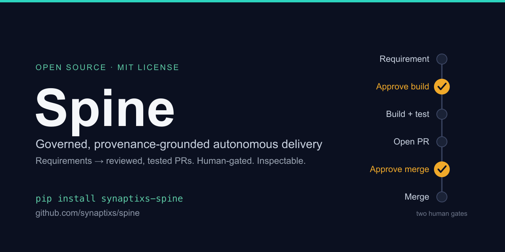

<p align="center">
  
</p>

# Spine

**Governed, provenance-grounded autonomous delivery** — turn requirements into
reviewed, tested pull requests, with a human in control.

> **Naming.** *Spine* is the product. It's distributed as the **`synaptixs-spine`**
> package and its command is **`orchestrator`** — those names stay in install lines
> and commands throughout the docs.

Spine reads a requirement (from Confluence, Notion, a Markdown file, or an
[OpenSpec](https://openspec.dev) spec-driven change), understands
your target repo, generates code grounded in that repo's own conventions, writes and
runs tests, and opens a **pull request for you to review**. It pauses for your
approval before it starts and before anything merges. Nothing is pushed, merged, or
written to your tracker unless you say so.

It's built for teams who want agents that are **inspectable, reproducible, and safe
to run on real code** — not demos.

```bash
pip install synaptixs-spine
orchestrator init && orchestrator doctor                  # scaffold .env, check readiness
orchestrator sdlc feature --source file://./spec.md --safe   # build locally — no pushes, no PRs
```

---

## Documentation

| Guide | Read it for |
|---|---|
| **[Setup & Install](SETUP.md)** | Installing the CLI, the `.env`, and standing up the full stack (Temporal + Postgres) for the autonomous pipeline. |
| **[User Guide](USER_GUIDE.md)** | A step-by-step walkthrough: from your first local build to a real PR, local models, the web dashboard, and connecting tools (MCP). |
| **[Using Spine from Codex](CODEX_GUIDE.md)** | Drive Spine from the **Codex app** — install (plugin or MCP server), credentials, the tool reference, and end-to-end greenfield + brownfield walkthroughs. |
| **[Features & Capabilities](FEATURES.md)** | The capability catalog — everything Spine can do today, its status, the command/flag to use it, and a link to each deep dive. |
| **[Knowledge Graph (PKG)](KNOWLEDGE_GRAPH.md)** | How Spine understands your codebase — the code-native graph, its model, the CLI, and how it powers brownfield *and* greenfield work. |
| **[Operations & Developer Guide](OPERATIONS.md)** | How to operate it: deployment modes, the full environment-variable reference, and standing up each advanced capability — including the semantic spine (ontomesh × infodrift). |
| **[Community brief](COMMUNITY.md)** | A one-page overview to share — what it does, lifecycle coverage, how to try it, and the feedback we're looking for. |

New here? **Install → [User Guide](USER_GUIDE.md) Steps 1–4.** That's the whole
everyday workflow in about ten minutes.

---

## Features & capabilities

**Requirements → reviewed PR.** Point it at a requirements source and a code repo.
It extracts a backlog of intents, writes a spec, generates the implementation and
tests, gets them green, and opens a PR — with **two human gates** (before building,
before merging). A safe mode builds entirely locally (branch + diff, no external
writes) so you can inspect everything first.

**Code-grounded understanding.** Before generating, it builds a **Product Knowledge
Graph** of your repo — modules, types, functions, call sites, blast radius — and
grounds new code in what already exists, so output reads like your team wrote it.
Works across **Python, Java, TypeScript, C#, C, and C++**. `orchestrator understand` writes a
committed, code-true `memory-bank/` your whole team (and any AI tool) can read.

**Governed autonomy.** The workflow itself is a typed, validated artifact. A planner
decomposes the objective, a runtime executes it, and **per-edge verifiers** check
every step against schemas, evidence, and policy. Failures trigger replan, a human
approval, or a clean stop. Every tool call, approval, and decision lands in an
**append-only audit log**, and each run is capped by a spend budget.

**Learns across runs.** Cross-run semantic memory lets the agent recall conventions,
pitfalls, and decisions from past runs — each memory cites the run it came from.

**You can see inside it.** Live **OpenTelemetry** tracing covers every LLM call,
loop step, and tool call, joined to the audit log — so you can debug a run, not just
read its result.

**Use it your way.** A **CLI** for scripting and CI, a **web dashboard** (delegate
runs, watch them live, approve gates inline), a **terminal UI**, and **MCP** in both
directions — consume external MCP tools, or expose the whole pipeline *as* an MCP
server to Claude Code, Codex, or your IDE.

**Bring your own model.** Multi-provider via LiteLLM (Anthropic, OpenAI, Bedrock),
or run fully offline on a local model (Ollama). Mix models per stage.

**Durable.** Long-running pipelines are checkpointed (Temporal + Postgres) — they
survive restarts and resume across human approval pauses.

---

## How it works

```
  requirement (Confluence / Notion / Markdown)
        │
        ▼
   plan ──► validate ──► generate code ──► run tests ──► review ──► open PR
        │        (grounded in your repo's knowledge graph)        │
        └──────────── per-edge verifiers + audit ────────────────┘
                 human gate 1 ▲                    ▲ human gate 2
                 (before build)                    (before merge)
```

| Concept | What it is |
|---|---|
| **Planner → GraphIR** | Turns an objective into a typed, validated execution graph (nodes, edges, budgets, approval points). |
| **Registry** | Versioned agent templates + tool contracts the planner assembles from. |
| **Runtime** | LangGraph-based executor with Postgres checkpointing and typed state. |
| **Verifier chain** | Per-edge schema / confidence / evidence / policy checks that gate every handoff. |
| **Approval gates** | First-class nodes that pause for human review and resume on your decision. |
| **Audit log** | Append-only record of every tool call, approval, and policy decision. |

---

## FAQ

**Does it merge code on its own?**
No. It opens a PR; a human reviews and merges. There are two approval gates — before
building and before merging — and safe mode makes no external writes at all.

**Where does my code/data go?**
To whichever LLM provider you configure — or nowhere external, if you run a local
model (Ollama). Generated code stays in a local branch until you choose `--live`.

**Do I need Docker or a database?**
Not for the everyday path (`sdlc feature --safe` builds one requirement locally).
The autonomous multi-feature pipeline + web dashboard needs Temporal + Postgres —
see the [Setup guide](SETUP.md).

**Which languages and models?**
Code generation and comprehension cover **Python, Java, TypeScript, C#, C, and C++**
(C# also extracts ASP.NET Core endpoints and EF Core entities; C builds the
`#include` graph and merges header declarations with their source definitions; C++ is
a superset of the C front-end that adds classes, namespaces, inheritance, member
functions, and templates, and shares C's CMake/Meson + `ctest` codegen). Any
LiteLLM-supported provider (Anthropic, OpenAI, Bedrock) or a local Ollama model;
you can set a different model per stage.

**How is it safe to run on real repos?**
Write guards on generated files, allow-listed + write-gated external tools, a per-run
spend budget, an append-only audit trail, and human approval before any push or merge.

**CLI or web UI?**
Either — they drive the same engine and the same API. Use the CLI for scripting/CI,
the web UI (or terminal UI) for watching runs and approving gates by hand.

**Can other tools call it?**
Yes. It speaks MCP both ways: it can use external MCP servers, and it can run *as* an
MCP server so Claude Code / Codex / your IDE can call the pipeline (with the same gates).

---

## Contributing & feedback

We'd love your input. Pick the channel that fits:

- 🐛 **Bug?** Open a [bug report](https://github.com/synaptixs/spine/issues/new?template=bug_report.md).
- 💡 **Feature idea / enhancement?** Open a [feature request](https://github.com/synaptixs/spine/issues/new?template=feature_request.md).
- 💬 **Question, feedback, or idea to discuss?** Start a [Discussion](https://github.com/synaptixs/spine/discussions).
- 🔒 **Security issue?** Please follow [SECURITY.md](SECURITY.md) — don't open a public issue.

See [CONTRIBUTING.md](CONTRIBUTING.md) and the [CODE_OF_CONDUCT.md](CODE_OF_CONDUCT.md)
for how contributions are reviewed.

## License

MIT License. See [LICENSE](LICENSE).
