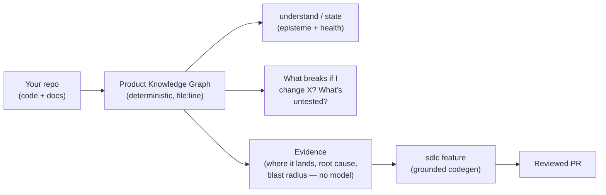

<p align="center">
  
</p>

# Spine

**Governed, provenance-grounded autonomous delivery** — turn requirements into
reviewed, tested pull requests, with a human in control.

> **Naming.** *Spine* is the product. It's distributed as the **`synaptixs-spine`**
> package and its command is **`orchestrator`** — those names stay in install lines
> and commands throughout the docs.

Spine reads a requirement (from Confluence, Notion, a Markdown file, or an
[OpenSpec](https://openspec.dev) spec-driven change), understands
your target repo, generates code grounded in that repo's own conventions, writes and
runs tests, and opens a **pull request for you to review**. It pauses for your
approval before it starts and before anything merges. Nothing is pushed, merged, or
written to your tracker unless you say so.

It's built for teams who want agents that are **inspectable, reproducible, and safe
to run on real code** — not demos.

**How it fits together.** Everything starts from one deterministic graph of your repo —
built from the code *and* its docs — and every surface is a read of that graph:


```mermaid
flowchart LR
    repo["Your repo<br/>(code + docs)"]
    pkg["Product Knowledge Graph<br/>(deterministic, file:line)"]
    know["understand / state<br/>(episteme + health)"]
    ask["What breaks if I<br/>change X? What's<br/>untested?"]
    ev["Evidence<br/>(where it lands, root cause,<br/>blast radius — no model)"]
    build["sdlc feature<br/>(grounded codegen)"]
    pr["Reviewed PR"]
    repo --> pkg
    pkg --> know
    pkg --> ask
    pkg --> ev
    ev --> build
    build --> pr
```

**Try it on your own repo in under a minute.** No API key, no configuration, and it writes
nothing — `state` reads your code and prints what it found:

```bash
pip install synaptixs-spine
orchestrator state /path/to/your/repo
```

Measured cold on a clean machine: **25s to install, 0.8s to answer.** On
[`pallets/click`](https://github.com/pallets/click) it opens with

> This is a python library / service — **173 types** and **1722 functions** across **22
> components** (78 files). Top priority: Refactor 3 god-classes (>40 members), e.g. `Context`
> (60), `ProgressBar` (48).

then the architecture, the areas, documentation coverage and drift. Deterministic — no model
runs, so the same commit always gives the same report.

**When you want it to write code**, that's when configuration starts to matter:

```bash
orchestrator init && orchestrator doctor                     # scaffold .env, check readiness
orchestrator sdlc feature --source file://./spec.md --safe   # build locally — no pushes, no PRs
```

---

## What Spine does that other tools don't

Plenty of tools read your codebase. The difference is what they'll let themselves say
about it.

**1 · The graph is built by parsers, not by a model — and its accuracy is published.**
Eight language front-ends, every fact carrying `file:line`. Scored against a hand-labelled
corpus in CI: **precision 1.00 on every node and edge kind**. Where it's weaker, that's
published too — `CALLS` recall runs 1.00 on C and SQL down to 0.86 on TypeScript, reported
separately rather than averaged into something flattering.

**2 · The failure mode is silence, not fiction.** Everything the graph asserts exists;
what it can't resolve, it drops. A missing edge sends you looking. A fabricated one sends
you confidently into a function nobody wrote. We hold precision at 1.00 and let recall be
imperfect because that trade is the right way round for whoever reads it — and the
**invented-edge count is gated at zero**, per language, on every commit.

**3 · We measured whether it finds the right file, on code we don't control.** Given a real
bug report — the title alone — the file that actually fixed it is in Spine's top 10 **27 times
out of 38**, and its first guess is right 12 times. Picking ten files at random from the same
repositories would score 0.085. The corpus is five open-source projects pinned by commit, the
answer key comes from each bug's own fixing commit, and the whole thing is reproducible with one
command. The limits are published beside it — n=38, so top-1 sits in a 0.17–0.47 interval, and
the bugs are cleaner than average. See
[BENCHMARK.md](https://github.com/synaptixs/spine/blob/main/BENCHMARK.md).

**4 · We measured whether any of it helps, with a control.** Across 260 ticket-runs on two
frontier models: **47 of 68** new modules integrated correctly with the graph in context,
against **3 of 68** without. The control — tickets that already named their target file —
scored **122 of 124 either way**, which is what rules out "more context just helps". Every
published benchmark we could find in this category measures *efficiency* ("70% fewer
tokens"). That answers *how cheap*, not *is it right*.

**5 · Comprehension is deterministic, so it can be gated.** Same commit in, same bytes out
— no model, no cost, no variance. That's why `understand --check` can prove a knowledge
base is current rather than hoping, why extraction can be cached per commit, and why a
run's evidence can be replayed and diffed.

The honest summary: **Spine is slower to claim things than the alternatives, and that is
the product.** Where it can't know something, it says so and stops.

---

## What's new

**3.28.0 (current)** — **a cross-repo edge stops pointing at a node that does not exist.**
`pkg extract --repos` and `investigate --repos` reused one extractor across every repository, and
the cross-repo join candidates accumulate on the language front-ends — so one service's HTTP
calls were inherited by the next, and could be drawn as an edge from a caller that does not live
there. Fixed, with the regression pinned. Also: a document citing `src/orchestrator/pkg/store.py`
now binds to that module instead of discarding the match — **534 new `MENTIONS` edges** — and the
doc-binding gap is measured rather than asserted, which argues against the model tier it looked
like it needed.

**3.27.0** — **TypeScript stops skipping the calls it could not type.** `h.run()`,
where `h` is a parameter annotated `Handler` or a local from `new Handler()`, used to be dropped
rather than guessed — so `CALLS` recall on TypeScript was **0.36**. It is now **0.86**, with
precision still at 1.00 and no fabricated edges. The TypeScript compiler API was scoped and
argued against: it resolves against installed packages, so the same commit would yield a
different graph depending on whether `node_modules` is present. Also new: a recorded-intent tier,
so `investigate` can say *why* code exists and not only what calls it; and `orchestrator
--version`.

**3.26.1** — **Spine measures whether it finds the right file, and publishes the
number.** Given a real bug report, the file that actually fixed it is in the top 10 for **27 of
38** issues and the first guess is right for **12**; picking ten files at random from the same
repositories scores 0.085. The corpus is five open-source projects pinned by commit, the answer
key is each bug's own fixing commit, and one command reproduces it —
[BENCHMARK.md](https://github.com/synaptixs/spine/blob/main/BENCHMARK.md), which also states the
limits. Building it turned up three checks that were passing while measuring nothing: fact
freshness parsed every language as Python, the graph-grounded review layer never ran on a pull
request at all, and a drift finding was rendered that nothing called.

**3.25.1** — **the issue type finally reaches the run.** Spine has been issue-type
shaped since 3.21.0 — the profile selector, the localization check, the `bug`/`enhancement`
profiles — and nothing ever supplied the type, so every run took the `default` profile. A Bug
now gets root-cause analysis and must localize; an enhancement gets a churn reading over its
landing sites instead, and is no longer refused for naming the module it is about to create.

**3.24.0** — the Claude Code and Codex plugins catch up with the product: multi-repo tools,
`pkg_joins`, and an `[all]` install that actually extracts all eight languages.

**3.23.0** — **multi-repo comprehension**: several repositories merge into one graph, and a
ticket landing in one reports what depends on it in another. Declare them in
`.spine/repos.yaml`, let `orchestrator pkg joins --propose` derive the topology from evidence,
and `investigate --repos` reads it.

**3.22.0** — four front-ends were fabricating a `CALLS` edge when a parameter shadowed a
resolvable name. Measured at **47 fabricated edges across 11 public repositories**, fixed, and
gated at zero so it can't come back.

Full history, including the features we measured and *didn't* ship: **[CHANGELOG](https://github.com/synaptixs/spine/blob/main/CHANGELOG.md)**.

---

> ### 👉 [**See it work end to end — one ticket, start to finish**](https://github.com/synaptixs/spine/blob/main/EXAMPLE.md)
>
> A real bug, in a real public codebase you can clone yourself
> ([`pallets/click`](https://github.com/pallets/click)) — from *"where does this even live?"* to a
> reviewed PR. **Every command is one you can run, and the output is real.** It finds the four
> functions in the blast radius that **no test covers**, in about a minute, with no API key.

---

## 🔒 Security

Spine runs on real code, clones untrusted repositories, and executes generated code — so
we hold its own source to the same bar.

- **Checks run in CI on every pull request:** CodeQL (Python + JavaScript), `pip-audit`
  over the locked dependency set, `bandit`-class static analysis, and Dependabot.
- **We security-reviewed our own source** with a multi-model adversarial pass — 7
  confirmed issues fixed, **each with a regression test** (path traversal, an SSRF
  backstop gap, prompt-injection hardening in the review pipeline, and a web-UI XSS).
  Details in the [changelog](https://github.com/synaptixs/spine/blob/main/CHANGELOG.md).
- **All patchable dependency CVEs are resolved**, and the audit fails CI on any new one.

Found something? Please follow our coordinated-disclosure policy in
[SECURITY.md](https://github.com/synaptixs/spine/blob/main/SECURITY.md) — don't open a
public issue.

---

## Documentation

| Guide | Read it for |
|---|---|
| **[Worked example](https://github.com/synaptixs/spine/blob/main/EXAMPLE.md)** | **Start here.** One ticket, start to finish, on a public repo you can clone — with real output you can reproduce command for command. |
| **[Setup & Install](https://github.com/synaptixs/spine/blob/main/SETUP.md)** | Installing the CLI, the `.env`, and standing up the full stack (Temporal + Postgres) for the autonomous pipeline. |
| **[User Guide](https://github.com/synaptixs/spine/blob/main/USER_GUIDE.md)** | A step-by-step walkthrough: from your first local build to a real PR, local models, the web dashboard, and connecting tools (MCP). |
| **[Using Spine from Codex](https://github.com/synaptixs/spine/blob/main/CODEX_GUIDE.md)** | Drive Spine from the **Codex app** — install (plugin or MCP server), credentials, the tool reference, and end-to-end greenfield + brownfield walkthroughs. |
| **[Using Spine from Claude Code](https://github.com/synaptixs/spine/blob/main/CLAUDE_GUIDE.md)** | Drive Spine from **Claude Code** — install (plugin or MCP server), credentials, the tool reference, and end-to-end greenfield + brownfield walkthroughs. |
| **[Features & Capabilities](https://github.com/synaptixs/spine/blob/main/FEATURES.md)** | The capability catalog — everything Spine can do today, its status, the command/flag to use it, and a link to each deep dive. |
| **[Architecture](https://github.com/synaptixs/spine/blob/main/ARCHITECTURE.md)** | How the whole platform fits together — the six layers, all components, the two human gates, and the knowledge graph they all read from. Includes an animated diagram. |
| **[Knowledge Graph (PKG)](https://github.com/synaptixs/spine/blob/main/KNOWLEDGE_GRAPH.md)** | How Spine understands your codebase — the code-native graph, its model, the CLI, and how it powers brownfield *and* greenfield work. |
| **[Benchmark](https://github.com/synaptixs/spine/blob/main/BENCHMARK.md)** | How well it actually works, measured — top-k localization on 38 real bugs across five languages, the corpus with its commit SHAs, what the numbers do **not** show, and the command to reproduce them yourself. |
| **[CLI Reference](https://github.com/synaptixs/spine/blob/main/CLI_REFERENCE.md)** | Every `orchestrator` command across all 7 areas — arguments, options, and defaults. Run `orchestrator <command> --help` for the live version. |
| **[Operations & Developer Guide](https://github.com/synaptixs/spine/blob/main/OPERATIONS.md)** | How to operate it: deployment modes, the full environment-variable reference, and standing up each advanced capability — including the semantic spine (ontomesh × infodrift). |
| **[Community brief](https://github.com/synaptixs/spine/blob/main/COMMUNITY.md)** | A one-page overview to share — what it does, lifecycle coverage, how to try it, and the feedback we're looking for. |

New here? **Install → [User Guide](https://github.com/synaptixs/spine/blob/main/USER_GUIDE.md) Steps 1–4.** That's the whole
everyday workflow in about ten minutes.

---

## Features & capabilities

**Requirements → reviewed PR.** Point it at a requirements source and a code repo.
It extracts a backlog of intents, writes a spec, generates the implementation and
tests, gets them green, and opens a PR — with **two human gates** (before building,
before merging). A safe mode builds entirely locally (branch + diff, no external
writes) so you can inspect everything first. Already written the spec yourself? Hand
it straight to `orchestrator sdlc autorun --spec <file>` instead of deriving one from
a source.

**Plan before code.** Before a run spends anything, `orchestrator sdlc plan` assembles a
**build document** for the ticket — the requirement, the root cause, what the graph knows,
the blast radius, the files, the acceptance criteria reconciled against code that already
satisfies them, and what the codegen prompt will carry. Twelve sections, always the same,
each labelled with where it came from: quoted, computed, inferred, or decided by a person.
No model call, so the same commit produces the same document. `sdlc approve` records the
decision against a digest of what you read, and a run refuses if the plan has changed since.

**Code-grounded understanding.** Before generating, it builds a **Product Knowledge
Graph** of your repo — modules, types, functions, call sites, blast radius — and grounds new
code in what already exists, so output reads like your team wrote it. The measurement behind
that is [above](#what-spine-does-that-other-tools-dont); the method and its bounds are
published in full
([on this repo](https://github.com/synaptixs/spine/blob/main/docs/specs/codegen-model-comparison-results.md)
· [replicated on an unrelated codebase](https://github.com/synaptixs/spine/blob/main/docs/specs/external-repo-grounding-results.md)),
and the harness ships with the package so you can get your own number.

Works across **Python, Java, TypeScript, C#, C, C++ and Go**, plus **SQL** data-layer
comprehension (schema, queries, stored procedures, migration folding). It reads your
**documentation** too — Markdown, reST, plain text and **PDF** — folding it in as `Doc` nodes
linked to the code they describe, so you can ask *which docs cover this symbol* and *where
they've drifted*. `orchestrator understand` writes a committed, code-true `episteme/` your
team and any AI tool can read — *epistēmē*, knowledge grounded in evidence, because every
word of it is derived from the code rather than written by hand.

**Across repositories, not just inside one.** Declare your services in `.spine/repos.yaml`
and they merge into a single graph, so *"what breaks if I change this?"* can answer with a
caller in a **different repo** — an HTTP client, a shared table, an imported library. Spine
derives the topology from evidence (`pkg joins --propose`) rather than asking you to draw it,
and reports what it could *not* place, because a missing cross-repo edge looks exactly like
two services that aren't coupled.

**Governed autonomy.** The workflow itself is a typed, validated artifact. A planner
decomposes the objective, a runtime executes it, and **per-edge verifiers** check
every step against schemas, evidence, and policy. Failures trigger replan, a human
approval, or a clean stop. Every tool call, approval, and decision lands in an
**append-only audit log**, and each run is capped by a spend budget.

**Learns across runs.** Cross-run semantic memory lets the agent recall conventions,
pitfalls, and decisions from past runs — each memory cites the run it came from.

**You can see inside it.** Live **OpenTelemetry** tracing covers every LLM call,
loop step, and tool call, joined to the audit log — so you can debug a run, not just
read its result.

**Use it your way.** A **CLI** for scripting and CI, a **web dashboard** (delegate
runs, watch them live, approve gates inline), a **terminal UI**, and **MCP** in both
directions — consume external MCP tools, or expose the whole pipeline *as* an MCP
server to Claude Code, Codex, or your IDE.

**Bring your own model.** Multi-provider via LiteLLM (Anthropic, OpenAI, Bedrock),
or run fully offline on a local model (Ollama). Mix models per stage. Run
`orchestrator models` to see which models are available — each id with its context
window, price, and whether it supports the tool calling codegen and the judge need.
The default is `claude-opus-5`.

**Durable.** Long-running pipelines are checkpointed (Temporal + Postgres) — they
survive restarts and resume across human approval pauses.

---

## How it works

A request flows top to bottom — through comprehension and planning, into a governed execution loop
that **pauses at two human gates** — and out as a reviewed PR. The **[full architecture, with an
animated diagram, is in ARCHITECTURE.md](https://github.com/synaptixs/spine/blob/main/ARCHITECTURE.md)**.

<p align="center">
  
</p>

> **Every number on that diagram is read from the source, not typed into it.** The version, the
> command count, the node and edge kinds and the language front-ends are computed at render time
> by [`scripts/render_architecture_svg.py`](https://github.com/synaptixs/spine/blob/main/scripts/render_architecture_svg.py),
> and CI fails if the checked-in image no longer matches. The
> [SVG is the source](https://github.com/synaptixs/spine/blob/main/assets/spine-architecture.svg);
> the PNG above is a rendering of it.
>
> The version it replaced was stamped `3.8.4` and claimed `7 node kinds · 9 edge kinds` — two
> releases after `ARCHITECTURE.md` had corrected them to **8 and 11**. Nothing noticed, because a
> picture is the one artefact no test reads. Now one does.

```
  requirement (Confluence / Notion / Markdown)
        │
        ▼
   plan ──► validate ──► generate code ──► run tests ──► review ──► open PR
        │        (grounded in your repo's knowledge graph)        │
        └──────────── per-edge verifiers + audit ────────────────┘
                 human gate 1 ▲                    ▲ human gate 2
                 (before build)                    (before merge)
```

| Concept | What it is |
|---|---|
| **Planner → GraphIR** | Turns an objective into a typed, validated execution graph (nodes, edges, budgets, approval points). |
| **Registry** | Versioned agent templates + tool contracts the planner assembles from. |
| **Runtime** | LangGraph-based executor with Postgres checkpointing and typed state. |
| **Verifier chain** | Per-edge schema / confidence / evidence / policy checks that gate every handoff. |
| **Approval gates** | First-class nodes that pause for human review and resume on your decision. |
| **Audit log** | Append-only record of every tool call, approval, and policy decision. |

---

## FAQ

**Does it merge code on its own?**
No. It opens a PR; a human reviews and merges. There are two approval gates — before
building and before merging — and safe mode makes no external writes at all.

**Where does my code/data go?**
To whichever LLM provider you configure — or nowhere external, if you run a local
model (Ollama). Generated code stays in a local branch until you choose `--live`.

**Do I need Docker or a database?**
Not for the everyday path (`sdlc feature --safe` builds one requirement locally).
The autonomous multi-feature pipeline + web dashboard needs Temporal + Postgres —
see the [Setup guide](https://github.com/synaptixs/spine/blob/main/SETUP.md).

**Which languages and models?**
Comprehension and codegen cover **Python, Java, TypeScript, C#, C, C++ and Go** — each
front-end going beyond structure into what that stack actually does (Java and C# REST
endpoints, EF Core entities, C's `#include` graph, C++ templates and namespaces, Go
interface satisfaction by method-set matching). **SQL** adds data-layer comprehension plus
greenfield migration codegen validated against an ephemeral database. **Docs** fold in
automatically; **media** (diagrams, screenshots, recorded reviews) via the opt-in
`media extract`. Any LiteLLM provider — Anthropic, OpenAI, Bedrock — or a local Ollama
model, and you can set a different model per stage. Extras and details:
[FEATURES.md](https://github.com/synaptixs/spine/blob/main/FEATURES.md).

**How is it safe to run on real repos?**
Write guards on generated files, allow-listed + write-gated external tools, a per-run
spend budget, an append-only audit trail, and human approval before any push or merge.

**CLI or web UI?**
Either — they drive the same engine and the same API. Use the CLI for scripting/CI,
the web UI (or terminal UI) for watching runs and approving gates by hand.

**Can other tools call it?**
Yes. It speaks MCP both ways: it can use external MCP servers, and it can run *as* an
MCP server so Claude Code / Codex / your IDE can call the pipeline (with the same gates).

---

## Contributing

**We'd genuinely like the help, and the codebase is unusually easy to be useful in.**

It's plain Python. `pip install -e ".[dev]"`, and the test suite runs in about three
minutes with no services, no API key and no network. There's no build step anywhere —
the web UI is vanilla JS on purpose. Most of the interesting work is a pure function
over a graph, which means you can hold a change in your head and prove it with a
fixture.

### Good places to start

| If you want to… | Look at |
|---|---|
| **Add a language** | `pkg/*_extractor.py`. Eight front-ends today; each is one file plus a labelled corpus case. Rust, Kotlin and Ruby are the obvious next three. |
| **Improve accuracy** | `corpus/` — hand-written fixtures with expected facts. Adding a case that *fails* is a real contribution; it's how the last four front-end bugs were found. |
| **Fix something we've written down** | [`STATE-OF-SPINE` §8](https://github.com/synaptixs/spine/blob/main/docs/specs/STATE-OF-SPINE.md) is a standing list of what's broken or missing, kept honest at each release. |
| **Work on a bigger idea** | [`docs/specs/`](https://github.com/synaptixs/spine/tree/main/docs/specs) — every design record, including the ones we closed *unshipped* and why. |

### How we work, in three points

1. **A fixture that fails first.** New behaviour lands with a test written *before* it
   works and seen to fail. A test that passes before the code is a test that measures
   nothing — and a green check over an unexamined case is the mistake this project has
   made most often.
2. **Say what you didn't measure.** A `0` that means *"not checked"* must not read like a
   `0` that means *"clean"*. Bound your output honestly — "top N of M", never a clipped
   list implying completeness.
3. **Never guess in the graph.** If a fact can't be resolved from a real parse tree, drop
   it. `CLAUDE.md` has the full set of invariants and the scars behind each one.

Before pushing: `mypy src tests` (**not** just `src`), `ruff format --check .`, and the
suite. Work off `develop`. Details in
[CONTRIBUTING.md](https://github.com/synaptixs/spine/blob/main/CONTRIBUTING.md).

### Or just tell us what you found

You don't have to write code to be useful — **running it on a codebase we've never seen
is genuinely valuable**, especially if it gets something wrong.

- 🐛 [Bug report](https://github.com/synaptixs/spine/issues/new?template=bug_report.md) — a
  wrong fact in the graph is our most serious kind of bug, and we want it.
- 💡 [Feature request](https://github.com/synaptixs/spine/issues/new?template=feature_request.md)
- 💬 [Discussion](https://github.com/synaptixs/spine/discussions) — questions and half-formed ideas welcome.
- 🔒 Security: [SECURITY.md](https://github.com/synaptixs/spine/blob/main/SECURITY.md), not a public issue.

See also the [CODE_OF_CONDUCT.md](https://github.com/synaptixs/spine/blob/main/CODE_OF_CONDUCT.md).

## License

MIT License. See [LICENSE](https://github.com/synaptixs/spine/blob/main/LICENSE).
