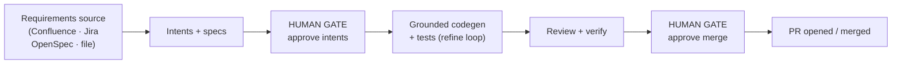

# User Guide — Spine

> **Spine** is the product; it's distributed as the **`synaptixs-spine`** package
> and its command is **`orchestrator`**. Install lines and commands below use those
> names verbatim.

Point it at a **code repo** and a **requirements source** (a Confluence page, a
Notion page, or a Markdown file). It turns requirements into working, tested code
and opens a **reviewed pull request** — pausing for **your approval** at two
points: before it starts building, and before anything merges.

You stay in control the whole way. Nothing is pushed, merged, or written to your
tracker unless you say so.

This guide is a straight line. Do **Step 0 → Step 4** and you'll have your first
change in hand. Everything after that is optional, in roughly the order you'll
want it.

| Steps | You get |
|---|---|
| **0–4** | Installed, configured, and your first feature built locally — then a real PR. |
| **5–6** | Preview before you run; run fully offline on a local model. |
| **7–8** | The hands-off pipeline with a web dashboard, and smarter (agentic) codegen. |
| **9–10** | Connect external tools (MCP), and call Spine from Claude/Codex. |
| **11** | Troubleshooting. |

---

## Step 0 — What you'll need

The essentials (Steps 1–4):

- **Python 3.12+** and **[uv](https://docs.astral.sh/uv/)**
  — `curl -LsSf https://astral.sh/uv/install.sh | sh`
- **An LLM** — either an API key (`OPENAI_API_KEY` or `ANTHROPIC_API_KEY`)
  **or** [Ollama](#step-6--run-fully-offline-on-a-local-model-no-api-key) for a
  local model with no key (Step 6).

Add these when you want real source/PR work (Step 4 onward):

- **Confluence / Jira** credentials — to read requirements and (optionally) file issues.
- A **GitHub repo** — the repo it builds *into* — plus a token or GitHub App for private repos.

Only for the full pipeline + dashboard (Step 7):

- **Docker** — runs Temporal + Postgres locally.

You do **not** need Docker, a database, or any servers for Steps 1–6.

---

## Step 1 — Install

The published package is `synaptixs-spine`; the command it gives you is
`orchestrator`.

### From PyPI (just the tool)

```bash
pip install synaptixs-spine
orchestrator --help
```

Optional extras, added when you need them:
- `pip install 'synaptixs-spine[sdlc]'` — run the generated tests (the `sdlc feature`/`run` path)
- `pip install 'synaptixs-spine[tui]'` — the `orchestrator tui` terminal UI (Step 7)
- `pip install 'synaptixs-spine[all]'` — everything below at once: every language front-end,
  the MCP server and doc ingestion. This is the right install for the Claude Code / Codex
  plugin; `[languages]` is the front-ends on their own.
- `[java]`, `[typescript]`, `[csharp]`, `[c]`, `[cpp]`, `[go]`, `[sql]` — language parsers for
  comprehension + grounding (Python needs no extra). C# codegen also needs the **.NET SDK**
  (`dotnet`) on PATH; C / C++ codegen needs a C / C++ compiler plus **CMake** (greenfield) or
  **Meson + Ninja** (matching the target repo's build system); **Go** codegen needs the **`go`
  toolchain** on PATH (`go build`/`go test`). `[sql]` adds `.sql`
  comprehension (schema/queries/procedures + migration folding) — no toolchain needed.
- `[docs]` — **PDF** doc ingestion; `[office]` — **Word/Excel** (`.docx`/`.xlsx`) ingestion.
  Markdown, `.rst`, `.txt` and **HTML** need no extra. Without an extra those files are simply
  skipped, so a base install still ingests everything it can read.
- `[media]` — **image OCR** (needs a system `tesseract` binary); `[asr]` — **local audio/video
  transcription** (Whisper). Only the opt-in `orchestrator media extract` uses these; the
  deterministic build never does. See *Bringing diagrams & recordings into the graph* below.
- `[mcp]` (MCP client), `[otel]` (live tracing)

### Upgrading

- **PyPI install:** `pip install --upgrade synaptixs-spine` (verify with `pip show synaptixs-spine`).
- **Source checkout:** `git pull && uv sync --extra dev`.

### From source (needed for Step 7's pipeline, or to develop)

```bash
git clone https://github.com/synaptixs/spine
cd spine
uv sync --extra dev            # installs the project + dev tools
uv run orchestrator --help     # in this layout, prefix CLI calls with `uv run`
```

> The rest of the guide writes plain `orchestrator …`. On a source checkout,
> read that as `uv run orchestrator …`.

---

## Step 1.5 — See what it knows about your repo (no configuration yet)

Before any of the setup below, Spine can already read your code. `state` needs **no API key and
no `.env`**, and **writes nothing** — it prints what it found:

```bash
orchestrator state /path/to/your/repo
```

On a clean machine that is 25 seconds to install and under a second to answer. Everything in
this step is deterministic: no model runs, so the same commit always produces the same report.
`orchestrator profile` and `orchestrator pkg extract --json` are the same — read-only, keyless.

Configure when you want Spine to *write* code, which is Step 2 onward.

> **`understand` is the one read command that does write.** It builds the committed knowledge
> base — `episteme/` inside the repo — because that artifact is meant to be reviewed and
> committed. Use `state` while you are evaluating; use `understand` once you have decided the
> bank belongs in your repository.

---

## Step 2 — Configure

```bash
orchestrator init      # scaffolds a commented .env, then checks readiness
# open .env and fill in: your LLM key, your model, and (later) Confluence/Jira + repo
orchestrator doctor    # readiness report — tells you exactly what's set and what's missing
```

`doctor` reads `.env` automatically — run it from the folder that has your
`.env`. Start minimal; you only need the LLM settings for your first run.

| Setting | What it's for | Needed by |
|---|---|---|
| `OPENAI_API_KEY` / `ANTHROPIC_API_KEY` | Your LLM provider | Step 3 |
| `ORCHESTRATOR_MODEL` | One model for every stage (optional — defaults to `claude-opus-5`) | Step 3 |
| `CONFLUENCE_*`, `JIRA_*` | Read requirements / file issues | Step 4 |
| `SDLC_REPO_URL` | The repo it builds **into** | Step 4 |
| `SDLC_PR_BASE` | The branch a run builds **on** and opens its PR into — set this to `develop` if that is where you merge, or runs are written against `main` | Step 4 |
| `GITHUB_TOKEN` *(or `GITHUB_APP_*`)* | Auth for a private target repo | Step 4 |

### Choosing a model

Every stage runs on `claude-opus-5` unless you say otherwise. To see what you can
point it at — with context windows, prices, and which models support the tool
calling the pipeline requires:

```bash
orchestrator models                    # everything, plus what each stage uses now
orchestrator models --provider openai  # just one vendor
```

Set one knob for everything, or a model per stage:

| Variable | Drives |
|---|---|
| `ORCHESTRATOR_MODEL` | every stage |
| `SDLC_CODEGEN_MODEL` | codegen — implement, refine, revise, author_tests |
| `SDLC_JUDGE_MODEL` | the acceptance judge |
| `ORCHESTRATOR_INTAKE_MODEL` | intent extraction and spec writing |
| `ORCHESTRATOR_REASONING_EFFORT` | reasoning level on tool-calling models (default `high`) |

A stage's own variable wins over `ORCHESTRATOR_MODEL`, which wins over the default.
Pointing a stage at another vendor needs that vendor's key in the environment.

> **Tool calling is required, not preferred.** Codegen and the judge both force a
> tool call. On a model without it they fall back to reading prose out of a text
> reply, which is far less reliable — `orchestrator models` marks those.

---

## Step 2.5 — Understand the project (optional, recommended)

Build a committed, code-true knowledge base before generating anything:

```bash
orchestrator understand .        # writes ./episteme/*.md
```

It extracts the Product Knowledge Graph + project profile and renders
`architecture.md`, `domain-model.md`, `tech-context.md`, `conventions.md`, and
`glossary.md` — deterministic, no LLM. Brownfield repos get a real map of what's
there; greenfield repos get a stub that fills in as features land. Re-run anytime
to refresh (`--refresh` re-extracts instead of using the commit cache). Commit
`episteme/` so your team — and any AI tool — reads the same project truth.

**Keep it provably current in CI**, rather than hopefully current:

```bash
orchestrator understand . --check     # writes nothing; exits non-zero if episteme is stale
```

`--check` re-renders and diffs against the committed bank. One thing to know before you wire it
into CI: docs are read **from disk regardless of git**, so an untracked or gitignored Markdown
file in your working tree still becomes a `Doc` node — and `--check` will report the bank stale
over a difference CI cannot reproduce. Commit your docs, or keep them outside the repo.

Your repo's **documentation** is folded in at the same time: Markdown, reST, and plain-text
docs and **HTML** (plus **PDF** with `[docs]`, and **Word/Excel** with `[office]`) become
`Doc` nodes linked to the code they
describe. Nothing to turn on — a repo with no docs just skips it. This powers the
**Documentation** section in `state` (below) and the `docs_for` `/spine` tool.

### Bringing diagrams & recordings into the graph

Architecture diagrams and recorded design reviews hold a lot of the *why* that never makes it
into code. Spine can fold them in too — as the same `Doc` nodes + `MENTIONS` — but through one
deliberate extra step, because OCR and speech-to-text are model inference and must stay out of
the deterministic build.

Run the opt-in producer once:

```bash
orchestrator media extract docs/architecture/     # OCR diagrams (needs [media] + tesseract)
orchestrator media extract review.mp4             # transcribe locally (needs [asr])
```

It writes a reviewable transcript artifact under `.spine-media/`; **review and commit it**. From
then on `understand`/`state` read that plain-JSON artifact like any other doc and never run a
model — same commit in, same graph out. A media file with no artifact is simply skipped, so this
changes nothing until you choose to run it. Transcription stays on your machine unless you pass
`--asr api --allow-remote`, which uploads the media to a remote service. See the
[CLI reference](CLI_REFERENCE.md) for all options.

**What actually binds (set your expectations here).** Media text is matched to code by the same
precision-first binder used for docs, and it links a symbol only when the extracted text names it
*unambiguously as code*: a `snake_case` identifier (`calc_tax`), a dotted path
(`billing.tax.calc_tax`), or a **multi-word** `CamelCase` name (`BacklogService`, `InvoiceService`).
A **single capitalised word** — a box simply labelled `Invoice`, or the word "Invoice" spoken in a
review — is treated as prose, **not** a code claim, so it will *not* link (this is deliberate: a
wrong link is worse than none). Practical upshot:

- **Diagrams** link well — class/service labels are usually multi-word CamelCase or snake_case.
- **Recordings** link the identifiers that are spoken or captioned as such; a spoken one-word type
  name generally won't. Transcripts are still searchable as `Doc` text regardless.

Because OCR/ASR quality varies, **validate on one real diagram or recording** before relying on the
links: run `media extract`, commit the artifact, then `orchestrator state .` and check its
**Documentation** section (or ask the `docs_for` `/spine` tool) to see which symbols the media
actually bound. If precision is poor for your material, the transcripts are still useful as
searchable `Doc` content even when few symbols link.

For a **team-facing snapshot of what the repo is today and how healthy it looks**, use
the Current State report (also no LLM — synthesized from the same graph):

```bash
orchestrator state .                       # developer view, to stdout
orchestrator state . --lens stakeholder    # plain-language view
orchestrator state . --out STATE.md        # write it to a file
orchestrator state . --out report.html     # single self-contained HTML report you can email
orchestrator state . --no-timestamp        # omit generated-at, for byte-stable CI diffs
```

`--out report.html` emits a **self-contained** page — CSS and diagrams inlined, nothing fetched
— so a saved or emailed copy still renders. Any other extension emits markdown.

With `--no-timestamp`, `state` is byte-stable: two runs of the same commit produce identical
files, so you can diff a report or check it into CI. `understand` has the same guarantee.

It renders a plain-language **overview**, an **infrastructure & runtime** breakdown (the
datastores, queues, cloud, container services and external APIs the repo declares it needs —
from its manifests, build files, and `docker-compose`), a **code-structure** map (layout by
component + entry points), a **system-architecture diagram** (components grouped into zones,
with weighted dependency arrows from the import/`#include` graph), a **component-dependency**
table, **call-graph hotspots**, complexity/god-components, test-coverage and recent-activity
signals, a **Documentation** section (symbol coverage % + top doc drift, from the ingested
docs), a name-based security surface, and prioritized recommendations. A report is a
*view* — re-run to refresh; nothing is written unless `--out` is given.

To turn one feature idea into a **grounded design before writing code**, use `design`:

```bash
orchestrator design . --title "Add CSV export" -c "downloads a .csv"   # heuristic, to stdout
orchestrator design . --title "Add CSV export" --llm --out DESIGN.md   # LLM writes the prose
```

It anchors the design to the repo's real modules and adds a **Blast radius** section from the
knowledge graph — for each module the design touches, who imports it and which of its symbols
have the most callers (the risky-to-change hotspots) — plus a **Unverified references** flag
for any named path that doesn't exist in the graph (a hallucinated file, or a genuinely new
one to confirm). Deterministic by default; `--llm` (needs a provider) writes the approach and
interfaces. Symbol-level hotspots need a call graph, so on languages without one the report
says so and gives module-level impact only.

To **research a ticket against the codebase before designing**, use `investigate` — it takes a
ticket (from a source or inline) and produces a brief: where it lands in the code (real
symbols with `file:line` + caller counts), the relevant committed `episteme/` knowledge, and,
when the pipeline's registry DB is configured, prior-run notes. Deterministic, no LLM.

```bash
orchestrator investigate . --source jira://PROJ-123     # research a real ticket
orchestrator investigate . --title "Login 500s on empty token"   # or an inline problem
```

When you have a **stack trace or a failing test**, `localize` resolves each frame to the repo
symbol it names (`file:line`), points at the likely fault site, and lists who calls it — the
first step of a root-cause investigation. Deterministic, no LLM. Feed it a trace via `--trace`,
`--text`, or stdin:

```bash
pytest 2>&1 | orchestrator localize .            # pipe a failing run straight in
orchestrator localize . --trace crash.log        # or from a saved traceback
```

For the **full root-cause analysis**, `rca` goes a step further: it localizes the bug, then
reports the fault site, ranked root-cause **hypotheses** with evidence (callers, recent git
churn, the exception), the **regression surface** a fix must cover, and a scoped fix approach.
It **stops at the report — no code is changed** (a human decides). Deterministic by default;
`--llm` enriches the hypotheses. The bug can be a trace, a `jira://` Bug, or inline text:

```bash
pytest 2>&1 | orchestrator rca .                 # a failing test → grounded RCA
orchestrator rca . --source jira://PROJ-42        # a Jira Bug → grounded RCA
orchestrator rca . --trace crash.log --llm --out rca.md
```

Before you change a symbol, `regression` tells you **what to re-test**: it walks the call
graph to find everything that depends on the target, then splits the blast radius into tests
that already exercise it and production code with **no covering test** — the regression gaps.
Deterministic, no LLM. Give it a symbol or a fault site:

```bash
orchestrator regression . --symbol validate_token   # what breaks if I change this?
orchestrator regression . --trace crash.log          # or use the fault site from a trace
```

> **Call graphs.** `localize`, `rca`, and `regression` (and the design **Blast radius**) trace
> caller/callee edges — now extracted for **Python, C, C++, C#, Java, TypeScript, and Go** (Java/TS
> call graphs were added alongside these commands). On a language without one, the reports say
> so and fall back to module-level impact rather than implying zero.

> **Local path _or_ git URL.** `understand`, `state`, `profile`, `catalog plan`, and
> `pkg extract`/`export`/`docs` accept either — `orchestrator state https://github.com/org/repo`
> shallow-clones it to a temp dir, analyses it, and cleans up (for `understand` on a URL the
> episteme lands in `./episteme`, since the clone is transient). Public providers
> (github.com / bitbucket.org / gitlab.com) work out of the box; add an enterprise host with
> `ORCHESTRATOR_REPO_ALLOWED_HOSTS=git.acme.com`. `file://`, plaintext `http://`, and
> private/loopback hosts are always refused (SSRF guard). The web UI exposes the same on every
> Understand page — a **Browse…** button to pick a local folder, or paste a URL.

**Where it's stored.** `episteme/` is the one artifact you **commit** — the durable,
versioned, code-true doc your team and any AI tool reads. The graph it renders from is a
regenerable cache at `~/.cache/orchestrator/pkg/` (rebuilt from code on every commit, so it
can't go stale); the Current State report is a *view* you regenerate on demand. So the habit
is: `orchestrator understand .` → commit `episteme/`, then re-run whenever the code moves.

> **Deep dive:** see **[KNOWLEDGE_GRAPH.md](KNOWLEDGE_GRAPH.md)** for the full PKG
> guide — the data model, the CLI (`pkg extract` / `export` / `docs`), **where each
> artifact is persisted**, how grounding uses it, and how it works for brownfield and
> greenfield projects.

> **Multi-language.** Comprehension covers **Python** out of the box and **Java**,
> **TypeScript**, **C#**, **C**, **C++**, **Go**, and **SQL** when the matching parser extra is
> installed (`pip install 'synaptixs-spine[java]'` / `[typescript]` / `[csharp]` / `[c]` /
> `[cpp]` / `[go]` / `[sql]`). `understand`, codegen grounding, and `pkg extract` then process
> `.java` / `.ts` / `.cs` / `.c` / `.h` / `.cpp` / `.hpp` / `.go` / `.sql` too. For **SQL**, the
> graph models the **data layer from source** — `CREATE TABLE`/columns → `Entity`/`Field`,
> foreign keys → `REFERENCES`, views and `SELECT`/`INSERT`/`UPDATE`/`DELETE` → `READS`/
> `WRITES`, and stored procedures → `Function` + `CALLS`. A `migrations/` folder is folded
> in order (so you see the *current* schema, with `DROP`/`RENAME` applied), and a `.sql`
> schema is treated as authoritative over ORM-inferred foreign keys. The **dialect is
> auto-detected per file** (PostgreSQL/MySQL/SQL Server/Oracle/…) so each parses under its own
> grammar; pin it with `--dialect` on `pkg extract`/`understand`/`state`. **Greenfield SQL
> codegen** works too: `sdlc feature --language sql` scaffolds a `migrations/` directory,
> generates a DDL migration for the intent, and validates it by **applying it to an ephemeral
> database** (in-memory SQLite by default — zero toolchain; set `SDLC_SQL_ENGINE=postgres`
> with the `[sql-postgres]` extra + Docker for real-Postgres fidelity). A failed apply is the
> refine signal, exactly like a failing test. For **Java**, JAX-RS / Jakarta REST resource
> methods become endpoints with `EXPOSES` edges to their handlers. For **C#**, the graph
> additionally captures ASP.NET Core endpoints (`EXPOSES`) and EF Core entities
> (`REFERENCES`); codegen scaffolds a
> solution + xUnit project and runs `dotnet test` (needs the **.NET SDK**). For **C**,
> it builds the `#include` graph and merges header declarations with their source
> definitions; codegen scaffolds a **CMake** project (greenfield) or works in a brownfield
> **Meson** repo, building + testing via `ctest` / `meson test` (needs a C compiler plus
> CMake or Meson+Ninja). **C++** is a superset of the C front-end — it reuses the include
> graph and header/source merge and adds classes, namespaces, inheritance (`IMPLEMENTS`),
> member functions, and templates; codegen scaffolds a CMake **CXX** project and builds +
> tests via `ctest` (needs a C++ compiler plus CMake). For **Go**, the module unit is the
> **package (its directory)**, so every `.go` file in a dir merges into one component; the
> graph carries the call graph (`CALLS`), same-package struct-field `REFERENCES`, and — the
> Go highlight — **interface satisfaction** (`IMPLEMENTS`), computed by matching a concrete
> type's method set (name + arity, value **and** pointer receivers) against each in-repo
> interface. Codegen writes idiomatic Go into the target package and builds + tests it with
> `go build ./...` / `go test ./...` (needs the **`go` toolchain**); it is **multi-module
> aware** — the runner builds and tests the module(s) the change actually touches, not just
> the repo root, so code generated into a sub-module is never a false green.

### Working with existing repos (brownfield) — and how knowledge grows

Spine understands a repo from its **own code**: it builds a Product Knowledge Graph
(PKG) and a committed `episteme/`, then grounds every action in that. ontomesh
(domain ontology) is an *optional* add-on — not the thing that reads your code.

**Brownfield — comprehend, then deliver:**

1. **Comprehend** the existing codebase (deterministic, no LLM):
   ```bash
   orchestrator understand .       # PKG → episteme/*.md
   orchestrator profile .          # quick architecture profile
   orchestrator audit .            # surface findings / issues
   ```
2. **Deliver** new intents or bug fixes, grounded in the repo's real layout and
   conventions — `--layout auto` follows the existing structure and never scaffolds:
   ```bash
   orchestrator sdlc feature --source file://./spec.md --safe
   ```
   The `[grounding] target-KG context: N chars` line is it reusing what's already there.
3. **Findings** come from the same PKG: blast-radius scoping, the reviewer pass, `audit`.

**Greenfield — knowledge grows as you build.** The first `understand` writes a stub and
the first `feature` run scaffolds `src/<package>/` + `tests/`. From there the PKG and
`episteme/` fill in with every feature that lands — re-run
`orchestrator understand . --refresh` so the committed knowledge keeps pace. The repo
accumulates its own code-true memory as it grows.

> **Optional domain layer.** For domain-heavy systems (fraud, telecom, healthcare) you
> can compose *business-domain* knowledge on top of the code-true grounding (Spine
> Seam 1, `SPINE_ONTOMESH_URL`) — see [OPERATIONS.md](OPERATIONS.md#the-semantic-spine).
> It augments comprehension; it never replaces the PKG.

### Is the graph actually right?

Grounding is only worth as much as the graph under it, so the accuracy is a number you can
check rather than an adjective in a README.

```bash
orchestrator pkg verify .        # does the graph contradict itself? (dangling edges, provenance)
orchestrator pkg accuracy        # precision & recall per kind, per language, vs a labelled corpus
```

Against the committed corpus of 19 fixture repositories across 8 front-ends, **precision is
1.00 on every node kind and every edge kind in all 8 languages**, and recall is 1.00 on every
kind except `CALLS`:

| language | `CALLS` recall |
|---|---|
| `c` `sql` | 1.00 |
| `python` | 0.73 |
| `cpp` `csharp` `go` `java` | 0.67 |
| `typescript` | 0.50 |

What that means in practice: **nothing in the graph is invented** — every edge Spine emits is
one that exists in your source. The remaining gap is *silence*, calls that exist and are not
emitted, all of them the same shape (a call whose receiver is a variable rather than a name).
For grounding an agent, those two failure modes are not equally bad, and Spine has only the
survivable one.

Three further oracles measure a real repository rather than fixtures:

```bash
orchestrator pkg accuracy . --oracle parity      # declared routes/tables vs what the graph holds
orchestrator pkg accuracy . --oracle invention   # calls to names that don't exist
orchestrator pkg accuracy . --oracle runtime     # CALLS recall from actually running your tests
```

`--oracle runtime` **executes your test suite** — it is never implied, always echoes the command
first, and measures recall only. Both `runtime` and `invention` are **Python-only**: on other
languages `invention` reports every candidate as *unexaminable*, which prints as `0` and means
"not measured", not "clean". `pkg verify` is the complement — it catches self-contradiction, but
it cannot catch a fabricated edge whose target node was fabricated alongside it.

### Which ticket was this code written for? (opt-in)

`understand` and `state` both accept `--intents`, which records the ticket each symbol was last
changed for as `Intent` nodes and `SERVES` edges, read from `git blame` plus commit messages.

```bash
orchestrator understand . --intents
```

> **It is opt-in because it costs roughly 3× the CPU** of a plain run — one `git blame` per
> file. Two surfaces read it, both since 3.27.0: `orchestrator investigate --intents` names the
> ticket each landing symbol was last changed for, and `pkg export --intents` writes the facts
> back out. `pkg extract` still has no `--intents` flag, and `--intents` does not apply with
> `--repos`, because blame is per repository.

---

## Step 3 — Your first build (local and safe)

This is the core loop, with zero infrastructure. It reads one requirement, writes
code grounded in the target repo's own structure, generates tests, and leaves you
a **local branch + diff** to inspect. No pushes, no PRs, nothing external.

The full pipeline, and where **you** stay in control — nothing crosses a gate without you:



> `sdlc feature --safe` (this step) runs the middle of that flow locally and stops at a
> branch + diff. The two gates are enforced by the autonomous `sdlc run` (Step 7).

```bash
orchestrator sdlc feature --source confluence://<page_id> --safe
```

- `--source` also accepts `notion://<page_id>`, `file://./spec.md`,
  **`jira://<root>`** (read existing tickets — `jira://PROJ-123` walks an issue and its
  subtasks/epic children, `jira://PROJ` a whole project, `jira://jql/<query>` a saved
  search; uses the same `JIRA_*` creds as issue creation), or
  **`openspec://<change-id>`** (spec-driven: reads an [OpenSpec](https://openspec.dev)
  change under `openspec/changes/` and maps its `### Requirement:`/`#### Scenario:`
  blocks straight to acceptance criteria — **deterministic, no LLM extraction**, so
  intents are exactly what the spec states; `openspec://` alone runs every change).
  To go the other way — **bootstrap** an OpenSpec change *from* a wiki page for a human
  to polish — run `orchestrator openspec draft --source confluence://<id> --out ./openspec`,
  edit the generated `openspec/changes/<id>/`, then `sdlc feature --source openspec://<id>`.
- `--safe` is the safe default: dry-run tracker, local commit, **no push**.
- Pin one requirement with `--intent <intent-id>` if a page has several.

> **Stable, tracked backlog.** The extracted intents are cached deterministically
> (first run extracts; later runs reuse — no re-fetch, no LLM — until `--refresh`),
> so a pinned `--intent` is stable. Each run also writes a **`BACKLOG.md`** ledger:
> `[ ]` todo, `[~]` in progress (a `--live` PR is open), `[x]` done (PR merged, via
> `sdlc complete`). View/regenerate it anytime with
> `orchestrator backlog --source confluence://<page_id>`.

> **Isolated test env.** The pipeline runs the generated tests in a **per-project
> venv** it creates in the worktree, installing pytest + the project's deps (and any
> missing import) automatically — so you don't pre-install test deps. Optional knobs:
> `SDLC_TEST_ISOLATION=local` uses the orchestrator's own interpreter instead;
> `ORCHESTRATOR_LLM_TIMEOUT_SECONDS` (default 120) widens the LLM timeout for large pages.

**Code structure (`--layout`).** The runner places generated code by target:
- **Greenfield repo** → it **scaffolds** a `src/<package>/` skeleton (package name
  derived from the repo, e.g. `Example-Service.` → `example_service`),
  with `tests/` and a pytest-ready `pyproject`, then generates into it. The first
  `--live` run lands this structure on the remote as part of the PR; later runs detect
  it and extend it.
- **Existing codebase** → it **follows the repo's layout**, never scaffolding.
- Default is `--layout auto` (the above). Force it with `--layout new|existing`, and
  override the name with `--package-name <name>`.

As it runs it prints each stage, including `[layout] mode=… package=…` and
`[grounding] target-KG context: N chars` — that's it reading the existing codebase so
the new code reuses what's already there. When it finishes, check out the branch it
made and read the diff.

---

## Step 3.4 — Read the plan before anything is built

A run's first output used to be a pull request or a traceback, and both arrive after the
money is spent. `sdlc plan` puts a **build document** in front of you first — assembled
from the ticket, the graph, git and your repo's own tests, and costing nothing.

```bash
orchestrator sdlc plan --spec ./SSPN-49.json --path .
```

With `--spec` there is **no model call anywhere** in this path, so the same commit and the
same spec produce the same document every time. It lands at
`.spine/plans/<INTENT>-build.md`; re-running overwrites it and keeps what it replaced under
`history/`, keyed by the commit it was derived at.

Twelve sections, always the same, in the same order. What they are for:

| | |
|---|---|
| **1–2** | the requirement as filed, and what should happen instead |
| **3** | root cause — the exception, the fault site, ranked hypotheses. Omitted entirely when there is nothing to localize, rather than padded |
| **4** | what the graph knows, ending with a verdict on whether the investigation brief can be trusted for *this* ticket |
| **5** | blast radius — a diagram, then what imports it, what it is contained by, what the counts do not know, and the evidence: coverage today, endpoints crossed, the tests to run, recent history, docs affected |
| **6–7** | the design, and the files it names with their sizes |
| **8** | acceptance criteria in **three states**: stated, *stated but already met by code that exists*, and proposed |
| **9–10** | what the generator needs, and exactly what the codegen prompt will carry — in bytes and percent of the window |
| **11–12** | what it costs, and two confidence numbers that are never conflated |

**Every section says where it came from** — quoted from the ticket, computed from the
graph, inferred by a model, or decided by a person. A document that mixes a quoted
requirement with an inference and does not say which is which lends the authority of the
first to the second.

**Section 8 is the one that pays for itself.** On the ticket this was built for, one of six
criteria described behaviour the code already had. A run would have reported it met having
changed nothing. To mark one, add `met_criteria` to your spec JSON — the criterion's exact
text mapped to the evidence:

```json
"met_criteria": {
  "Any other non-success HTTP status surfaces the status code…":
    "src/orchestrator/cli.py:134 — _check() already does this"
}
```

It stays on the page, marked, rather than quietly disappearing from the list.

### Approve it, and only then build

```bash
orchestrator sdlc approve SSPN-49 --note "checked the criteria reconciliation"
```

The decision records who, when, why, and a **digest of what you read**. `sdlc autorun`
re-derives the plan and compares: same tree, same digest, and your approval stands. Change
the code underneath it and the run refuses, because an approval that survives the code
moving approves a document nobody has read.

The gate is on by default. `--no-plan-gate` skips it, and says out loud that it did.

---

## Step 3.5 — What stops a bad change from shipping

A model writes the code **and** the tests that judge it, so "the tests pass" only
means its tests agree with its code. Between a green suite and a commit sit several
checks that don't take the model's word for it. You'll see each as a bracketed line.

```bash
orchestrator sdlc autorun --source jira://PROJ-14 --issue PROJ-14 --path . --safe --max-cost 10
```

**Before the run starts at all — `[plan]`.** Unless you passed `--no-plan-gate`, the run
refuses without an approved build document for this ticket (Step 3.4). It parks rather
than fails: the ticket is fine, the review has not happened.

**Before anything is judged — `[research]`.** Three deterministic passes run first and
compose one **Evidence** artifact: where the ticket lands (symbol, `file:line`, kind, caller
count, owning module), a root-cause analysis, and a blast radius computed from **those landing
sites**. No model runs, so it costs nothing, and it is written even if the run parks — a parked
run's evidence is what you are being asked to judge. It lands as `evidence.md` / `evidence.json`
beside the other artifacts.

**Before any code is written — `[validity]`.** The ticket is checked against the
graph. A criterion asserting *"11 Entity nodes on this repo"* when the source has 7
is a false premise, and building to it produces code that passes its own tests and
is still wrong. Verdicts other than `PROCEED` park the run with evidence rather than
guessing.

**Two of those verdicts are new, and both can park a ticket that used to build:**

- **An acceptance criterion that names code the graph does not hold — on a bug.** *"`OrderTotals`
  is recalculated on save"* against a repo with no such symbol is the same false premise as a
  wrong count: a bug describes code that already runs, so a criterion nobody can locate is a test
  nobody can write. Every criterion is bound to a symbol and a `file:line`, or reported, in
  `criteria.md`. **Prose never parks a run:** CamelCase words, `ALL_CAPS` env vars, tool names
  and plain English are not claims about your code and are marked "not a code claim".

  **On an enhancement it is reported, not refused.** A feature's criterion names what the run is
  about to build, so refusing it would mean the better-written criterion is the one that parks
  your ticket — *"the compiler returns ≥ 70 rules"* is prose and proceeds, while
  *"`rule_compiler` returns ≥ 70 rules"* names its subject, is more testable, and would have
  stopped the run. The finding still appears in the assessment, and the design stage lists the
  same absent name under unverified references. Which way it goes depends on the ticket's
  **issue type** — see below.
- **A design that names a place your repository does not have.** A new file in an existing
  directory is fine — that is a file being created. A file in a directory that exists nowhere,
  or a symbol in a module that does not exist, is not. See `design-references.md`.

Both refuse rather than guess, and both park with the evidence on disk. If a park is wrong,
`sdlc runs approve` continues the run.

**The ticket's issue type decides which research it gets, and how strictly it is judged.** It is
read from the tracker — a Jira `Bug`, `Story`, `New Feature` — and falls back to the ticket's
labels when the type is one Spine does not map. A `Bug` runs root-cause analysis and must
localize: if nothing in the graph matches its words there is no fault site to work from, and the
run parks as `UNLOCALIZED` rather than guessing one. An enhancement skips RCA, which it has no
symptom to use, and gets a churn reading over its landing sites instead — *is the area I am
building into moving?* Override it with `--issue-type Bug` when the tracker is wrong, or when
you are running from a `--spec` file and there is no ticket to ask.

**`[typecheck]`** runs your repo's own type checker over the lines the change
touched, and any error goes back to the refine loop like a test failure. This is not
redundant with the tests: generated tests routinely exercise a new helper directly
and never import the module the ticket was about, so they sail past a missing import
or an attribute that doesn't exist on the line that matters. Scoped to changed
lines, so pre-existing errors elsewhere in your repo don't block the run.

**`[proof]`** reverts the change and re-runs the generated tests. They must fail. A
suite that passes *without* the change is not testing it.

**`[coverage]`** reverts each changed file **on its own**. Anything that leaves the
suite green is a file no test reaches — the classic shape being a correct, fully
tested helper wired into a command by a line nothing ever calls. Gaps go back to the
test author, naming the files.

**`[judge]`** asks the one question the others can't: does this change satisfy the
ticket's acceptance criteria? It reads the spec and the code, never the codegen
conversation, so it can't rationalise the generator's choices. `REQUEST_CHANGES`
sends the specific blockers back for revision; a reply that can't be read stops the
run rather than passing it.

### And then you

```bash
orchestrator sdlc autorun --source jira://PROJ-14 --issue PROJ-14 --safe --review
```

`--review` prints the full diff and asks, once, after every check above and before
the first write. Declining commits nothing and pushes nothing.

Everything between `[validity]` and `[judge]` is a model or a heuristic. **Two gates are
a person, and they catch different failures.** The plan gate (Step 3.4) asks whether the
work is the right work, before a line is written or a cent is spent. `--review` asks
whether the diff is the right diff, after everything above has run. Neither replaces the
other, and both are worth using the first few times you point Spine at a repo you care
about — and on your first `--live` run.

It **fails closed**: with no terminal to ask on, it declines rather than assuming
yes. Pass it from an interactive shell, not from cron or a background job.

---

## Step 4 — Go live: a real issue + pull request

When the local result looks right, let it do the real thing — file a Jira issue,
push a branch, and open a PR:

```bash
orchestrator sdlc feature --source confluence://<page_id> --live
```

**If the work is already ticketed, say so** — otherwise the run files a *second*
issue for the same story, and a run that fails partway leaves that issue behind
describing work that never happened:

```bash
orchestrator sdlc feature --source confluence://<page_id> --issue ENG-42 --live
```

The branch, the PR title, the PR-link comment and the To Do → In Progress move all
land on `ENG-42`, and nothing is created. A key that doesn't resolve stops the run
before the worktree, so a typo costs you nothing.

**Every live run logs what it spent.** When it finishes — pass or fail — it posts a Jira
worklog on the issue: the run's wall-clock as time spent, and a table of tokens per
pipeline stage with the models used and the cost, taken from the provider's own usage
figures rather than an estimate. A failed run logs one too; that is where the spend most
needs explaining. `--safe` posts nothing, and a tracker that rejects the worklog leaves a
line in the log without changing the run's verdict.

**The ticket's status follows the work.** A live run moves it to *In Progress* when it
starts — not when it finishes, so a run that dies halfway still shows that something picked
the ticket up — and to *In Review* when the PR opens. **Done is never set by the agent**: it
means a human looked at the change. A board whose workflow uses different status names logs
a line and carries on rather than failing the run.

A human reviews and merges the PR (it never merges on its own). After the merge,
close the loop so the tracker issue moves to Done:

```bash
orchestrator sdlc complete --pr https://github.com/<owner>/<repo>/pull/<n>
```

That's the whole everyday workflow: **`feature --safe` → look → `feature --live`
→ merge → `complete`.**

---

## Step 5 — Preview before you run (read-only)

Want to see what it *would* do without spending an LLM call or touching anything?

```bash
orchestrator ingest --source confluence://<page_id>     # the backlog it reads (dry-run)
orchestrator ingest --source confluence://<page_id> --create   # actually file the issues

orchestrator profile .                                   # languages, framework, DB, tests, task type
orchestrator catalog plan . --intent "Add CSV export"    # the capabilities it would assemble (Step 8)
```

All read-only except `ingest --create`. (The same backlog preview is also a
point-and-click page in the web UI — **Backlog**, `/app/backlog` — see Step 7.)

---

## Step 6 — Run fully offline on a local model (no API key)

No key, fully private: point it at [Ollama](https://ollama.com) (local or a
hosted endpoint). `doctor` accepts Ollama as a valid provider.

```bash
# Local: `ollama pull qwen2.5-coder` then `ollama serve`, then in .env:
OLLAMA_API_BASE=http://localhost:11434
ORCHESTRATOR_INTAKE_MODEL=ollama/qwen2.5-coder

# Hosted Ollama / any OpenAI-compatible endpoint:
OLLAMA_API_BASE=https://your-ollama-host
```

**Model choice matters more than the provider.** Reading requirements and review
run fine on modest models, but code generation emits strict JSON and anchored
edits — use a **coder** model there. You can even mix local and cloud per stage:

```bash
ORCHESTRATOR_INTAKE_MODEL=ollama/qwen2.5-coder   # cheap stages, local
SDLC_CODEGEN_MODEL=claude-opus-5                  # codegen, cloud quality
SDLC_REVIEW_MODEL=ollama/qwen2.5-coder            # the review judge
```

---

## Step 7 — The full pipeline + web dashboard

Steps 3–6 build one requirement at a time from the terminal. When you want
**hands-off runs across many requirements**, the **web UI** (a delegation inbox,
console, and trace), and durable execution that survives restarts, switch on the
pipeline. This is the part that
needs Docker, and it runs from a **source checkout** (Step 1, option 2).

**7.1 — The one-command way (recommended):**
```bash
orchestrator up
```
That single command brings up the Docker infra (Postgres + Temporal), applies
migrations, and launches **both** the web/API server and the SDLC worker with
sensible defaults. When it prints **“Spine is up”**, open `http://localhost:8000/app`
and log in with the API key it shows (`dev-key` by default). **Ctrl-C** stops the app
processes (the infra containers stay up for fast restarts). It needs Docker running
and an LLM key in your `.env` (for real codegen). Flags: `--port`, `--no-worker`
(browse-only), `--no-docker` (infra already running), `--compose-file`.

Prefer to run the pieces yourself (or need to customise ports/env)? The manual path
below is exactly what `orchestrator up` automates.

**7.1a — Start the stack and create the database (once):**
```bash
docker compose -f docker-compose.dev.yml up -d     # Temporal + Postgres + MinIO
set -a; source .env; set +a                        # load .env into this shell
export SDLC_CODEGEN=llm ORCHESTRATOR_API_KEY=dev-key
# The web UI signs cookies with this secret — set any random value:
export ORCHESTRATOR_SESSION_SECRET=$(python3 -c "import secrets; print(secrets.token_hex(32))")
uv run alembic upgrade head                        # create the schema
```

**7.2 — Start the two processes (separate terminals):**
```bash
# Terminal 1 — the worker that executes the pipeline stages:
uv run python -m orchestrator.sdlc.worker

# Terminal 2 — the REST API + the whole web UI (one process serves every page):
uv run uvicorn orchestrator.registry.api.app:app --factory --port 8000
```

> The worker reads the **process environment**, not `.env` — always
> `set -a; source .env; set +a` in its terminal first.

**7.3 — Sign in, then launch a run.** Open `http://localhost:8000/app` — you're sent
to `/login`; sign in once with your `ORCHESTRATOR_API_KEY` (the session cookie then
authenticates every page). Start a run from the **Inbox** (paste a source, click
**Delegate**), or from the terminal:
```bash
orchestrator sdlc run --source confluence://<page_id> --max-features 1
# prints the sdlc_id and the gate ids: sdlc-<id>-0 (intents), sdlc-<id>-1 (merge),
# plus sdlc-<id>-2 (designs) when the design gate is enabled — see 7.3a
```

Approve a gate by clicking **Approve / Reject** in the Inbox or Console — or via the API:
```bash
curl -X POST -H "x-api-key: dev-key" http://localhost:8000/v1/approvals/sdlc-<id>-0/approve
```

**7.3a — What a run does before it writes code.** The pipeline **comprehends the repo**
first — it builds the same knowledge graph + `episteme/` as `understand`, and folds a
one-line summary into the intents gate, so you approve the extracted intents *and* see that
Spine read the codebase. After you approve intents and it creates issues, a **design wave**
produces a grounded, per-issue **design** (approach, files-to-touch, interfaces, risks, test
strategy — anchored to the repo's real modules) that each feature then builds to. Both the
comprehension and the designs are saved as **run artifacts**: expand the run in the **Console**
to download `knowledge-graph.db`, the episteme docs, and each issue's
`design.md` / `design.json`.

Three pipeline flags control this (comprehension + design are **on** by default; the extra
design *gate* is **off** so runs don't gain a mandatory pause unless you want one):

| Env var | Default | Effect |
|---|---|---|
| `SDLC_COMPREHEND` | on | Comprehend the repo before the intents gate. |
| `SDLC_DESIGN` | on | Produce a grounded design per issue before codegen. |
| `SDLC_DESIGN_GATE` | **off** | Add a human **“approve designs”** gate (Gate 1.5, id `sdlc-<id>-2`) after the design wave, before any code is written. |

**7.4 — The web UI (sign in at `/login` first):** one app, one nav, one login. The
left sidebar groups every surface into sections:

**Deliver** — hand work over and watch it ship.
| URL | What you see |
|---|---|
| `/app/inbox` | **Inbox** — delegate a run, watch it progress **live** (server-sent events), approve/reject gates **inline**. The front door. |
| `/app/intake` | **Intake studio** — preview any source (Confluence / Notion / file / OpenSpec) as a backlog, then delegate a gated run (dry-run by default). |
| `/app/backlog` | **Backlog preview** — a source rendered as a derived backlog (read-only). |
| `/console` | **Console** — the approval queue + runs dashboard (state filter, inline trace, export a run's timeline). Expand a run to download its **comprehension + design artifacts** (knowledge graph, episteme, per-issue designs). |

**Understand** — repo intelligence. Point at a **local path _or_ a git URL** (GitHub / Bitbucket / GitLab / enterprise) — **Browse…** picks a local folder, or paste a URL (cloned on demand).
| URL | What you see |
|---|---|
| `/app/understand` | Build the code-true **episteme** for a repo (runs as a job, with live progress). |
| `/app/state` | **Current State** report (developer / stakeholder lens), rendered in-app. |
| `/app/memory-bank` | Browse a repo's committed `episteme/*.md`. |
| `/app/graph` | **Knowledge graph** — a module-level overview (node/edge mix, biggest modules, dependencies, top symbols). |
| `/app/catalog` | What Spine can do in this repo — the capability catalog + a per-intent plan. |

**Govern** — the "governed autonomy" story, made visible.
| URL | What you see |
|---|---|
| `/app/audit` | **Audit log** — the append-only record of every action; filter by run / actor / action. |
| `/app/governance` | **Policy & budget** — per-run spend vs the cap, policy + approval decisions, and a one-click run-bundle **export**. |

**Quality**
| URL | What you see |
|---|---|
| `/app/evals` | **Evals** — skill quality + how the eval harness works. |
| `/app/memory` | **Cross-run memory** — the conventions / pitfalls the engineer learned across runs. |
| `/app/advanced` | **Advanced** — which gated subsystems (agentic loop, semantic spine) are wired. |

**Connect · Registry · System**
| URL | What you see |
|---|---|
| `/app/connections` | **Connections** — MCP servers (list, live-test, **browse to pick an `mcp.json`**, and — when enabled — add/edit/remove) + source/tracker status. |
| `/app/registry` | **Registry** — agent templates, tool contracts, glossary. |
| `/app/personas` | **Personas & skills** — the personas the engineer adopts and the skills they apply. |
| `/app/system` | **System** — readiness (the `doctor` env checks) + a live database probe. |
| `/trace/<sdlc_id>` | **Run timeline** — the ordered stages for one run (intake → codegen → tests → review → merge). |
| `http://localhost:8233` | **Temporal UI** — the raw execution: every activity, retries, per-stage pass/fail (where the actual test output lives). |

**7.5 — Access & safety config (safe by default).** Two surfaces reach beyond the
current repo — analysing a repo by URL, and editing MCP config — so both are gated
by environment variables you opt into:

| Env var | Default | Effect |
|---|---|---|
| `ORCHESTRATOR_WORKSPACE_ROOT` | the cwd `up` ran in | Local repo paths must resolve under this root. |
| `ORCHESTRATOR_REPO_ALLOWED_HOSTS` | `github.com,bitbucket.org,gitlab.com` | Hosts a repo URL may be cloned from. Add an enterprise/custom host, or `*` for any. `file://` / `http://` / localhost / private IPs are always blocked. |
| `ORCHESTRATOR_REPO_ALLOW_ANY_LOCAL` | off | Allow any absolute **local** repo path (trusted single-user). |
| `ORCHESTRATOR_MCP_CONFIG_WRITABLE` | off | Allow adding/editing MCP servers from the Connections page (writes `mcp.json`; a stdio server's `command` is executed on this machine — off by default). |

> Non-GitHub private repos authenticate via your **ambient git credentials**
> (SSH agent / credential helper / a token in the URL); GitHub uses `GITHUB_TOKEN`
> or a GitHub App. Public repos need nothing.

> Prefer the terminal? `pip install 'synaptixs-spine[tui]'` then `orchestrator tui`
> — the same watch-runs / clear-gates / delegate actions, keyboard-driven, over the
> same API (`ORCHESTRATOR_API_URL` + `ORCHESTRATOR_API_KEY`, or `--api-url`/`--api-key`).

For raw test output and per-activity detail, the **Temporal UI** (or the worker
logs) is the source of truth.

---

## Step 8 — Smarter codegen: it adapts to each repo

Out of the box, Spine **profiles each project and assembles the right
capabilities** instead of treating every repo the same — and can run codegen as
an **agentic loop** that uses tools mid-task.

**8.1 — See the plan (read-only, no LLM):**
```bash
orchestrator profile .                                  # what kind of project this is
orchestrator catalog list                               # every capability it can assemble
orchestrator catalog plan . --intent "Add CSV export"   # what it would use here
```
A plan is three things, each chosen by a rule from the profile: **skills** (match
the repo's conventions), **mcp_servers** (external tools to use — Step 9), and
**workflow_params** (run shape). In the pipeline (Step 7) the plan is shown **at
the intent gate**, so you approve the toolkit alongside the work.

**8.2 — Turn on the agentic loop:**
```bash
export SDLC_CODEGEN=llm            # real LLM codegen (not the built-in stub)
export SDLC_AGENTIC_CODEGEN=1      # run codegen as a think → act → observe loop
```
Instead of one shot, the agent reads files, queries the repo's knowledge graph,
writes, runs the tests, and fixes — and (Step 9) calls approved external tools.

- **Off by default** — single-shot stays default until you're happy with cost
  (the loop makes several model calls per feature).
- **Needs a tool-calling model** (`claude-*`, `gpt-5*`); otherwise it falls back
  to single-shot.
- **Safe by construction** — a hard step cap, a per-run spend budget
  (`SDLC_RUN_BUDGET_USD`), the same write guards as single-shot, and external
  tools allow-listed + write-gated. Destructive tool calls can **pause for your
  approval** mid-run, then resume with your decision.

You extend the catalog with new skills/tools/run-shapes via a selector
(language × task-type × has-DB); the planner picks them up automatically.

---

## Step 9 — Connect external tools (MCP)

`orchestrator mcp contracts` shows the governed ToolContract derived for each
onboarded MCP tool, and labels every argument with its **declared type**, read
from the server's own JSON Schema (nothing is stored — the labels are derived on
every read). A union type is joined with `|`, and an argument the schema doesn't
give a top-level `type` (an `anyOf`, a `$ref`, or a tool with no schema at all)
is labelled `any`:

```json
{
  "contract_id": "mcp.atlassian.jira_search",
  "inputs": ["additional_fields (string)", "limit (integer)", "cursor (string|null)", "payload (any)"],
  "input_types": {"additional_fields": "string", "limit": "integer"}
}
```

Use it to see an argument's expected shape *before* a call fails on a type
mismatch.

**Stringly-typed arguments are encoded for you.** Some servers type a structured
argument as a *string of JSON* rather than an object — Atlassian's
`jira_create_issue.additional_fields` is the one you'll hit first. Pass the
natural object; `mcp call` reads the declared type and encodes it:

```bash
orchestrator mcp call atlassian:jira_create_issue --args '{"project_key":"SSPN","additional_fields":{"labels":["dogfood"]}}'
```

Without this you'd have to embed a JSON document inside a JSON document. If you
already encode it yourself, that still works — both spellings are accepted.

The coercion is deliberately narrow: it applies only where the schema says
`string` (or `string|null`) and you passed an object or array. An argument the
server declares as `object`, one it doesn't declare at all, or a tool whose
schema can't be read is sent exactly as you wrote it — Spine won't guess at a
type the server never stated.

Spine can use external **[MCP](https://modelcontextprotocol.io)
servers** — read Confluence/Jira through Atlassian's MCP server, introspect a
database, and more — reusing the same `mcpServers` config you already use with
Claude or Codex.

**9.1 — Install + point at a config:**
```bash
pip install 'synaptixs-spine[mcp]'        # or from source: uv sync --extra mcp
```
> **Install the extra first, or the failure is silent.** Without it, `mcp list` prints an
> empty tool list rather than an error — a missing dependency currently looks identical to an
> unreachable server. If you see zero tools, check this before debugging the server.

**Two files, one character apart, opposite directions.** `mcp.json` (no leading dot) is what
*Spine reads* to find servers it may call. A tracked `.mcp.json` is the reverse — how Claude
Code launches Spine *as* a server. Editing the wrong one is the most common setup mistake.

Supply the `mcpServers` JSON via `--config`, `$ORCHESTRATOR_MCP_CONFIG`, or `./mcp.json`.
Transport is inferred (`command` → stdio, `url` → HTTP).

**9.1a — Atlassian via Docker (recommended: no tokens in the config file).**
`mcp.json` is *not* gitignored by default and is exactly the file people paste tokens into.
Pass credentials with `--env-file` instead, so the config carries nothing secret and stays
safe to commit or share:
```json
{
  "mcpServers": {
    "atlassian": {
      "command": "docker",
      "args": ["run", "-i", "--rm", "--env-file", "/abs/path/to/.env",
               "ghcr.io/sooperset/mcp-atlassian:latest"],
      "allow": ["jira_get_issue", "jira_search",
                "confluence_get_page", "confluence_get_page_children"]
    }
  }
}
```
`mcp-atlassian` expects **different variable names** than Spine's own `CONFLUENCE_*`/`JIRA_*`.
The token names already match; add four aliases to your `.env` (same values you already have):
```
JIRA_URL=https://your-org.atlassian.net            # Spine calls this JIRA_BASE_URL
JIRA_USERNAME=you@org.com                          # Spine calls this JIRA_EMAIL
CONFLUENCE_URL=https://your-org.atlassian.net/wiki # note the /wiki suffix
CONFLUENCE_USERNAME=you@org.com
```
Use an **absolute** path for `--env-file`: the server is launched as a subprocess whose working
directory you do not control. And note Docker's `--env-file` does **not** strip inline comments —
`FOO=bar  # note` yields the value `bar  # note`. Keep comments on their own lines.

**9.1b — Atlassian via `uvx`** (no Docker; installs into your environment):
```json
{
  "mcpServers": {
    "atlassian": {
      "command": "uvx",
      "args": ["mcp-atlassian"],
      "env": { "JIRA_URL": "https://your-org.atlassian.net", "JIRA_USERNAME": "you@org.com" },
      "allow": ["jira_get_issue", "jira_search", "confluence_get_page"]
    }
  }
}
```
The inline `env` block is convenient but puts values **in the file** — fine for non-secrets,
wrong for tokens. Prefer `--env-file` (9.1a) whenever credentials are involved.

**9.1c — Several servers at once.** `mcpServers` is a map; add as many as you need. Each is
launched independently, and **one unreachable server does not blank the others** — the rest
still list their tools:
```json
{
  "mcpServers": {
    "atlassian": {
      "command": "docker",
      "args": ["run", "-i", "--rm", "--env-file", "/abs/path/to/.env",
               "ghcr.io/sooperset/mcp-atlassian:latest"],
      "allow": ["jira_get_issue", "jira_search", "confluence_get_page"]
    },
    "postgres": {
      "command": "docker",
      "args": ["run", "-i", "--rm", "-e", "DATABASE_URI",
               "mcp/postgres:latest"],
      "allow": ["query", "list_schemas"]
    },
    "internal": {
      "url": "https://mcp.your-org.internal/sse",
      "headers": { "Authorization": "Bearer ${INTERNAL_MCP_TOKEN}" },
      "write_enabled": false
    }
  }
}
```
Tool names are namespaced `server:tool`, so two servers may expose the same tool name without
colliding. Point the Atlassian presets at a specific server with `MCP_JIRA_SERVER` /
`MCP_CONFLUENCE_SERVER` when you run more than one that could serve them.

- **`allow`** is an allow-list — only those tools are callable (omit = all, with a warning).
- **Writes are off by default**: mutating tools are refused unless you set
  `write_enabled: true` on that server.
- **Servers run on your machine.** A stdio server's `command` is executed locally; Docker at
  least confines it. Review what you onboard.

**9.2 — Inspect + call:**
```bash
orchestrator mcp list                       # discovered tools (server:tool)
orchestrator mcp contracts                  # governance view: side-effects + write-gating
orchestrator mcp call confluence:confluence_get_page --args '{"page_id":"123"}'
```

**9.3 — Use them in a run:**
```bash
# Drive intake through Atlassian's MCP server instead of REST creds:
orchestrator sdlc feature --source mcp-confluence://<page_id> --safe
orchestrator sdlc feature --source mcp-jira://<issue-key> --safe   # Jira issue + its children
# Feed a database's real schema into codegen's grounding:
orchestrator mcp ingest-db --server <db-server-name>
```
`mcp-confluence` and `mcp-jira` are presets (one `mcp-atlassian` server usually serves both —
point them at it with `MCP_CONFLUENCE_SERVER` / `MCP_JIRA_SERVER`). For **any other** MCP
server, use the generic `mcp://<root>` and name its tools via `MCP_SOURCE_SERVER` /
`MCP_SOURCE_DOC_TOOL` / `MCP_SOURCE_CHILDREN_TOOL` (results are parsed leniently, falling back
to raw text). This routes source access through a governed MCP server instead of spreading
`CONFLUENCE_*` / `JIRA_*` tokens into the env.
In the pipeline (Step 7), configured MCP tools are auto-onboarded at startup with
the same rate-limit + audit + approval path.

**9.4 — Manage MCP servers from the web UI.** The **Connections** page
(`/app/connections`) lists every configured server and **tests each live**
(reachable? which allow-listed tools?), alongside your source/tracker status. Use
**Browse…** to pick an `mcp.json` anywhere on the machine (a server-side file
picker — the config lives on the server, so a normal upload can't select it). To
add / edit / remove servers from the page (it writes `mcp.json`), start with
`ORCHESTRATOR_MCP_CONFIG_WRITABLE=1` — off by default because a stdio server's
`command` runs on this machine. When it's off, the page shows the config path so
you can edit the file directly.

---

## Step 10 — Call it from Claude, Codex, or your IDE (MCP server)

The reverse of Step 9: Spine can **become** an MCP server, so any host
— Claude Code, the Codex app, Claude Desktop, claude.ai — can call your
"intent → reviewed PR" pipeline as tools, with the **same human gates**.

```bash
pip install 'synaptixs-spine[all]'        # or from source: uv sync --extra all
```
> `[mcp]` alone serves the tools but a **Python-only** graph — a Java or Go repo yields zero
> nodes rather than an error. `[all]` is `[languages]` + `[mcp]` + doc ingestion, which is what
> the comprehension tools are worth installing for.

**10.1 — Local (the host launches it over stdio):**
```bash
orchestrator-mcp            # serves over stdio, reads ./.env for creds
```
Register with **Claude Code** via `.mcp.json`:
```json
{ "mcpServers": { "orchestrator": { "command": "orchestrator-mcp" } } }
```
Register with the **Codex app** in `~/.codex/config.toml` (a host launched from a
different cwd won't find `./.env`, so point `ORCHESTRATOR_DOTENV` at it — no secrets
are copied into the config):
```toml
[mcp_servers.spine]
command = "orchestrator-mcp"      # or an absolute path to the venv's console script
args = []
tool_timeout_sec = 600            # sdlc_feature does codegen + a build; give it room

[mcp_servers.spine.env]
ORCHESTRATOR_DOTENV = "/abs/path/to/your/.env"
```
Restart the host to pick up the server. The tools it exposes: `doctor`,
`ingest_preview`, `pkg_grounding`, `read_memory_bank`; the read-only **comprehension**
set — `map_repo`, `blast_radius`, `explain_symbol`, `investigate`, `localize`,
`regression_gaps`, `root_cause`, and **`docs_for`** (which docs describe a symbol, or a
repo-wide doc-coverage summary); and `sdlc_feature` — which takes `repo`, `language`,
`layout` (`new` = greenfield, `existing` = brownfield), and `package_name`, so you can
deliver into a fresh **or** an existing repo from the host.
(`sdlc_start_run`/`…_status`/`…_decide_gate`/`…_result` drive the long gated run.)

**As a first-class Codex plugin** (an entry in the plugin list, not just an
`mcp_servers` line): this repo ships a one-plugin marketplace under
[`codex-marketplace/`](codex-marketplace/). The MCP-server config above and the plugin
are two layers of the same thing — the plugin *bundles* that server plus branding.
```bash
pip install 'synaptixs-spine[all]'            # puts `orchestrator-mcp` on PATH
codex plugin marketplace add synaptixs/spine  # or a local path to codex-marketplace/
codex plugin add spine@spine
```
Then **Spine** shows up under `codex plugin list`. See
[codex-marketplace/README.md](codex-marketplace/README.md) for the manifest layout and
how creds (`ORCHESTRATOR_DOTENV`) are supplied.

**10.2 — Remote (hosted clients connect to a URL):**
```bash
orchestrator-mcp --http --host 0.0.0.0 --port 8080     # behind TLS in production
```
Pick one auth mode (a public bind without either is refused):
- **Shared secret** — set `ORCHESTRATOR_MCP_TOKEN` + `ORCHESTRATOR_MCP_RESOURCE_URL`; the client sends that token as its bearer.
- **OAuth introspection** — set `ORCHESTRATOR_MCP_ISSUER_URL`, `…_INTROSPECTION_URL`, client id/secret, and `…_REQUIRED_SCOPES` to validate every token against your IdP.

Destructive tools stay gated regardless of auth: `sdlc_feature(live=true)` and
`sdlc_start_run(create_jira=true)` both need an explicit `confirm=true`.

---

## Step 11 — Troubleshooting

| Symptom | Fix |
|---|---|
| `doctor` shows everything missing | Run it from the folder that has your `.env`. |
| Codegen times out | Set `ORCHESTRATOR_MODEL` to a faster model (see `orchestrator models`). |
| Private repo clone fails | Set `GITHUB_TOKEN` (PAT) or the GitHub App (`GITHUB_APP_*`). |
| Console asks for an API key | Paste the `ORCHESTRATOR_API_KEY` you started the server with (`dev-key` above). |
| `sdlc run` hangs at a gate | Approve it in the console or via `/v1/approvals/.../approve`. |
| Worker does nothing | It reads the process env, not `.env` — `set -a; source .env; set +a` before starting it. |
| `mcp list` shows no servers | Add an `mcpServers` file (`--config`, `$ORCHESTRATOR_MCP_CONFIG`, or `./mcp.json`). |
| `mcp` commands fail to import | Install the extra: `pip install 'synaptixs-spine[mcp]'` (or `uv sync --extra mcp`). |
| An MCP tool is "not allow-listed" / write-gated | Add it to the server's `allow`; for mutating tools set `write_enabled: true`. |
| Agentic loop falls back to single-shot | Use a tool-calling model (see `orchestrator models`) and set `SDLC_CODEGEN=llm`. |
| `orchestrator-mcp --http` refuses to start | Set `ORCHESTRATOR_MCP_TOKEN` or `…_INTROSPECTION_URL`, bind `127.0.0.1`, or pass `--allow-unauthenticated` on a trusted net. |
| Remote client gets 401 | Send `Authorization: Bearer <token>`; for introspection confirm the token is active and carries the required scope. |
| `Nondeterminism error` on replay | An in-flight workflow predates a code change. Terminate the stale run (Temporal UI); new runs are unaffected. |

---

Built something with it, or hit a snag this guide didn't cover? Open an issue —
see [CONTRIBUTING.md](CONTRIBUTING.md).
