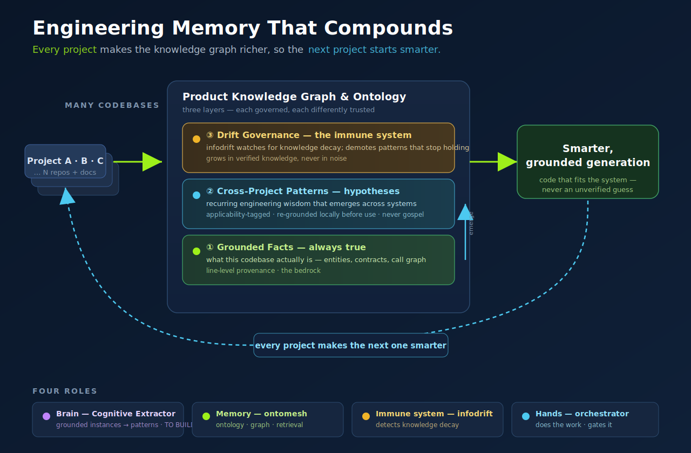

# Knowledge Vision — Engineering Memory That Compounds

*The long-game thesis behind the Product Knowledge Graph. Companion to
`README.md` (§4). One sentence: **a system that learns what's true about software,
remembers it, and proves it before it acts.***

---

## The pitch

**Most AI coding assistants are amnesiacs.** They read a repo, solve one ticket,
and forget everything. The next project starts from zero.

**We're building engineering memory that compounds.** Our extractor doesn't just
*read* code — it distills each codebase into **verified, structured knowledge**:
the entities, contracts, and patterns that make that system work. Every project
makes the knowledge graph richer, so the next project starts *smarter*.

**The result:** an institutional engineering intelligence that turns every
project into reusable, trustworthy knowledge — getting faster and safer with
scale, **without ever trusting an unverified guess.**

> Not a chatbot that knows everything. A system that *learns what's true,
> remembers it, and proves it before it acts.*

---

## Three layers, each governed

The danger in "a knowledge graph that evolves itself" is that it evolves into
*noise*. We prevent that by keeping knowledge in three layers with **different
levels of trust** — abstraction never masquerades as fact.

| Layer | What it is | Trust |
|---|---|---|
| **① Grounded facts** | What *this* codebase actually is — entities, contracts, call graph, with line-level provenance | **Bedrock** — always true, always traceable |
| **② Cross-project patterns** | Recurring engineering wisdom that *emerges* once we've seen enough systems | **Hypothesis** — applicability-tagged, re-grounded locally before use, never gospel |
| **③ Drift governance** | Monitoring (infodrift) that watches for knowledge *decay* and demotes patterns that stop holding | **Immune system** — the graph grows in *verified* knowledge, never in noise |

---

## The four roles

| Role | Component | Status |
|---|---|---|
| 🧠 **Brain** — turns grounded instances into transferable patterns | *Cognitive Extractor* | **to build** |
| 📚 **Memory** — ontology, graph, retrieval | **ontomesh** | exists |
| 🛡 **Immune system** — detects knowledge decay/drift | **infodrift** | exists |
| ✋ **Hands** — does the work and gates it | **orchestrator** | built |

The orchestrator acts; ontomesh remembers; infodrift keeps the memory honest;
the cognitive extractor is the learning brain we build on top.

---

## Three principles that keep it honest

1. **Grounded ≠ generalized — keep them separate.** A pattern that's wisdom in
   Product A is an anti-pattern in Product B. Facts (precise, provenanced) and
   patterns (portable, conditional) live in different layers and are trusted
   differently. A pattern is never applied without re-grounding against the local
   code.
2. **Governed evolution, not blind accretion.** Every learned pattern is a Claim
   with Evidence, verified before it's trusted, with confidence that decays. When
   infodrift sees a pattern stop holding, it's demoted. The graph only grows in
   *verified* knowledge.
3. **Patterns emerge — they aren't designed up front.** You can't mine universal
   patterns from one project. Build the grounded extractor first, accumulate
   verified instances across many repos, *then* let the brain surface candidate
   patterns. Memories before the brain — not the reverse.

---

## Why this is the moat

Stateless tools compete on model quality — a moving, commoditizing target.
**Compounding knowledge is a durable asset:** it gets better the more it's used,
and it can't be copied without re-living every project it learned from. Solving
today's tickets in a way that *accumulates* is exactly what makes tomorrow's
system futuristic. The compounding **is** the future.

---

*Pieces: `orchestrator` (this repo) · `synaptixs/ontomesh` · `synaptixs/infodrift`.
The Cognitive Extractor is the next thing to build — see `README.md` §4 (PKG)
for the grounded-extractor wedge it starts from.*
