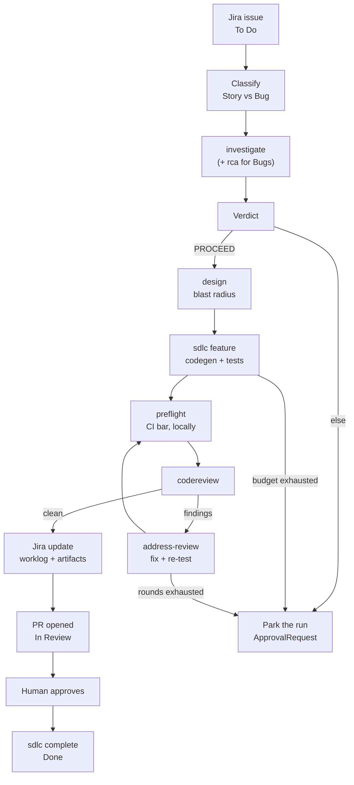

# Design + Plan: the autonomous run agent

**Status:** Proposed. No branch yet. Nine phases; phases 0–3 are strictly serial, 4–6 run in
parallel once the supervisor exists.

**One-liner:** one agent drives a ticket from Jira through design, code, tests, review and
back to Jira — calling the commands Spine already has — and knows when to stop and ask.

---

## 1. The case

Every stage of the loop exists as a command today. Nothing calls them in order, carries state
between them, or decides what to do when a stage says *no*. A human is the connective tissue,
and the connective tissue is the bottleneck.

The interesting part is not the happy path — chaining seven commands is a shell script. It is
**everything that isn't the happy path**: a ticket whose acceptance criteria contradict the
source, a bug that localizes to nothing, a refine loop that will never go green, a review
finding the agent shouldn't fix itself, a crash that strands a worktree and leaves a ticket
`In Progress` forever. This document is mostly about those.

**Two failures from the dogfooding runs shape the whole design:**

- SSPN-3's acceptance criterion said *"11 `Entity` nodes on this repo"*. The source has 7.
  An agent that treats acceptance criteria as ground truth either loops forever or declares
  false success.
- SSPN-2 carried a criterion (`impact_of` returns non-empty) that could not be met without a
  change to shared traversal code in a different subsystem. The right answer was to deliver
  four criteria, refuse the fifth, and say why.

So: **the ability to reject a ticket is a feature, not an error path.**

---

## 2. What already exists (build on this, do not rebuild)

| Piece | Gives us |
|---|---|
| `investigate` | The brief: where a ticket lands in the code, relevant project knowledge, prior notes from past runs — grounded, no-LLM |
| `design` | Grounded design with blast radius (`EXPOSES`-aware since SSPN-17) |
| `sdlc feature` | Source → spec → worktree → grounded codegen → test/refine → commit → PR → Jira, with `--issue` adoption |
| `rca`, `localize` | Bug → fault site → hypotheses → regression surface |
| `regression`, `sdlc/coverage.py` | What a change should re-test, from the call graph |
| `codereview/` | Grounded reviewer, verifiers, semgrep, GitHub client, **webhook** |
| `sdlc address-review` | Read a PR's review comments, revise, push |
| `sdlc/preflight.py` | The CI bar (ruff/format/mypy) run locally before a PR opens |
| `sdlc/escalation.py` | Risk from judge uncertainty + refine effort + blast radius |
| `approval/` | `ApprovalRequest`, states, risk classification, approvers, **timeouts**, pending/timed-out queries |
| `sdlc/run_control.py` | **start / poll / decide-gate / result** over a long, gated Temporal workflow — non-blocking |
| `agentic/loop.py`, `agentic/policy.py` | Bounded think→act→observe, policy gates on tool use, approval pauses that **resume where they stopped** |
| `RecordingLLMClient` + `sdlc/telemetry.py` | Per-stage tokens/models/cost; the Jira worklog |
| `evals/`, `scripts/skill_ab.py` | A/B measurement and promotion |

**The engine exists. What is missing is a driver, a verdict, a bounded review loop, and the
unhappy-path plumbing.** That should shape the estimate: mostly composition, one piece of real
judgment.

---

## 3. The happy path

---

## 4. Contracts

Four things must be pinned before any code, because everything else composes against them.

### 4.1 Verdict

The validity gate returns exactly one of these, with evidence. Not prose.

| Verdict | Meaning | Action |
|---|---|---|
| `PROCEED` | Grounded; criteria check out against the graph | Continue |
| `CRITERIA_WRONG` | A criterion contradicts the source | Park. Human. |
| `UNLOCALIZED` | A Bug that resolves to no symbol | Ask for a trace/failing test |
| `ALREADY_DONE` | Prior notes or the graph show it exists | Park. Human. |
| `DUPLICATE` | Another ticket covers it | Park. Human. |
| `TOO_BIG` | Blast radius or intent count over threshold | Split first. Human. |

### 4.2 Run state

Persisted, not derived: run id, ticket key, phase, worktree, branch, PR url, budgets consumed,
verdict, escalation tier, parked-on approval id. One run owns one ticket; a retry **resumes**.

### 4.3 Budgets

Enforced *during* the run, not reported after: tokens, cost, refine rounds, review rounds,
wall-clock. Exhaustion is a park, never a silent stop and never a "ship it anyway".

### 4.4 Escalation tiers

`escalation.py` today computes risk and **never blocks** — correct for a supervised pipeline,
wrong for an unattended one. Tiers become:

- `ANNOTATE` — record on the PR and ticket, continue (today's behaviour)
- `PARK` — create an `ApprovalRequest` with a timeout, notify, stop and wait

---

## 5. Human gates

Four. Anything else runs unattended.

| # | Trigger | Blocks | What the human sees |
|---|---|---|---|
| 1 | Verdict ≠ `PROCEED` | Yes | The brief, the contradiction, the evidence |
| 2 | Budget exhausted | Yes | What was tried, what it cost, the current diff |
| 3 | High risk, green anyway | No | Risk signals on the PR and ticket |
| 4 | Final PR | Yes | The change, tests, findings, worklog |

Gates are **asynchronous**. The agent parks against an `ApprovalRequest` and resumes on
decision; it never holds a session open waiting.

---

## 6. Unhappy paths

| Failure | Detect | Automatic response | Human |
|---|---|---|---|
| Ticket invalid | Validity gate | Stop before any code is written | Yes |
| Bug won't localize | RCA unresolved | Request a trace; never guess a fault site | Yes |
| Tests never green | Refine budget, no-op refine | Stop at the first no-op refine | Yes |
| Lint/type failure | `preflight` | Feed the refine loop locally | No |
| Review findings | Review-round budget | Fix → re-test → re-review, bounded | After N |
| Finding out of scope | Reviewer classification | File an evidence-rich ticket | No |
| Cost blowout | Budget | Park | Yes |
| Crash mid-run | Reaper vs Jira/git state | Release worktree, revert status, comment | Notify |
| Duplicate ticket/PR | Idempotency key + run↔ticket binding | Refuse to create | No |
| Flaky CI | Re-run once, compare | Escalate if the two runs disagree | Yes |

---

## 7. Invariants this must not break

From [CLAUDE.md](../../CLAUDE.md), plus two this track adds:

1. **The PKG is the source of truth.** The agent reads facts; it never re-derives them from
   paths or filenames.
2. **`understand` / `state` stay deterministic and no-LLM.** The agent may *call* them; it may
   never put a model in their path.
3. **Bound honestly.** Every budget, every truncated list, says what it elided.
4. **Additive only.** Existing commands keep their behaviour and exit codes. The agent
   composes them; it does not change them. A human must be able to run any stage by hand and
   get exactly what they get today.
5. **Nothing outward-facing without a gate.** Jira writes, PR opens and pushes go through
   `agentic/policy.py`, not raw credentials.

---

## 8. Phases

| # | Phase | Delivers | Exit criterion |
|---|---|---|---|
| 0 | Design record | This document + the epic | Contracts in §4 agreed |
| 1 | Merge train | Parallel PRs stop invalidating each other | Two PRs land without a rebase |
| 2 | Walking skeleton | `sdlc autorun`, happy path, safe mode | One Story goes ticket → PR unattended |
| 3 | Run supervisor | Run state, budgets, idempotency, park/resume, reaper | Kill mid-run; Jira + git stay consistent; re-run resumes |
| 4 | Validity gate | Classifier + verdict + criteria check | Replaying SSPN-2/3/18 returns the right verdict unaided |
| 5 | Review loop | Bounded findings → fix → re-test → re-review | An injected defect is found and fixed with no human |
| 6 | Escalation | `PARK` tier wired to `ApprovalRequest` + notify | A high-risk run parks, survives restart, resumes |
| 7 | Telemetry | Cross-agent ledger aggregation, per-ticket trace | A finished ticket shows cost, models, stages, artifacts |
| 8 | Measurement | Scored corpus + baseline | A table to regress against |
| 9 | Release | Version bump, CHANGELOG, tag | Only once the rest is boring |

**Phase 1 is a real prerequisite.** Every PR regenerates `episteme/`, so any merge invalidates
every open branch — observed twice while shipping SSPN-2 and SSPN-17, with one agent working
*serially*. An agent opening PRs in parallel deadlocks. Options: stop committing the artifact
and verify it in CI; regenerate post-merge; or serialize merges behind a queue.

---

## 9. Open decisions

1. **Durability.** Build the skeleton as a Temporal workflow from the start (durability and
   gates come free via `run_control.py`), or as a shell chain and retrofit? Leaning Temporal.
2. **Transport.** Agent→agent over MCP (`plugin/server.py`, typed, schema'd) or CLI subprocess
   (inspectable, stringly-typed)? Leaning MCP for the agent, CLI stays the human surface.
3. **Budget exhaustion.** Park with the work in progress, or ship what exists for review?
4. **Which escalation tiers park** rather than annotate.

---

## 10. Risks

| Risk | Mitigation |
|---|---|
| Ticket quality is the ceiling | Phase 4 is the answer; it must not slip |
| Cost runs away quietly | Budgets in Phase 3 (enforced), not Phase 7 (observed) |
| Humans become the bottleneck | Four gates; measure interventions per ticket in Phase 8 |
| False confidence — green suite, wrong change | Escalation + review loop; a self-consistent artifact can still be wrong |
| Credentialed automation | Policy gates on writes. A test suite once wrote to production Jira (SSPN-12); automation would have filed hundreds |

## 11. What stays human, permanently

Final merge approval. The fate of a rejected ticket. Anything touching production data or
money. And the call on whether an acceptance criterion is wrong — the agent detects and
evidences that; it never overrules it.
