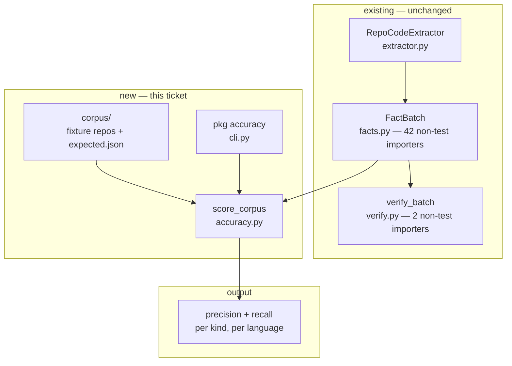

# PKG-ACC-1 — build document

Phase 1 of [`../pkg-accuracy-roadmap.md`](../pkg-accuracy-roadmap.md): a labelled corpus and
the two numbers. Everything needed to generate the code and tests. Self-contained.

---

## 1. Requirement

`orchestrator pkg accuracy --corpus <path>` reports **precision and recall per node kind and
per edge kind, per language**, measured against hand-labelled fixture repositories.

Today no such number exists. `pkg verify` on this repo reports `OK — 0 error(s), 1
warning(s)`, which establishes that the graph does not contradict itself and says nothing
about whether it is right. `pkg capabilities` reports that the `python` front-end *can* emit
all ten edge kinds and `typescript` four of ten — capability, explicitly not coverage.

## 2. Intent

Convert "precision-first" from a design stance appearing in six extractor docstrings into a
measured figure per kind, per language, reproducible by anyone who clones the repo.

Phase 1 **reports**. It does not gate — no threshold, no non-zero exit on a low score. The
regression gate is phase 5, and building it before there is anything true to put in it is
the failure mode the roadmap names in §3.

## 3. Root cause

Not a bug — an absent capability. The reason it is absent is structural, and worth stating
because it determines the design:

Every existing check is **oracle-free by construction**. `verify.py`'s six checks run on any
repo with nothing to compare against; `GroundingVerifier` re-extracts a file and confirms a
symbol still exists; `understand --check` compares a generation against its own previous
output. All three ask *is this self-consistent*. None can ask *is this correct*, because
correctness needs something that already knows the answer, and no such thing exists in the
repository.

**Consequence:** the deliverable is not primarily code. It is the *ground truth* — the code
that compares against it is the small part.

## 4. PKG — what the graph knows

Extracted from this repo at `695bdb3`: **11,076 nodes** (10,376 grounded, 700 external),
**32,223 edges** — 15,405 `CALLS`, 9,672 `CONTAINS`, 6,645 `IMPORTS`, 274 `IMPLEMENTS`,
120 `CONSUMES`, 77 `EXPOSES`, 29 `READS`, 1 `WRITES`, 0 `REFERENCES`, 0 `MENTIONS`.

**Grounded nodes are 100% `python`.** No other language front-end has any population in this
repo, which is why the corpus must be *fixture repositories* rather than a labelling of this
codebase. There is nothing here to label for TypeScript.

**Modules in the blast radius, with inbound imports counted at symbol granularity:**

| module | importers | non-test | contained symbols |
|---|---|---|---|
| `orchestrator.pkg.verify` | 3 | **2** (`cli`, `pkg/__init__`) | 12 |
| `orchestrator.pkg.capabilities` | 2 | **1** (`cli`) | 9 |
| `orchestrator.pkg.facts` | 87 | **42** | 6 |
| `orchestrator.cli` | 3 | 0 (tests only) | 77 |

`verify_batch` has 19 callers — one production (`cli.pkg_verify`), eighteen tests.

**Why this matters for scoping:** `verify.py` is a leaf. A sibling `accuracy.py` inherits
exactly that containment. `facts.py`, by contrast, has 42 non-test importers — which is why
the resolution-tiering work discussed alongside this phase is a materially riskier change
than this one, and a legitimate reason to do this first.

**Caveat on the numbers above:** `from X import Y` emits `IMPORTS` edges to the *symbol*
(`py:orchestrator.pkg.facts.NodeKind`), not to the module. A module-keyed query reports
`facts.py` as having **zero** importers; a prefix-aware one reports 87. Both readings come
from the same graph. This is not cosmetic — see §9, where it is the single most likely way
to get a wrong number out of this feature.

## 5. Blast radius — impact neighbourhood



**Reading it:** `accuracy.py` consumes a `FactBatch` exactly as `verify.py` does, and adds
one input `verify.py` does not have — the labelled corpus. Nothing flows back. No existing
module changes behaviour.

**Containment:** the only edit to an existing file is one new Typer command in `cli.py`,
which no production module imports. `facts.py` is read, never modified — no new field, no
new kind. If this feature were deleted entirely, every other surface would behave
identically.

## 6. Design

**Three pieces, in dependency order.**

### 6.1 The corpus — `corpus/<language>/<case>/`

Fixture repositories small enough to label by hand, each with a sidecar `expected.json`:

```json
{
  "language": "python",
  "case": "dispatch",
  "why": "instance-method calls the extractor documents as skipped",
  "nodes": [{"id": "py:shop.cart.Cart", "kind": "Type"}],
  "edges": [{"src": "py:shop.cart.Cart.total", "dst": "py:shop.tax.rate", "kind": "CALLS"}],
  "known_gaps": [
    {"edge": {"src": "...", "dst": "...", "kind": "CALLS"},
     "why": "receiver type unknown without inference — typescript_extractor.py:20 documents the skip"}
  ]
}
```

`known_gaps` is the load-bearing field. A fact listed there is **still counted as a miss** in
recall — it is not an exemption. It records that the miss is understood rather than
unnoticed, so the report can separate *known* from *new* recall loss. New losses are the
signal phase 5 will eventually gate on.

Labels are written **from the source by hand**, in the exact id vocabulary the graph emits.

### 6.2 The comparator — `src/orchestrator/pkg/accuracy.py`

Mirrors `verify.py`: a pure function over a `FactBatch`, a frozen report dataclass, no I/O
beyond reading the corpus.

- **Node match key:** `(id, kind)`. **Edge match key:** `(src, dst, kind)`.
- **Provenance is excluded from the match** and reported separately as `provenance_drift`.
  A one-line shift is not a wrong fact, and folding it into precision would make the headline
  number move for reasons nobody cares about.
- **External nodes are excluded from the node ratio; edges pointing at them are not.**
  An `external=True` node is a placeholder for something outside the scanned tree. An edge
  *to* one is still a claim that the call happens, and that claim can be false.
  *(Revised 2026-08-12 after the first corpus run: excluding both scored a confirmed phantom
  — `py:svc.registry.build -CALLS-> py:cls`, where `cls` is a local variable — at 1.0
  precision. The original rule hid the exact class of error the measurement exists to find.)*
- Precision = |emitted ∩ expected| / |emitted|. Recall = |emitted ∩ expected| / |expected|.
  Reported per kind per language, plus a per-case breakdown.
- A kind with an empty expected set reports `—`, never `1.0`. Vacuous perfection is the
  easiest way to publish a misleading number.

### 6.3 The command — `pkg accuracy` in `cli.py`

Mirrors `pkg_verify` (`cli.py:2637`) exactly: path argument defaulting to the bundled
corpus, `--json`, `--language` filter. **Exit code is always 0** unless the corpus itself is
malformed or unreadable. Reporting, not gating.

## 7. Files

**Created**

| file | contents | size |
|---|---|---|
| `src/orchestrator/pkg/accuracy.py` | `score_corpus()`, `CorpusCase`, `AccuracyReport`, per-kind tallies | ~220 lines |
| `corpus/README.md` | the labelling method — how a case is written, why `known_gaps` counts as a miss | ~80 lines |
| `corpus/python/plain/` | module, class, method, function, direct calls — the baseline | ~60 lines + labels |
| `corpus/python/decorated/` | route decorators, `functools.wraps`, class decorators — `Endpoint`/`EXPOSES` | ~70 lines + labels |
| `corpus/python/dispatch/` | instance calls, callables as arguments, `getattr` — the known-hard case | ~60 lines + labels |
| `corpus/python/relative_imports/` | a package importing across submodules — the shape of the historical bug | ~50 lines + labels |
| `corpus/typescript/plain/` | class, interface, type alias, exported arrow consts | ~60 lines + labels |
| `corpus/typescript/generics/` | generic classes and interfaces, type parameters | ~50 lines + labels |
| `corpus/typescript/instance_calls/` | `obj.method()` — documented as skipped at `typescript_extractor.py:20` | ~40 lines + labels |
| `tests/pkg/test_accuracy.py` | comparator arithmetic, vacuous-kind handling, corpus well-formedness | ~150 lines |

**Changed**

| file | scope |
|---|---|
| `src/orchestrator/cli.py` | one new `@pkg_app.command("accuracy")`, ~35 lines, modelled on `pkg_verify` at line 2637 |
| `docs/specs/build-documents/README.md` | one index row |
| `docs/specs/pkg-accuracy-roadmap.md` | phase 1 status: proposed → built |

**Scope call — Python and TypeScript only.** Not the other six front-ends. Python emits all
ten edge kinds and TypeScript four, so between them they cover both parse technologies
(`ast` and tree-sitter) and both ends of the vocabulary. Extending to Java/Go/C/C++/C#/SQL is
the same corpus shape against an existing harness and does not need this document.

## 8. Acceptance criteria

1. `orchestrator pkg accuracy` with no arguments scores the bundled corpus and prints
   precision and recall per node kind and edge kind, per language.
2. `--json` emits the same report as structured data; `--language python` filters to one.
3. A kind with no expected facts reports `—`, never `1.0`.
4. `external=True` nodes appear in neither numerator nor denominator.
5. Provenance differences do not affect precision or recall, and are reported separately.
6. A fact listed in `known_gaps` still counts as a recall miss, and is labelled *known* in
   the output rather than silently excluded.
7. The command exits 0 on any score, and non-zero only when a corpus case is malformed.
8. The corpus **as a whole** contains cases the current extractor does not fully score. An
   individual case may legitimately score 1.0/1.0 as a control — `corpus/python/plain` does,
   and the signal is any future run where it stops.
9. `mypy src tests` and `ruff format --check .` pass.

## 9. Facts the generator needs

- **`from X import Y` emits `IMPORTS` to the symbol when `Y` has a node, and to the module
  `py:X` when it does not.** Verified on this repo:
  `py:orchestrator.knowledge.areas → py:orchestrator.pkg.facts.NodeKind`, 392 such edges.
  The fallback is one condition in `import_link.py` — the rewrite fires only when the target
  is an *external placeholder*, so a real node is left alone and a variable, re-export or
  alias is repointed at its module. Both halves bite: a label naming the module misses when
  `Y` is a function, and a label naming the symbol misses when `Y` is a variable — same
  syntax, different edge. *(The second half was found by measurement on
  `corpus/python/decorated`, after this document originally stated only the first.)* A total
  mismatch for one kind should be reported as a suspected vocabulary error, not a score.
- **Node ids are language-prefixed and stable** (`py:pkg.mod.Cls`). C/C++ ids are symbols
  (`cpp:HSL2RGB`), not locations.
- `FactBatch` de-duplicates on add, and a grounded node upgrades an external placeholder for
  the same id (`facts.py:118`). Count from `batch.nodes` / `batch.edges`, not from a running
  tally during extraction.
- `Edge.key()` includes provenance (`facts.py:95`). Do **not** use it as the match key — it
  would make provenance drift look like a wrong fact.
- Follow `verify.py`'s report shape: a frozen dataclass with an `ok` property and a list of
  typed items, so the CLI layer stays a formatter.
- The CLI pattern to copy is `pkg_verify` at `cli.py:2637` — `_repo_arg` context manager,
  `_print` for JSON, `typer.echo` for text.
- TypeScript extraction needs the `typescript` extra installed; without it `_ts_parser`
  raises `RuntimeError` (`typescript_extractor.py:397`). The TypeScript corpus cases must
  skip cleanly, not fail, when the extra is absent.
- No new dependency. No change to `facts.py`.

## 10. Codegen prompt

**System:** `_IMPLEMENT_SYSTEM` — source files only, new module permitted.

**User payload:**
- Sections 1, 3, 6, 8, 9 of this document
- Full text of `src/orchestrator/pkg/verify.py` (354 lines) as the shape to mirror
- Full text of `src/orchestrator/pkg/facts.py` (141 lines) as the vocabulary
- `cli.py` lines 2529–2680 (the `pkg` command group) rather than the whole 2,901-line module

**Then `author_tests`** receives the same spec plus the written source.

**The corpus should not be generated.** A model writing both the fixture source and its
expected facts produces a corpus that agrees with itself, which measures nothing. §9's
circularity warning applies to the generator as much as to a person: **labels are written
from the source by a human, and reviewed against the language reference, not against
extractor output.**

---

## 11. Token usage & cost

**Not measured.** This document was assembled by hand; no pipeline run of this ticket exists,
so there is no worklog to quote. The only measured baseline in this repo is SSPN-49 at a mean
148,801 tokens per run (~$1.19 on `claude-opus-5`), against a 122 KB payload.

This ticket's payload is smaller — `verify.py` and `facts.py` are 495 lines together against
SSPN-49's whole `cli.py` — so the code portion should cost less. That is an inference from
payload size, not a measurement, and it is stated as one.

**Effort, which is the number that matters here:** roughly one engineer-week, and the split
is the point.

| | |
|---|---|
| comparator + CLI + tests | ~2 days |
| corpus: 7 cases, labelled by hand and reviewed | ~3 days |

The expensive part is the ground truth, and it cannot be generated, parallelised, or skipped.

---

## 12. Confidence

| | score |
|---|---|
| The analysis is right | **90%** |
| A person ships it in one pass from this document | **80%** |
| An unattended pipeline run completes | **35%** |

### Why the analysis is 90%

| claim | confidence | basis |
|---|---|---|
| No accuracy measurement exists today | ~99% | `pkg --help` lists five commands; `verify.py`'s own docstring scopes itself to oracle-free invariants. |
| Containment | ~99% | Graph-proven: `verify.py` has 2 non-test importers, `cli` has none. |
| Comparator design is sound | ~90% | Set arithmetic over stable ids. The judgement calls — excluding provenance and external nodes — are argued in §6.2 and could be decided differently. |
| The symbol-vs-module `IMPORTS` trap is real | ~99% | Reproduced on this repo while writing §4. |
| One week is the right estimate | ~70% | The comparator is predictable. Labelling seven cases by hand is not, and hand-labelling is where every published corpus overruns. |

**Resolved 2026-08-12 — two cases are now labelled**, and the schema survived contact.

| case | nodes P/R | CALLS P/R | CONTAINS P/R | IMPORTS P/R |
|---|---|---|---|---|
| `python/plain` | 1.00 / 1.00 | 1.00 / 1.00 | 1.00 / 1.00 | 1.00 / 1.00 |
| `python/dispatch` | 1.00 / 1.00 | **0.67 / 0.40** | 1.00 / 1.00 | 1.00 / 1.00 |

Hand-labelling landed in the right vocabulary first try — symbol-level `IMPORTS`,
`self.method()` resolving, an `__init__`-assigned attribute counting as a `Field`. Two misses
were predicted in `known_gaps` before any run and both occurred, with nothing unpredicted.

The corpus also earned its keep immediately: a 15-line fixture surfaced a **false positive**
the whole existing check surface is blind to — `build -CALLS-> py:cls`, where `cls` is a
local variable. `pkg verify` passes this fixture, because a graph asserting a call to a
non-existent external function is perfectly self-consistent.

### Why the pipeline is 35%

Lower than SSPN-49's 40%, for a specific reason rather than pessimism: the deliverable is
mostly *data*, and §10 argues that data must not be model-generated. A pipeline run can
produce `accuracy.py`, the CLI command and the tests — perhaps 40% of the work — and
structurally cannot produce the corpus. Scoring this as a codegen ticket measures the wrong
thing.

### Recommendation

**Split it — and the first half is done.** `corpus/python/plain/` and
`corpus/python/dispatch/` are labelled, scored, and the `expected.json` shape held. Four
schema questions surfaced and were decided (recorded in [`../../../corpus/README.md`](../../../corpus/README.md#decided-rules)),
one of which reversed a rule in §6.2 above.

What remains splits cleanly:

| | work | shape | state |
|---|---|---|---|
| comparator | `accuracy.py` + `pkg accuracy` + 16 tests | code against existing ground truth | **built 2026-08-13 01:41** |
| corpus | 7 cases — Python ×4, TypeScript ×3 | hand labelling, cannot be generated | **complete 2026-08-13 08:27** |

**As built**, all 7 cases:

| | Python P/R | TypeScript P/R |
|---|---|---|
| `CALLS` | 0.80 / 0.73 | 1.00 / 0.50 |
| every other edge kind | 1.00 / 1.00 | 1.00 / 1.00 |
| every node kind | 1.00 / 1.00 | 1.00 / 1.00 |

Every acceptance criterion in §8 is met. `mypy src tests` clean, `ruff format --check .`
clean, `tests/pkg` green. Verified by exit code rather than by reading the code: a corpus
scoring 0.50 recall exits **0**, a malformed corpus exits **1** — reporting, not gating.

**Phase 1 is complete.** Estimated ~1 week; took ~10.5 hours — see the roadmap's Progress
table, and treat the overshoot as a caution about the later phases' estimates rather than as
a win. The numbers describe 7 hand-written fixtures chosen to contain hard shapes, so they
are pessimistic by construction and say nothing about a real repository. That is phase 2's
job.
