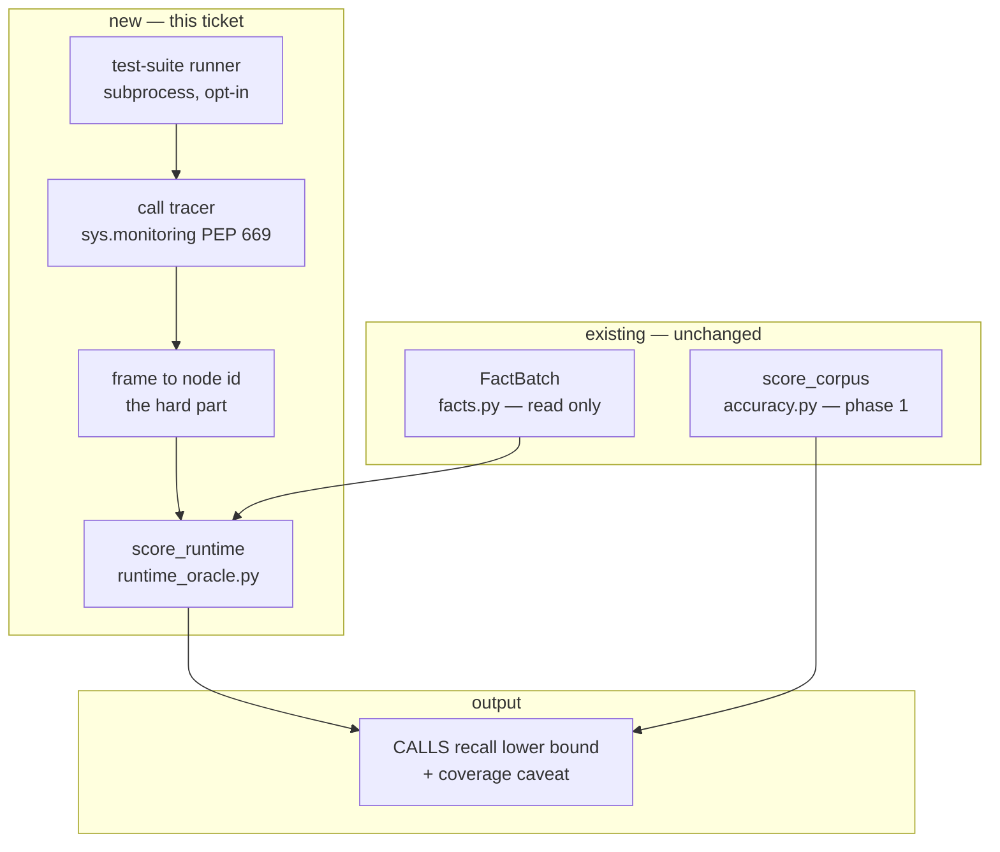

# PKG-ACC-2 — build document

Phase 2 of [`../pkg-accuracy-roadmap.md`](../pkg-accuracy-roadmap.md): the runtime oracle.
Everything needed to generate the code and tests. Self-contained.

**Status:** ✅ **shipped 2026-08-13 09:36 EDT** · started 08:37 · elapsed ~1 hour

**As built** — `orchestrator pkg accuracy --oracle runtime . --tests tests/pkg`:

| | |
|---|---|
| `CALLS` recall (lower bound) | **0.70** |
| observed pairs / matched | 1,357 / 951 |
| unmapped | **0** |
| coverage of the traced suite | 21.2% of statements |
| filtered as never-the-graph's-job | 11.0M out-of-tree, 742k builtin, 3.4k anonymous |
| wall clock | 34s |

Every acceptance criterion in §8 is met. 19 new tests, all 8 §9 hazards covered; `mypy src
tests` clean over 615 files, `ruff format --check .` clean, 351 tests green.

**One defect found and fixed during implementation, worth more than the feature:**
`module_for_file` runs inside the `CALL` callback — ~11.7M times over this repo's own
`tests/pkg`. The first implementation did a `Path.resolve()` on each, taking the traced suite
from the spike's 18 seconds to **over ten minutes**. The spike had memoised it; the
refactor into a standalone pure function silently dropped the cache. Restored, with the
reason in the docstring so it does not get "cleaned up" again. *A spike that validates an
algorithm does not validate the implementation that replaces it.*

---

## 1. Requirement

`orchestrator pkg accuracy --oracle runtime` runs a repository's own test suite under a call
tracer, and reports **what fraction of calls that demonstrably happened have a `CALLS` edge
in the graph**.

No labelling. No corpus. It works on any Python repository with a test suite, including one
nobody here has ever seen.

## 2. Intent

Phase 1's numbers describe **7 hand-written fixtures**, chosen to contain hard shapes and
therefore pessimistic by construction. They say nothing about any real repository. This is
the phase that produces a number about real code, and it is the only oracle in the roadmap
that scales to a customer's repository without anyone labelling anything.

**It measures recall and nothing else.** See §3.

## 3. Root cause

Not a bug — the second absent capability, and one with a hard limit worth stating before any
code is written.

A trace observes calls that *happened*. From that you can ask: did the graph know about this
call? That is **recall**. You cannot ask the converse — an edge the trace never observed is
not thereby wrong, because the test suite simply may not exercise it. **Precision is not
computable from a trace**, and any implementation that reports one is lying.

So the output is a **lower bound on recall**, bounded twice over:

1. by what the test suite executes (its coverage), and
2. by what the tracer can attribute to a graph node id (§9's mapping problem).

Both bounds must appear in the output next to the number, or the number will be read as
"recall is 0.71" when it means "recall is *at least* 0.71 over the 43% of the codebase these
tests touch".

## 4. PKG — what the graph knows

Extracted at `docs/pkg-accuracy-roadmap` HEAD: **11,076 nodes**, **15,514 `CALLS` edges**.

| | count | share |
|---|---|---|
| `CALLS` to a first-party node | 10,662 | 69% |
| `CALLS` to an `external` target | 4,852 | **31%** |

That 31% is the reason this phase matters twice over. Phase 1 proved that *some* external
call targets are invented — `py:cls` from a local variable, `py:fn` from a parameter — and
nothing currently distinguishes an invented external target from a legitimate stdlib call.
The runtime oracle sees the truth for every call the tests execute.

**Modules in the blast radius:**

| module | importers | non-test | note |
|---|---|---|---|
| `orchestrator.pkg.accuracy` | 2 | **1** (`cli`) | phase 1's module — extended, not replaced |
| `orchestrator.pkg.verify` | 3 | 2 | untouched |
| `orchestrator.pkg.facts` | 87 | 42 | **read only, never modified** |

`accuracy.py` has the same leaf containment `verify.py` has. A new sibling module for the
tracer inherits it.

## 5. Blast radius — impact neighbourhood



**Reading it:** the new path runs alongside phase 1's, not through it. `score_corpus` and
`score_runtime` both produce scores and share a report surface, but neither calls the other —
one needs a corpus and no execution, the other needs execution and no corpus.

**Containment:** one new module, one new flag on an existing command. `facts.py` is read and
never written. If this feature were removed, `pkg accuracy` would behave exactly as it does
today.

**The one thing that leaves the neighbourhood:** running a test suite executes arbitrary
code. That is not a graph concern and it is the reason §6.3 exists.

## 6. Design

### 6.1 The tracer — `sys.monitoring`, not `sys.settrace`

`requires-python = ">=3.12"`, so **PEP 669 is guaranteed by the project floor** rather than
merely available. No `settrace` fallback is needed, and the overhead difference is the
difference between "run the suite under it" and "don't".

Register a tool id and subscribe to `events.CALL`. The callback receives
`(code, instruction_offset, callable, arg0)`, which gives *both* ends of the edge directly:

| end | from | id |
|---|---|---|
| caller | `code.co_filename` → module, `code.co_qualname` | `py:{module}.{qualname}` |
| callee | `callable.__module__`, `callable.__qualname__` | `py:{module}.{qualname}` |

`settrace` would give only the callee frame and force the caller to be inferred from the
stack. `CALL` gives the callable itself. This is why the phase is worth doing now rather than
when it was written.

### 6.2 The mapping — the actual work

Everything else is plumbing; this is where the ticket succeeds or fails. See §9 for the
enumerated hazards. The output of this stage is a set of `(caller_id, callee_id)` pairs in
the *same vocabulary* `facts.py` emits, plus a tally of what could not be mapped — which is
reported, never silently dropped.

### 6.3 Running the suite — opt-in, subprocess, explicit

The suite runs in a **subprocess**, under an explicit flag, with the command shown before it
runs. It is never implied by `pkg accuracy` with no arguments.

Running a repository's tests means executing that repository's code. For Spine's own repo
that is unremarkable; pointed at a repository someone else wrote it is a materially different
act from every other command in this tool, all of which only ever *read*. The flag name, the
help text and the docs must say so.

### 6.4 Reporting

```
CALLS recall (runtime oracle) — 0.71 lower bound
  observed 1,204 first-party calls across 304 tests
  1,204 observed · 855 have an edge · 349 do not
  unmapped: 87 traced calls could not be attributed to a node id
  coverage: these tests execute 43% of first-party statements
  precision: NOT MEASURABLE from a trace — see the corpus oracle
```

Every line after the first exists to stop the first being over-read.

## 7. Files

**Created**

| file | contents | size |
|---|---|---|
| `src/orchestrator/pkg/runtime_oracle.py` | `CallTracer`, `trace_test_suite()`, `score_runtime()`, frame→id mapping | ~280 lines |
| `tests/pkg/test_runtime_oracle.py` | mapping hazards ×8, recall arithmetic, unmapped accounting | ~220 lines |

**Changed**

| file | scope |
|---|---|
| `src/orchestrator/pkg/accuracy.py` | share the `KindScore` shape; no change to `score_corpus` |
| `src/orchestrator/cli.py` | `--oracle runtime` on `pkg accuracy`, ~30 lines |
| `docs/specs/pkg-accuracy-roadmap.md` | phase 2 progress + end stamp |

**Scope call — the runtime oracle only.** The roadmap's phase 2 bundles five oracles
(runtime, language toolchain, import machinery, live database, OpenAPI) at ~2 weeks. This
document covers **one**, because it is the one the roadmap itself calls highest-value and the
only one that needs no external system. The other four are separate tickets against the same
report surface.

## 8. Acceptance criteria

1. `orchestrator pkg accuracy --oracle runtime <path>` runs the repo's test suite under
   `sys.monitoring` and reports a `CALLS` recall lower bound.
2. The output states, on every run: the observed call count, the edge-match count, the
   unmapped count, test coverage, and that **precision is not measurable this way**.
3. Traced calls that cannot be attributed to a node id are counted and reported — never
   silently discarded, and never counted as either a hit or a miss.
4. Every hazard in §9 has a test: nested function, decorated function, bound method,
   classmethod/staticmethod, lambda, comprehension, C/builtin callee, and a callee outside
   the scanned tree.
5. Running the suite requires an explicit flag and happens in a subprocess; the command is
   echoed before execution.
6. The oracle's output is **never** written to `episteme/` and never consumed by `understand`
   or `state` — see the determinism decision in §9.
7. Exits 0 on any score. Non-zero only when the suite cannot be run or the repo has no tests.
8. `mypy src tests` and `ruff format --check .` pass.

## 9. Facts the generator needs

**A trace observes a PAIR; the graph holds one edge PER CALL SITE.** `Edge.key()` includes
provenance, so two calls from `f` to `g` on different lines are two edges. Measured on this
repo: **15,514 `CALLS` edges collapse to 12,824 unique `(src, dst)` pairs.** The comparison
must be pair-level on both sides or the denominators silently disagree by ~17%. Found by the
spike, and it is the easiest way to get a plausible wrong number out of this feature.

**The mapping hazards, each of which needs a test:**

| shape | what the tracer sees | what the graph holds |
|---|---|---|
| nested function | `co_qualname` = `outer.<locals>.inner` | `py:mod.outer.inner` — **`<locals>` must be stripped** |
| decorated fn (`@wraps`) | the *wrapper's* code object; `__qualname__` preserved | `py:mod.original` |
| decorated fn (no `wraps`) | wrapper name in both | no node — counts as unmapped, not as a miss |
| bound method | `__qualname__` = `Cls.method`, `__module__` = defining module | `py:mod.Cls.method` ✓ |
| `classmethod` / `staticmethod` | may arrive as the underlying function | `py:mod.Cls.method` |
| lambda | `co_qualname` contains `<lambda>` | no node — unmapped |
| comprehension | its own code object in ≤3.11; inlined in 3.12 | no node — unmapped |
| C function / builtin | `__module__` is stdlib or `None` | out of tree — excluded, not unmapped |

- **Verified facts about this environment:** Python 3.12.7, `sys.monitoring` present,
  `co_qualname` present, `coverage` 7.14.0 already installed as a dev dependency.
- Module name from a file path must use `module_qualname()` from `pkg/extractor.py` — the
  same function the extractor uses (`src/` stripped, `__init__` collapsed). Do not
  reimplement it; a divergent module name makes every id miss.
- Node ids are `py:{module}.{qualname}`. Confirmed against `PythonExtractor.extract`, which
  builds symbol ids as `{parent_id}.{name}`.
- pytest config: `testpaths = ["tests"]`, `addopts` excludes `integration` and `real_llm`
  markers. The oracle must respect the repo's own pytest configuration rather than inventing
  an invocation.
- `sys.monitoring` tool ids are a scarce global resource — acquire with
  `sys.monitoring.use_tool_id`, and release it in a `finally`. `coverage` also uses one, so
  running both simultaneously needs distinct ids.

**The determinism decision, which needs an answer before implementation:** CLAUDE.md's
invariant 2 is that `understand` and `state` are deterministic and no-LLM — same code in,
same output out. This oracle is the **first measurement surface in the project that is not
reproducible byte-for-byte**: test execution order, skipped tests, and coverage all vary. That
is inherent, not a defect. The constraint it implies is that its output must stay out of
every deterministic path — never into `episteme/`, never read by `understand` or `state`.
Recorded as acceptance criterion 6.

## 10. Codegen prompt

**System:** `_IMPLEMENT_SYSTEM` — source files only, new module permitted.

**User payload:**
- Sections 1, 3, 6, 8, 9 of this document
- Full text of `src/orchestrator/pkg/accuracy.py` (the report shape to share)
- `pkg/extractor.py` lines 130–175 (`module_qualname`, `PythonExtractor.extract`)
- `cli.py` lines 2637–2800 (the `pkg accuracy` command to extend)

**The §9 hazard table is the specification, not context.** A model asked to "trace calls and
match them to the graph" will produce something that works on a flat module and silently
mismatches on every decorated or nested function — which is most of a real codebase. Each row
is a test in acceptance criterion 4.

---

## 11. Token usage & cost

**Not measured** — no pipeline run of this ticket exists.

**Effort:** ~3–4 days, one engineer. Split:

| | |
|---|---|
| tracer + subprocess runner | ~0.5 day |
| the frame→id mapping and its 8 hazard tests | **~2 days** |
| reporting, CLI, docs | ~1 day |

**Calibration from phase 1:** estimated ~1 week, took ~10.5 hours — a ~3× overshoot. That is
not a reason to divide this estimate by three. Phase 1's cost was concentrated in hand
labelling, which turned out to converge faster than feared; this phase's cost is concentrated
in the mapping table above, where the risk is *unknown unknowns* in CPython's frame model
rather than volume of work. Different risk shape, so the same optimism does not transfer.

---

## 12. Confidence

| | score |
|---|---|
| The analysis is right | **85%** |
| A person ships it in one pass from this document | **70%** |
| An unattended pipeline run completes | **30%** |

### Why the analysis is 85%

| claim | confidence | basis |
|---|---|---|
| Precision is not computable from a trace | ~99% | Definitional. An unobserved edge is untested, not false. |
| `sys.monitoring` is available and sufficient | ~99% | Verified: 3.12.7 running, and `requires-python >=3.12` guarantees it for every install. |
| `CALL` gives both ends of the edge | ~95% | PEP 669's signature. Not yet exercised against a decorated or nested callee in this repo. |
| Containment | ~99% | Graph-proven: `accuracy.py` has 1 non-test importer. |
| The hazard table is complete | **~60%** | It is the list I can enumerate from knowing CPython. The whole risk of this ticket is the row that is missing from it. |
| 3–4 days | ~65% | Contingent on the row above. |

The missing 15% is concentrated in one place, and it is honest to name it: **the hazard table
is a guess about a runtime, where phase 1's equivalent was a guess about a vocabulary.** A
vocabulary can be read out of the source in an afternoon. A runtime's frame model reveals
itself when you run it.

### Why the pipeline is 30%

Lower than phase 1's 35%, for the same structural reason as before: the hard part is not the
code. A model can write a `sys.monitoring` callback. Getting `outer.<locals>.inner` to match
`py:mod.outer.inner` across eight shapes is iterative debugging against a live interpreter,
which is the stage codegen has failed most.

### Recommendation — and the spike result

**The spike ran 2026-08-13 08:50 EDT. The design survives.**

Traced all of `tests/pkg` (304 tests) under `sys.monitoring`, deriving `(caller_id,
callee_id)` for every observed call:

| | |
|---|---|
| observed first-party call pairs | **1,019** |
| both ends map to a graph node | **1,019 — 100%** |
| unmapped | **0** |
| have a `CALLS` edge | 621 |
| **`CALLS` recall lower bound** | **60.94%** |
| tracing overhead | 18.0s vs 6.9s untraced — **~2.6×** |
| events filtered in-callback | 10.9M out-of-tree, 736k builtins, 3.2k anonymous |

**100% mappable.** `<locals>` stripping worked; nothing needed a hazard row that was not
already in the table. The 60% confidence on that table's completeness was warranted as a
prior and is now discharged for this repo — with the caveat that this is well-structured
Python, and a codebase leaning on metaprogramming may still surprise it.

**Revised confidence:** analysis 85% → **95%**; one-pass ship 70% → **85%**. The estimate
moves from 3–4 days to **~2 days**, because the ~2 days budgeted for the mapping was budgeted
for discovering the hazard table was wrong, and it isn't.

**And the spike corrected this document and the roadmap.** Both stated that the corpus
numbers were "pessimistic by construction" because the fixtures were built around hard
shapes. They are not: corpus Python `CALLS` recall is **0.73**, real code traced is **0.61**.
The hand-written fixtures were *optimistic*. That is the single most valuable thing phase 2
has produced so far, and it arrived before a line of production code was written.
