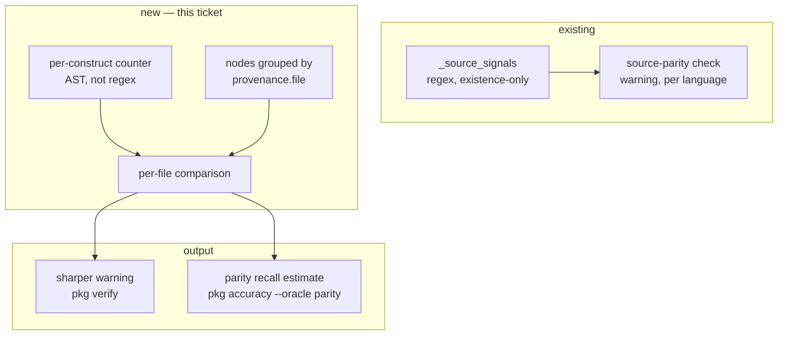

# PKG-ACC-3 — build document

Phase 3 of [`../pkg-accuracy-roadmap.md`](../pkg-accuracy-roadmap.md): per-construct parity.
Everything needed to generate the code and tests. Self-contained.

**Status:** ✅ **shipped 2026-08-13 10:31 EDT** · started 10:23 · elapsed ~8 minutes

**As built** — `pkg verify` gains per-file counts, `pkg accuracy --oracle parity` reports the
aggregate:

| | regex (before) | AST (after) |
|---|---|---|
| route declarations counted | 96 | **68** |
| `Endpoint` nodes | 71 | 70 |
| apparent "recall" | **0.74 — a fabrication** | shortfall **5**, surplus **7** |

**The 0.74 was 96% noise.** AST counting removed every false signal: the 10 decorators quoted
in `test_python_routes.py` fixtures, the 5 in the route extractor's own docstrings, the rest
in test strings. What remains is 4 files genuinely short and 7 files legitimately over
(doubly-mounted routers, as §9 predicted).

**And it found two live production routes that are invisible to the graph.**
`registry/api/app.py:110` declares `GET /healthz` and `GET /readyz` inside the `create_app()`
factory, on a local `app` variable — the extractor descends into the factory body but cannot
resolve the router, so it emits nothing. Every downstream surface — blast radius, impact,
the build document — believes those endpoints do not exist. Nothing in the previous check
could see it: Python *has* `Endpoint` nodes, so the language-level test stayed silent.

Every acceptance criterion is met except one deviation, stated rather than quietly dropped:

**§7's `corpus/python/routes_undercount` fixture was not created.** AC 3 is pinned by
`test_a_route_decorator_inside_a_string_is_not_counted` instead. A corpus case would have
required labelling every node and edge in the fixture to be admissible ground truth — real
work, for a guarantee a six-line unit test already gives exactly. The corpus is for scoring
extraction; this is a counting rule.

10 new tests; 361 pass, `mypy src tests` clean over 615 files, `ruff` clean.

---

## 1. Requirement

`source-parity` should count rather than test for existence. Today it asks *"does this
language have **any** `Endpoint` node?"*. It should ask *"this file declares 4 route
decorators and the graph holds 1 — where did 3 go?"*, reported per file with `file:line`.

## 2. Intent

A per-file recall estimate for the two constructs that matter most — routes and tables —
needing **no corpus and no execution**. Phase 1 needs hand-labelled fixtures; phase 2 needs a
test suite to run. This needs neither, so it works on a repository that has no tests and that
nobody has labelled.

## 3. Root cause — and why this phase is not what the roadmap thought

The roadmap describes phase 3 as cheap: *"same regex signals already in `_source_signals`,
counted instead of tested for non-emptiness"*. **A prototype run before writing this document
shows that is wrong**, and the reason is worth stating precisely because it invalidates the
one-line version of the plan.

Prototyped against this repo, counting `_ROUTE_SYNTAX['python']` matches per file:

| | |
|---|---|
| route decorator signals | **96** |
| `Endpoint` nodes | **71** |
| naive per-construct recall | **0.74** |

That 0.74 is **not** a recall figure. Of the 25 apparent misses, ~19 are files where the
regex matched something that was never a route:

| file | signals | nodes | what the regex actually matched |
|---|---|---|---|
| `tests/pkg/test_python_routes.py` | 10 | 0 | route decorators **inside test fixture strings** |
| `pkg/python_routes.py` | 5 | 0 | the route extractor's **own regexes and docstrings** |
| `tests/pkg/test_verify.py` | 2 | 0 | fixture strings |
| `pkg/extractor.py` | 1 | 0 | a docstring |
| `tests/pkg/test_python_client.py` | 1 | 0 | fixture strings |

The genuine disagreements are five files in `registry/` and `intake/`, totalling ~6 endpoints
— a completely different picture from "26% of routes are missing".

**The root cause is that the existing regex was correct for the question it was asked, and
phase 3 changes the question.** `_source_signals`' own docstring says so: *"it regex-scans
rather than re-parsing: the question is 'does this source declare any?', not 'which ones'"*.
Existence-checking tolerates a false signal, because a language having *some* `Endpoint`
nodes suppresses the warning entirely. **Counting converts every false signal into a phantom
missing route.** The justification for regex expires exactly when this phase begins.

## 4. PKG — what the graph knows

| | count |
|---|---|
| `Endpoint` nodes (this repo, Python) | 71 |
| `EXPOSES` edges | 77 |
| files with ≥1 route signal | 17 |
| files where signals ≠ nodes | 10, of which **~5 are real** |

`Endpoint` and `Entity` nodes both carry `Provenance`, so grouping emitted nodes per file is
already possible — no new fact is needed. The whole ticket is on the *source* side.

**Blast radius modules:**

| module | importers | non-test | note |
|---|---|---|---|
| `orchestrator.pkg.verify` | 3 | 2 (`cli`, `pkg/__init__`) | the check being changed |
| `orchestrator.pkg.accuracy` | 2 | 1 (`cli`) | gains a third oracle |

## 5. Blast radius — impact neighbourhood

**Containment:** `verify.py`'s existing six checks keep their shape; `source-parity` gains
counts. Nothing else in the graph pipeline changes, and no `facts.py` change is needed.

## 6. Design

### 6.1 Count with the AST, not the regex

For Python, walk the same `ast` the extractor already parses and count *decorators that are
route decorators* — the same shape `python_routes.scan_module` looks for, but counted rather
than resolved. A decorator inside a string literal is not a decorator to an AST, which
removes the entire false-signal class in one step.

The regex stays for languages with no front-end AST available, and where it stays, **its
counts are labelled as `approximate`** rather than presented next to AST-derived ones as
though they were equivalent.

### 6.2 Compare per file

`{file: source_count}` against `{file: node_count}` grouped by `provenance.file`.
Three outcomes, and all three are interesting:

| | meaning |
|---|---|
| source > graph | under-extraction — the case this phase exists for |
| source < graph | either the counter is under-matching, or the graph invented one |
| equal | parity |

### 6.3 Two surfaces, one computation

- **`pkg verify`** keeps `source-parity` as a **warning** and gains the per-file detail:
  *"`registry/api/app.py:41` declares 2 route decorators, the graph holds 0"*. Still never an
  error — a repo may use a framework no front-end has learned, and failing a build for that
  turns the check into something people switch off.
- **`pkg accuracy --oracle parity`** reports the aggregate as a recall estimate, alongside
  `corpus` and `runtime`. Same computation, different question: verify asks *is something
  broken*, accuracy asks *how good is it*.

## 7. Files

**Changed**

| file | scope |
|---|---|
| `src/orchestrator/pkg/verify.py` | `_source_signals` → per-file counts; `_check_source_parity` reports them | ~90 lines |
| `src/orchestrator/pkg/accuracy.py` | `score_parity()` sharing the counter | ~50 lines |
| `src/orchestrator/cli.py` | `--oracle parity` | ~25 lines |
| `tests/pkg/test_verify.py` | existing parity tests still pass; add counting cases | ~80 lines |

**Created**

| file | contents |
|---|---|
| `corpus/python/routes_undercount/` | a fixture that declares routes the graph misses **and** a decorator inside a string — the false-signal case, pinned |

## 8. Acceptance criteria

1. `pkg verify` reports, per file, the declared count and the graph count when they disagree,
   with `file:line`.
2. `source-parity` stays a **warning**, never an error.
3. A route decorator written inside a string literal or docstring is **not** counted for a
   language with an AST counter. `tests/pkg/test_python_routes.py` must report 0 declared,
   not 10.
4. Counts derived by regex rather than AST are labelled `approximate` in the output.
5. `pkg accuracy --oracle parity` reports the aggregate estimate and exits 0 on any score.
6. Both directions are reported: source > graph, and graph > source.
7. Existing `test_verify.py` parity tests pass unchanged — in particular
   `test_python_route_decorators_no_longer_trip_the_check` and
   `test_computed_tablename_is_not_a_declaration`.
8. `mypy src tests` and `ruff format --check .` pass.

## 9. Facts the generator needs

- **The prototype's 0.74 is a false number and must not be reproduced.** Any implementation
  that counts `_ROUTE_SYNTAX` matches and divides will report it. AC 3 is the test that
  prevents it.
- `python_routes.scan_module` already identifies route decorators from the AST — reuse its
  predicate rather than writing a second one, or the counter and the extractor will disagree
  and the check will report gaps that are definitional.
- `Endpoint` ids are `py:endpoint:{VERB} {path}` and a **router mounted twice yields two
  endpoints from one decorator** (`python_routes.emit`'s docstring). So `nodes > signals` is
  expected and correct for a doubly-mounted router — it is not evidence of invention. This is
  the single most likely way to generate a false alarm in the other direction.
- `_source_signals` reads only files the graph already knows about, via grounded `Module`
  provenance. Keep that: it avoids a second tree walk and keeps the check O(known files).
- Synthetic locators (`db://`) are not files — already filtered by `_SYNTHETIC_PREFIXES`.
- Corpus fixtures live under `.repo/` and are excluded from ruff; a new fixture here follows
  the same rules (see `corpus/README.md`).

## 10. Codegen prompt

**System:** `_IMPLEMENT_SYSTEM` — source files only.

**User payload:** sections 3, 6, 8, 9; `verify.py` in full (354 lines); `python_routes.py`'s
`scan_module` and `emit`.

**§3 is the specification.** A model given "count the regex matches" will produce the 0.74
and it will look plausible.

---

## 11. Token usage & cost

**Not measured.** Effort: **~1 day**, revised down from the roadmap's ~2 days — the prototype
already established what the hard part is, and it is smaller than the phase's own description
implied (one AST predicate, reused from the extractor).

Calibration so far: phase 1 estimated ~1 week, took ~10.5 h. Phase 2 estimated ~2 days after
a scope cut, took ~1 h. Both overshot because the estimates priced in discovering something
the measurement then handed over cheaply. **That pattern is now the expectation, not the
surprise** — so this estimate is deliberately not cut a third time on the same reasoning.

---

## 12. Confidence

| | score |
|---|---|
| The analysis is right | **90%** |
| A person ships it in one pass from this document | **85%** |
| An unattended pipeline run completes | **45%** |

### Why the analysis is 90%

| claim | confidence | basis |
|---|---|---|
| The naive count is dominated by false signals | ~99% | Prototyped: 19 of 25 apparent misses are strings, docstrings and test fixtures. |
| AST counting removes that class | ~95% | A decorator in a string is not a decorator to `ast`. Not yet run. |
| ~5 genuine endpoint gaps exist in this repo | ~85% | Read from the prototype's per-file table; not yet confirmed against the source of each. |
| Double-mounted routers make `nodes > signals` legitimate | ~90% | Stated in `python_routes.emit`'s docstring; not yet observed in this repo's data. |
| Reusing the extractor's predicate is right | ~90% | Two predicates would drift, and a check that disagrees with the extractor by construction reports noise forever. |

Higher than phase 2's 85% for one reason: **the expensive discovery already happened.** The
prototype cost twenty minutes and converted the central risk from unknown to measured before
the document was written.

### Why the pipeline is 45%

Higher than phases 1 and 2 — this is a contained change to one function with an existing test
file to extend, no new subsystem, no runtime, no corpus to label. The residual risk is that a
model reproduces the 0.74.

### Recommendation

**Build it.** The prototype has already done the job a spike would have done. The one thing to
resolve before writing code is §6.3 — whether this is one surface or two.
