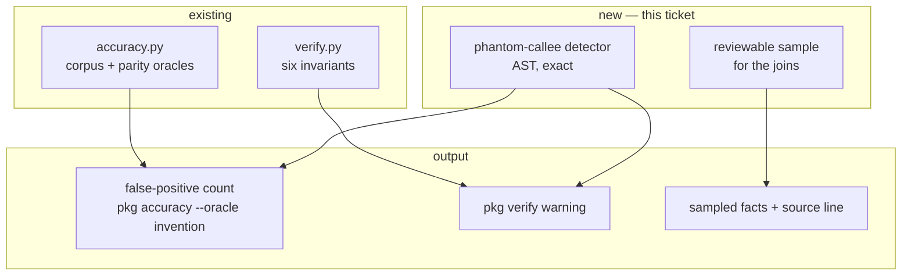

# PKG-ACC-4 — build document

Phase 4 of [`../pkg-accuracy-roadmap.md`](../pkg-accuracy-roadmap.md): the false-positive
side. Self-contained.

**Status:** ✅ **shipped 2026-08-13 11:16 EDT** · started 10:58 · elapsed ~18 minutes

**As built** — `pkg accuracy --oracle invention`, plus an `invented-call` warning in
`pkg verify` and `--sample N` for the joins:

| | |
|---|---|
| `CALLS` edges | 15,719 |
| …to external targets | 4,928 |
| candidates examined | 651 (0 unexaminable) |
| **invented** | **496 — 3.16% of all calls** |

**§9's prediction was wrong, and in the interesting direction.** It said the prototype's 326
was an *upper* bound and scope-correctness would lower it. It went **up**, to 496 — because
scope-correctness was not the only change. The prototype never counted a `def` as a binding,
so it missed nested functions called by name (`esc`, defined at
`scripts/intents_to_confluence.py:68` and called four lines later, emitted as `py:esc`). Two
corrections in opposite directions, net increase. Both sub-classes verified by hand:

| shape | example | verified |
|---|---|---|
| call through a parameter | `launch.py:237` — `echo: Echo` | yes |
| call through a positional-only parameter | `codegen_benchmark.py:1080` — `call` | yes |
| call to a nested `def` | `intents_to_confluence.py:68` — `esc` | yes |

Every acceptance criterion met. 16 new tests; 377 pass, `mypy src tests` clean over 617
files, `ruff` clean. **AC 7 holds: the graph's output is unchanged** — this ticket measures,
and the extractor fix is its own ticket with this number to prove itself against.

---

## 1. Requirement

Every check in this project hunts for **absence**. Nothing hunts for **invention**. Phase 4
measures the false-positive rate: of the facts the graph asserts, what fraction are wrong?

## 2. Intent

A wrong edge is worse than a missing one, because every surface downstream presents it as
grounded. Blast radius says "6 callers"; if one is invented, the reader has no way to tell
which — and the confident tone is identical either way.

## 3. Root cause — and why this is not the phase the roadmap described

The roadmap scopes phase 4 as a **human sampling exercise**: *"`pkg accuracy --sample N` — a
reviewable sample of emitted facts… costs a person twenty minutes per release"*.

A 20-minute prototype shows the largest known invention class is **automatically detectable**,
no human required:

| | |
|---|---|
| `CALLS` edges (this repo) | 15,642 |
| …to an `external` target | 4,896 (31%) |
| …to a **single-segment** external target | 647 |
| …where that name is **bound as a local or parameter in the caller's own file** | **326** |
| share of all `CALLS` that are this invention | **2.1%** |

Verified by hand: `launch.py:237` declares `echo: Echo` as a **parameter**. The graph asserts
`py:orchestrator.launch._run -CALLS-> py:echo` — a claim that a module named `echo` exists
outside the scanned tree, and that `_run` calls it. Both false. The corpus found this twice
(`py:cls` from a local variable, `py:fn` from a parameter); it is 326 edges repo-wide.

**So phase 4 splits into two things the roadmap treated as one:**

| | detectable | needs a human |
|---|---|---|
| local name emitted as an external callee | **yes — AST, exact** | no |
| `CONSUMES` matched on `(verb, path)` | no | yes |
| `EXPOSES` composed from mount prefixes | no | yes |
| ORM `REFERENCES` guessing a class name | no | yes |

The detector is worth more than the sampler and costs less. The sampler still ships, for the
joins — but it is no longer the whole phase.

## 4. PKG — what the graph knows

15,642 `CALLS`; 4,896 to external targets. The 326 confirmed inventions are **6.7% of all
external-target `CALLS`** — so the "31% of calls go outside the tree" figure is itself
partly fiction.

Corpus precision context: Python `CALLS` precision is 0.80 on the corpus, TypeScript 1.00.
This defect is the entire difference, and 326 is its repo-wide size.

## 5. Blast radius — impact neighbourhood

**Containment:** additive. No change to extraction, no change to `facts.py`. The graph's
output is byte-identical after this ticket — it only becomes measurable.

## 6. Design

### 6.1 The detector

For each `CALLS` edge whose target is `external` and whose id has a single segment: parse the
caller's file, and ask whether that name is bound there as a parameter, assignment target,
`for` target, `with` alias, comprehension variable, or `except ... as`. If it is, the edge is
**invention**, not an external call.

Exact, not heuristic: a name bound in the caller's own scope cannot be a module outside the
tree. Reported with `file:line` and the binding site.

### 6.2 The sampler

`pkg accuracy --sample N --kind CONSUMES` — a deterministic sample (seeded by commit, not
random) of emitted facts, each with the source line it was derived from, in a form a person
can tick through. Deterministic so two people reviewing the same release see the same sample.

### 6.3 Where it surfaces

- `pkg accuracy --oracle invention` — the count and rate.
- `pkg verify` — a **warning**, matching `source-parity`'s precedent.

## 7. Files

**Created:** `src/orchestrator/pkg/invention.py` (~200 lines), `tests/pkg/test_invention.py`
(~180 lines).
**Changed:** `verify.py` (+1 check), `accuracy.py` (+oracle), `cli.py` (+`--sample`).

## 8. Acceptance criteria

1. `pkg accuracy --oracle invention` reports the count, the rate over all `CALLS`, and
   examples with `file:line` and the binding site.
2. Every binding form is covered: parameter, assignment, `for`, `with … as`, comprehension,
   `except … as`, walrus.
3. A genuine external call (`json.dumps`, an imported name) is **never** flagged.
4. A name bound only in a *different* function in the same file is still correctly flagged or
   not — scope is respected, not just file membership.
5. `pkg verify` warns, never errors.
6. `--sample N` is deterministic for a given commit.
7. The graph's output is unchanged by this ticket.
8. `mypy src tests` and `ruff format --check .` pass.

## 9. Facts the generator needs

- **The prototype's 326 is file-scoped, not scope-scoped**, and is therefore an *upper* bound
  on this class. A name bound in function A and genuinely imported for function B would be
  wrongly flagged. AC 4 is what tightens it; expect the true number to be somewhat lower.
- Single-segment external ids are the *candidate* set, not the answer: `py:ValueError` is a
  builtin and legitimately external. The binding test is what separates them.
- `Edge.provenance` gives the call site's `file:line`, which is what identifies the caller's
  file. Some edges may lack provenance — skip, and count them as unexamined rather than clean.
- `module_qualname` maps a file to a module id; reuse it rather than deriving names again.

## 10. Codegen prompt

Sections 3, 6, 8, 9; `verify.py`, `accuracy.py`, and the prototype's binding-collection walk.
**§9's first bullet is the specification** — a model that reproduces the file-scoped
prototype will report 326 and call it exact.

---

## 11. Token usage & cost

**Not measured.** Effort **~1 day**: the detector is a scope-aware AST walk (~half a day, and
the scope handling is the whole of it), the sampler and CLI the rest.

Calibration: phases 1–3 estimated ~1 week / ~2 days / ~1 day and took ~10.5 h / ~1 h / ~8 min.
The estimates keep pricing in discovery that measurement hands over cheaply. This one is not
discounted further on that basis — scope-correct name resolution is ordinary work with a
known shape, not a discovery risk.

---

## 12. Confidence

| | score |
|---|---|
| The analysis is right | **95%** |
| A person ships it in one pass | **85%** |
| An unattended pipeline run completes | **40%** |

| claim | confidence | basis |
|---|---|---|
| The invention class is real | ~99% | Verified by hand at `launch.py:237`; found twice independently by the corpus. |
| ~326 is the right order of magnitude | ~85% | Prototyped file-scoped; scope-correct will be lower, not higher. |
| It is exactly detectable | ~95% | A name bound in the caller's scope cannot be an out-of-tree module. |
| Precision is not otherwise measurable without a human | ~90% | The joins have no oracle short of reading the source. |

### Recommendation

Build the detector first and the sampler second. The detector produces a number; the sampler
produces a chore. If only one ships, it should be the one that does not depend on someone
finding twenty minutes.
