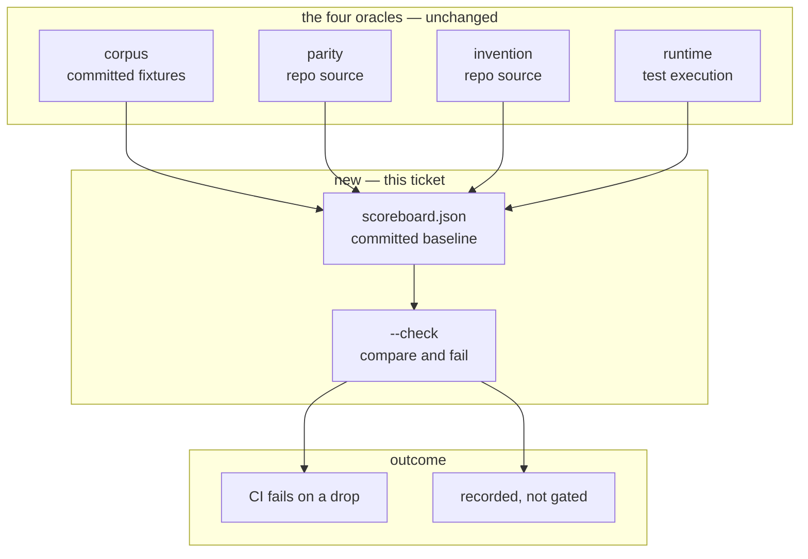

# PKG-ACC-5 — build document

Phase 5 of [`../pkg-accuracy-roadmap.md`](../pkg-accuracy-roadmap.md): the scoreboard and the
CI gate. Self-contained.

**Status:** ✅ **shipped 2026-08-13 12:36 EDT** · started 12:28 · elapsed ~8 minutes

**As built** — `corpus/scoreboard.json` (120 lines, committed), `pkg accuracy --scoreboard`
to write it, `pkg accuracy --check` as the gate:

| metric | gated | value at baseline |
|---|---|---|
| corpus precision & recall | **strict** | python `CALLS` 8/10 emitted, 8/11 expected; every other kind 1.00 |
| parity shortfall | **ratchet** | 5 (surplus 7) |
| invention | **no — trend only** | 496 of 15,781 calls |
| runtime recall | **no — absent by default** | not collected unless `--tests` given |

**Verified against a live regression, not just unit tests.** Adding a file with a computed
route path (`@router.get(f"/computed/{x}")`) — a route the extractor cannot resolve — made
`--check` print `[REGRESSION] parity: shortfall increased — was 5, now 6` and **exit 1**.
Removing it returned exit 0. The scoreboard is byte-identical across regenerations.

Every acceptance criterion met. 12 new tests; 389 pass, `mypy src tests` clean over 618
files, `ruff` clean. `CONTRIBUTING.md` now lists `orchestrator pkg accuracy --check` in the
quality gate, with the reason invention is excluded stated there rather than left to be
inferred from CI behaviour.

---

## 1. Requirement

Accuracy numbers, committed and versioned, and CI failing when they drop — *"exactly as
`understand --check` does for determinism today"*.

## 2. Intent

Phases 1–4 produce four numbers. Nothing records them and nothing notices when they fall. A
front-end that quietly stops resolving half its call sites is still the most damaging failure
in this project's history, and today it would still pass every check.

**The point is the derivative, not the level.** The graph currently has 496 invented edges and
5 missing endpoints. Those are baselined in, not treated as failures — the gate's job is to
stop it getting *worse*, not to demand it already be perfect.

## 3. Root cause — and the trap that decides the design

The naive gate is "record every number; fail if any drops". A prototype run before writing
this shows that fails **blameless commits**.

Baseline, then one ordinary new file (`def handler(cb): return cb()`) added and re-measured:

| metric | source | unrelated commit | across runs |
|---|---|---|---|
| corpus precision / recall | committed fixtures | **unchanged** | deterministic |
| parity shortfall | repo source | **unchanged** | deterministic |
| **invention count** | repo source | **496 → 497** | deterministic |
| **invention rate** | repo source | **0.031554 → 0.031616** | deterministic |

Every number is reproducible run-to-run. That is not the problem. The problem is **what each
number is measured against**:

- **Corpus scores are measured against committed fixtures.** They move only when extraction
  changes. Repo churn cannot touch them.
- **Invention and parity are measured against the repository itself.** They move whenever
  anyone writes code — and a callback parameter is ordinary Python, not a defect being
  introduced.

Gating the invention count would fail a PR that adds a perfectly normal function. Gating the
*rate* fails it too: the rate moved on the same commit. **A metric measured against a moving
population cannot be gated on equality**, and this is the single decision the phase turns on.

## 4. PKG — what the graph knows

Current values, all four oracles, on this branch:

| metric | value | measured against |
|---|---|---|
| corpus `CALLS` P/R (python) | 0.80 / 0.73 | 7 committed fixtures |
| corpus `CALLS` P/R (typescript) | 1.00 / 0.50 | same |
| every other corpus kind | 1.00 / 1.00 | same |
| parity shortfall / surplus | 5 / 7 | this repo's source |
| invention | 496 edges, 3.16% | this repo's source |
| runtime `CALLS` recall | 0.70 | this repo's test execution |

**Blast radius:** `accuracy.py` (1 non-test importer), `cli.py`, and one new committed file.
No change to extraction, `facts.py`, or any fact the graph emits.

## 5. Blast radius — impact neighbourhood

**Containment:** additive. The scoreboard is a committed artefact and a comparison; nothing
in extraction or comprehension reads it.

## 6. Design

### 6.1 What is gated, and what is only recorded

| metric | gate | why |
|---|---|---|
| corpus precision & recall, per kind per language | **strict — any drop fails** | measured against committed fixtures; immune to repo churn |
| parity shortfall | **ratchet — must not increase** | rises only when the graph fails to keep up with declarations, not when code is added |
| invention count and rate | **recorded, not gated** | moves on ordinary commits — see §3 |
| runtime `CALLS` recall | **recorded, never gated** | non-deterministic by nature: it moved 0.61 → 0.70 in one hour purely because `tests/pkg` gained 18 tests |

Three of four are recorded; two of four are gated. **Stating which is which in the file
itself** is the difference between a scoreboard and a number nobody can interpret.

### 6.2 The artefact

`corpus/scoreboard.json` — committed, next to the ground truth it is derived from. Machine
first, with a `gated: true|false` flag per metric so the file explains its own contract.

### 6.3 The commands

Modelled on `understand --check`, which is this repo's established precedent for
"regenerate and compare against a committed artefact":

- `pkg accuracy --scoreboard` — regenerate and write the baseline.
- `pkg accuracy --check` — regenerate, compare, print a diff, **exit non-zero on a gated
  regression only**. Ungated metrics print their movement and never fail the build.

**The runtime oracle is excluded from both** unless `--tests` is passed: it executes code, and
a command CI runs by default must not.

## 7. Files

**Created:** `corpus/scoreboard.json`; `tests/pkg/test_scoreboard.py` (~150 lines).
**Changed:** `accuracy.py` (+`build_scoreboard`, `compare_scoreboard`, ~120 lines);
`cli.py` (+2 flags, ~50 lines); `CONTRIBUTING.md` (the gate now includes `pkg accuracy --check`).

## 8. Acceptance criteria

1. `pkg accuracy --scoreboard` writes `corpus/scoreboard.json` deterministically — same tree,
   byte-identical file.
2. `pkg accuracy --check` exits **0** on the current tree, with today's 496 invented edges and
   5 missing endpoints baselined in.
3. A corpus precision or recall **drop** exits non-zero and names the kind and language.
4. A corpus **improvement** exits 0, and says the baseline is stale.
5. An increase in parity shortfall exits non-zero; a decrease does not.
6. A change in invention count or rate **never** exits non-zero, and is printed either way.
7. Runtime recall is absent from the scoreboard unless `--tests` is given.
8. Every metric in the file records whether it is gated.
9. `mypy src tests` and `ruff format --check .` pass.

## 9. Facts the generator needs

- **The scoreboard must be regenerable in CI without executing repo code.** The runtime oracle
  runs a test suite; it is opt-in and excluded by default (AC 7).
- Corpus scores come from `score_corpus("corpus")` — the fixtures, *not* the host repo. Passing
  the repo path instead silently scores nothing and reports vacuous perfection.
- `KindScore.precision`/`recall` return `None` for an empty population. `None` is not a drop
  from `None`, and it is not `0.0` — comparison must handle it explicitly or a kind that
  disappears entirely will read as "unchanged".
- Float equality: scores are exact rationals from integer counts, so compare the **counts**,
  not the floats, and derive the ratio for display only.
- The scoreboard is committed. `episteme/` is not — do not follow its pattern of regenerating
  in CI and failing on a diff *of the artefact*; here the artefact is the baseline, and only a
  **gated regression** fails.

## 10. Codegen prompt

Sections 3, 6, 8, 9; `accuracy.py`, `invention.py`, the `pkg accuracy` command.
**§3 is the specification.** A model given "fail when a number drops" will gate the invention
count and produce a build that fails on ordinary commits.

---

## 11. Token usage & cost

**Not measured.** Effort **~half a day**: the comparison logic is small, the artefact format
is small, and the decision that shapes both is already made by §3's prototype.

Calibration: phases 1–4 estimated ~1 week / ~2 days / ~1 day / ~1 day and took ~10.5 h / ~1 h /
~8 min / ~18 min.

---

## 12. Confidence

| | score |
|---|---|
| The analysis is right | **95%** |
| A person ships it in one pass | **90%** |
| An unattended pipeline run completes | **50%** |

| claim | confidence | basis |
|---|---|---|
| Corpus scores are immune to repo churn | ~99% | Prototyped: unchanged when a new file was added; deterministic across runs. |
| Invention cannot be gated on equality | ~99% | Prototyped: one ordinary file moved both count and rate. |
| Runtime recall must not be gated | ~95% | Observed moving 0.61 → 0.70 from adding tests, within one session. |
| Parity shortfall is safely ratchetable | ~85% | Unchanged by the added file, and it rises only on under-extraction. Not yet tested against a commit that adds an *unextractable* route. |

The residual risk is AC 5: parity shortfall is the one gated metric measured against a moving
population, and the argument for it is structural rather than prototyped.

### Recommendation

Build it. The one open question is what to do about invention being ungated — §6.1 leaves the
largest known defect class watched but not enforced, which is a real gap and should be a
stated limitation rather than an oversight.
