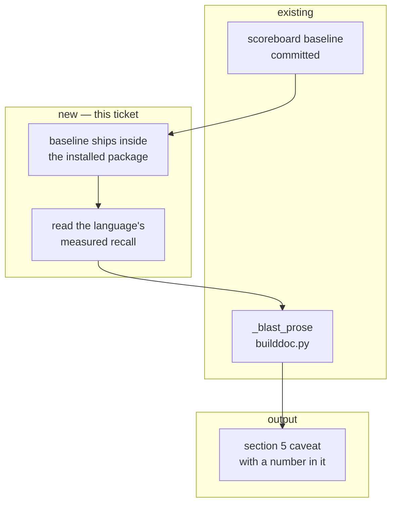

# PKG-ACC-6 — build document

Phase 6 of [`../pkg-accuracy-roadmap.md`](../pkg-accuracy-roadmap.md): carry the measured
number into what people actually read. Self-contained.

**Status:** ✅ **shipped 2026-08-13 12:49 EDT** · started 12:42 · elapsed ~7 minutes

**As built** — the blast-radius caveat now reads, for Python:

> **Caveat:** method calls through an instance emit no `CALLS` edge (SSPN-48), so per-method
> counts under-report. Module-function counts are exact. Measured `CALLS` recall for python is
> **0.73** (against the extractor's own test corpus, not this repository) — treat this list as
> a lower bound.

Three branches, all pinned by tests: a measured language gains the clause; an unmeasured one
(`go`, and five others) keeps today's wording verbatim with no "0.00"; a language with no call
graph is untouched.

The baseline moved to `src/orchestrator/pkg/scoreboard.json` so it ships in the wheel — with a
test asserting it is inside the package root, since the failure mode is silent and only
appears on an installed Spine. `render_build_md`'s docstring was amended rather than left
claiming a purity it no longer has.

Every acceptance criterion met. 4 new tests; 1183 pass across `pkg`/`sdlc`/`cli`,
`mypy src tests` clean over 618 files, `ruff` clean, and `pkg accuracy --check` still exits 0
from the new path.

---

## 1. Requirement

The build document's blast-radius caveat should state the **measured** recall for the language
it describes, instead of a hand-written qualitative hedge.

Today, `builddoc.py:687`:

> **Caveat:** method calls through an instance emit no `CALLS` edge (SSPN-48), so per-method
> counts under-report. Module-function counts are exact.

After:

> **Caveat:** method calls through an instance emit no `CALLS` edge, so per-method counts
> under-report. Measured `CALLS` recall for Python is **0.73** — treat this list as a lower
> bound. Module-function counts are exact.

## 2. Intent

Five phases produced numbers that only exist if you run a CLI. **Nobody reading a build
document runs the CLI.** This is the phase that makes the measurement visible to the person
making the decision, which is the only place it changes an outcome.

The difference is between a caveat a reader skims and a number they can reason with: "counts
under-report" tells you to be vaguely careful; "recall is 0.73" tells you roughly one call in
four is missing, and lets you decide whether that matters for *this* ticket.

## 3. Root cause — and the packaging constraint that shapes it

Not a bug: the caveat was written before any number existed to put in it.

**The constraint, found by checking before planning:** `pyproject.toml` packages only
`src/orchestrator` into the wheel. `corpus/scoreboard.json` lives at the repository root, so
**a pip-installed Spine has no scoreboard to read**. The build document would silently fall
back to the qualitative caveat in exactly the deployment where the reader is least able to go
and measure it themselves.

The corpus *fixtures* need not ship — they are only needed to regenerate the baseline. The
**baseline itself** must, because it is what gets quoted.

## 4. PKG — what the graph knows

| | |
|---|---|
| `orchestrator.sdlc.builddoc` | the generator; `_blast_prose` builds reading / containment / caveat |
| caveat site | `builddoc.py:687` (call graph available) and `:682` (no call graph) |
| the number | corpus `CALLS` recall — Python 0.73, TypeScript 0.50 |

**The right number is the corpus one, not the runtime one.** Corpus recall is measured against
committed fixtures, so it is a property of *the extractor version* and applies to any repo it
reads. Runtime recall (0.70) is a property of *one repository's test suite*, is
non-deterministic, and must never enter a document labelled `DETERMINISTIC`.

## 5. Blast radius — impact neighbourhood

**Containment:** `builddoc.py` is the only consumer. If the baseline is missing or the
language has no measurement, the caveat degrades to exactly today's wording — the document is
never worse than it is now.

## 6. Design

### 6.1 Ship the baseline inside the package

Move the committed baseline to `src/orchestrator/pkg/scoreboard.json` so it travels with the
wheel. `pkg accuracy --scoreboard` writes it there; `--check` reads it from there. `corpus/`
keeps the fixtures, which are only needed to regenerate.

### 6.2 Read it, per language

`measured_recall(language, kind="CALLS") -> float | None`. `None` when the language has no
measurement — six of the eight front-ends have none, and inventing one for them would be worse
than saying nothing.

### 6.3 Say it honestly

The number is measured on **fixtures**, not on the repository being described. The wording
must not imply otherwise:

> Measured `CALLS` recall for Python is 0.73 (against the extractor's own test corpus) — treat
> this list as a lower bound.

A reader who takes "0.73" as a statement about *their* repo has been misled by us, not by
themselves.

## 7. Files

**Changed:** `accuracy.py` (baseline path + `measured_recall`, ~40 lines); `builddoc.py`
(`_blast_prose` caveat, ~20 lines); `cli.py` (path constant); `CONTRIBUTING.md` (path).
**Moved:** `corpus/scoreboard.json` → `src/orchestrator/pkg/scoreboard.json`.
**Changed tests:** `test_scoreboard.py` (path), plus new cases in the builddoc tests.

## 8. Acceptance criteria

1. The blast-radius caveat states the measured `CALLS` recall for the document's language.
2. A language with no measurement produces **today's exact wording**, unchanged.
3. The wording makes clear the figure is measured against the extractor's corpus, not against
   the repository being described.
4. The baseline is readable from an installed (non-editable) package.
5. The build document stays deterministic — no timestamps, no runtime oracle, same input →
   same output.
6. `pkg accuracy --check` still passes, reading the baseline from its new home.
7. `mypy src tests` and `ruff format --check .` pass.

## 9. Facts the generator needs

- **`_blast_prose` has two caveat branches** (`builddoc.py:682` and `:687`) — one for languages
  with no call graph, one for languages with. Only the second gets a number; the first is
  already saying something stronger ("omitted rather than zero").
- The build document is labelled `DETERMINISTIC`. Reading a committed JSON preserves that;
  calling any oracle live would not.
- `KindScore.recall` is `None` for an empty population. `None` must render as *no clause*, not
  as "0.00" — a language nobody measured is not a language that scored zero.
- The scoreboard stores **counts**, not ratios (phase 5, §9). Derive the ratio for display.
- Moving the baseline breaks `test_the_committed_baseline_matches_the_tree` and the
  `SCOREBOARD_FILE` constant in `cli.py`. Both are part of this ticket, not collateral.

## 10. Codegen prompt

Sections 1, 3, 6, 8, 9; `builddoc.py`'s `_blast_prose`; `accuracy.py`'s scoreboard functions.
**§6.3 is the specification for the wording** — a model will write "recall is 0.73" without
the clause that says what it was measured against, which is the one thing that makes it
honest rather than misleading.

---

## 11. Token usage & cost

**Not measured.** Effort **~half a day**: one file move, one lookup function, one string, and
the tests that pin the wording.

---

## 12. Confidence

| | score |
|---|---|
| The analysis is right | **95%** |
| A person ships it in one pass | **90%** |
| An unattended pipeline run completes | **55%** |

| claim | confidence | basis |
|---|---|---|
| The baseline does not ship today | ~99% | Checked: the wheel packages `src/orchestrator` only, and the file is at the repo root. |
| Corpus recall is the right number, not runtime | ~95% | Corpus is a property of the extractor version; runtime is a property of one repo's tests and is non-deterministic. |
| Degrading to today's wording is safe | ~95% | Six of eight front-ends have no measurement; the fallback is the current text verbatim. |
| The move breaks only the two named call sites | ~85% | Grep-level confidence, not yet executed. |

### Recommendation

Build it. The wording in §6.3 is the part worth arguing about before the code exists, because
it is the only user-visible output of the whole roadmap.
