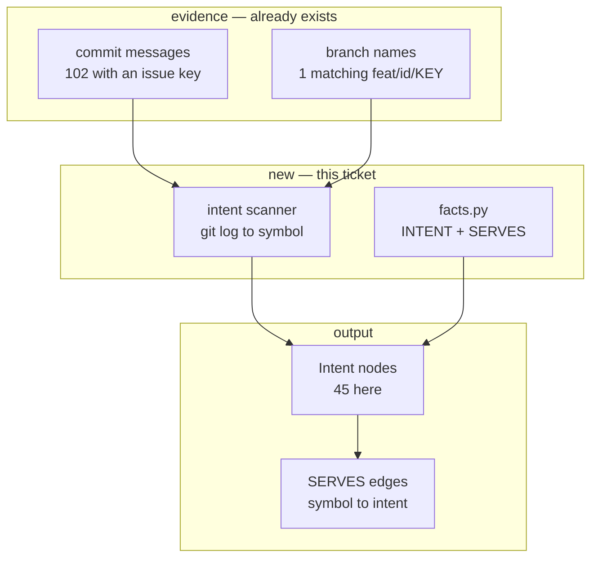

# PKG-ACC-7 — build document

Phase 7 of [`../pkg-accuracy-roadmap.md`](../pkg-accuracy-roadmap.md): from mechanism to
meaning — the intent layer. Self-contained.

**Status:** 🔵 **in progress** · started 2026-08-13 12:56 EDT · **split into two tickets**

Per §12's recommendation, this phase lands in two parts so a downstream failure has one
possible cause rather than two:

| | ships | state |
|---|---|---|
| **7a — the vocabulary** | `NodeKind.INTENT`, `EdgeKind.SERVES` in `facts.py`; nothing emits them | ✅ **shipped 2026-08-13 14:39 EDT** |
| **7b — the scan** | `pkg/intent_link.py`: git history → `Intent` nodes and `SERVES` edges | not started |

**7a, as built.** Two enum members and a docstring. The point was never the diff — it was the
verification surface: `facts.py` has 92 importers, 46 non-test, and this is the first change in
the roadmap that touches the vocabulary rather than reading it.

**Exactly one downstream consequence, out of 46 non-test importers.**
`test_the_committed_matrix_matches_the_front_ends` failed: `pkg capabilities` asserts the
matrix in `KNOWLEDGE_GRAPH.md` byte-equal against what the front-ends can emit, and the
vocabulary grew a `Intent` column and a `SERVES` column. Regenerated. Nothing else moved —
2,728 tests pass, `pkg verify` reports OK, and `pkg accuracy --check` exits 0 because no graph
gained a fact.

That is the whole argument for splitting, demonstrated: had the scanner landed in the same
commit, the capability-matrix failure would have had two candidate causes and the graph output
would have changed at the same moment.

---

## 1. Requirement

`Intent` nodes and a `SERVES` edge, so the graph can answer *"what is this for"* and not only
*"what calls it"*. Built from the **recorded** evidence tier: git says commit *C* touched this
symbol, and *C* names an issue key.

## 2. Intent

The graph's entire vocabulary is mechanical. Seven node kinds, all physical artefacts; ten
edge kinds, all mechanical relations. Exactly one — `MENTIONS` — carries meaning.

Nothing says what a subsystem is *for*, which requirement a function satisfies, or why an edge
exists. That intent already exists in this system — in tickets, build documents, commit
messages, `docs/specs/` — and **none of it links to a symbol**. Same shape as the
`EXPOSES`/`CONSUMES` gap: two halves, no join.

This is also the first phase that does not measure anything. Phases 1–6 were about
*confidence*; this one is about *meaning*.

## 3. Root cause — and the mechanism the roadmap got wrong

The roadmap is emphatic that the recorded tier is *"the free win"* because **Spine creates the
branch names** and already has `_issue_key_from_branch` (`cli.py:1431`), which parses
`feat/<sdlc_id>/<ISSUE-KEY>`.

Measured against this repository's actual history before writing this plan:

| | count |
|---|---|
| commits | 465 |
| commits carrying an `SSPN-` key **in the message or body** | **102** |
| distinct issue keys reachable that way | **45** |
| merges whose branch matches `feat/<id>/<KEY>` | **1** |

**The specified mechanism yields one data point out of 465.** It is correct for branches the
SDLC pipeline generates and irrelevant to how the repository is actually developed — humans
write descriptive slugs (`fix/confidence-not-applicable`, `docs/build-document-roadmap`).
Commit messages carry the keys; branch names do not.

So the recorded tier is real and worth building — 45 intents, 102 commits — but the join is
**commit message → issue key**, not **branch name → issue key**. `_issue_key_from_branch` stays
as a fallback for pipeline-generated branches, where it is exact.

## 4. PKG — what the graph knows

**This is the riskiest change in the roadmap, and the first that alters graph output.**

| | |
|---|---|
| `orchestrator.pkg.facts` importers | **92 (46 non-test)** |
| phases 1–6 touching `facts.py` | none — all were additive and read-only |
| this phase | adds `NodeKind.INTENT` and `EdgeKind.SERVES` |

Every prior phase could be deleted and leave the graph byte-identical. This one cannot: it
adds facts, which moves the scoreboard, `episteme/`, and any consumer that switches
exhaustively on `NodeKind`.

## 5. Blast radius — impact neighbourhood

**Containment is weaker than every prior phase.** `facts.py` has 46 non-test importers, and a
new `NodeKind` reaches all of them. The mitigation is that both additions are *additive* —
nothing existing changes meaning — but any exhaustive `match` on `NodeKind` is a compile-time
break and any renderer that assumes seven kinds is a runtime surprise.

## 6. Design

### 6.1 The recorded tier only

Stated is already `MENTIONS`. Structural and inferred are separate tickets — and the inferred
tier is the one the roadmap warns against starting from, because a model narrating the graph
produces fluent, unfalsifiable prose about every symbol and destroys the property that makes
the graph worth trusting.

### 6.2 The join

For each commit carrying an issue key: the files it touched, and the symbols whose provenance
falls inside the changed line ranges. That yields `symbol -SERVES-> Intent`, deterministically,
with no model and line precision.

`Intent` id: `intent:SSPN-49`. Provenance is the commit, not a file.

### 6.3 Every intent fact carries its tier

`recorded` here. The vocabulary must carry the tier from the first commit, because the moment
an `inferred` tier exists, a reader needs to know which they are looking at — and retrofitting
provenance onto facts already in circulation is the thing the build document's own labelling
discipline exists to prevent.

## 7. Files

**Changed:** `facts.py` (+1 `NodeKind`, +1 `EdgeKind`); `pkg/__init__.py` (export).
**Created:** `pkg/intent_link.py` (~220 lines) — the git walk and the join;
`tests/pkg/test_intent_link.py` (~200 lines).
**Regenerated:** `src/orchestrator/pkg/scoreboard.json` — graph output changes.

## 8. Acceptance criteria

1. A commit whose message contains an issue key yields an `Intent` node with that id.
2. Symbols whose provenance falls in that commit's changed line ranges gain `SERVES` edges.
3. A branch matching `feat/<id>/<KEY>` is also honoured, via `_issue_key_from_branch`.
4. Every `Intent` fact records its evidence tier (`recorded`).
5. A repository with no issue keys anywhere produces **zero** `Intent` nodes and no error.
6. `pkg verify` passes: no dangling `SERVES` endpoints, no stale provenance.
7. The scan is deterministic — same history, same facts, no timestamps.
8. `pkg accuracy --check` passes after regenerating the baseline.
9. `mypy src tests` and `ruff format --check .` pass.

## 9. Facts the generator needs

- **Use commit messages, not branch names** (§3). A generator following the roadmap's text
  will implement `_issue_key_from_branch` over `git log` and produce one node.
- Issue-key pattern: `SSPN-<digits>` here, but it must be **configurable** — no other
  repository uses this project's prefix.
- `git log --format` with `--name-only` gives files; line ranges need `--numstat` or a diff
  parse. Symbol provenance is `file:line`, so the join needs ranges, not just filenames — a
  filename-only join attributes every symbol in a 3,000-line module to any commit that touched
  one line of it.
- Shelling out to git: `subprocess`, and the repo may be a shallow clone or not a repo at all.
  Both must degrade to zero intents, not an exception (AC 5).
- `facts.py` is a frozen-dataclass vocabulary with 46 non-test importers. Adding an enum member
  is additive; changing `Node`/`Edge` shape is not, and is out of scope.
- `understand`/`state` must stay deterministic. A git walk is deterministic for a given
  history; a *timestamp* is not — record commit hashes, never wall-clock.

## 10. Codegen prompt

Sections 3, 6, 8, 9; `facts.py`; `cli.py:1431`; a sample of `git log` output from this repo.
**§3 and §9's first bullet are the specification.** The roadmap's own text is the trap here.

---

## 11. Token usage & cost

**Not measured.** Effort **~2 days** — genuinely larger than phases 2–6, and not discounted on
their track record. Those were additive and read-only; this one changes the vocabulary that 46
non-test modules import, and the cost is in what that touches rather than in the git walk.

---

## 12. Confidence

| | score |
|---|---|
| The analysis is right | **90%** |
| A person ships it in one pass | **70%** |
| An unattended pipeline run completes | **25%** |

| claim | confidence | basis |
|---|---|---|
| Branch names are the wrong mechanism here | ~99% | Measured: 1 of 465. |
| Commit messages carry 102 commits / 45 intents | ~99% | Measured. |
| The line-range join is the hard part | ~85% | A filename join is trivial and wrong; ranges need diff parsing against historical file states. |
| Adding two enum members is additive | ~80% | True of the vocabulary; **not** verified against every exhaustive `match` in 46 importers. |

Lowest pipeline confidence in the roadmap, and deliberately so: this is the first phase that
changes graph output, and the first whose blast radius the graph itself says is large.

### Recommendation

**Land the vocabulary and the scan separately.** Two tickets: one that adds `INTENT`/`SERVES`
to `facts.py` and proves nothing broke across the 46 importers; one that populates them. If
they land together and something downstream breaks, there is no way to tell which half did it.
