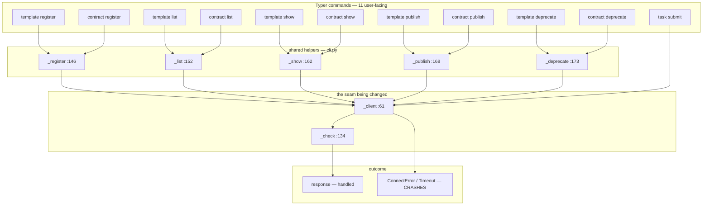

# SSPN-49 — build document

Everything needed to generate the code and tests. Self-contained.

---

## 1. Requirement

`orchestrator template list` and `orchestrator contract list` exit 1 with ~40 lines of
Rich-formatted stack frames ending in:

```
ConnectError: [Errno 61] Connection refused
```

…when the registry API is simply not running. Nothing says what was unreachable, at which
URL, or that `orchestrator up` starts it.

Found by a manual sweep of all 48 CLI commands.

## 2. Intent

A server that is not running is an expected condition. It should print one actionable line
and exit non-zero — not a crash.

## 3. Root cause

`_client()` (`cli.py:61`) builds an `httpx.Client`. Every call site wraps the response in
`_check()` (`cli.py:134`), which handles any status ≥ 400 by printing
`Error {status}: {detail}` and exiting 1 — no traceback.

`ConnectError` and `TimeoutException` are raised **during the request**, before a response
exists. They never reach `_check`, so nothing catches them and Typer prints the traceback.

**Consequence:** the only uncovered cases are those two exception types. HTTP error statuses
are already handled.

## 4. PKG — what the graph knows

**Module:** `orchestrator.cli` @ `src/orchestrator/cli.py:1` (107,722 b)

**Imported by — 3 modules, all tests:**
`tests.test_cli`, `tests.test_launch`, `tests.test_mcp_contracts_types`.
The only names they take are `app` and, in one test, `_issue_key_from_branch`.

**Imports — 208 edges, 14 first-party:** `orchestrator.pkg`, `orchestrator.mcp`,
`orchestrator.knowledge`, `orchestrator.catalog`, `orchestrator.agentic`,
`orchestrator.core.llm`, `orchestrator.intake.factory`, `orchestrator.personas`,
`orchestrator.spine`, `orchestrator.temporal`, and 4 more. **All inbound** — `cli` is a leaf
consumer. Nothing depends on it except tests.

**Symbols in `cli`, ranked by callers:**

| symbol | callers | transitive impact |
|---|---|---|
| `_print` | 23 | 36 |
| `_repo_arg` | 16 | 14 |
| `_client` | **6** | 16 |
| `_check` | **6** | 16 |
| `_issue_key_from_branch` | 5 | 3 |
| `_register` `_list` `_show` `_publish` `_deprecate` | 2 each | 2 each |

**Investigation brief:** `orchestrator investigate` returns the registry *server* modules
(`registry/api/app.py`, `backlog.py`, `approvals.py`, …) and never names `cli.py` — lexical
retrieval matching "registry API" to modules literally called that. **Wrong for this ticket;
ignore it.** The files below come from the spec's stated paths.

## 5. Blast radius — impact neighbourhood

Every edge below is from the graph, not from reading the file.



**Reading it:** eleven commands funnel through five helpers into `_client`. `_check` catches
everything that comes back as a *response*. The right-hand branch — an exception raised
before any response exists — has nothing catching it. That is the whole bug, and the whole
fix goes on that one edge.

**Containment:** the neighbourhood ends at `cli.py`. `_client` and `_check` are
module-private, `cli` is imported only by tests, and it imports 14 first-party modules but
is imported by none. A change here cannot propagate outward.

**Caveat (SSPN-48):** method calls through an instance emit no `CALLS` edge, so per-method
counts under-report. Everything above is module functions, where the counts are exact.

## 6. Design

A single context manager wrapping the request block, used at all six sites:

```python
with api_errors(), _client() as client:
    _print(_check(client.get("/v1/agent-templates")))
```

It catches `httpx.ConnectError` and `httpx.TimeoutException`, prints one line, and exits
non-zero. It does not touch `_check` — HTTP statuses stay where they are.

*(Alternative, if preferred: an inline `try/except` at each of the six sites. No new file,
six repeated blocks. Everything else in this document is unchanged.)*

## 7. Files

**Changed**

| file | scope |
|---|---|
| `src/orchestrator/cli.py` | 1 import; 6 lines — `with _client() as client:` → `with api_errors(), _client() as client:` at lines 148, 158, 164, 169, 174, 263 |

**Created**

| file | contents | size |
|---|---|---|
| `src/orchestrator/api_errors.py` | `api_errors()` context manager + 2 small helpers for the URL and timeout wording | ~60 lines |
| `tests/test_cli_api_errors.py` | ~6 tests | ~90 lines |

## 8. Acceptance criteria

1. When the registry API cannot be connected to, a command using `_client()` prints one line
   naming the base URL it tried and how to start the server, exits non-zero, and prints no
   traceback.
2. A request that times out prints one line naming the configured
   `ORCHESTRATOR_API_TIMEOUT_SECONDS` value, and no traceback.
3. All six `_client()` call sites get this behaviour — `_register`, `_list`, `_show`,
   `_publish`, `_deprecate` and `task_submit`.
4. The happy path is unchanged: `tests/test_cli.py::test_register_loads_json_payload` passes
   untouched, with the same exit code and the same stdout.

## 9. Facts the generator needs

- `_check()` at `cli.py:134` already handles status ≥ 400 with no traceback. **Do not
  duplicate it.** Only `httpx.ConnectError` and `httpx.TimeoutException` are uncovered.
- `_client()` at `cli.py:61` already reads:
  - `ORCHESTRATOR_API_URL` — default `http://localhost:8000`
  - `ORCHESTRATOR_API_KEY` — default `dev-key`
  - `ORCHESTRATOR_API_TIMEOUT_SECONDS` — default `60`
- `httpx` is a direct dependency. No new dependency.
- Exit via `typer.Exit(code=...)`. Do not swallow the failure.
- Tests use `typer.testing.CliRunner`. The client is stubbed with:
  ```python
  monkeypatch.setattr(cli_module, "_client", lambda: DummyClient())
  ```
  See `tests/test_cli.py::test_register_loads_json_payload` for the working shape.
- `httpx.ConnectError("msg")` takes a message.
  `httpx.HTTPStatusError("msg", request=..., response=...)` requires both keywords.

## 10. Codegen prompt

**System:** `_IMPLEMENT_SYSTEM` — source files only, paths relative to the worktree root,
new module permitted provided the files the spec names are also edited.

**User payload:**
- Sections 1, 3, 6, 8, 9 of this document
- Full text of `src/orchestrator/cli.py` (107,722 b)
- Full text of `tests/test_cli.py` (14,064 b)
- Design: touch `cli.py`, create `api_errors.py`

**Context:** 121,786 b of 200,000 — 61%. Both files fit whole; nothing excerpted.

**Then `author_tests`** receives the same spec plus the written source, and writes
`tests/test_cli_api_errors.py` only.

---

## 11. Token usage & cost

Measured, not estimated — four runs of this ticket logged totals to the Jira worklog.

| | |
|---|---|
| mean run | 148,801 tokens |
| lightest | 118,252 (failed at implement) |
| heaviest | 208,463 (reached author_tests) |
| split | ~85% in / 15% out |

Input dominates: the prompt carries 122 KB of source and is **resent on every corrective
attempt**, up to five. Output is capped at 32k covering thinking plus reply.

| model | $/Mtok in | $/Mtok out | per run | range |
|---|---|---|---|---|
| `claude-opus-5` *(default)* | 5.00 | 25.00 | **$1.19** | $0.95–1.67 |
| `claude-fable-5` | 10.00 | 50.00 | $2.38 | $1.89–3.34 |
| `claude-sonnet-5` | 2.00 | 10.00 | $0.48 | $0.38–0.67 |
| `claude-haiku-4-5` | 1.00 | 5.00 | $0.24 | $0.19–0.33 |
| `gpt-5.6` / `gpt-5.5` | 5.00 | 30.00 | $1.30 | $1.03–1.82 |
| `gpt-5.6-terra` | 2.00 | 12.00 | $0.51 | $0.40–0.71 |
| `gpt-5.4` | 2.50 | 15.00 | $0.65 | $0.52–0.91 |
| `gpt-5.4-mini` | 0.75 | 4.50 | $0.20 | $0.16–0.27 |
| `gpt-5.6-luna` | 0.20 | 1.20 | $0.05 | $0.04–0.07 |

**A failed run costs the same as a successful one.** The cheapest measured run produced
nothing. Six attempts have cost roughly $4.75 on `claude-opus-5` and shipped no code.

Prices from the installed LiteLLM catalog via `orchestrator models`. The 85/15 split is
inferred from prompt size against the 32k output cap — the worklog records totals only.

---

## 12. Confidence

Two numbers, because conflating them is the misleading answer.

| | score |
|---|---|
| The analysis is right | **95%** |
| A person ships it in one pass from this document | **90%** |
| An unattended pipeline run completes | **40%** |
| Attempts so far | 6 runs / 0 completions |

### Why the analysis is 95%

| claim | confidence | basis |
|---|---|---|
| Root cause | ~99% | Read from source. The two exceptions are raised before a response exists, so `_check` structurally cannot see them. |
| Scope containment | ~99% | Graph-proven: both helpers module-private, `cli` imported only by tests, no outbound dependents. |
| Exact edit sites | ~99% | Six line numbers, verified against the file. |
| Fix shape works | ~95% | A context manager around two exception types. No unknowns. |
| Test surface sized right | ~85% | 10 of 11 commands untested is a bigger job than the spec implied; the real volume may be larger. |

The missing 5% is *decisions*, not unknowns: whether the message wording survives review, and
whether `task submit` is in scope.

### Why the pipeline is 40%

Six attempts, zero completions. That is the base rate.

| fix landed since | addresses | state |
|---|---|---|
| #164 design reads stated paths | design named the wrong files | **verified** — design now says `cli.py` |
| #165 new module permitted | prompt contradicted the spec | **verified** — reached `implement` + `author_tests` |
| #166 recovery can revise / no unsent claims | renamed helpers, unfixable module | untested on this ticket |
| retry allowance for empty *(uncommitted)* | the last two failures | untested |

**Unaddressed:** codegen sets no `temperature`, while intake pins `0.0`. `summary='placeholder'`
was a bad *draw*, not a bad decision. More retries mitigates that; it does not cure it.

**And this document raises the bar it must clear.** Ten untested commands mean `author_tests`
has substantially more to write — the stage that has failed most.

### Recommendation

The document has essentially resolved the *thinking*. It moved the pipeline odds from roughly
25% to roughly 40%.

- **To ship SSPN-49:** a person working from this document is the high-confidence path.
- **To prove the pipeline:** a reasonable ticket for a seventh run — but commit the retry fix
  first, since it targets exactly the last two failures, and expect to salvage rather than merge.
