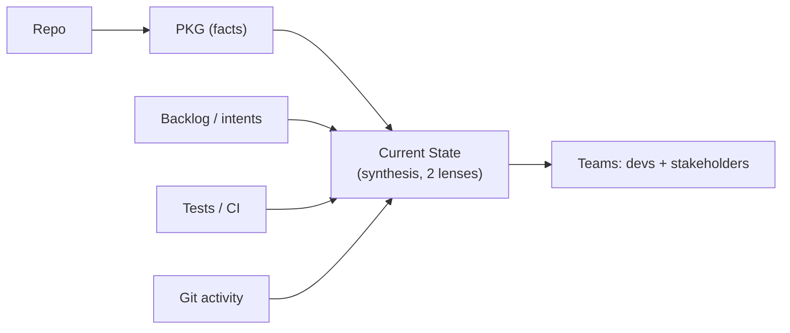

# Design: Current State — the team-facing view on top of the PKG

**Status:** Design / proposed (build **after** the PKG; PKG is the source of facts).

A synthesis layer that answers *"where is this project right now, and is it healthy?"* —
rendered for two audiences (developers and non-developers) from facts Spine already has.
The PKG is the **engine** (code-true facts); Current State is the **dashboard** computed
from it.

## Why, and why after the PKG

- **Derived, not authored.** A hand-written status doc rots within a sprint. Current State
  is *recomputed from facts* every time, so it stays honest — the same principle that makes
  the PKG trustworthy. You can't render an honest current state before the facts exist →
  it is **built after the PKG**.
- **But surfaced first.** Build order: `repo → PKG → current-state`. Experience order:
  Current State is the **front door** a team lands on; the PKG powers it underneath.

## Inputs (PKG + more — this is why it's a layer above the graph)

| Signal | Source | Answers |
|---|---|---|
| Structure | **PKG** | what exists, how it connects, hotspots / blast-radius-prone areas |
| Delivery | backlog / intents (intake) | what's *planned* vs *done* |
| Health | tests / CI status | what's actually green |
| Activity | git history | what's moving / recently changed |
| Prose | `memory-bank/*.md` | architecture, conventions, glossary |

## Output — one derivation, two lenses

- **Developer lens** — architecture map, key types/modules, test/CI health, hotspots,
  gaps/TODOs, recent changes. (Extends today's `memory-bank/` + `profile`/`audit`.)
- **Stakeholder lens (non-dev)** — plain language: *what this system does today*,
  capabilities present, what's in progress, what's done, a green/red health read. **No
  jargon, ideally visual.** This is the missing piece today and the headline value.

Both render from the **same** computed state, so they never disagree.

## Brownfield vs greenfield — same mechanism

- **Brownfield:** computed right after the first extraction → instant "here's what you've
  inherited."
- **Greenfield:** starts near-empty ("nothing built yet, here's the plan") and
  **co-evolves with the PKG** as features land — the same growth story as the Knowledge
  Graph guide, surfaced as a friendly snapshot.

## Surface (proposed)

- A committed **`current-state.md`** (alongside `memory-bank/`), regenerated on demand —
  so the team's shared "where are we" lives in the repo and stays code-true.
- CLI: extend **`orchestrator understand`** to also render Current State, or a dedicated
  **`orchestrator state`** command (`--lens dev|stakeholder`, `--json`).
- Optional **rendered visual / dashboard** for the stakeholder lens (a generated SVG/HTML,
  like the docs hero) — the non-dev "is it healthy / what does it do" view.

## Principles

1. **Code-true & derived** — recomputed from facts, never hand-maintained.
2. **Audience-aware** — two lenses off one derivation; non-dev lens is jargon-free.
3. **Honest health** — green/red reflects real tests/CI, not optimism.
4. **Rides the PKG** — no new comprehension plumbing; it consumes the graph (+ backlog,
   health, activity) we already produce.

## Phasing (small, after comprehension is solid)

1. **State model + dev lens** — synthesize PKG (+ test/CI status where available) into a
   `current-state.md` (developer lens). Extends the existing renderers.
2. **Stakeholder lens** — the jargon-free, plain-language rendering off the same model.
3. **Delivery + activity** — fold in backlog (planned vs done) and recent git activity.
4. **Visual dashboard** — a generated stakeholder view (SVG/HTML).

## Non-goals / open questions

- Not a project-management tool — it *reflects* state, it doesn't track tasks.
- Health depends on a discoverable test/CI signal; degrade gracefully when absent.
- Open: live (web UI) vs committed-doc primary surface; how much the stakeholder lens
  should infer "what the system does" vs state it from intents/domain-model.

> Sequencing: build after comprehension is solid (Python/Java/TS/C# done) — it rides the
> graph we already have. See [pkg-code-grounded-understanding](pkg-code-grounded-understanding.md)
> and the public [KNOWLEDGE_GRAPH.md](../../KNOWLEDGE_GRAPH.md).
</content>
