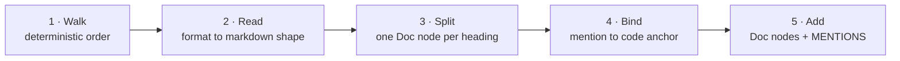

# Document ingestion reference — how a document becomes graph facts, format by format

**Verified against source 2026-08-29 at 3.25.1.** Companion to
[`doc-ingestion-spec.md`](doc-ingestion-spec.md), which is the *design record* — why doc
ingestion exists and what shipped in which phase. This page is the *behavioural* reference:
what each format does, what it costs, and what a document has to look like to be worth
ingesting at all. Every number here was measured on this repository the day it was written,
and the commands are given so they can be re-run rather than trusted.

Its sibling for code is [`parsing-and-the-pkg.md`](parsing-and-the-pkg.md) — that page covers
how *source* becomes graph facts, front-end by front-end. This one covers *prose*.

---

## The one thing to know

**Spine has no pipeline per format.** It has one pipeline, and each format has a small
converter into a common shape: **markdown-shaped text**. HTML's `<h1>`, Word's `Heading 1`
style and a spreadsheet's sheet name all become an ATX `#` heading; HTML's `<code>` becomes a
backtick span. Everything downstream — splitting, mention extraction, binding — reads that one
shape and never learns which format it came from.

That is why the per-format table below looks asymmetric but isn't. A format splits into
sections exactly when its converter can recover headings. PDF and plain text carry nothing a
heading can be built from, so they don't. Nothing is special-cased; the asymmetry is a property
of the formats.

## The five stages

### 1 · Walk

`read_doc_pages` walks from the repo root with `os.walk`, **sorted at every level** so the
output is deterministic, skipping `DEFAULT_IGNORE_DIRS` (`.git`, `node_modules`, build output)
and **any directory whose name starts with a dot**. A file is visited only if some registered
reader claims its suffix; everything else is invisible to doc ingestion.

> The leading-dot rule is load-bearing elsewhere: it is why every on-disk test fixture root in
> `corpus/` is named `.repo/`. See the corpus note in [`CLAUDE.md`](../../CLAUDE.md).

### 2 · Read — and normalise into markdown shape

Formats **register** rather than branch. A `DocReader` is `(name, suffixes, read, sections)`
on a module-level registry, so adding a format touches no existing reader and no dispatch code.

| Format | Needs | How structure is recovered | Sections |
|---|---|---|---|
| `.md` `.markdown` | — (stdlib) | native ATX headings; front matter values kept as prose, keys and fences dropped | **yes** |
| `.html` `.htm` | — (stdlib `HTMLParser`) | `<h1>`–`<h6>` → `#`–`######`; `<code>`/`<tt>`/`<kbd>`/`<samp>`/`<var>` → backtick spans; `<script>`/`<style>` dropped | **yes** |
| `.docx` | `[office]` (`python-docx`) | Word's `Heading 1`–`Heading 6` and `Title` styles → `#`–`######` | **yes** |
| `.xlsx` | `[office]` (`openpyxl`) | each sheet name → `# Sheet`; **string cells only**, joined with `·` | **yes** |
| `.rst` `.txt` | — | nothing to recover | no |
| `.pdf` | `[docs]` (`pypdf`) | nothing — text extraction only, no structure | no |
| audio / video | `[media]` / `[asr]` + `media extract` | nothing — transcript segments joined as paragraphs | no |

**`.xlsx` keeps string cells only** — numbers, dates and formula results are data, not prose
about code, and would add noise without ever binding.

**Not registered on purpose: standalone `.yaml`/`.yml`.** A repo's YAML is overwhelmingly
configuration, not documentation.

**`read` returns `str | None`, and `None` always means skip.** Too large, unparseable, an
optional dependency missing, an encrypted workbook — every one of them is non-fatal. A format
Spine cannot read is simply **absent** from the graph, never an error. This is the `pypdf`
precedent, and it is what makes every extra genuinely optional.

### 3 · Split

`split_sections` runs only when the reader declared `sections=True`. Each heading becomes its
own `Doc` node keyed `path#slug` (`doc:README.md#usage`), with **provenance at the heading's own
line** — so a `MENTIONS` edge points at the paragraph that made the claim, not at a file.
Content before the first heading becomes a section keyed by the bare path, so nothing is
dropped. Slugs are de-duplicated with a numeric suffix; the whole thing is deterministic.

A document with more than `_MAX_SECTIONS` (40) headings **stays whole** rather than fragmenting
the graph.

### 4 · Extract and bind

Mentions are the spans with *code intent*, de-duplicated per page with backticks taking
precedence: backticked spans, dotted paths (`a.b.C`), `snake_case`, `CamelCase`, and file
paths. Bare CamelCase words ("GitHub", "Python") bind when they resolve but never count as
drift — prose capitalisation is not a code claim.

Each mention is then bound against the **already-built code graph**, with three outcomes:

| Anchors | Result | Why |
|---|---|---|
| exactly 1 | **`MENTIONS` edge** | unambiguous claim about a symbol |
| more than 1 | **skipped** | an ambiguous edge poisons grounding — the same skip-rather-than-guess rule that holds `CALLS` precision at 1.00 |
| 0 | **doc-drift finding** | the docs name something the code does not define |

Drift is filtered by `symbolish_drift` to identifier-shaped claims, so paths, filenames and
URLs in backticks (`episteme/`, `graph.html`, `foo_test.go`) do not drown the signal.

### 5 · Add — and only add

`link_docs` is a post-pass over a finished code graph. It calls `add_node` for `Doc` and
`add_edge` for `MENTIONS`, and nothing else: **no code node, edge or provenance is modified**,
and a repo with no docs comes back unchanged. That is what makes wiring it into every
comprehension surface safe.

One nuance worth stating, because it looks like an exception and isn't: a `MENTIONS` edge
counts as a *use* in dead-code detection, alongside `CALLS` and `IMPLEMENTS`, so a
documented-but-uncalled symbol stops being flagged. That is an inference over the graph
changing, not the graph being rewritten.

## Media — the two-phase exception

Media is the only input whose text is produced by a **model**, and it is the pattern to copy if
another one ever is. It runs in two phases:

1. **`media extract`** — an explicit, separate step. Runs OCR (`pytesseract`) or ASR (Whisper
   locally, or a remote API only with per-run `--allow-remote` consent) and writes a committed
   artifact carrying `schema_version`, `source_sha256`, and the transcript segments with
   `start_ms`/`end_ms`.
2. **`read_media_artifact`** — the reader the PKG actually calls. Pure and deterministic: it
   hashes the media file, finds the artifact, and returns its text. It returns `None` — skip —
   for an unknown `schema_version`, a hash mismatch (the media changed since extraction), a
   malformed artifact, or no artifact at all.

So a model contributes the *text* while the *graph build* stays deterministic, cacheable and
gateable by `understand --check`. No model runs inside `understand`.

## Bounds

Every limit fails to **skip**, never to an error.

| Bound | Value |
|---|---|
| Text file bytes | `_MAX_DOC_BYTES` |
| PDF | 25 MB and 500 pages |
| Office files | `_MAX_OFFICE_BYTES` |
| Workbook | `_MAX_SHEETS` sheets, `_MAX_SHEET_ROWS` rows |
| Sections per document | 40 |

## What it costs today, measured

On this repository, 2026-08-29 at 3.25.1:

| | Value |
|---|---|
| Registered readers | **7** (`grep -c 'register_reader(DocReader' src/orchestrator/pkg/doc_source.py`) |
| …of which split into sections | **4** — markdown, html, docx, xlsx |
| `Doc` nodes | **1,505** |
| `MENTIONS` edges | **2,300** |
| `Doc` nodes with at least one edge | **662** |
| **Orphan `Doc` nodes — prose reachable from no symbol** | **843 = 56%** |

The orphan figure is the honest headline. The sections it names are not junk — they are
`ARCHITECTURE.md#the-one-sentence-version`, `#the-layers`, `#the-two-gates`: the prose that
explains *why*, which names no identifier and therefore reaches no symbol. See
[Known limits](#known-limits).

### The cost of losing headings, measured

The same content ingested twice — once as markdown, once converted to PDF:

| | `Doc` nodes | mentions | bound edges |
|---|---|---|---|
| markdown | **8** (per heading) | 80 | **30** |
| PDF | **1** (whole file) | 51 | **16** |

Two distinct causes, and the smaller one is the obvious-looking one:

- **Granularity dominates.** `extract_mentions` de-duplicates per page, so one `Doc` node
  yields at most one edge per symbol. Eight section nodes let a symbol discussed in three
  sections produce three edges, each addressable at its own heading line.
- **Line-wrapping costs a little.** `_BACKTICK_RE` forbids a newline inside a span, so an
  identifier broken across lines is lost: 104 backtick spans in the markdown against 96 in the
  PDF — 9 lost, including `docs_for(symbol)` and `mentions_of(doc_id)`.

So what a structure-less format loses is **pointer resolution**, not comprehension: `docs_for`
can say "described in this 4-page document" instead of "described at
`doc-ingestion-spec.md#components-where-the-code-goes`, line 116" — and it is the second form
that is worth putting in a prompt.

## Writing a document that binds

Applies to any format; it matters most for the ones that cannot carry headings.

1. **Name symbols exactly**, in backticks or as dotted paths. `extract_media`, not "the media
   extractor".
2. **Qualify anything ambiguous.** `off_machine` exists on four classes and is *skipped*;
   `AsrBackend.off_machine` binds. Ambiguity is refused, not guessed.
3. **Keep identifiers on one line.** A backtick span broken by a line break is not a mention.
4. **Put the explanation beside the symbols it explains.** Prose travels attached to the
   symbols in its own section, so rationale separated from its identifiers reaches nothing.
5. **Use real headings** where the format has them — that is what buys section granularity.

## Where these facts are consumed

| Consumer | What it does with them |
|---|---|
| `PKGCodegenGrounder._doc_block` (`sdlc/grounding.py`) | attaches up to 500 chars of a `MENTIONS`-linked section's prose to that symbol's source in the codegen context — the model gets the code *and what it is for* |
| `doc_drift` → `state` | reports code-intent claims the graph does not support |
| `insights.py` dead-code | treats a `MENTIONS` edge as a use |
| `sdlc/builddoc.py` | lists the docs covering in-scope symbols, so a change plan names the prose that will need updating |
| `docs_for` / `mentions_of` (`pkg/store.py`, MCP `plugin/server.py`) | "which docs describe `X`?", answerable by an assistant |
| `renderers.py` glossary | the *Explained in* column — the same query in bulk |

## Known limits

- **PDF, `.rst`/`.txt` and media collapse to one `Doc` node per file**, because none of them
  can express a heading. Media is the one where the fix needs no new dependency: its segments
  already carry `start_ms`/`end_ms` and could become timestamped sections. **Unmeasured and
  unscheduled.**
- **56% of `Doc` sections bind to nothing.** This is not a parsing problem — those sections are
  perfectly-parsed markdown. Connecting intent-bearing prose to code without an identifier
  needs semantic matching, which means a model, which collides with the determinism that makes
  `understand --check` a gate. Any fix belongs in a clearly-labelled second tier, measured and
  declared the way GraphIR Phase 2b was, never smuggled into the deterministic path.
- **Diagrams contribute almost nothing.** A mermaid flowchart is read as text, but its labels
  are prose and bind to nothing, and **its arrows never become edges** — a diagram saying
  "intake → design" produces no relationship. A diagram embedded in a PDF yields loose label
  tokens with no structure. *A diagram is better used as a set of assertions to check against
  the graph than as a source of facts to add to it; that idea has no spec.*
- **A layout-aware extractor was considered and not pursued** (2026-08-29). Docling-class tools
  recover headings, reading order and tables. Headings are the only part this pipeline can use,
  and HTML, DOCX and XLSX already get them for free — leaving PDF, where the measured ceiling
  is roughly the doubling shown above, against a torch-sized dependency and a two-phase
  artifact seam. Revisit if a target environment is shown to keep most of its
  identifier-bearing prose in PDF.
