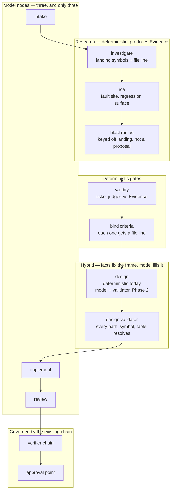

# The SDLC as a GraphIR workflow — one orchestrator, deterministic where it counts

**Status:** Not started. **Written 2026-08-18 against 3.19.0.**
**Owner:** _unassigned_

**One-liner:** Spine runs **two orchestration systems that never touch each other**. `sdlc/autorun.py`
is an imperative six-stage pipeline; GraphIR + the planner + the verifier chain + Temporal is a
typed, replannable, governed workflow engine reachable only from the task API. This record makes
the SDLC pipeline *be* a GraphIR workflow whose first act is **research**: deterministic Evidence —
investigate + RCA + blast radius — that design, codegen and the acceptance criteria are all bound
to. **Without converting a single deterministic stage into a model call.**

---

## Why this record exists

An external architecture review of this repository (GPT-5.6, 2026-08-18) proposed an "SDLC
Supervisor" that assembles specialist agents per ticket. Its inventory of Spine's primitives was
checked against source and is **largely accurate**, and it found one thing worth acting on:

> `grep -n "planner\|GraphIR\|graph_ir\|temporal\|agentic" src/orchestrator/sdlc/autorun.py`
> → **no matches.**

The SDLC pipeline knows nothing about the workflow engine. The workflow engine is consumed only by
[`temporal/activities.py`](../../src/orchestrator/temporal/activities.py) and
[`registry/api/tasks.py`](../../src/orchestrator/registry/api/tasks.py). Everything the review
wants — inspectable, resumable, branchable, replannable, configurable per issue type — is already
built, and the SDLC does not use it.

**Where that review goes wrong, and why this spec exists rather than that one:** it assumes the six
SDLC stages are agents. Two of them are not, and that is deliberate. See
[the determinism boundary](#the-determinism-boundary--the-constraint-that-governs-everything-here)
and [what was rejected](#appendix--what-was-rejected-from-the-source-analysis).

---

## What exists today, verified against source

| Primitive | Where | Note |
|---|---|---|
| Typed workflow IR | [`ir/graph.py`](../../src/orchestrator/ir/graph.py) | `GraphSpec`, `Node`, `Edge` with `condition`, `ApprovalPoint`, `Budget` |
| Node types | `ir/graph.py` `NodeType` | `agent`, `verifier`, `approval`, `loop_guard`, `reflection`, `a2a_call` — **no deterministic-tool type** |
| Patterns | `ir/graph.py` `WorkflowPattern` | five declared; **three executable** (`single_agent`, `sequential`, `manager_specialists`) per `IRValidator.SUPPORTED_PATTERNS` |
| Validator | [`ir/validator.py`](../../src/orchestrator/ir/validator.py) | 8 rule families incl. `cycle`, `unreachable`, `budget`, `reference_unresolved` |
| Executor | [`runtime/task_orchestration.py`](../../src/orchestrator/runtime/task_orchestration.py) | LangGraph graphs built per pattern; dispatch is `node.type is NodeType.AGENT` only |
| Durability | [`temporal/`](../../src/orchestrator/temporal/) | worker, activities, `replan_ir` |
| Verifier chain | `runtime/verifiers/` | `base, chain, confidence, evidence, glossary, policy` |
| SDLC pipeline | [`sdlc/autorun.py`](../../src/orchestrator/sdlc/autorun.py) | `RunContext` + six stages, checkpoint / park / resume / budget |
| RCA | [`sdlc/rca.py`](../../src/orchestrator/sdlc/rca.py) | `build_rca` — *"Deterministic unless `llm` is given"*; **not reachable from `autorun`**, CLI + plugin only |
| Blast radius | [`sdlc/impact.py`](../../src/orchestrator/sdlc/impact.py) | called from `design.py` **after** design proposes `files_to_touch` — see defect 2 |

### The six stages: what calls a model **today**, and what should

`async` does not mean "calls a model" — four stages are `async`, three call a model. Read this
table rather than the signatures, because the difference is where the doubt creeps in.

| Stage | Model **today** | Class today | Target | Note |
|---|---|---|---|---|
| `intake` | **yes** | `model` | `model` | `intake/specs.py`, `intents.py` |
| `investigate` | no | `deterministic` | `deterministic` | sync `def`, PKG query |
| `validity` | no | `deterministic` | `deterministic` | *"the graph answers, not a model"* |
| `design` | **no** | `deterministic` | **`model` (hybrid fields), Phase 2, validator first** | `produce_design(..., llm=None)` — see below |
| `implement` | **yes** | `model` | `model` | codegen |
| `review` | **yes** | `model` | `model` | `reviewer.review` → `llm_findings`, `fixer.refine` |

**Why `design` is deterministic today.** [`autorun.py`](../../src/orchestrator/sdlc/autorun.py)
passes `llm=None`, and says why — *"No LLM here yet: the deterministic design is the honest skeleton
default… Wiring the model in is phase 2 work."* `_llm_design` exists in `design.py` and is simply
not wired. Counting it as a model node, as an earlier draft of this record did, overstates the model
surface by 33%.

**Why it should not stay that way.** The deterministic design is a template, and its own output
admits it:

```python
"approach": f"Implement '{title}' following the repo's existing structure and conventions."
"interfaces": []
"data_changes": []
"test_strategy": "Add tests covering each acceptance criterion: " + "; ".join(ac[:6])
```

`interfaces` and `data_changes` are empty, `approach` is a sentence with the title interpolated.
Those fields are not in the graph and never will be. A model is the right tool for them — which
makes `design` the one stage where a **hybrid** node is warranted.

### The hybrid split — facts fix the frame, the model fills it

`design` is the canonical hybrid node, and the split is **per field**, not per stage:

| Field | Source | Why |
|---|---|---|
| `files_to_touch` | **fact** — Evidence landing sites | the graph knows where the ticket lands; a model would guess |
| `blast_radius` | **fact** — computed from landing, *before* design runs | must never be computed from the model's own proposal (defect 2) |
| `risks` | **fact** — dependents, hotspots, recently-changed | derivable, so derive it |
| `approach` | **model**, framed by Evidence | not in the graph |
| `interfaces` | **model**, every named symbol checkable | empty today |
| `data_changes` | **model**, every named table checkable | empty today |
| `test_strategy` | **model**, bound to the bound criteria | a template today |

The model proposes *inside a frame it cannot move*: files, impact and criteria are fixed by Evidence
before it is called.

> **The class of a hybrid node is `model`.** If any field is model-produced, the node is a model
> node and the promotion rule applies in full — including the validator on its output edge. There
> is no third class; "mostly deterministic" is not a category, because it is not enforceable.

**The validator already half-exists**, which is what makes this promotable rather than an exception.
[`impact.py:178`](../../src/orchestrator/sdlc/impact.py):

```python
def unverified_references(br: BlastRadius) -> list[str]:
    """Design-named paths absent from the graph (possible hallucinations)."""
    return [] if not br.grounded else list(br.unresolved)
```

Spine already computes *"paths this design named that the graph has never heard of"*, and already
suppresses it on a greenfield repo where absence is legitimate. Today it is **reported** — carried
into `design.json` and the build document. Promoting `design` means making it **enforcing**, and
extending it from paths to symbols and tables: every file, symbol and table a design names must
resolve in the PKG or be a legal new path, and `files_to_touch` must sit inside the blast radius or
carry an explicit reason. All of that is checkable without a second model.

`_stage_validity` is the only stage that can stop a run before code is written. Its own docstring
states why that matters: *"a ticket claiming eleven entities where the source has seven would
otherwise be built to a false premise, pass its own tests, and be wrong."* That is a graph query.
An agent cannot make that guarantee.

### Research is not wired as research — four defects

The pipeline checks the ticket against the graph **once**, at `validity`, and thereafter the
*ticket* — not the graph — drives every downstream stage. Four concrete consequences:

1. **RCA never runs.** `build_rca` produces `fault_site`, `fault_module`, `callers`,
   `regression_surface`, `recently_changed`, `hypotheses`, all deterministically, and `autorun`
   does not call it. A bug ticket gets no root-cause work.
2. **Blast radius is computed from the design's own proposal.** `design.py`:
   `blast_radius(store, design.get("files_to_touch"))`. The impact analysis describes the files the
   design *guessed at*, not the files the evidence says the ticket lands on. If the proposal is
   wrong, the blast radius is a faithful analysis of a fiction — and it reads as verification.
3. **The evidence is discarded between stages.** `Investigation.landing` carries
   `Landing{name, where:"file:line", kind, callers, module}`. What reaches `RunContext` is
   `where.split(":", 1)[0]` — the file path alone. Line, kind, caller count and owning module are
   dropped, so design and codegen see filenames where the research proved symbols.
4. **Acceptance criteria are never bound to evidence.** `spec["acceptance_criteria"]` originates in
   intake (a model, reading a document, not the code) and is read straight through by `design.py`,
   `codegen.py` and `grounding.py`. Tests are generated against criteria written by a model that
   had not examined the code. `validity` catches false *counts*; nothing binds a criterion to a
   symbol or a `file:line`.

**This is the substance of the design below.** Evidence — investigate + RCA + blast-radius keyed
off the landing sites — is the artifact the workflow carries, and acceptance criteria are bound to
it before any code is written.

---

## The determinism boundary — the constraint that governs everything here

**Every node in an SDLC GraphIR declares a class, and the class is enforced, not documented.**

### Class `deterministic`

A deterministic node **must**:

1. make **no model call**, no network call, no clock read, no RNG draw;
2. produce **byte-identical output** for the same `(commit, inputs)` — the same standard
   `understand` and `state` are held to (invariant 2 of [CLAUDE.md](../../CLAUDE.md));
3. record a **content digest** of its output in the run record.

Executing the same graph twice at the same commit must produce identical output from every
deterministic node. This is a CI check, not a convention — see [Phase 1](#phase-1--the-tool-node-type-and-the-sdlc-ir-in-shadow).

### Class `model`

Today there are **three** model nodes: `intake`, `implement`, `review`. `design` is `async` but
runs with `llm=None`, so it is `deterministic` today and `model` after Phase 2. That is a budget,
not a starting point to grow from: **three today, four after Phase 2, and the fourth costs a
validator.**

> **The promotion rule.** A node may be **demoted** from `model` to `deterministic` freely — no
> permission, no measurement, it is strictly a gain. A node may be **promoted** from
> `deterministic` to `model` only when **all three** hold, and only by amending this document:
>
> 1. a measurement shows the model node beats the deterministic one on ticket acceptance;
> 2. **its output edge carries a validator** — a deterministic check, not a second model, that can
>    reject the output before a downstream node consumes it;
> 3. the run's model-call count stays inside the budget in [Measurement](#measurement-plan).
>
> "It seems like it should be an agent" is not a reason.

**Clause 2 is the one that would have caught the live gap.** Every model output in the pipeline
today has a validator downstream — intake's spec is judged by `assess()`, implement's code by tests
+ preflight + fit, review's fixes by re-running the tests. `design` has none. It is safe only
because it currently calls no model; the moment `llm=` is wired in, model-written design text flows
into codegen as `ctx.plan` **unchecked**, and a hallucinated path or invented symbol propagates into
the change.

So `design`'s promotion is **scheduled, not forbidden** — Phase 2, in this order: build the
validator (an enforcing `unverified_references` extended to symbols and tables), then wire
`_llm_design`, then measure. If the measurement does not favour the model fields, design stays
deterministic and the validator is kept anyway — it costs nothing and guards the field the day
someone tries again.

**Why the rule points that way.** Every measurement this project owns says the deterministic layer
is what makes the model layer worth anything: 29/50 grounded versus 0/50 ungrounded on `create`
tickets, 47/68 versus 3/68 across two codebases
([`codegen-model-comparison-results.md`](codegen-model-comparison-results.md),
[`external-repo-grounding-results.md`](external-repo-grounding-results.md)). Replacing a graph
query with a model call spends money to make a guarantee into a guess.

### What the boundary looks like in a graph



---

## Phases

Four phases. **Each is complete in itself** — it ships, it is useful, and the programme can stop
there without leaving debris. Implement one at a time.

### Which phase closes which defect

Read this before choosing where to start. The four defects in
[Research is not wired as research](#research-is-not-wired-as-research--four-defects) do **not**
distribute evenly across the phases, and a phase that *produces* an artifact is not the phase that
*closes* the defect — nothing is fixed until something downstream consumes it.

| Defect | Produced | Consumed | **Closed at** |
|---|---|---|---|
| 1 · RCA never runs | Phase 1 — `rca` joins the Evidence node | Phase 2 — feeds design | **Phase 1** for "runs and is recorded"; **Phase 2** for "informs the change" |
| 2 · Blast radius computed from the design's own proposal | Phase 1 — computed from landing sites | Phase 2 — design consumes it and stops computing its own | **Phase 2** |
| 3 · Evidence discarded between stages | Phase 1 — Evidence keeps `{name, where, kind, callers, module}` | Phase 2 — design and codegen receive it | **Phase 2** |
| 4 · Acceptance criteria never bound to evidence | — | Phase 2 — `criteria_binding.py` | **Phase 2** |

**Phases 3 and 4 close no defects.** Phase 3 is configurability, Phase 4 is throughput. Both are
real work; neither fixes anything listed above.

> **The consequence, stated plainly: Phase 1 is enablement, Phase 2 is where the value lands.**
> Phase 1 produces Evidence and nothing reads it — deliberately, since that is what makes it
> shippable in shadow with zero behaviour change. **Stopping after Phase 1 leaves three of four
> defects open.** If the goal is closing the defects rather than building the workflow engine,
> Phases 1 and 2 are the deliverable and Phase 1 alone is a down payment.

### Which phase closes which defect

Read this before choosing where to start. The four defects in
[Research is not wired as research](#research-is-not-wired-as-research--four-defects) are **not**
spread evenly across the phases.

| Defect | Produced | Consumed | **Closed at** |
|---|---|---|---|
| 1. RCA never runs | Phase 1 — `rca` joins Evidence | Phase 2 — feeds design | **Phase 1** (runs + recorded); fully Phase 2 |
| 2. Blast radius computed from the design's own proposal | Phase 1 — computed from landing sites | Phase 2 — design consumes it and stops computing its own | **Phase 2** |
| 3. Evidence discarded between stages | Phase 1 — full `Landing{name, where, kind, callers, module}` preserved | Phase 2 — design and codegen receive it | **Phase 2** |
| 4. Acceptance criteria never bound to evidence | — | Phase 2 — `criteria_binding.py`; an unbound countable criterion parks | **Phase 2** |

**Phases 3 and 4 close no defects.** Phase 3 is configurability, Phase 4 is throughput. Both are
real; neither fixes anything listed above.

> **The consequence, stated plainly: Phase 1 is enablement, Phase 2 is where the value lands.**
> Phase 1 produces Evidence and nothing downstream reads it — deliberately, because that is what
> makes it shippable in shadow with zero behaviour change. Stopping after Phase 1 leaves **three of
> four defects open**. If the goal is closing the defects rather than building the workflow engine,
> **Phases 1+2 are the deliverable** and Phase 1 alone is a down payment.

| Phase | Deliverable | Status | Started | Ended |
|---|---|---|---|---|
| 1 | `tool` node type + the **Evidence** research node, SDLC expressed as IR, run in shadow | ✅ **COMPLETE** | 2026-08-18 | 2026-08-18 |
| 2 | The IR executes the run; Evidence is **consumed**; criteria bound to it; `RunContext` becomes the typed Case | Not started | — | — |
| 3 | Issue-type-shaped workflows; profiles as files a repo can carry | Not started | — | — |
| 4 | Parallel fan-out and the bounded replan loop | Not started | — | — |

### Phase 1 — the `tool` node type, the Evidence artifact, and the SDLC IR in shadow

**Deliverable.** `NodeType.TOOL` exists; the pipeline is expressible as a validated GraphIR; and a
new **`Evidence`** artifact is produced on every run by three deterministic nodes — `investigate`,
`rca`, and `blast_radius` **keyed off the landing sites rather than off a design proposal**. The IR
and its deterministic nodes execute **alongside** the imperative pipeline and their outputs are
compared. `autorun` remains authoritative; nothing downstream consumes Evidence yet.

**Why Evidence lands in Phase 1 and not later.** It is the artifact the whole design is about, it
is entirely deterministic, and it costs nothing to produce. Shipping it first means every
subsequent phase has something true to be judged against.

**Evidence carries the structure that is currently thrown away** — `Landing{name, where, kind,
callers, module}` in full, not `where.split(":")[0]` — plus the RCA fields and a blast radius
computed from the landing sites. It carries `grounded: bool` from `Investigation` and `RCAReport`:
when the PKG had no grounded nodes for this ticket, the Evidence is **empty and says so**, rather
than a confident-looking artifact assembled from nothing.

**Files, as built.** `ir/graph.py` (+`TOOL`), `ir/validator.py` (`tool_unresolved` rule, checked
**without a session** — `autorun` runs with no registry service, so a DB-backed tool lookup would
leave the SDLC's graph unvalidatable in exactly the context that runs it; plus agent-chain
condensation so tools may sit between agents), `runtime/tool_registry.py` (new — name →
deterministic callable, with digest capture), `sdlc/evidence.py` (new — `Evidence` +
`build_evidence()` composing `build_investigation` / `build_rca` / `blast_radius`),
`sdlc/profiles/default.yaml` (new), `sdlc/autorun.py` (shadow build + compare; writes
`evidence.md`, `evidence.json`, `shadow.json`), `cli.py` (`sdlc workflow`), `tests/ir/`,
`tests/sdlc/`.

> **The package is `sdlc/profiles/`, not `sdlc/workflows/`.** `orchestrator.sdlc.workflows` is
> already the Temporal workflow module; a package of that name shadows it and `SDLCWorkflow`
> silently stops existing. The test suite stayed green — `mypy` caught it.

**Done when.** (a) `orchestrator sdlc workflow default` prints the validated graph; (b) a
shadow run reports **zero divergence** between IR-executed deterministic nodes and the imperative
stages, over ≥20 runs across ≥5 commits; (c) a determinism test runs the same graph twice at one
commit under five `PYTHONHASHSEED` values in subprocesses and asserts identical digests — the
technique that caught the `state` bug in 3.19.0; (d) `Evidence` is written for every run, bug
tickets included, and `grounded=false` is visible rather than silent.

**Defects: closes 1** (RCA runs and is recorded). **Leaves open 2, 3, 4** — Evidence is produced
and nothing consumes it, so design still computes its own blast radius, codegen still sees
filenames, and criteria are still unbound. That is by design: shadow mode changes no behaviour.

**Defects.** Closes **1** in the sense that RCA runs and is recorded on every bug ticket. Leaves
**2, 3 and 4 open** — Evidence is produced but nothing consumes it, so design still computes its own
blast radius, still receives filenames rather than symbols, and criteria are still unbound.

**Gate result — 2026-08-18. PASS.** `scripts/phase1_shadow_gate.py`: **20 runs across 5 commits,
0 divergences**, floor met. Verdicts exercised both paths (16 `PROCEED`, 4 `TOO_BIG`, i.e. parked),
and 9 distinct Evidence digests over the 20 runs confirm the artifact varies with ticket and
commit rather than being constant. The gate was proved able to fail three ways before it was
believed: perturbing one field of a tool's output flagged 4/4 runs, breaking the comparator
flagged none, and running 4 runs across 1 commit failed the floor.

**Two nodes are compared, not four.** `n_rca` and `n_blast_radius` have no imperative twin — RCA
does not run in `autorun` at all, and the blast radius is computed inside `design.py` from the
design's own proposal. The gate reports `compared_nodes` and `uncompared_nodes` separately so a
reader cannot mistake the coverage.

**No model runs in the gate, and that is not a shortcut.** Both compared nodes are deterministic;
the three model stages have no bearing on whether the graph reproduces them. The gate drives the
real `_shadow_pass`, `_stage_investigate` and `_stage_validity` from `autorun` rather than a
reimplementation — a gate that re-derives what it checks checks itself.

**Value if we stop here.** RCA finally runs on autonomous bug tickets and a *true* blast radius is
recorded per run — both absent today — plus an inspectable description of the pipeline and the
first proof that its deterministic half is reproducible. Useful even if the IR never becomes the
executor.

### Phase 2 — the IR executes the run, Evidence is consumed, criteria are bound

**Deliverable.** `orchestrator sdlc autorun --workflow default` executes the graph for real:
deterministic nodes run through the tool registry, the three model stages run as `agent` nodes
wrapping today's functions unchanged. **Evidence stops being an artifact nobody reads:**

- `validity` judges the ticket against Evidence rather than re-deriving landing sites;
- `design` receives Evidence — including a blast radius that is already known — instead of
  computing impact from its own `files_to_touch` guess;
- **acceptance criteria are bound.** Each criterion in `spec["acceptance_criteria"]` is matched to a
  symbol and a `file:line` in Evidence. A criterion that cannot be bound is reported, and an
  unbound *countable* criterion parks the run — the same treatment `assess()` already gives a false
  count, for the same reason: a criterion nobody can locate is a test nobody can write.

**And `design` is promoted to a hybrid model node — validator first, in this order:**

1. **Build the validator.** `unverified_references` becomes enforcing rather than reporting, and
   extends from paths to symbols and tables. A design naming an unresolvable reference on a
   *grounded* repo does not reach codegen. Greenfield suppression stays as it is.
2. **Wire `_llm_design`,** with the fact fields (`files_to_touch`, `blast_radius`, `risks`) supplied
   from Evidence and **not** re-derivable by the model.
3. **Measure.** If the model fields do not improve acceptance, design reverts to deterministic and
   the validator is kept regardless — it costs nothing and guards the seam permanently.

`RunContext` is persisted per node; `park`/`resume` map onto `ApprovalPoint` and node state. The
imperative path stays available behind a flag for one release.

**Files.** `sdlc/autorun.py` (delegate to the runtime), `sdlc/case.py` (new — the typed, persisted
Case; `RunContext` becomes a view over it), `sdlc/criteria_binding.py` (new — deterministic
criterion → symbol/`file:line`), `sdlc/validity.py` (accept Evidence), `sdlc/design.py` (accept a
precomputed blast radius; wire `_llm_design` behind the validator), `sdlc/design_validator.py` (new
— enforcing reference resolution), `sdlc/impact.py` (`unverified_references` → symbols and tables),
`runtime/task_orchestration.py` (dispatch `TOOL`), `registry/api/`, `cli.py`.

**Done when.** Acceptance on the benchmark corpus is **non-inferior** to the imperative path (see
[Measurement](#measurement-plan)); resume works at node granularity; the run record shows per-node
cost, latency and digest; every acceptance criterion in a completed run carries a provenance or an
explicit "unbound" with a reason; the design validator rejects a synthetic design naming a
nonexistent symbol, proven by a test that fails when the validator is reverted; `sdlc explain <run>` renders the graph that actually executed,
including skipped nodes and why.

**Defects: closes 2, 3, 4, and completes 1.** Every defect in this record is shut by the end of
this phase. Nothing about research remains outstanding afterwards.

**Defects.** Closes **2, 3 and 4**, and completes **1** by putting the RCA in front of design.
After this phase every defect in §"Research is not wired as research" is shut. Leaves none open.

**Value if we stop here.** The chain the ticket drives becomes the chain the *evidence* drives —
design constrained by a real blast radius, tests written against located criteria — plus
node-granular resume, replay and per-node cost, and one orchestration system instead of two.

### Phase 3 — issue-type-shaped workflows, and profiles a repo can carry

**Deliverable.** Profiles are files, not code. A bug and an enhancement produce different graphs via
`Edge.condition`, which the IR already carries: the bug profile weights `rca` and regression
surface, the enhancement profile weights blast radius and existing-capability analysis, and each
selects which Evidence nodes run. A repo may carry its own profile.

**Files.** `sdlc/workflows/{default,bug,enhancement}.yaml`, `sdlc/workflow_select.py` (new —
deterministic profile choice from issue type; **no model**), `cli.py` (`sdlc workflows`).

**Done when.** Bug-ticket acceptance improves against a bug corpus with held-out graders, or the
result is reported as null. Profile selection is deterministic and unit-tested per issue type.

**Defects: closes none.** This phase is configurability, not correctness. It is worth doing on its
own merits and should not be sequenced ahead of Phase 2 on the argument that it fixes something.

**Defects.** Closes **none** — all four are shut by the end of Phase 2. This phase is
configurability, and it should not be sold as a fix.

**Value if we stop here.** The SDLC becomes configurable per repository without a code change, and
each issue type gets the research it actually needs rather than one fixed pass.

### Phase 4 — parallel fan-out and the bounded replan loop

**Deliverable.** Independent nodes run concurrently under a bounded pool and the run budget.
Failures route through the existing verifier chain into `replan_ir`, capped by
`Budget.max_replan_count`, which already exists and is currently unused by the SDLC.

**Files.** `runtime/task_orchestration.py` (fan-out for `sequential`/`manager_specialists` graphs
with independent nodes), `sdlc/case.py` (concurrent node writes), `temporal/` (replan wiring),
`ir/validator.py` (parallel-shape rules).

**Done when.** Wall-clock per ticket drops with **no acceptance regression** and no budget
overrun; a forced node failure demonstrably replans within the cap and stops at it.

**Defects: closes none.** This phase is throughput. If it is reached with any defect still open,
the sequencing went wrong.

**Defects.** Closes **none** — this phase is throughput. It must not regress any of the four, and
the Phase 2 gates stay in the suite to prove it.

**Value if we stop here.** The programme is complete: one orchestrator, deterministic where it
counts, replannable, and faster.

---

## Measurement plan

Reuse the existing harness. Do not build a second one.
[`scripts/codegen_benchmark.py`](../../scripts/codegen_benchmark.py) for runs,
[`scripts/bench_aggregate.py`](../../scripts/bench_aggregate.py) for Wilson score intervals, with
aborted passes **excluded rather than counted as failures** — the accounting error that once
reported an arm as `4/10` when six tickets never reached the model.

**Primary metric.** Ticket acceptance: generated tests pass **and** preflight baseline-diff passes
**and** the change fits. Unchanged from the published benchmark, so Phase-2 numbers are directly
comparable to the 3.19.0 baseline.

**Guardrails, reported every phase.**

| Metric | Gate |
|---|---|
| Deterministic-node divergence | **0** — any divergence blocks the phase |
| USD per ticket | ≤ baseline + 10% |
| Model calls per ticket | **≤ 3** today; **≤ 4** from Phase 2, and only once design's validator is enforcing. Any further increase amends this document |
| Acceptance criteria unbound to evidence | reported every run; an unbound countable criterion parks (Phase 2 on) |
| Wall-clock per ticket | Phase 4 must improve it; Phases 1–3 must not regress it >10% |

**Per-phase gates.** Phase 1: 0 divergences, ≥20 runs, ≥5 commits, plus the `PYTHONHASHSEED`
determinism test, and Evidence produced for every run. Phase 2: non-inferiority against the imperative path, plus 100% of acceptance criteria either bound or explicitly reported unbound. Phase 3: bug-corpus
acceptance, ≥20 bug tickets × 5 passes, held-out graders. Phase 4: wall-clock improvement at equal
acceptance.

**State the power honestly, because non-inferiority is the weakest claim here.** At 10 tickets × 5
passes = 50 trials, a Wilson interval around p≈0.9 is roughly ±8pp. Phase 2 can therefore detect a
regression of about 10pp and **cannot** rule out a 5pp one. Either widen the corpus for that phase
or say so in the result — "within the noise of a 50-trial comparison", never "no difference".

**Nobody grades their own work.** Every acceptance suite is authored separately from the ticket, as
today. A phase that changes the harness does not also report its own improvement.

---

## Invariants you must not break

1. **The determinism boundary above.** It is the point of this design, not a caveat on it.
2. **The PKG stays the source of truth.** Nodes render facts; they never re-derive them from paths
   or filenames (CLAUDE.md invariant 1).
3. **Two human bookends.** A workflow profile may **add** approval points. It may never remove the
   merge gate or the validity park. Policy widens governance, never narrows it.
4. **Budget is per run, not per node.** A graph that fans out still answers to
   `SDLC_RUN_BUDGET_USD`.
5. **Bound honestly.** An executed graph reports the nodes it skipped and why. A run summary that
   omits skipped nodes implies a completeness it does not have (CLAUDE.md invariant 7).
6. **No new framework.** GraphIR, LangGraph and Temporal are already dependencies. This programme
   adds one node type and a registry — not an agent framework.

## Non-goals

- **Free-form agent-to-agent conversation.** Coordination is typed artifacts through the Case.
- **Replacing deterministic stages with agents.** Explicitly rejected; see the promotion rule.
- **Confidence-threshold routing** on an uncalibrated score.
- **A supervisor hierarchy.** Three levels of supervisor for a six-node graph is organisation
  theatre. Revisit only if a profile genuinely exceeds ~20 nodes.
- **Deployment / CD.** The pipeline still ends at a reviewed, CI-green merged PR.

## Open questions

1. **Where do profiles live** — `sdlc/workflows/` in the package, or `.spine/workflows/` in the
   target repo? Phase 3 needs an answer; Phase 1 can hardcode the package path.
2. **Temporal or plain asyncio** for SDLC runs? Autorun does not use Temporal today, and Phase 2
   does not need it. Deciding at Phase 4 is fine; deciding at Phase 2 is cheaper.
3. **Migration of in-flight runs.** A `RunContext` written by 3.19.0 must still resume after
   Phase 2, or the release notes must say it cannot.
4. **Does `sdlc feature` move too**, or stay the single-ticket imperative path? Current assumption:
   it stays, and `autorun` is the only surface that gains a graph.

---

## Appendix — what was rejected from the source analysis

| Proposal | Why it is not in this spec |
|---|---|
| Replace `investigate` / `validity` with `investigation-agent` / `requirements-validator` | Both are synchronous PKG queries today. Promotion to a model node would trade a guarantee for a guess, against the promotion rule. |
| Decompose RCA into six agents (Evidence, Localization, Git History, Reproduction, Hypothesis, Judge) | `build_rca` is deterministic by default; `localize_trace` and `_recently_changed_files` already do localization and git history exactly and for free. Six model calls to reproduce two functions. **The real gap is that `rca` is unreachable from `autorun`** — Phase 1 fixes that. |
| Route on confidence `≥0.85 → design`, `0.50–0.85 → reproduce`, `<0.50 → park` | The score's origin and calibration are unspecified. Uncalibrated numbers driving control flow are precisely the failure mode this project keeps finding in itself. |
| `SDLCCase` as new architecture | `RunContext` already carries run id, issue, branch, worktree, PR URL, spec, design, verdict, tests, artifacts, checkpointing, parking, resume and duplicate-run protection. Phase 2 makes it typed and per-node; it does not invent it. |
| A ~15-agent organisation per ticket | Unpriced. Against a three-model-call baseline and an enforced `SDLC_RUN_BUDGET_USD`, roughly an order of magnitude per ticket, with no proposed measurement of whether it helps. |
| Three levels of supervisor | See Non-goals. |

**What the analysis got right, and it is the reason this record exists:** the SDLC pipeline and the
workflow engine are two systems that never meet, and the SDLC should be the graph.
