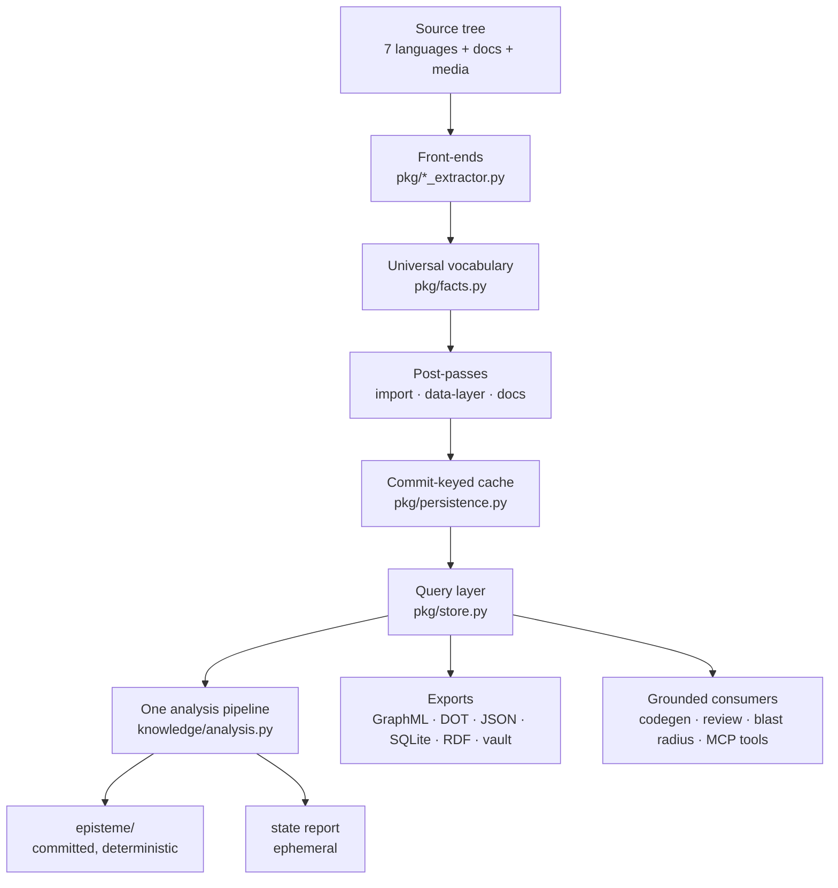

# The knowledge graph — foundation architecture

**Status:** Derived from the code, 2026-08-02. Descriptive, not a proposal — this documents
what `pkg/` and `knowledge/` *are*, so a change can be judged against it.

Measured on this repo at the time of writing: **10,446 nodes (9,780 grounded), 28,894 edges**,
from 7 node kinds and 9 edge kinds.

---

## The one idea

**The graph is the source of truth; everything else renders it.**

Every surface Spine offers — the committed `episteme/`, the `state` report, blast radius,
codegen grounding, the GraphML you open in Gephi — is a *projection* of one fact graph. None
of them re-derive facts from paths, filenames or heuristics. If a surface needs to know
something new, the answer is to extend the vocabulary and the front-ends, never to make the
renderer guess.

That constraint is what makes the rest defensible: a claim in `episteme/architecture.md` can
be traced to a file and line, and two surfaces cannot disagree about the same commit.

## Layers

### 1. Front-ends — the only place that reads source

`pkg/extractor.py` dispatches **per file suffix** to a language front-end: Python, Java,
TypeScript, C, C++, C#, Go, SQL. Each parses its own language and emits the *same* vocabulary.

Two consequences worth holding onto:

- **Adding a language is additive.** A new front-end emits `Module`/`Type`/`Function` and every
  downstream surface works immediately — no renderer changes.
- **Detection and extraction are independent systems.** `catalog/profile.py` can detect a
  language that `pkg/` has no front-end for. A language can be *reported* and yield zero graph
  nodes, which looks like a bug and is not one.

### 2. The vocabulary — deliberately small

`pkg/facts.py` is the contract every layer shares.

| Node kind | Meaning | On this repo |
|---|---|---|
| `Function` | function / method / procedure | 5,538 |
| `Field` | attribute / property / column | 2,268 |
| `Module` | file or namespace | 957 |
| `Doc` | a documentation page or section — **and media transcripts** | 932 |
| `Type` | class / struct / interface / enum | 751 |
| `Endpoint` | HTTP route / RPC | — |
| `Entity` | ORM model / data entity | — |

| Edge kind | Meaning | On this repo |
|---|---|---|
| `CALLS` | call site | 12,831 |
| `CONTAINS` | module→type, type→method | 8,255 |
| `IMPORTS` | import / `#include` | 5,950 |
| `MENTIONS` | doc→the symbol it describes | 1,605 |
| `IMPLEMENTS` | subclass / interface impl | 253 |
| `READS` / `WRITES` | data access | — |
| `EXPOSES` | route→handler | — |
| `REFERENCES` | entity→entity foreign key | — |

**The vocabulary is task-driven and closed on purpose.** Media (G3) reuses `Doc` rather than
taking a kind of its own — which is why an exporter covering `Doc` covers OCR'd images and
transcripts for free. Adding a member to serve one renderer is the mistake this design guards
against.

**`Provenance` is what separates a fact from a guess.** Every grounded node carries
`file`/`line`/`end_line`. `Node.grounded` is `provenance is not None and not external` — the
666-node gap between 10,446 total and 9,780 grounded is third-party symbols we know *of* but
did not read. Surfaces that assert things about the codebase filter on `grounded`.

### 3. Post-passes — where the graph becomes more than parse output

Raw extraction is per-file. Three passes then relate the pieces, in `knowledge/analysis.py`:

- **`import_link`** — resolves imports across files.
- **`data_layer_link`** — folds migrations into the schema and reconciles ORM entities, producing
  `Entity`/`Field` and `REFERENCES`.
- **`link_docs`** — reads markdown/rST/text/PDF/Office (and committed media transcripts), makes
  a `Doc` node per file *and per section*, and binds `MENTIONS` to the symbols each describes.

**This is the step most easily missed.** Raw extraction is not the whole graph. `pkg export`
originally skipped `link_docs` and silently shipped exports without 920 `Doc` nodes and 1,576
`MENTIONS` edges. Any new projection must ask which post-passes it needs *before* serialising.

### 4. Cache — a build artifact, not a crawl

`pkg/persistence.py` keys the cache on **HEAD commit SHA**, and trusts it **only on a clean
tree**. A dirty worktree or a non-git directory always re-extracts, because stale facts are
"the one sin the PKG must never commit". A pinned `--dialect` also bypasses it, since it changes
SQL extraction.

### 5. Query layer — the graph's real API

`pkg/store.py` is where consumers ask questions rather than walk edges: `callers_of`,
`callees_of`, `imports_of`/`importers_of`, `implementors_of`/`implements_of`,
`references_of`/`dependents_of`, `docs_for`/`mentions_of`, `touches`, and `impact_of` /
`impact_across` — the blast radius.

**Every relation is reachable from both ends, and that is a rule, not a convenience.** Rendering
one direction only has produced the same bug three times: a domain model that showed
`references_of` but never who depended on *you*. When an edge is rendered, both directions must
be reachable.

### 6. One pipeline, two renderings

`knowledge/analysis.py` exists because `understand` and `state` used to each build the graph
*and* each decide what mattered — so the ephemeral report computed sixteen sections while the
committed knowledge base rendered four. The artifact a team reads and an AI grounds on was the
poorer of the two.

Now both call `analyse()` and differ **only in rendering**: one writes markdown into the repo,
the other prints.

**One deliberate asymmetry:** git-history metrics (`recent_areas`) stay out of `episteme`. They
shift every time anything is committed — including the knowledge base itself — so rendering them
would make `understand --check` fail forever after.

### 7. Projections

| Projection | Module | For |
|---|---|---|
| `episteme/` markdown | `knowledge/renderers.py` | Committed, diffable, page-per-module/area |
| `state` report | `knowledge/current_state.py` | Two lenses; HTML/SVG via `report_html`/`report_svg` |
| GraphML / DOT / JSON | `pkg/graph_export.py` | Gephi, yEd, Cytoscape, Graphviz, scripts |
| Obsidian vault | `knowledge/wikilinks.py` | A copy of `episteme/` in wikilink syntax |
| SQLite | `pkg/export.py` | Kind-per-table, ontomesh-ready |
| RDF | `pkg/rdf.py` | Semantic-web projection |

**Visuals and exports want opposite things.** A diagram with 9,000 nodes communicates nothing,
so visuals are *bounded* and record what was elided. Exports are *complete* — the point of
handing the graph to Gephi is that Gephi filters, and a silently truncated file lets a reader
draw conclusions from a subset without knowing it.

## The invariants, and what each is protecting

| Invariant | Failure it prevents |
|---|---|
| **Graph is truth; renderers never re-derive** | Two surfaces disagreeing about one commit |
| **`understand`/`state` are deterministic and no-LLM** | A knowledge base that cannot be diffed or trusted |
| **Layout computed, seeded, in Python** | A picture that redraws differently for an identical commit |
| **Group by owning module, never symbol id** | C/C++ ids are symbols, not locations — id-grouping floods any layout |
| **Bound honestly** | A clipped view implying completeness |
| **Caches commit-keyed, clean-tree only** | Facts that silently disagree with the source |

## Where the design has actually bitten

Recorded because each cost real time and none were predictable from the design alone.

- **`IMPORTS` targets the imported *symbol*, not always the module.** 2,779 of 5,950 import
  edges point at a `Type` or `Function`. A consumer filtering naively for module→module edges
  gets 3,055 dependencies where the `CONTAINS` walk yields 4,320 — losing **29%**, and losing
  them in the direction that *looks* plausible: a tidier architecture than the real one.
- **Doc ingestion reads from disk, not from git.** A gitignored markdown file becomes a `Doc`
  node locally and not in CI, so `understand --check` fails on a diff nobody can reproduce.
  A generated `BACKLOG.md` did exactly this, twice.
- **Two aggregation zoom levels key on different strings.** `overview.py` keys modules by
  `provenance.file`; `current_state.py`'s `_area` groups module *names* by their first two
  segments. Complementary, but not interchangeable.
- **Name-based grouping says nothing on a single-namespace repo.** All 18 drawn components sit
  in one `orchestrator` zone. Structural clustering (`knowledge/clustering.py`) separates a
  build/comprehension toolchain from a runtime service — a real split the naming cannot see.

## Consumers

`agentic`, `cli`, `codereview`, `knowledge`, `pkg`, `plugin`, `sdlc`, `spine` all read the
store. The graph is not a reporting sideline: codegen grounds on it, review verifies against
it, blast radius drives regression scoping, and the `/spine` MCP tools expose it to other
agents.

**That is the architectural bet.** A comprehension tool that only produces documents is a
documentation generator. The same facts feeding codegen, review and blast radius is what makes
it a foundation.
