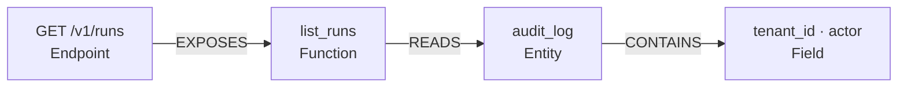

# Design + Plan: Python front-end parity (`Endpoint`, `Entity`, `READS`/`WRITES`)

**Status:** ✅ **COMPLETE.** All three phases shipped — `Endpoint`/`EXPOSES` (SSPN-2,
`pkg/python_routes.py`), `Entity`/`Field`/`REFERENCES` (SSPN-3, `pkg/python_orm.py`), and
`READS`/`WRITES` (SSPN-4). Python went from 4 of 7 node kinds and 4 of 9 edge kinds to
**6 of 7 and 8 of 9** — everything except `Doc`/`MENTIONS`, which belong to doc ingestion and
are no language's to emit.

Measured on this repo: 77 of 77 route handlers carry an inbound `EXPOSES` edge, 7 entities
with 78 columns, and 30 data-access edges. The chain the track existed to build is real:
`GET /v1/runs` --EXPOSES--> `list_runs` --READS--> `audit_log` --CONTAINS--> its columns.

> **One exit criterion is not met and was deliberately left alone: `impact_of` on a route
> handler still returns `[]`.** `FactStore.impact_of` walks `callers_of`, which filters on
> `EdgeKind.CALLS` only — so no `EXPOSES` edge participates, for *any* language. C# and Java
> have emitted endpoints for releases and read the same way. Closing it is a change to shared
> traversal behaviour, not to a front-end, so it belongs in its own ticket.

Python is the PKG's v0 front-end and the only one that is always on — it needs no extra, so
every install has it and most users never load another. It is also the **least capable of the
eight**: it emits 4 of 7 node kinds and 4 of 9 edge kinds. C# emits 6 and 6. This track closes
that gap for the language the graph is most often asked about.

> The framework detection here is **decorator- and class-shaped**, which is to say statically
> readable from the `ast` we already parse. No new dependency, no LLM, no heuristics over
> identifier spelling. The design effort is not in finding the routes — it is in **the
> precision rule** (§4) and in **router-prefix composition** (§5.1), which is a whole-repo
> join no per-file pass can do.

---

## 1. The evidence

Measured on this repo at `eb79c48`, `RepoCodeExtractor().extract(".")`, 1.3s, 0 unparseable
files:

| | Count |
|---|---|
| Nodes / edges | 9,514 / 27,289 |
| `Module` · `Type` · `Function` · `Field` | 957 · 751 · 5,538 · 2,268 |
| **`Endpoint` · `Entity`** | **0 · 0** |
| `IMPORTS` · `CONTAINS` · `CALLS` · `IMPLEMENTS` | 5,950 · 8,255 · 12,831 · 253 |
| **`EXPOSES` · `REFERENCES` · `READS` · `WRITES`** | **0 · 0 · 0 · 0** |

Against a source tree that contains **77 HTTP route decorators** and **7 `__tablename__`
declarations**.

**The consequence is a wrong answer, not a missing one.** Nothing in Python calls an HTTP
handler — the framework does, at runtime, through the decorator. So the graph reports **zero
callers for 75 of the 77 handlers (97%)**:

```
impact_of("py:orchestrator.registry.api.runs.list_runs")  ->  []
```

For a private helper that reads *safe to refactor*. For a public API it is the most dangerous
answer the system can produce: the blast radius is not small, it is **outside the language**,
in every client of `GET /v1/runs`. This is precisely what `sdlc/impact.py` and the code
reviewer consume before a change is approved.

`find("audit_log")` and `find("/v1/runs")` both return nothing. The question *"which endpoints
read the audit_log table?"* is not answered poorly — it is unaskable, because neither endpoint
nor table exists as a node.

---

## 2. How this went unnoticed (and why §6.3 is load-bearing)

Four mechanisms. All four are still active, so any node kind we add next goes dark the same
way unless the last one is fixed.

| # | Mechanism | Where |
|---|---|---|
| 1 | **The gap was engineered to be invisible.** `has_api_surface()` gates the API page on `Endpoint` nodes existing, so a Python service and a routeless library render identically. The docstring names this exact ambiguity and accepts it. | [`renderers.py:1676`](../../src/orchestrator/knowledge/renderers.py) |
| 2 | **The committed artifact states the limitation as a fact about the repo.** `domain-model.md` — for a repo with 7 ORM models — opens "_No database or ORM entities detected, so this is the code's model_". The blind spot wearing the costume of a finding. | [`episteme/domain-model.md`](../../episteme/domain-model.md) |
| 3 | **The invariant checker validates the graph against itself.** All four checks (dangling edges, provenance, phantoms, orphan rates) are intra-graph. A graph missing an entire node kind is perfectly self-consistent; `pkg verify .` returns OK on this repo. | [`verify.py`](../../src/orchestrator/pkg/verify.py) |
| 4 | **Capability is per-language and nothing enforces parity.** `Endpoint` is asserted in `test_java_extractor.py` and `test_csharp_extractor.py`, never for Python. The vocabulary grew past the v0 front-end and nothing pulled it forward. | `tests/pkg/` |

The root cause under all four: **every check asks "is what we asserted true?" and none asks
"is what's true asserted?"** Invariant #7 ("bound honestly") governs aggregation caps — it has
nothing to say about a node kind that is uniformly, silently zero.

---

## 3. Where Python is today, against the other seven

| Front-end | Node kinds | Edge kinds |
|---|---|---|
| **Python** (stdlib, always on) | Module, Type, Function, Field | IMPORTS, CONTAINS, CALLS, IMPLEMENTS |
| Java | + **Endpoint** | + **EXPOSES** |
| C# | + **Endpoint, Entity** | + **EXPOSES, REFERENCES** |
| TypeScript | Module, Type, Function, Field | IMPORTS, CONTAINS, CALLS, IMPLEMENTS |
| C / C++ / Go | Module, Type, Function, Field | + **REFERENCES** (C/C++/Go), IMPLEMENTS (C++/Go) |
| SQL | Module, Function, **Entity** | CONTAINS, CALLS, **READS, WRITES** |

After this track, Python matches C# — the current high-water mark — and adds `READS`/`WRITES`,
which only SQL has today.

---

## 4. The precision rule

The same discipline `_resolve_call` already holds to: **resolve what is literal, skip what is
computed, never guess.** An ambiguous fact in the PKG is worse than an absent one, because
every surface downstream presents it as grounded.

| Emit | Skip |
|---|---|
| Path is a **string literal**, or a concatenation of literals | f-string with a variable; a path held in a name; a path built in a loop |
| `__tablename__` is a **string literal** | `__tablename__` computed from a helper or a `Meta` lookup |
| `ForeignKey("other.col")` with a literal target | `ForeignKey(SomeVar)` |
| Base resolves to `DeclarativeBase` / `models.Model` | anything else |

**Pydantic models, dataclasses, TypedDicts and attrs classes must never become entities.** At
the field level they are indistinguishable from an ORM model; treating them as tables would
flood the data layer with fiction and is the single highest-risk failure mode in this track.
The gate is a real ORM marker, not shape.

---

## 5. Phases

### 5.1 Phase 1 — `Endpoint` + `EXPOSES`

| Framework | Detected from |
|---|---|
| FastAPI / Starlette | `@app.get("/x")`, `@router.post("/x")`, `APIRouter(prefix=…)`, `include_router(r, prefix=…)` |
| Flask | `@app.route("/x", methods=[…])`, `@bp.route(…)`, `Blueprint(…, url_prefix=…)` |
| Django | `urls.py`: `path()`, `re_path()`, `include()` |

Ids mirror the C# scheme exactly so every existing renderer composes for free:

```
py:endpoint:GET /v1/runs      NodeKind.ENDPOINT, name "GET /v1/runs"
py:endpoint:GET /v1/runs  --EXPOSES-->  py:orchestrator.registry.api.runs.list_runs
```

Verb defaults: the decorator verb for FastAPI; `GET` for a Flask `@route` with no `methods=`.

**Router-prefix composition is a whole-repo join.** `include_router(runs.router,
prefix="/v1/runs")` lives in a different file from the `@router.get("")` it re-mounts —
whole-repo knowledge a per-file extractor does not have, exactly like `link_imports`. It goes
in `PythonExtractor.finalize(batch)`, the duck-typed hook `RepoCodeExtractor.extract` already
calls (currently only Go implements it). **Contract: mutate `batch` in place; the return value
is ignored.**

> **Decided: unresolved prefixes still emit.** When prefix resolution fails (a router imported
> through a name the join can't follow), the endpoint is emitted at its *local* path. Dropping it
> would reintroduce the precise false-negative this track exists to kill — a public handler with
> no inbound edge, which `impact_of` then reports as safe to change. A locally-pathed endpoint is
> a partially-known fact; an absent one is a wrong answer. This is settled, not open.

**Exit criteria.**

- On this repo, ≥ 70 of the 77 route handlers carry an inbound `EXPOSES` edge.
- `impact_of` on any route handler returns a non-empty result.
- `render_api_surface` writes an API-surface page for this repo.
- `pkg verify .` reports 0 errors.
- No endpoint is emitted for a route whose path is not a string literal.

### 5.2 Phase 2 — `Entity` + `Field` + `REFERENCES`

| ORM | Table name from | Foreign keys from |
|---|---|---|
| SQLAlchemy declarative | literal `__tablename__` | `ForeignKey("other.col")` |
| Django | `Meta.db_table`, else `app_model` | `ForeignKey(Other)`, `OneToOneField` |

The existing `Type` node stays (`AuditLogRow`); an `Entity` node is added alongside
(`py:entity:audit_log`), matching C#. Because the id is **not** `sql:`-prefixed,
[`link_data_layer`](../../src/orchestrator/pkg/data_layer_link.py) already collapses it onto a
real schema table when the repo has one — no change needed in that pass, and a Python + SQL
repo gets schema-authoritative foreign keys for free.

**Exit criteria.**

- 7 `Entity` nodes on this repo, one per declared `__tablename__`.
- Each `Entity` has its columns as `Field` children, with provenance at the class line.
- `episteme/domain-model.md` stops claiming no database or ORM entities were detected.
- A `ForeignKey` with a literal target yields a `REFERENCES` edge between the two entities.
- No Pydantic model, dataclass, TypedDict or attrs class becomes an `Entity`.

### 5.3 Phase 3 — `READS` / `WRITES` (separate PR)

Narrow and high-precision only: `select(X)` / `insert(X)` / `update(X)` / `delete(X)` where `X`
is a **bare name** resolving to a known ORM class → an edge from the enclosing function to the
`Entity`. That is the dominant SQLAlchemy 2.0 idiom and the one this repo uses
(`select(AuditLogRow)` in `registry/api/runs.py`). Raw `text()` SQL, dynamic table selection
and lazy-loading traversals are skipped.

**Exit criteria.**

- `select(X)` with `X` a bare name bound to an ORM class yields a `READS` edge from the
  enclosing function to that `Entity`.
- `insert(X)` / `update(X)` / `delete(X)` yield a `WRITES` edge on the same terms.
- On this repo, `list_runs` reads `audit_log`.
- No edge is emitted for `text()` SQL or a non-literal table argument.
- `pkg verify .` reports 0 errors.

**Constraints.** Deterministic and no-LLM, stdlib `ast` only, no new dependency. Precision over
recall: a wrong data-access edge is worse than a missing one, because it sends a schema-change
impact query to the wrong callers.

Phases 1–2 deliver the whole value on their own. Phase 3 has the worst precision-per-unit-effort
ratio of the three and should not hold them up.

Together the three phases turn two disconnected islands into one chain:



---

## 6. Cross-cutting work

### 6.1 Cache format version 3 → 4

[`persistence.py:30`](../../src/orchestrator/pkg/persistence.py). The cache is keyed on the
**analyzed** repo's HEAD, so without a bump an unchanged repo serves the endpoint-free graph
forever — the false-negative, now cached. The existing rule in that comment ("bump on any
change that makes previously-emitted facts wrong") is written about wrong facts; this is a
*missing* fact that produces a wrong **answer**, which is the same harm. Bump.

### 6.2 Fingerprint the extractor set into the cache key

`_cache_path` is `sha256(repo_path) + HEAD` today. Installing `tree-sitter-go` after a
clean-tree run silently keeps serving a Go-free graph until HEAD moves. Same line of code, same
failure mode as 6.1 — fix both together.

**Constraints for 6.1 and 6.2.** The fingerprint must be stable across processes and machines —
a hash of the sorted language names, never `id()` or iteration order, or every run would miss the
cache and re-extract. A cache miss must stay cheap: extraction of this repo is ~1.3s, and that is
the ceiling a miss costs. No cache file may ever outlive a format bump.

### 6.3 A source-vs-graph parity check in `verify.py`

**This is the check that would have caught the original gap, and the reason §2 is in this
document.** A new tier-2 check: if the source contains route-decorator syntax for a supported
framework and the graph holds zero `Endpoint` nodes — warn. Same for `__tablename__` versus
`Entity`. `_check_provenance` already receives `root`, so source access is in hand.

Every existing check asks whether the graph is self-consistent. This is the first one that asks
whether the graph is *complete with respect to the source*, which is the only class of check
that can catch a front-end falling behind the vocabulary.

**Constraints.** The check runs on every `pkg verify` invocation, so it must stay a single
bounded pass over the already-walked source — no second full re-parse, and no measurable addition
to the ~1.3s extraction budget. It reports at **warning** severity, never error: a repo may
legitimately have route syntax the front-end has not learned yet, and failing the build for that
would make the check something people disable. Zero false positives on a repo with no routes and
no ORM.

### 6.4 A per-language capability matrix in `KNOWLEDGE_GRAPH.md`

That document presents 7 node kinds and 9 edge kinds as though every front-end emits all of
them. Its silence is part of the cause. Ship §3's table into it.

**Constraints.** The table must be verified against the code, not hand-maintained prose — the
parity test in §7 is what keeps it true, and the doc cites it. Any mermaid added alongside it has
to pass `node scripts/check-mermaid.js`, since our own renderer supports only a subset and a
fallback block is invisible until someone opens the web UI.

---

## 7. Files

| File | Change |
|---|---|
| `pkg/python_frameworks.py` | **new** — decorator + ORM detection; keeps `extractor.py` (609 lines) from growing a second personality |
| `pkg/extractor.py` | call the detector from `PythonExtractor`; add `finalize()` for the prefix join |
| `pkg/persistence.py` | version bump + extractor fingerprint (6.1, 6.2) |
| `pkg/verify.py` | source-vs-graph parity check (6.3) |
| `tests/pkg/test_python_endpoints.py` | **new** — mirrors `test_csharp_extractor.py` |
| `tests/pkg/test_python_entities.py` | **new** — includes the negative cases: Pydantic/dataclass must **not** yield entities |
| `tests/pkg/test_frontend_parity.py` | **new** — asserts the §3 matrix itself, so the next front-end can't quietly fall behind |
| `KNOWLEDGE_GRAPH.md` | capability matrix (6.4) |
| `episteme/` | regenerated |

Nothing here is shared with another live track; `facts.py` is **read-only** for this work — the
vocabulary already has every kind we need, which is the whole point.

---

## 8. Risks

| Risk | Mitigation |
|---|---|
| **Pydantic/dataclass mistaken for an ORM model** — floods the data layer with fiction | §4 gate is a real ORM marker, never field shape. Negative tests are part of phase 2's definition of done. |
| **Django's default table name (`app_model`) is a convention, not a literal** — deriving a fact from a naming rule brushes against invariant #1 | **Decided: derive it.** `Meta.db_table` wins when present; otherwise emit the `app_model` name Django itself will create, so the graph matches the real database rather than going silent on most Django projects. The derivation is deterministic and provenance points at the class line, so the claim stays traceable to source. Settled, not open. |
| **`understand --check` diffs on every Python repo** | Expected — it is the deliverable. The `episteme/` regeneration must land in the same PR as the extractor change, or CI fails on a diff nobody can reproduce. |
| **`has_api_surface` now fires on repos it never did** | Correct behaviour, but it means a new page appears in every Python service's bank. Call it out in the changelog. |
| **Endpoint count inflation from test fixtures** | Route decorators inside `tests/` are real routes in a test app. Keep them; the renderer already separates production from test call-sites. |

---

## 9. Explicitly out of scope

- **The ~48% `CALLS` recall ceiling.** 26,981 call expressions inside functions yield 12,831
  edges: 52.8% bare names (resolved), 35.5% `x.y()` (resolved only for `self`+sibling or an
  imported name), 11.6% attribute chains (dropped by design). Blast radius stays partial after
  this track. The honest interim move — separate from this work — is to make
  `GroundedRetriever.render` state its own recall so a caller knows the list is a floor.
- Rust / Kotlin / Ruby front-ends (see the gap-roadmap's standing decision on language count).
- SQLAlchemy imperative `Table()` mappings and `automap`.
- `READS`/`WRITES` beyond the four literal constructors in §5.3.
- The four-passes divergence across consumers (`load_or_extract` vs `analyse`) — real, and
  measured at 1,640 doc→symbol edges invisible to the MCP and code-review paths, but a
  **separate** track. Endpoint and entity extraction live in the front-end, which every
  consumer already runs, so this work reaches all of them without it.
