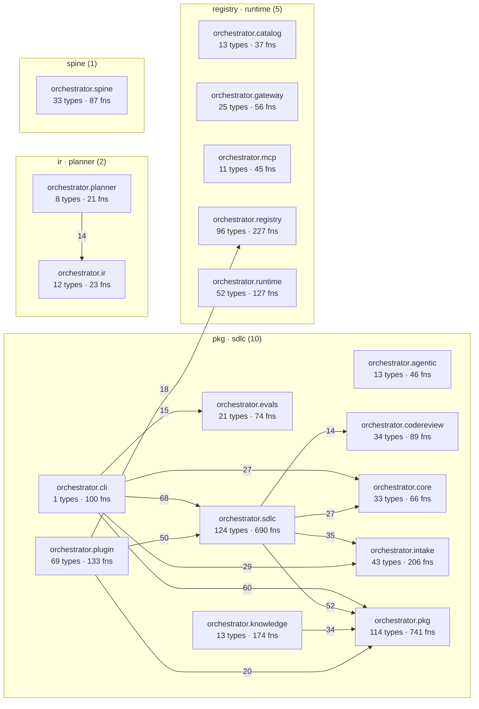

# Architecture
<!-- generated by `orchestrator understand`; the PKG is source of truth, edits here are advisory -->

**Graph size:** 15497 nodes · 43622 edges — 8177 functions · 3346 fields · 1742 docs · 1139 modules · 1014 types · 72 endpoints · 7 entitys.

## Areas
The coarse components — start here, then drill into a module. An area is a module's first two path or namespace segments.

| Area | Zone | Modules | Types | Functions |
|---|---|---|---|---|
| [`orchestrator.pkg`](areas/orchestrator.pkg.md) | orchestrator | 53 | 114 | 453 |
| [`orchestrator.sdlc`](areas/orchestrator.sdlc.md) | orchestrator | 49 | 124 | 381 |
| [`orchestrator.registry`](areas/orchestrator.registry.md) | orchestrator | 50 | 96 | 171 |
| [`orchestrator.plugin`](areas/orchestrator.plugin.md) | orchestrator | 10 | 69 | 88 |
| [`orchestrator.knowledge`](areas/orchestrator.knowledge.md) | orchestrator | 14 | 13 | 142 |
| [`orchestrator.intake`](areas/orchestrator.intake.md) | orchestrator | 22 | 43 | 100 |
| [`orchestrator.runtime`](areas/orchestrator.runtime.md) | orchestrator | 20 | 52 | 45 |
| [`orchestrator.cli`](areas/orchestrator.cli.md) | orchestrator | 11 | 1 | 95 |
| [`orchestrator.core`](areas/orchestrator.core.md) | orchestrator | 16 | 33 | 31 |
| [`orchestrator.codereview`](areas/orchestrator.codereview.md) | orchestrator | 12 | 34 | 25 |
| [`orchestrator.evals`](areas/orchestrator.evals.md) | orchestrator | 12 | 21 | 38 |
| [`orchestrator.spine`](areas/orchestrator.spine.md) | orchestrator | 14 | 33 | 19 |
| [`orchestrator.gateway`](areas/orchestrator.gateway.md) | orchestrator | 19 | 25 | 14 |
| [`orchestrator.catalog`](areas/orchestrator.catalog.md) | orchestrator | 8 | 13 | 25 |
| [`orchestrator.mcp`](areas/orchestrator.mcp.md) | orchestrator | 10 | 11 | 25 |
| [`orchestrator.agentic`](areas/orchestrator.agentic.md) | orchestrator | 8 | 13 | 16 |
| [`scripts.docs_audit`](areas/scripts.docs_audit.md) | scripts | 1 | 0 | 24 |
| [`orchestrator.launch`](areas/orchestrator.launch.md) | orchestrator | 1 | 2 | 17 |
| [`scripts.sdlc_shapes`](areas/scripts.sdlc_shapes.md) | scripts | 1 | 2 | 17 |
| [`orchestrator.planner`](areas/orchestrator.planner.md) | orchestrator | 3 | 8 | 10 |
| [`orchestrator.temporal`](areas/orchestrator.temporal.md) | orchestrator | 6 | 7 | 11 |
| [`scripts.render_knowledge_foundation_svg`](areas/scripts.render_knowledge_foundation_svg.md) | scripts | 1 | 2 | 14 |
| [`orchestrator.personas`](areas/orchestrator.personas.md) | orchestrator | 5 | 5 | 10 |
| [`scripts.codegen_benchmark`](areas/scripts.codegen_benchmark.md) | scripts | 1 | 1 | 14 |
| [`migrations.versions`](areas/migrations.versions.md) | migrations | 6 | 0 | 14 |

## Public surface
_Split by each language's own rule — a leading underscore._

**2390 public** symbols · **1644 internal**, of 4034. Most of this codebase is machinery you don't need to read to use it.

Most-depended-upon public symbols: [`Provenance`](../src/orchestrator/pkg/facts.py#L81), [`Edge`](../src/orchestrator/pkg/facts.py#L137), [`Node`](../src/orchestrator/pkg/facts.py#L121), [`Failure`](../src/orchestrator/plugin/outputs.py#L38), [`TargetLayout`](../src/orchestrator/sdlc/layout.py#L80), [`LLMCodegenAdapter`](../src/orchestrator/sdlc/codegen.py#L866), [`FactBatch`](../src/orchestrator/pkg/facts.py#L150), [`RepoCodeExtractor`](../src/orchestrator/pkg/extractor.py#L619), [`load_local_env`](../src/orchestrator/core/env.py#L20), [`FactStore`](../src/orchestrator/pkg/store.py#L25), [`TestRunResult`](../src/orchestrator/sdlc/testrunner.py#L78), [`GroundingVerifier`](../src/orchestrator/pkg/verifier.py#L52), [`map_repo`](../src/orchestrator/plugin/server.py#L407), [`RunContext`](../src/orchestrator/sdlc/autorun.py#L65), [`regression_gaps`](../src/orchestrator/plugin/server.py#L700), +2375 more

## Import cycles
_Groups of modules that depend on each other, directly or through a chain. Each is a place the layering doesn't hold — and a hazard for import order._

- 9 modules: `orchestrator.pkg.c_extractor` ↔ `orchestrator.pkg.cpp_extractor` ↔ `orchestrator.pkg.csharp_extractor` ↔ `orchestrator.pkg.extractor` ↔ `orchestrator.pkg.java_extractor` ↔ `orchestrator.pkg.perl_extractor`, +3 more
- 4 modules: `orchestrator.knowledge.analysis` ↔ `orchestrator.knowledge.current_state` ↔ `orchestrator.knowledge.insights` ↔ `orchestrator.knowledge.renderers`
- 3 modules: `orchestrator.sdlc.php` ↔ `orchestrator.sdlc.preflight` ↔ `orchestrator.sdlc.testrunner`
- 2 modules: `orchestrator.agentic.codegen_tools` ↔ `orchestrator.sdlc.codegen`

## System architecture
The top components grouped by zone; arrows run in the direction of the dependency, weighted by how many imports back them.

### Strongest component dependencies

| From | → | To | Strength |
|---|---|---|---|
| `tests.sdlc` | → | `orchestrator.sdlc` | 483 |
| `tests.pkg` | → | `orchestrator.pkg` | 336 |
| `tests.plugin` | → | `orchestrator.plugin` | 154 |
| `tests.intake` | → | `orchestrator.intake` | 148 |
| `tests.registry` | → | `orchestrator.registry` | 122 |
| `tests.sdlc` | → | `orchestrator.pkg` | 82 |
| `tests.knowledge` | → | `orchestrator.knowledge` | 77 |
| `orchestrator.cli` | → | `orchestrator.sdlc` | 68 |
| `tests.codereview` | → | `orchestrator.codereview` | 62 |
| `orchestrator.cli` | → | `orchestrator.pkg` | 60 |

## Layers
Types bucketed by role, inferred from naming conventions — a rough shape of the codebase, not a declared architecture.

| Layer | Types |
|---|---|
| Other | 924 |
| Data shapes (VM/DTO/model) | 44 |
| Business logic | 29 |
| Data access | 6 |
| Interfaces / contracts | 3 |
| App wiring / infra | 1 |

## Complexity
_How big the types are, and which are biggest._

Size distribution: **872** 1-10 · **71** >10 · **57** marker · **6** >25 · **1** god (>40)

| Largest type | Members | Defined at |
|---|---|---|
| `LLMCodegenAdapter` | 53 | `src/orchestrator/sdlc/codegen.py:866` |
| `CurrentState` | 36 | `src/orchestrator/knowledge/current_state.py:118` |
| `RunContext` | 33 | `src/orchestrator/sdlc/autorun.py:65` |
| `SDLCActivities` | 30 | `src/orchestrator/sdlc/activities.py:44` |
| `FactStore` | 28 | `src/orchestrator/pkg/store.py:25` |
| `PythonExtractor` | 26 | `src/orchestrator/pkg/extractor.py:157` |
| `PerlExtractor` | 26 | `src/orchestrator/pkg/perl_extractor.py:360` |
| `ApprovalRequestRow` | 22 | `src/orchestrator/registry/db/models.py:127` |
| `LineageIndex` | 22 | `src/orchestrator/spine/lineage.py:95` |
| `AgentLoop` | 21 | `src/orchestrator/agentic/loop.py:197` |

## Test coverage
_Which components the test suite reaches, by test→source imports. Presence, not line coverage._

**27 of 54 components** are imported by at least one test.

Largest components no test imports: `scripts.render_knowledge_foundation_svg` (2 types), `scripts.sdlc_shapes` (2 types), `scripts.codegen_benchmark` (1 type), `scripts.render_architecture_svg` (1 type), `scripts.roadmap-status` (1 type).

## Documentation
_The repo's own prose folded into the graph (`Doc` nodes + `MENTIONS` edges). A mention counts only when it binds to exactly one symbol, so this under-counts rather than guesses._

**1742 docs** ingested, naming **951 of 9671 symbols** (10% doc coverage).

**1070 potential drift** — the docs name code the graph doesn't have (renamed or removed symbols, or prose the binder can't resolve).

| The docs claim… | …in |
|---|---|
| `mk_accessors` | CHANGELOG.md |
| `__PACKAGE__` | CHANGELOG.md |
| `belongs_to` | CHANGELOG.md |
| `has_many` | CHANGELOG.md |
| `might_have` | CHANGELOG.md |
| `exporter_default` | CHANGELOG.md |
| `has_one` | CHANGELOG.md |
| `workflow_call` | CHANGELOG.md |
| … | _+1062 more_ |

## Possibly unused
_**157 of 1464 internal symbols** have no caller, subclass or doc reference in the graph. **Candidates, not verdicts**: calls through an attribute chain are skipped rather than guessed at, and dynamic dispatch, registries and reflection are invisible. Public symbols are excluded — having no in-repo caller is what being an API looks like._

[`Status`](../src/orchestrator/registry/_common.py#L42), [`_CFamily`](../src/orchestrator/pkg/scope.py#L410), [`_CSharp`](../src/orchestrator/pkg/scope.py#L318), [`_Choice`](../src/orchestrator/planner/v0.py#L42), [`_Go`](../src/orchestrator/pkg/scope.py#L287), [`_InferredGlossaryEntry`](../src/orchestrator/planner/v1.py#L53), [`_Lang`](../src/orchestrator/pkg/scope.py#L121), [`_ManagerSpecialistChoice`](../src/orchestrator/planner/v1.py#L47), [`_Plan`](../src/orchestrator/planner/v1.py#L60), [`_SpineGroup`](../src/orchestrator/cli/_app.py#L67), [`_State`](../src/orchestrator/obs/tracing.py#L40), [`_StepChoice`](../src/orchestrator/planner/v1.py#L40), [`_TypeRecLike`](../src/orchestrator/pkg/perl_orm.py#L42), [`_TypeScript`](../src/orchestrator/pkg/scope.py#L239), [`_Wrapped`](../src/orchestrator/gateway/handlers.py#L62), [`_add`](../src/orchestrator/pkg/docs.py#L178), [`_add`](../src/orchestrator/pkg/media_extract.py#L224), [`_api_surface`](../src/orchestrator/agentic/tools.py#L34), [`_approval_points_reference_known_nodes`](../src/orchestrator/ir/graph.py#L145), [`_audit`](../src/orchestrator/codereview/webhook.py#L197), +137 more

## Module map (top 25 by members)
The biggest first-party modules — where the code lives. Tests are excluded; each opens its page (or its source, if it has no page).

- [`orchestrator.plugin.server`](modules/orchestrator.plugin.server.md) — 2 types, 64 functions
- [`orchestrator.plugin.outputs`](modules/orchestrator.plugin.outputs.md) — 61 types, 2 functions
- [`orchestrator.knowledge.renderers`](modules/orchestrator.knowledge.renderers.md) — 4 types, 52 functions
- [`orchestrator.sdlc.codegen`](modules/orchestrator.sdlc.codegen.md) — 8 types, 30 functions
- [`orchestrator.sdlc.layout`](modules/orchestrator.sdlc.layout.md) — 1 types, 37 functions
- [`orchestrator.sdlc.builddoc`](modules/orchestrator.sdlc.builddoc.md) — 3 types, 31 functions
- [`orchestrator.sdlc.testenv`](modules/orchestrator.sdlc.testenv.md) — 10 types, 24 functions
- [`orchestrator.pkg.csharp_extractor`](modules/orchestrator.pkg.csharp_extractor.md) — 2 types, 26 functions
- [`orchestrator.knowledge.current_state`](modules/orchestrator.knowledge.current_state.md) — 1 types, 26 functions
- [`orchestrator.pkg.accuracy`](modules/orchestrator.pkg.accuracy.md) — 7 types, 20 functions
- [`orchestrator.pkg.php_routes`](modules/orchestrator.pkg.php_routes.md) — 1 types, 25 functions
- [`orchestrator.cli.registry`](modules/orchestrator.cli.registry.md) — 0 types, 25 functions
- [`scripts.docs_audit`](modules/scripts.docs_audit.md) — 0 types, 24 functions
- [`orchestrator.pkg.php_extractor`](modules/orchestrator.pkg.php_extractor.md) — 2 types, 21 functions
- [`orchestrator.sdlc.autorun`](modules/orchestrator.sdlc.autorun.md) — 3 types, 20 functions
- [`orchestrator.sdlc.feature_runner`](modules/orchestrator.sdlc.feature_runner.md) — 2 types, 21 functions
- [`orchestrator.registry.api.capabilities`](modules/orchestrator.registry.api.capabilities.md) — 11 types, 11 functions
- [`orchestrator.cli.pkg`](modules/orchestrator.cli.pkg.md) — 0 types, 20 functions
- [`orchestrator.knowledge.report_html`](modules/orchestrator.knowledge.report_html.md) — 0 types, 20 functions
- [`orchestrator.pkg.perl_extractor`](modules/orchestrator.pkg.perl_extractor.md) — 4 types, 16 functions
- [`orchestrator.pkg.typescript_extractor`](modules/orchestrator.pkg.typescript_extractor.md) — 2 types, 18 functions
- [`orchestrator.cli.sdlc`](modules/orchestrator.cli.sdlc.md) — 0 types, 19 functions
- [`orchestrator.launch`](modules/orchestrator.launch.md) — 2 types, 17 functions
- [`orchestrator.pkg.c_extractor`](modules/orchestrator.pkg.c_extractor.md) — 1 types, 18 functions
- [`orchestrator.pkg.persistence`](modules/orchestrator.pkg.persistence.md) — 3 types, 16 functions

_Showing the 25 biggest of 358 first-party modules._

## Call hotspots (most-called functions)
The most-depended-on functions: what breaks the most if you change it. Each links to its definition and to its direct callers; **reaches** is the transitive blast radius — every symbol a change here can touch.

- [`_print`](../src/orchestrator/cli/_common.py#L34) — 36 production call-sites · **reaches 48 symbols** (≤2 hops)
  - called by [`_comprehension_oracle`](../src/orchestrator/cli/pkg.py#L445), [`_deprecate`](../src/orchestrator/cli/registry.py#L70), [`_drift_oracle`](../src/orchestrator/cli/pkg.py#L585), [`_invention_oracle`](../src/orchestrator/cli/pkg.py#L627), [`_joins_check`](../src/orchestrator/cli/pkg.py#L198), +27 more
- [`load_local_env`](../src/orchestrator/core/env.py#L20) — 34 production · 6 test call-sites · **reaches 168 symbols** (≤4 hops)
  - called by [`_go`](../src/orchestrator/cli/sdlc.py#L714), [`_lifespan`](../src/orchestrator/intake/web/app.py#L127), [`_main`](../scripts/intents_to_confluence.py#L102), [`_main`](../scripts/live_github_auth.py#L21), [`_main`](../scripts/live_review.py#L32), +34 more
- [`_text`](../src/orchestrator/pkg/php_names.py#L26) — 33 production call-sites · **reaches 27 symbols** (≤3 hops)
  - called by [`_base_type_names`](../src/orchestrator/pkg/php_extractor.py#L825), [`_const_names`](../src/orchestrator/pkg/php_extractor.py#L843), [`_field_text`](../src/orchestrator/pkg/php_extractor.py#L951), [`_interface_names`](../src/orchestrator/pkg/php_extractor.py#L832), [`_is_this_property`](../src/orchestrator/pkg/php_extractor.py#L746), +12 more
- [`_e`](../src/orchestrator/knowledge/report_html.py#L44) — 26 production call-sites · **reaches 33 symbols** (≤3 hops)
  - called by [`_activity_section`](../src/orchestrator/knowledge/report_html.py#L327), [`_architecture_section`](../src/orchestrator/knowledge/report_html.py#L100), [`_blast_coverage`](../src/orchestrator/knowledge/report_html.py#L220), [`_blast_radius_section`](../src/orchestrator/knowledge/report_html.py#L166), [`_coverage_section`](../src/orchestrator/knowledge/report_html.py#L257), +10 more
- [`_audit`](../src/orchestrator/sdlc/workflows.py#L911) — 21 production call-sites · **reaches 1 symbols** (≤1 hop)
  - called by [`run`](../src/orchestrator/sdlc/workflows.py#L516)
- [`_first_named_of_type`](../src/orchestrator/pkg/perl_extractor.py#L157) — 21 production call-sites · **reaches 23 symbols** (≤3 hops)
  - called by [`_collect_local_constructor_types`](../src/orchestrator/pkg/perl_extractor.py#L1065), [`_handle_assignment`](../src/orchestrator/pkg/perl_extractor.py#L650), [`_handle_bareword_call`](../src/orchestrator/pkg/perl_extractor.py#L605), [`_handle_class_accessor_call`](../src/orchestrator/pkg/perl_extractor.py#L684), [`_handle_class_isa_attribute`](../src/orchestrator/pkg/perl_extractor.py#L505), +9 more
- [`_text`](../src/orchestrator/pkg/typescript_extractor.py#L735) — 20 production call-sites · **reaches 15 symbols** (≤2 hops)
  - called by [`_calls`](../src/orchestrator/pkg/typescript_extractor.py#L369), [`_defer_member_call`](../src/orchestrator/pkg/typescript_extractor.py#L475), [`_field_text`](../src/orchestrator/pkg/typescript_extractor.py#L730), [`_imported_locals`](../src/orchestrator/pkg/typescript_extractor.py#L663), [`_imports`](../src/orchestrator/pkg/typescript_extractor.py#L157), +4 more
- [`_text`](../src/orchestrator/pkg/c_extractor.py#L491) — 19 production call-sites · **reaches 33 symbols** (≤3 hops)
  - called by [`_calls`](../src/orchestrator/pkg/cpp_extractor.py#L287), [`_calls_in`](../src/orchestrator/pkg/c_extractor.py#L392), [`_declarator_name`](../src/orchestrator/pkg/c_extractor.py#L418), [`_declared_name`](../src/orchestrator/pkg/cpp_extractor.py#L364), [`_declared_names`](../src/orchestrator/pkg/c_extractor.py#L432), +11 more
- [`_text`](../src/orchestrator/pkg/perl_extractor.py#L151) — 19 production call-sites · **reaches 21 symbols** (≤3 hops)
  - called by [`_handle_assignment`](../src/orchestrator/pkg/perl_extractor.py#L650), [`_handle_bareword_call`](../src/orchestrator/pkg/perl_extractor.py#L605), [`_handle_class_accessor_call`](../src/orchestrator/pkg/perl_extractor.py#L684), [`_handle_class_isa_attribute`](../src/orchestrator/pkg/perl_extractor.py#L505), [`_handle_package`](../src/orchestrator/pkg/perl_extractor.py#L465), +9 more
- [`_doc`](../src/orchestrator/knowledge/renderers.py#L114) — 17 production call-sites · **reaches 99 symbols** (≤4 hops)
  - called by [`_core_types_page`](../src/orchestrator/knowledge/renderers.py#L1050), [`render_api_surface`](../src/orchestrator/knowledge/renderers.py#L1681), [`render_architecture`](../src/orchestrator/knowledge/renderers.py#L1256), [`render_area_page`](../src/orchestrator/knowledge/renderers.py#L837), [`render_conventions`](../src/orchestrator/knowledge/renderers.py#L1541), +8 more
