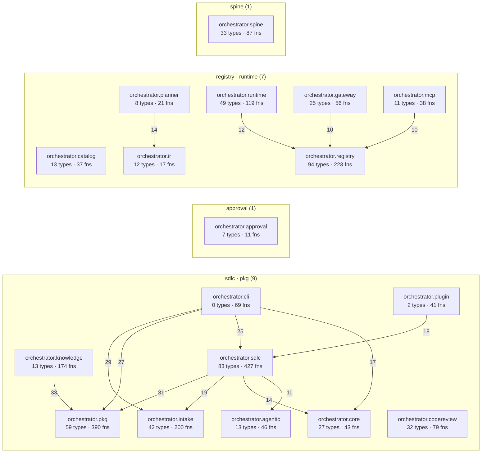

# Architecture
<!-- generated by `orchestrator understand`; the PKG is source of truth, edits here are advisory -->

**Graph size:** 10791 nodes · 29763 edges — 5725 functions · 2292 fields · 980 docs · 966 modules · 757 types · 71 endpoints.

## Areas
The coarse components — start here, then drill into a module. An area is a module's first two path or namespace segments.

| Area | Zone | Modules | Types | Functions |
|---|---|---|---|---|
| [`orchestrator.pkg`](areas/orchestrator.pkg.md) | orchestrator | 32 | 59 | 221 |
| [`orchestrator.sdlc`](areas/orchestrator.sdlc.md) | orchestrator | 32 | 83 | 197 |
| [`orchestrator.registry`](areas/orchestrator.registry.md) | orchestrator | 50 | 94 | 170 |
| [`orchestrator.knowledge`](areas/orchestrator.knowledge.md) | orchestrator | 14 | 13 | 142 |
| [`orchestrator.intake`](areas/orchestrator.intake.md) | orchestrator | 21 | 42 | 95 |
| [`orchestrator.runtime`](areas/orchestrator.runtime.md) | orchestrator | 19 | 49 | 44 |
| [`orchestrator.cli`](areas/orchestrator.cli.md) | orchestrator | 1 | 0 | 67 |
| [`orchestrator.codereview`](areas/orchestrator.codereview.md) | orchestrator | 11 | 32 | 22 |
| [`orchestrator.spine`](areas/orchestrator.spine.md) | orchestrator | 14 | 33 | 19 |
| [`orchestrator.core`](areas/orchestrator.core.md) | orchestrator | 12 | 27 | 14 |
| [`orchestrator.gateway`](areas/orchestrator.gateway.md) | orchestrator | 19 | 25 | 14 |
| [`orchestrator.catalog`](areas/orchestrator.catalog.md) | orchestrator | 8 | 13 | 25 |
| [`orchestrator.plugin`](areas/orchestrator.plugin.md) | orchestrator | 4 | 2 | 30 |
| [`orchestrator.evals`](areas/orchestrator.evals.md) | orchestrator | 7 | 7 | 23 |
| [`orchestrator.mcp`](areas/orchestrator.mcp.md) | orchestrator | 9 | 11 | 19 |
| [`orchestrator.agentic`](areas/orchestrator.agentic.md) | orchestrator | 8 | 13 | 16 |
| [`orchestrator.launch`](areas/orchestrator.launch.md) | orchestrator | 1 | 2 | 17 |
| [`orchestrator.planner`](areas/orchestrator.planner.md) | orchestrator | 3 | 8 | 10 |
| [`orchestrator.temporal`](areas/orchestrator.temporal.md) | orchestrator | 6 | 7 | 11 |
| [`orchestrator.personas`](areas/orchestrator.personas.md) | orchestrator | 5 | 5 | 10 |
| [`migrations.versions`](areas/migrations.versions.md) | migrations | 6 | 0 | 14 |
| [`orchestrator.ir`](areas/orchestrator.ir.md) | orchestrator | 3 | 12 | 2 |
| [`orchestrator.obs`](areas/orchestrator.obs.md) | orchestrator | 2 | 2 | 11 |
| [`orchestrator.approval`](areas/orchestrator.approval.md) | orchestrator | 3 | 7 | 4 |
| [`scripts.codegen_benchmark`](areas/scripts.codegen_benchmark.md) | scripts | 1 | 1 | 10 |

## Public surface
_Split by each language's own rule — a leading underscore._

**1739 public** symbols · **1151 internal**, of 2890. Most of this codebase is machinery you don't need to read to use it.

Most-depended-upon public symbols: [`Provenance`](../src/orchestrator/pkg/facts.py#L58), [`Edge`](../src/orchestrator/pkg/facts.py#L86), [`Node`](../src/orchestrator/pkg/facts.py#L70), [`TargetLayout`](../src/orchestrator/sdlc/layout.py#L79), [`LLMCodegenAdapter`](../src/orchestrator/sdlc/codegen.py#L650), [`load_local_env`](../src/orchestrator/core/env.py#L20), [`TestRunResult`](../src/orchestrator/sdlc/testrunner.py#L78), [`CurrentState`](../src/orchestrator/knowledge/current_state.py#L118), [`AuditLogRepo`](../src/orchestrator/registry/repositories.py#L161), [`PlannerError`](../src/orchestrator/planner/v0.py#L38), [`FactBatch`](../src/orchestrator/pkg/facts.py#L99), [`SDLCWorkflow`](../src/orchestrator/sdlc/workflows.py#L475), [`GroundingVerifier`](../src/orchestrator/pkg/verifier.py#L42), [`VerifierFailure`](../src/orchestrator/runtime/verifiers/base.py#L35), [`FactStore`](../src/orchestrator/pkg/store.py#L24), +1724 more

## Import cycles
_Groups of modules that depend on each other, directly or through a chain. Each is a place the layering doesn't hold — and a hazard for import order._

- 7 modules: `orchestrator.pkg.c_extractor` ↔ `orchestrator.pkg.cpp_extractor` ↔ `orchestrator.pkg.csharp_extractor` ↔ `orchestrator.pkg.extractor` ↔ `orchestrator.pkg.java_extractor` ↔ `orchestrator.pkg.sql_extractor`, +1 more
- 4 modules: `orchestrator.knowledge.analysis` ↔ `orchestrator.knowledge.current_state` ↔ `orchestrator.knowledge.insights` ↔ `orchestrator.knowledge.renderers`
- 2 modules: `orchestrator.agentic.codegen_tools` ↔ `orchestrator.sdlc.codegen`

## System architecture
The top components grouped by zone; arrows run in the direction of the dependency, weighted by how many imports back them.

### Strongest component dependencies

| From | → | To | Strength |
|---|---|---|---|
| `tests.sdlc` | → | `orchestrator.sdlc` | 237 |
| `tests.pkg` | → | `orchestrator.pkg` | 165 |
| `tests.intake` | → | `orchestrator.intake` | 132 |
| `tests.registry` | → | `orchestrator.registry` | 119 |
| `tests.knowledge` | → | `orchestrator.knowledge` | 77 |
| `tests.runtime` | → | `orchestrator.runtime` | 55 |
| `tests.integration` | → | `orchestrator.registry` | 54 |
| `tests.runtime` | → | `orchestrator.registry` | 52 |
| `tests.codereview` | → | `orchestrator.codereview` | 47 |
| `tests.knowledge` | → | `orchestrator.pkg` | 47 |

## Layers
Types bucketed by role, inferred from naming conventions — a rough shape of the codebase, not a declared architecture.

| Layer | Types |
|---|---|
| Other | 676 |
| Data shapes (VM/DTO/model) | 43 |
| Business logic | 26 |
| Data access | 5 |
| Interfaces / contracts | 3 |
| App wiring / infra | 1 |

## Complexity
_How big the types are, and which are biggest._

Size distribution: **656** 1-10 · **54** >10 · **41** marker · **2** >25 · **1** god (>40)

| Largest type | Members | Defined at |
|---|---|---|
| `LLMCodegenAdapter` | 47 | `src/orchestrator/sdlc/codegen.py:650` |
| `CurrentState` | 36 | `src/orchestrator/knowledge/current_state.py:118` |
| `SDLCActivities` | 30 | `src/orchestrator/sdlc/activities.py:44` |
| `PythonExtractor` | 23 | `src/orchestrator/pkg/extractor.py:145` |
| `FactStore` | 23 | `src/orchestrator/pkg/store.py:24` |
| `ApprovalRequestRow` | 22 | `src/orchestrator/registry/db/models.py:127` |
| `LineageIndex` | 22 | `src/orchestrator/spine/lineage.py:95` |
| `AgentLoop` | 21 | `src/orchestrator/agentic/loop.py:197` |
| `ApprovalRequest` | 21 | `src/orchestrator/approval/models.py:71` |
| `JiraAdapter` | 19 | `src/orchestrator/intake/jira.py:114` |

## Test coverage
_Which components the test suite reaches, by test→source imports. Presence, not line coverage._

**28 of 42 components** are imported by at least one test.

Largest components no test imports: `scripts.codegen_benchmark` (1 type).

## Documentation
_The repo's own prose folded into the graph (`Doc` nodes + `MENTIONS` edges). A mention counts only when it binds to exactly one symbol, so this under-counts rather than guesses._

**980 docs** ingested, naming **481 of 6752 symbols** (7% doc coverage).

**609 potential drift** — the docs name code the graph doesn't have (renamed or removed symbols, or prose the binder can't resolve).

| The docs claim… | …in |
|---|---|
| `isLast` | CHANGELOG.md |
| `nextPageToken` | CHANGELOG.md |
| `fields.issuetype` | CHANGELOG.md |
| `browse_url` | CHANGELOG.md |
| `Protocol` | CHANGELOG.md |
| `javax.ws.rs` | CHANGELOG.md |
| `jakarta.ws.rs` | CHANGELOG.md |
| `click.core` | CHANGELOG.md |
| … | _+601 more_ |

## Possibly unused
_**113 of 994 internal symbols** have no caller, subclass or doc reference in the graph. **Candidates, not verdicts**: calls through an attribute chain are skipped rather than guessed at, and dynamic dispatch, registries and reflection are invisible. Public symbols are excluded — having no in-repo caller is what being an API looks like._

[`Status`](../src/orchestrator/registry/_common.py#L42), [`_Choice`](../src/orchestrator/planner/v0.py#L42), [`_InferredGlossaryEntry`](../src/orchestrator/planner/v1.py#L53), [`_ManagerSpecialistChoice`](../src/orchestrator/planner/v1.py#L47), [`_Plan`](../src/orchestrator/planner/v1.py#L60), [`_State`](../src/orchestrator/obs/tracing.py#L40), [`_StepChoice`](../src/orchestrator/planner/v1.py#L40), [`_Wrapped`](../src/orchestrator/gateway/handlers.py#L62), [`_add`](../src/orchestrator/pkg/docs.py#L107), [`_add`](../src/orchestrator/pkg/media_extract.py#L224), [`_api_surface`](../src/orchestrator/agentic/tools.py#L34), [`_approval_points_reference_known_nodes`](../src/orchestrator/ir/graph.py#L140), [`_audit`](../src/orchestrator/codereview/webhook.py#L197), [`_audit_is_mandatory`](../src/orchestrator/registry/tool_contract.py#L73), [`_blast_radius`](../src/orchestrator/agentic/tools.py#L49), [`_build`](../src/orchestrator/sdlc/activities.py#L315), [`_callers_of`](../src/orchestrator/agentic/tools.py#L38), [`_cell`](../src/orchestrator/knowledge/renderers.py#L1413), [`_changes_dir`](../src/orchestrator/intake/openspec_source.py#L187), [`_coerce_state`](../src/orchestrator/approval/repository.py#L217), +93 more

## Module map (top 25 by members)
The biggest first-party modules — where the code lives. Tests are excluded; each opens its page (or its source, if it has no page).

- [`orchestrator.cli`](modules/orchestrator.cli.md) — 0 types, 67 functions
- [`orchestrator.knowledge.renderers`](modules/orchestrator.knowledge.renderers.md) — 4 types, 52 functions
- [`orchestrator.sdlc.layout`](modules/orchestrator.sdlc.layout.md) — 1 types, 35 functions
- [`orchestrator.sdlc.testenv`](modules/orchestrator.sdlc.testenv.md) — 9 types, 22 functions
- [`orchestrator.knowledge.current_state`](modules/orchestrator.knowledge.current_state.md) — 1 types, 26 functions
- [`orchestrator.pkg.csharp_extractor`](modules/orchestrator.pkg.csharp_extractor.md) — 2 types, 25 functions
- [`orchestrator.plugin.server`](modules/orchestrator.plugin.server.md) — 0 types, 26 functions
- [`orchestrator.registry.api.capabilities`](modules/orchestrator.registry.api.capabilities.md) — 11 types, 11 functions
- [`orchestrator.sdlc.codegen`](modules/orchestrator.sdlc.codegen.md) — 8 types, 13 functions
- [`orchestrator.knowledge.report_html`](modules/orchestrator.knowledge.report_html.md) — 0 types, 20 functions
- [`orchestrator.launch`](modules/orchestrator.launch.md) — 2 types, 17 functions
- [`orchestrator.sdlc.testrunner`](modules/orchestrator.sdlc.testrunner.md) — 12 types, 6 functions
- [`orchestrator.pkg.c_extractor`](modules/orchestrator.pkg.c_extractor.md) — 1 types, 16 functions
- [`orchestrator.pkg.doc_source`](modules/orchestrator.pkg.doc_source.md) — 2 types, 15 functions
- [`orchestrator.pkg.java_extractor`](modules/orchestrator.pkg.java_extractor.md) — 2 types, 14 functions
- [`orchestrator.registry.api.workspace`](modules/orchestrator.registry.api.workspace.md) — 3 types, 13 functions
- [`orchestrator.intake.factory`](modules/orchestrator.intake.factory.md) — 1 types, 13 functions
- [`orchestrator.sdlc.worker`](modules/orchestrator.sdlc.worker.md) — 0 types, 14 functions
- [`orchestrator.obs.tracing`](modules/orchestrator.obs.tracing.md) — 2 types, 11 functions
- [`orchestrator.pkg.media_extract`](modules/orchestrator.pkg.media_extract.md) — 3 types, 10 functions
- [`orchestrator.pkg.persistence`](modules/orchestrator.pkg.persistence.md) — 1 types, 12 functions
- [`orchestrator.pkg.python_routes`](modules/orchestrator.pkg.python_routes.md) — 2 types, 11 functions
- [`orchestrator.pkg.sql_extractor`](modules/orchestrator.pkg.sql_extractor.md) — 2 types, 11 functions
- [`orchestrator.planner.v1`](modules/orchestrator.planner.v1.md) — 5 types, 8 functions
- [`orchestrator.registry.api.connections`](modules/orchestrator.registry.api.connections.md) — 5 types, 8 functions

_Showing the 25 biggest of 281 first-party modules._

## Call hotspots (most-called functions)
The most-depended-on functions: what breaks the most if you change it. Each links to its definition and to its direct callers; **reaches** is the transitive blast radius — every symbol a change here can touch.

- [`load_local_env`](../src/orchestrator/core/env.py#L20) — 28 production · 6 test call-sites · **reaches 72 symbols** (≤3 hops)
  - called by [`_lifespan`](../src/orchestrator/intake/web/app.py#L124), [`_main`](../scripts/intents_to_confluence.py#L102), [`_main`](../scripts/live_github_auth.py#L21), [`_main`](../scripts/live_review.py#L32), [`_run_address_review`](../src/orchestrator/cli.py#L613), +28 more
- [`_e`](../src/orchestrator/knowledge/report_html.py#L44) — 26 production call-sites · **reaches 33 symbols** (≤3 hops)
  - called by [`_activity_section`](../src/orchestrator/knowledge/report_html.py#L327), [`_architecture_section`](../src/orchestrator/knowledge/report_html.py#L100), [`_blast_coverage`](../src/orchestrator/knowledge/report_html.py#L220), [`_blast_radius_section`](../src/orchestrator/knowledge/report_html.py#L166), [`_coverage_section`](../src/orchestrator/knowledge/report_html.py#L257), +10 more
- [`_print`](../src/orchestrator/cli.py#L78) — 23 production call-sites · **reaches 36 symbols** (≤2 hops)
  - called by [`_deprecate`](../src/orchestrator/cli.py#L151), [`_list`](../src/orchestrator/cli.py#L130), [`_publish`](../src/orchestrator/cli.py#L146), [`_register`](../src/orchestrator/cli.py#L124), [`_run_address_review`](../src/orchestrator/cli.py#L613), +16 more
- [`_audit`](../src/orchestrator/sdlc/workflows.py#L911) — 21 production call-sites · **reaches 1 symbols** (≤1 hop)
  - called by [`run`](../src/orchestrator/sdlc/workflows.py#L516)
- [`_doc`](../src/orchestrator/knowledge/renderers.py#L114) — 17 production call-sites · **reaches 98 symbols** (≤4 hops)
  - called by [`_core_types_page`](../src/orchestrator/knowledge/renderers.py#L1050), [`render_api_surface`](../src/orchestrator/knowledge/renderers.py#L1681), [`render_architecture`](../src/orchestrator/knowledge/renderers.py#L1256), [`render_area_page`](../src/orchestrator/knowledge/renderers.py#L837), [`render_conventions`](../src/orchestrator/knowledge/renderers.py#L1541), +8 more
- [`_link`](../src/orchestrator/knowledge/renderers.py#L179) — 17 production call-sites · **reaches 101 symbols** (≤4 hops)
  - called by [`_api_split_block`](../src/orchestrator/knowledge/renderers.py#L1119), [`_caller_line`](../src/orchestrator/knowledge/renderers.py#L198), [`_core_types_page`](../src/orchestrator/knowledge/renderers.py#L1050), [`_dead_code_block`](../src/orchestrator/knowledge/renderers.py#L1193), [`_map_link`](../src/orchestrator/knowledge/renderers.py#L1312), +11 more
- [`page_shell`](../src/orchestrator/registry/api/web/shell.py#L84) — 16 production · 3 test call-sites · **reaches 26 symbols** (≤2 hops)
  - called by [`_html_page`](../src/orchestrator/registry/api/trace.py#L228), [`_page`](../src/orchestrator/registry/api/web/intelligence.py#L50), [`advanced_page`](../src/orchestrator/registry/api/web/advanced.py#L22), [`audit_page`](../src/orchestrator/registry/api/web/governance.py#L21), [`backlog_page`](../src/orchestrator/registry/api/backlog.py#L43), +14 more
- [`_text`](../src/orchestrator/pkg/c_extractor.py#L433) — 16 production call-sites · **reaches 29 symbols** (≤3 hops)
  - called by [`_calls_in`](../src/orchestrator/pkg/c_extractor.py#L334), [`_declarator_name`](../src/orchestrator/pkg/c_extractor.py#L360), [`_declared_names`](../src/orchestrator/pkg/c_extractor.py#L374), [`_field_text`](../src/orchestrator/pkg/c_extractor.py#L428), [`_has_storage`](../src/orchestrator/pkg/c_extractor.py#L415), +8 more
- [`_repo_arg`](../src/orchestrator/cli.py#L83) — 15 production · 1 test call-sites · **reaches 14 symbols** (≤1 hop)
  - called by [`catalog_plan`](../src/orchestrator/cli.py#L1971), [`design`](../src/orchestrator/cli.py#L1551), [`investigate`](../src/orchestrator/cli.py#L1662), [`localize`](../src/orchestrator/cli.py#L1740), [`pkg_docs`](../src/orchestrator/cli.py#L2233), +9 more
- [`_under_tests`](../src/orchestrator/knowledge/renderers.py#L173) — 15 production · 1 test call-sites · **reaches 100 symbols** (≤4 hops)
  - called by [`__init__`](../src/orchestrator/knowledge/renderers.py#L232), [`_caller_line`](../src/orchestrator/knowledge/renderers.py#L198), [`_core_types_page`](../src/orchestrator/knowledge/renderers.py#L1050), [`_error_idiom_block`](../src/orchestrator/knowledge/renderers.py#L1503), [`_naming_block`](../src/orchestrator/knowledge/renderers.py#L1439), +8 more
