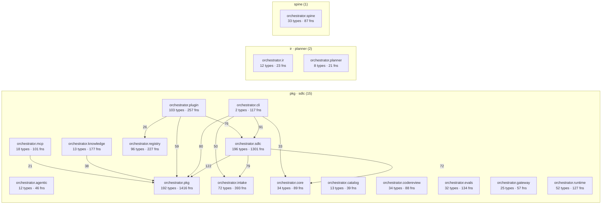

# Architecture
<!-- generated by `orchestrator understand`; the PKG is source of truth, edits here are advisory -->

**Graph size:** 24927 nodes · 79680 edges — 15234 functions · 4860 fields · 1945 docs · 1444 types · 1365 modules · 72 endpoints · 7 entitys.

## Areas
The coarse components — start here, then drill into a module. An area is a module's first two path or namespace segments.

| Area | Zone | Modules | Types | Functions |
|---|---|---|---|---|
| [`orchestrator.pkg`](areas/orchestrator.pkg.md) | orchestrator | 84 | 192 | 861 |
| [`orchestrator.sdlc`](areas/orchestrator.sdlc.md) | orchestrator | 81 | 195 | 849 |
| [`orchestrator.intake`](areas/orchestrator.intake.md) | orchestrator | 30 | 72 | 246 |
| [`orchestrator.plugin`](areas/orchestrator.plugin.md) | orchestrator | 15 | 103 | 178 |
| [`orchestrator.registry`](areas/orchestrator.registry.md) | orchestrator | 50 | 96 | 171 |
| [`orchestrator.knowledge`](areas/orchestrator.knowledge.md) | orchestrator | 14 | 13 | 146 |
| [`orchestrator.cli`](areas/orchestrator.cli.md) | orchestrator | 11 | 2 | 108 |
| [`orchestrator.evals`](areas/orchestrator.evals.md) | orchestrator | 20 | 32 | 77 |
| [`orchestrator.runtime`](areas/orchestrator.runtime.md) | orchestrator | 20 | 52 | 45 |
| [`orchestrator.mcp`](areas/orchestrator.mcp.md) | orchestrator | 14 | 18 | 69 |
| [`orchestrator.core`](areas/orchestrator.core.md) | orchestrator | 17 | 34 | 47 |
| [`orchestrator.codereview`](areas/orchestrator.codereview.md) | orchestrator | 12 | 34 | 24 |
| [`orchestrator.spine`](areas/orchestrator.spine.md) | orchestrator | 14 | 33 | 19 |
| [`orchestrator.catalog`](areas/orchestrator.catalog.md) | orchestrator | 8 | 13 | 27 |
| [`orchestrator.gateway`](areas/orchestrator.gateway.md) | orchestrator | 19 | 25 | 14 |
| [`scripts.swebench_localization`](areas/scripts.swebench_localization.md) | scripts | 8 | 0 | 37 |
| [`orchestrator.agentic`](areas/orchestrator.agentic.md) | orchestrator | 8 | 12 | 16 |
| [`scripts.docs_audit`](areas/scripts.docs_audit.md) | scripts | 1 | 0 | 24 |
| [`scripts.roadmap-status`](areas/scripts.roadmap-status.md) | scripts | 1 | 1 | 20 |
| [`orchestrator.launch`](areas/orchestrator.launch.md) | orchestrator | 1 | 2 | 17 |
| [`orchestrator.setup`](areas/orchestrator.setup.md) | orchestrator | 8 | 6 | 13 |
| [`scripts.sdlc_shapes`](areas/scripts.sdlc_shapes.md) | scripts | 1 | 2 | 17 |
| [`orchestrator.planner`](areas/orchestrator.planner.md) | orchestrator | 3 | 8 | 10 |
| [`orchestrator.temporal`](areas/orchestrator.temporal.md) | orchestrator | 6 | 7 | 11 |
| [`scripts.render_knowledge_foundation_svg`](areas/scripts.render_knowledge_foundation_svg.md) | scripts | 1 | 2 | 14 |

## Public surface
_Split by each language's own rule — a leading underscore._

**3371 public** symbols · **2755 internal**, of 6126. Most of this codebase is machinery you don't need to read to use it.

Most-depended-upon public symbols: [`Provenance`](../src/orchestrator/pkg/facts.py#L92), [`add_edge`](../src/orchestrator/pkg/facts.py#L192), [`Edge`](../src/orchestrator/pkg/facts.py#L152), [`add_node`](../src/orchestrator/pkg/facts.py#L187), [`Node`](../src/orchestrator/pkg/facts.py#L132), [`FactStore`](../src/orchestrator/pkg/store.py#L37), [`RepoCodeExtractor`](../src/orchestrator/pkg/extractor.py#L789), [`Failure`](../src/orchestrator/plugin/outputs.py#L63), [`FactBatch`](../src/orchestrator/pkg/facts.py#L165), [`TargetLayout`](../src/orchestrator/sdlc/layout.py#L71), [`TestRunResult`](../src/orchestrator/sdlc/contracts.py#L27), [`load_local_env`](../src/orchestrator/core/env.py#L20), [`LLMCodegenAdapter`](../src/orchestrator/sdlc/codegen.py#L1037), [`Message`](../src/orchestrator/core/llm/client.py#L52), [`load_or_extract`](../src/orchestrator/pkg/persistence.py#L283), +3356 more

## Import cycles
_Groups of modules that depend on each other, directly or through a chain. Each is a place the layering doesn't hold — and a hazard for import order._

- 16 modules: `orchestrator.pkg.c_extractor` ↔ `orchestrator.pkg.clang_includes` ↔ `orchestrator.pkg.clang_link` ↔ `orchestrator.pkg.cpp_extractor` ↔ `orchestrator.pkg.csharp_extractor` ↔ `orchestrator.pkg.extractor`, +10 more
- 3 modules: `orchestrator.intake.factory` ↔ `orchestrator.intake.follow_links` ↔ `orchestrator.intake.service`
- 3 modules: `orchestrator.knowledge.analysis` ↔ `orchestrator.knowledge.current_state` ↔ `orchestrator.knowledge.renderers`
- 2 modules: `orchestrator.agentic.codegen_tools` ↔ `orchestrator.sdlc.codegen`
- 2 modules: `orchestrator.sdlc.layout` ↔ `orchestrator.sdlc.rust_codegen`

## System architecture
The top components grouped by zone; arrows run in the direction of the dependency, weighted by how many imports back them.

```mermaid
flowchart LR
  subgraph c_2["pkg · sdlc (15)"]
    aorchestratoragentic["orchestrator.agentic<br/>12 types · 46 fns"]
    aorchestratorcatalog["orchestrator.catalog<br/>13 types · 39 fns"]
    aorchestratorcli["orchestrator.cli<br/>2 types · 117 fns"]
    aorchestratorcodereview["orchestrator.codereview<br/>34 types · 88 fns"]
    aorchestratorcore["orchestrator.core<br/>34 types · 89 fns"]
    aorchestratorevals["orchestrator.evals<br/>32 types · 134 fns"]
    aorchestratorgateway["orchestrator.gateway<br/>25 types · 57 fns"]
    aorchestratorintake["orchestrator.intake<br/>72 types · 393 fns"]
    aorchestratorknowledge["orchestrator.knowledge<br/>13 types · 177 fns"]
    aorchestratormcp["orchestrator.mcp<br/>18 types · 101 fns"]
    aorchestratorpkg["orchestrator.pkg<br/>192 types · 1416 fns"]
    aorchestratorplugin["orchestrator.plugin<br/>103 types · 257 fns"]
    aorchestratorregistry["orchestrator.registry<br/>96 types · 227 fns"]
    aorchestratorruntime["orchestrator.runtime<br/>52 types · 127 fns"]
    aorchestratorsdlc["orchestrator.sdlc<br/>196 types · 1301 fns"]
  end
  subgraph c_6["ir · planner (2)"]
    aorchestratorir["orchestrator.ir<br/>12 types · 23 fns"]
    aorchestratorplanner["orchestrator.planner<br/>8 types · 21 fns"]
  end
  subgraph c_12["spine (1)"]
    aorchestratorspine["orchestrator.spine<br/>33 types · 87 fns"]
  end
  aorchestratorsdlc -->|122| aorchestratorpkg
  aorchestratorcli -->|91| aorchestratorsdlc
  aorchestratorcli -->|80| aorchestratorpkg
  aorchestratorsdlc -->|79| aorchestratorintake
  aorchestratorplugin -->|76| aorchestratorsdlc
  aorchestratorsdlc -->|72| aorchestratorcore
  aorchestratorplugin -->|59| aorchestratorpkg
  aorchestratorcli -->|50| aorchestratorintake
  aorchestratorknowledge -->|38| aorchestratorpkg
  aorchestratorcli -->|33| aorchestratorcore
  aorchestratorplugin -->|26| aorchestratorregistry
  aorchestratormcp -->|21| aorchestratorpkg
```

### Strongest component dependencies

| From | → | To | Strength |
|---|---|---|---|
| `tests.sdlc` | → | `orchestrator.sdlc` | 1167 |
| `tests.pkg` | → | `orchestrator.pkg` | 820 |
| `tests.intake` | → | `orchestrator.intake` | 329 |
| `tests.plugin` | → | `orchestrator.plugin` | 317 |
| `tests.sdlc` | → | `orchestrator.pkg` | 192 |
| `orchestrator.sdlc` | → | `orchestrator.pkg` | 122 |
| `tests.registry` | → | `orchestrator.registry` | 122 |
| `orchestrator.cli` | → | `orchestrator.sdlc` | 91 |
| `tests.sdlc` | → | `orchestrator.intake` | 87 |
| `tests.evals` | → | `orchestrator.evals` | 84 |

## Layers
Types bucketed by role, inferred from naming conventions — a rough shape of the codebase, not a declared architecture.

| Layer | Types |
|---|---|
| Other | 1339 |
| Data shapes (VM/DTO/model) | 45 |
| Business logic | 39 |
| Data access | 9 |
| Interfaces / contracts | 3 |
| App wiring / infra | 1 |

## Complexity
_How big the types are, and which are biggest._

Size distribution: **797** 1-10 · **115** >10 · **72** marker · **8** >25 · **3** god (>40)

| Largest type | Members | Defined at |
|---|---|---|
| `LLMCodegenAdapter` | 63 | `src/orchestrator/sdlc/codegen.py:1037` |
| `FactStore` | 47 | `src/orchestrator/pkg/store.py:37` |
| `RunContext` | 44 | `src/orchestrator/sdlc/autorun.py:86` |
| `CurrentState` | 36 | `src/orchestrator/knowledge/current_state.py:127` |
| `RustExtractor` | 32 | `src/orchestrator/pkg/rust_extractor.py:136` |
| `PythonExtractor` | 31 | `src/orchestrator/pkg/extractor.py:169` |
| `TargetLayout` | 31 | `src/orchestrator/sdlc/layout.py:71` |
| `KotlinExtractor` | 30 | `src/orchestrator/pkg/kotlin_extractor.py:315` |
| `TypeIndex` | 30 | `src/orchestrator/pkg/typed_receivers.py:348` |
| `SDLCActivities` | 30 | `src/orchestrator/sdlc/activities.py:45` |

## Test coverage
_Which components the test suite reaches, by test→source imports. Presence, not line coverage._

**28 of 63 components** are imported by at least one test.

Largest components no test imports: `scripts.render_knowledge_foundation_svg` (2 types), `scripts.sdlc_shapes` (2 types), `scripts.codegen_benchmark` (1 type), `scripts.mutate-dispatch` (1 type), `scripts.render_architecture_svg` (1 type).

## Documentation
_The repo's own prose folded into the graph (`Doc` nodes + `MENTIONS` edges). A mention counts only when it binds to exactly one symbol, so this under-counts rather than guesses._

**1945 docs** ingested, naming **1243 of 17389 symbols** (7% doc coverage).

**2180 potential drift** — the docs name code the graph doesn't have (renamed or removed symbols, or prose the binder can't resolve).

| The docs claim… | …in |
|---|---|
| `mcpServers` | AGENT_GUIDE.md#cursor |
| `startup_timeout_sec` | AGENT_GUIDE.md#codex-configuration |
| `tool_timeout_sec` | AGENT_GUIDE.md#codex-configuration |
| `repo_path` | AGENT_GUIDE.md#6-the-tools-spine-exposes |
| `Any` | AGENT_GUIDE.md#6-the-tools-spine-exposes |
| `a.b.m` | AGENT_GUIDE.md#6-the-tools-spine-exposes |
| `bot_login` | AGENT_GUIDE.md#6-the-tools-spine-exposes |
| `min_severity` | AGENT_GUIDE.md#6-the-tools-spine-exposes |
| … | _+2172 more_ |

## Possibly unused
_**298 of 2526 internal symbols** have no caller, subclass or doc reference in the graph. **Candidates, not verdicts**: calls through an attribute chain are skipped rather than guessed at, and dynamic dispatch, registries and reflection are invisible. Public symbols are excluded — having no in-repo caller is what being an API looks like._

[`Status`](../src/orchestrator/registry/_common.py#L42), [`_CSharp`](../src/orchestrator/pkg/scope.py#L438), [`_Choice`](../src/orchestrator/planner/v0.py#L42), [`_Docs`](../src/orchestrator/plugin/server.py#L384), [`_Go`](../src/orchestrator/pkg/scope.py#L298), [`_InferredGlossaryEntry`](../src/orchestrator/planner/v1.py#L53), [`_Lang`](../src/orchestrator/pkg/scope.py#L121), [`_ManagerSpecialistChoice`](../src/orchestrator/planner/v1.py#L47), [`_ModelInits`](../src/orchestrator/pkg/verify.py#L353), [`_Plan`](../src/orchestrator/planner/v1.py#L60), [`_Rust`](../src/orchestrator/pkg/scope.py#L566), [`_SpineGroup`](../src/orchestrator/cli/_app.py#L68), [`_State`](../src/orchestrator/obs/tracing.py#L40), [`_StepChoice`](../src/orchestrator/planner/v1.py#L40), [`_TypeRecLike`](../src/orchestrator/pkg/perl_orm.py#L42), [`_TypeScript`](../src/orchestrator/pkg/scope.py#L250), [`_Wrapped`](../src/orchestrator/gateway/handlers.py#L62), [`_add`](../src/orchestrator/pkg/docs.py#L191), [`_add`](../src/orchestrator/pkg/media_extract.py#L224), [`_always_available`](../src/orchestrator/sdlc/toolchains.py#L167), +278 more

## Module map (top 25 by members)
The biggest first-party modules — where the code lives. Tests are excluded; each opens its page (or its source, if it has no page).

- [`orchestrator.plugin.server`](modules/orchestrator.plugin.server.md) — 3 types, 115 functions
- [`orchestrator.plugin.outputs`](modules/orchestrator.plugin.outputs.md) — 86 types, 2 functions
- [`orchestrator.sdlc.codegen`](modules/orchestrator.sdlc.codegen.md) — 9 types, 65 functions
- [`orchestrator.sdlc.layout`](modules/orchestrator.sdlc.layout.md) — 1 types, 64 functions
- [`orchestrator.sdlc.feature_runner`](modules/orchestrator.sdlc.feature_runner.md) — 5 types, 52 functions
- [`orchestrator.knowledge.renderers`](modules/orchestrator.knowledge.renderers.md) — 4 types, 50 functions
- [`orchestrator.sdlc.builddoc`](modules/orchestrator.sdlc.builddoc.md) — 4 types, 48 functions
- [`orchestrator.pkg.csharp_extractor`](modules/orchestrator.pkg.csharp_extractor.md) — 4 types, 43 functions
- [`orchestrator.sdlc.testenv`](modules/orchestrator.sdlc.testenv.md) — 11 types, 29 functions
- [`orchestrator.sdlc.proof_bundle`](modules/orchestrator.sdlc.proof_bundle.md) — 8 types, 31 functions
- [`orchestrator.pkg.js_extractor`](modules/orchestrator.pkg.js_extractor.md) — 3 types, 35 functions
- [`orchestrator.pkg.kotlin_extractor`](modules/orchestrator.pkg.kotlin_extractor.md) — 7 types, 31 functions
- [`orchestrator.sdlc.ideation`](modules/orchestrator.sdlc.ideation.md) — 9 types, 28 functions
- [`orchestrator.pkg.java_extractor`](modules/orchestrator.pkg.java_extractor.md) — 3 types, 29 functions
- [`orchestrator.pkg.typescript_extractor`](modules/orchestrator.pkg.typescript_extractor.md) — 2 types, 30 functions
- [`orchestrator.sdlc.toolchains`](modules/orchestrator.sdlc.toolchains.md) — 2 types, 30 functions
- [`orchestrator.pkg.accuracy`](modules/orchestrator.pkg.accuracy.md) — 7 types, 24 functions
- [`orchestrator.intake.requirements`](modules/orchestrator.intake.requirements.md) — 5 types, 24 functions
- [`orchestrator.pkg.external_docs`](modules/orchestrator.pkg.external_docs.md) — 3 types, 26 functions
- [`orchestrator.pkg.persistence`](modules/orchestrator.pkg.persistence.md) — 3 types, 26 functions
- [`orchestrator.sdlc.autorun`](modules/orchestrator.sdlc.autorun.md) — 3 types, 26 functions
- [`orchestrator.knowledge.current_state`](modules/orchestrator.knowledge.current_state.md) — 1 types, 26 functions
- [`orchestrator.cli.registry`](modules/orchestrator.cli.registry.md) — 0 types, 26 functions
- [`orchestrator.pkg.php_routes`](modules/orchestrator.pkg.php_routes.md) — 1 types, 25 functions
- [`orchestrator.sdlc.conventions`](modules/orchestrator.sdlc.conventions.md) — 1 types, 25 functions

_Showing the 25 biggest of 468 first-party modules._

## Call hotspots (most-called functions)
The most-depended-on functions: what breaks the most if you change it. Each links to its definition and to its direct callers; **reaches** is the transitive blast radius — every symbol a change here can touch.

- [`add_edge`](../src/orchestrator/pkg/facts.py#L192) — 177 production · 217 test call-sites · **reaches 1220 symbols** (≤4 hops)
  - called by [`_add_implements`](../src/orchestrator/pkg/php_extractor.py#L439), [`_add_member`](../src/orchestrator/pkg/c_extractor.py#L191), [`_add_member`](../src/orchestrator/pkg/csharp_extractor.py#L412), [`_add_member`](../src/orchestrator/pkg/kotlin_extractor.py#L1813), [`_add_member`](../src/orchestrator/pkg/php_extractor.py#L432), +218 more
- [`add_node`](../src/orchestrator/pkg/facts.py#L187) — 151 production · 371 test call-sites · **reaches 1409 symbols** (≤4 hops)
  - called by [`_add_implements`](../src/orchestrator/pkg/php_extractor.py#L439), [`_add_member`](../src/orchestrator/pkg/c_extractor.py#L191), [`_add_member`](../src/orchestrator/pkg/csharp_extractor.py#L412), [`_add_member`](../src/orchestrator/pkg/kotlin_extractor.py#L1813), [`_add_member`](../src/orchestrator/pkg/php_extractor.py#L432), +301 more
- [`_text`](../src/orchestrator/pkg/typescript_extractor.py#L1284) — 68 production call-sites · **reaches 66 symbols** (≤4 hops)
  - called by [`_bound_names`](../src/orchestrator/pkg/typescript_extractor.py#L1073), [`_chain`](../src/orchestrator/pkg/js_extractor.py#L510), [`_defer_member_call`](../src/orchestrator/pkg/typescript_extractor.py#L940), [`_descriptor_target`](../src/orchestrator/pkg/js_extractor.py#L605), [`_destructured`](../src/orchestrator/pkg/js_extractor.py#L1437), +28 more
- [`load_local_env`](../src/orchestrator/core/env.py#L20) — 44 production · 6 test call-sites · **reaches 410 symbols** (≤4 hops)
  - called by [`_go`](../src/orchestrator/cli/sdlc.py#L900), [`_lifespan`](../src/orchestrator/intake/web/app.py#L129), [`_main`](../scripts/intents_to_confluence.py#L102), [`_main`](../scripts/live_github_auth.py#L21), [`_main`](../scripts/live_review.py#L32), +43 more
- [`_print`](../src/orchestrator/cli/_common.py#L62) — 42 production call-sites · **reaches 54 symbols** (≤2 hops)
  - called by [`_comprehension_oracle`](../src/orchestrator/cli/pkg.py#L464), [`_deprecate`](../src/orchestrator/cli/registry.py#L70), [`_drift_oracle`](../src/orchestrator/cli/pkg.py#L604), [`_invention_oracle`](../src/orchestrator/cli/pkg.py#L646), [`_joins_check`](../src/orchestrator/cli/pkg.py#L215), +33 more
- [`_text`](../src/orchestrator/pkg/php_names.py#L26) — 33 production call-sites · **reaches 65 symbols** (≤4 hops)
  - called by [`_base_type_names`](../src/orchestrator/pkg/php_extractor.py#L825), [`_const_names`](../src/orchestrator/pkg/php_extractor.py#L843), [`_field_text`](../src/orchestrator/pkg/php_extractor.py#L951), [`_interface_names`](../src/orchestrator/pkg/php_extractor.py#L832), [`_is_this_property`](../src/orchestrator/pkg/php_extractor.py#L746), +12 more
- [`load_or_extract`](../src/orchestrator/pkg/persistence.py#L283) — 31 production · 32 test call-sites · **reaches 605 symbols** (≤4 hops)
  - called by [`_baseline_drift`](../src/orchestrator/codereview/checkout.py#L134), [`_build`](../src/orchestrator/sdlc/activities.py#L320), [`_code_check`](../src/orchestrator/plugin/requirements_tools.py#L51), [`_grounding_for`](../src/orchestrator/cli/build.py#L367), [`_load_graph`](../src/orchestrator/sdlc/autorun.py#L1107), +48 more
- [`text`](../src/orchestrator/pkg/kotlin_names.py#L26) — 31 production call-sites · **reaches 113 symbols** (≤4 hops)
  - called by [`_argument_node`](../src/orchestrator/pkg/kotlin_nav.py#L233), [`_argument_text`](../src/orchestrator/pkg/kotlin_nav.py#L380), [`_callable_reference`](../src/orchestrator/pkg/kotlin_routes.py#L553), [`_callee`](../src/orchestrator/pkg/gradle_extractor.py#L218), [`_callee_name`](../src/orchestrator/pkg/kotlin_nav.py#L367), +16 more
- [`_field_text`](../src/orchestrator/pkg/typescript_extractor.py#L1279) — 30 production call-sites · **reaches 45 symbols** (≤4 hops)
  - called by [`_block_declares`](../src/orchestrator/pkg/js_extractor.py#L708), [`_declares`](../src/orchestrator/pkg/js_extractor.py#L666), [`_descriptor_target`](../src/orchestrator/pkg/js_extractor.py#L605), [`_destructured`](../src/orchestrator/pkg/js_extractor.py#L1437), [`_emit_const_functions`](../src/orchestrator/pkg/typescript_extractor.py#L430), +16 more
- [`_text`](../src/orchestrator/pkg/js_orm.py#L142) — 27 production call-sites · **reaches 17 symbols** (≤4 hops)
  - called by [`_association`](../src/orchestrator/pkg/js_orm.py#L648), [`_define`](../src/orchestrator/pkg/js_orm.py#L511), [`_entity`](../src/orchestrator/pkg/js_orm.py#L556), [`_exported_literal`](../src/orchestrator/pkg/js_orm.py#L402), [`_exports_key`](../src/orchestrator/pkg/js_orm.py#L290), +9 more
