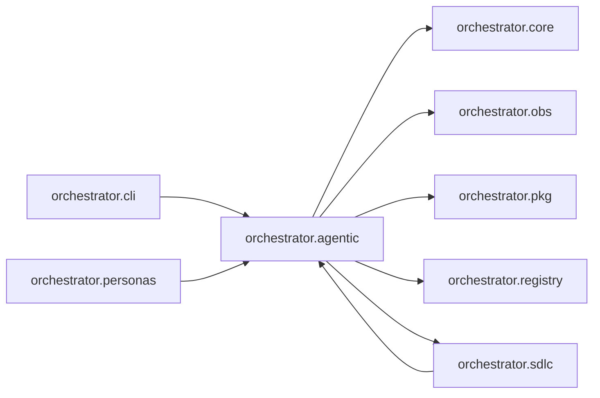

# `orchestrator.agentic`
<!-- generated by `orchestrator understand`; the PKG is source of truth, edits here are advisory -->

[← Episteme](../README.md) · [Architecture](../architecture.md)

**`orchestrator.agentic`** is one of 48 areas in this repo, in the `orchestrator` zone. It holds 8 modules — 13 types and 16 functions. It sits in the middle of the graph: 5 areas below it, 3 above. Changes here can reach both ways.

**In the diagram:** **`orchestrator.agentic`** (this area) · [`orchestrator.cli`](orchestrator.cli.md) · [`orchestrator.personas`](orchestrator.personas.md) · [`orchestrator.sdlc`](orchestrator.sdlc.md) · [`orchestrator.core`](orchestrator.core.md) · [`orchestrator.obs`](orchestrator.obs.md) · [`orchestrator.pkg`](orchestrator.pkg.md) · [`orchestrator.registry`](orchestrator.registry.md)

## Modules

- [`orchestrator.agentic`](../../src/orchestrator/agentic/__init__.py#L1)
- [`orchestrator.agentic.codegen_tools`](../../src/orchestrator/agentic/codegen_tools.py#L1)
- [`orchestrator.agentic.export`](../../src/orchestrator/agentic/export.py#L1)
- [`orchestrator.agentic.loop`](../../src/orchestrator/agentic/loop.py#L1)
- [`orchestrator.agentic.mcp_tools`](../../src/orchestrator/agentic/mcp_tools.py#L1)
- [`orchestrator.agentic.memory_tools`](../../src/orchestrator/agentic/memory_tools.py#L1)
- [`orchestrator.agentic.policy`](../../src/orchestrator/agentic/policy.py#L1)
- [`orchestrator.agentic.tools`](../../src/orchestrator/agentic/tools.py#L1)

## Depends on

[`orchestrator.core`](orchestrator.core.md), [`orchestrator.obs`](orchestrator.obs.md), [`orchestrator.pkg`](orchestrator.pkg.md), [`orchestrator.registry`](orchestrator.registry.md), [`orchestrator.sdlc`](orchestrator.sdlc.md)

## Depended on by

[`orchestrator.cli`](orchestrator.cli.md), [`orchestrator.personas`](orchestrator.personas.md), [`orchestrator.sdlc`](orchestrator.sdlc.md)
