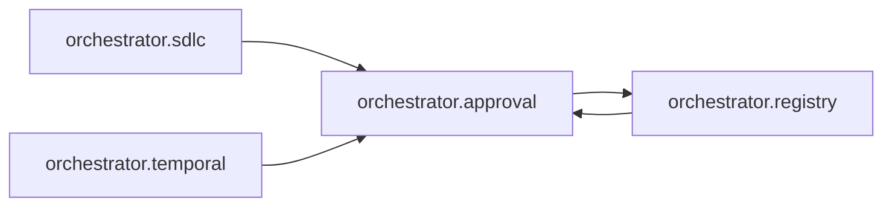

# `orchestrator.approval`
<!-- generated by `orchestrator understand`; the PKG is source of truth, edits here are advisory -->

[← Episteme](../README.md) · [Architecture](../architecture.md)

**`orchestrator.approval`** is one of 47 areas in this repo, in the `orchestrator` zone. It holds 3 modules — 7 types and 4 functions. It sits in the middle of the graph: 1 area below it, 3 above. Changes here can reach both ways.

**In the diagram:** **`orchestrator.approval`** (this area) · [`orchestrator.registry`](orchestrator.registry.md) · [`orchestrator.sdlc`](orchestrator.sdlc.md) · [`orchestrator.temporal`](orchestrator.temporal.md)

## Modules

- [`orchestrator.approval`](../../src/orchestrator/approval/__init__.py#L1)
- [`orchestrator.approval.models`](../../src/orchestrator/approval/models.py#L1)
- [`orchestrator.approval.repository`](../../src/orchestrator/approval/repository.py#L1)

## Depends on

[`orchestrator.registry`](orchestrator.registry.md)

## Depended on by

[`orchestrator.registry`](orchestrator.registry.md), [`orchestrator.sdlc`](orchestrator.sdlc.md), [`orchestrator.temporal`](orchestrator.temporal.md)
