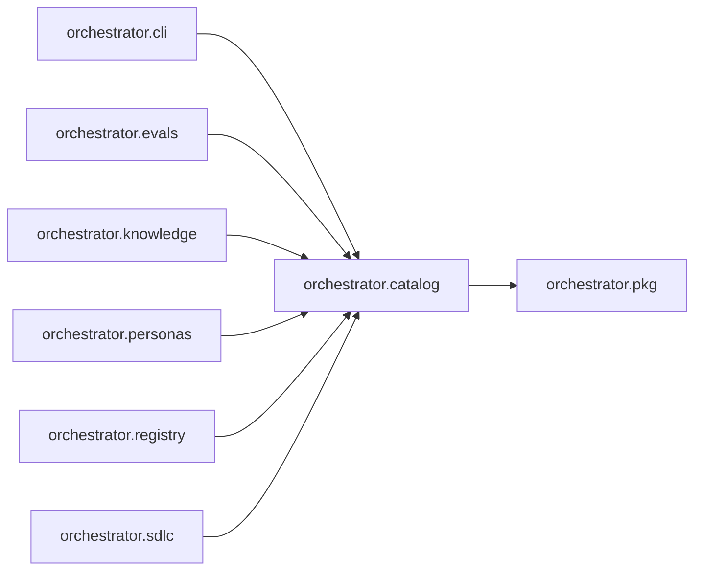

# `orchestrator.catalog`
<!-- generated by `orchestrator understand`; the PKG is source of truth, edits here are advisory -->

[← Episteme](../README.md) · [Architecture](../architecture.md)

**`orchestrator.catalog`** is one of 50 areas in this repo, in the `orchestrator` zone. It holds 8 modules — 13 types and 25 functions. It sits in the middle of the graph: 1 area below it, 6 above. Changes here can reach both ways.

**In the diagram:** **`orchestrator.catalog`** (this area) · [`orchestrator.cli`](orchestrator.cli.md) · [`orchestrator.evals`](orchestrator.evals.md) · [`orchestrator.knowledge`](orchestrator.knowledge.md) · [`orchestrator.personas`](orchestrator.personas.md) · [`orchestrator.registry`](orchestrator.registry.md) · [`orchestrator.sdlc`](orchestrator.sdlc.md) · [`orchestrator.pkg`](orchestrator.pkg.md)

## Modules

- [`orchestrator.catalog`](../../src/orchestrator/catalog/__init__.py#L1)
- [`orchestrator.catalog.catalog`](../../src/orchestrator/catalog/catalog.py#L1)
- [`orchestrator.catalog.models`](../../src/orchestrator/catalog/models.py#L1)
- [`orchestrator.catalog.planner`](../../src/orchestrator/catalog/planner.py#L1)
- [`orchestrator.catalog.profile`](../../src/orchestrator/catalog/profile.py#L1)
- [`orchestrator.catalog.skill_import`](../../src/orchestrator/catalog/skill_import.py#L1)
- [`orchestrator.catalog.skills`](../../src/orchestrator/catalog/skills.py#L1)
- [`orchestrator.catalog.vetting`](../../src/orchestrator/catalog/vetting.py#L1)

## Depends on

[`orchestrator.pkg`](orchestrator.pkg.md)

## Depended on by

[`orchestrator.cli`](orchestrator.cli.md), [`orchestrator.evals`](orchestrator.evals.md), [`orchestrator.knowledge`](orchestrator.knowledge.md), [`orchestrator.personas`](orchestrator.personas.md), [`orchestrator.registry`](orchestrator.registry.md), [`orchestrator.sdlc`](orchestrator.sdlc.md)
