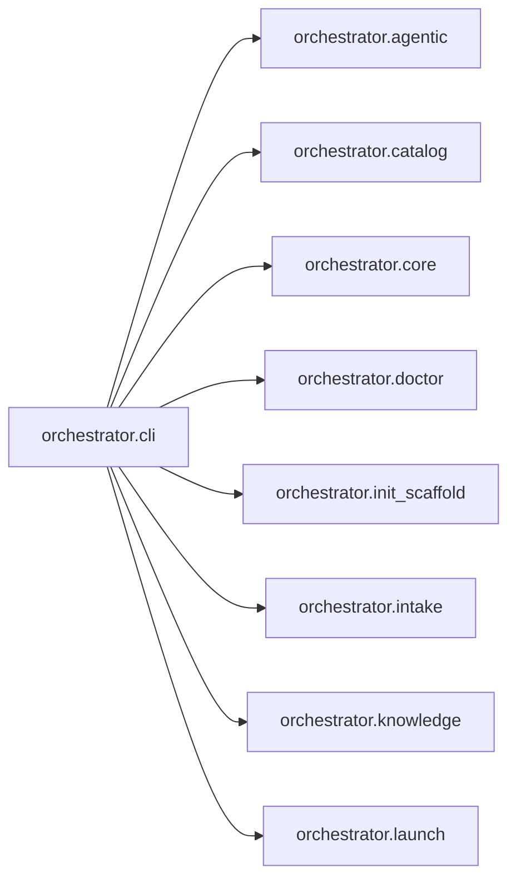

# `orchestrator.cli`
<!-- generated by `orchestrator understand`; the PKG is source of truth, edits here are advisory -->

[← Episteme](../README.md) · [Architecture](../architecture.md)

**`orchestrator.cli`** is one of 46 areas in this repo, in the `orchestrator` zone. It holds 1 module — 0 types and 65 functions. No other area imports it, and it draws on 16 — it's a leaf, so it's the safer place to change.

**In the diagram:** **`orchestrator.cli`** (this area) · [`orchestrator.agentic`](orchestrator.agentic.md) · [`orchestrator.catalog`](orchestrator.catalog.md) · [`orchestrator.core`](orchestrator.core.md) · `orchestrator.doctor` · `orchestrator.init_scaffold` · [`orchestrator.intake`](orchestrator.intake.md) · [`orchestrator.knowledge`](orchestrator.knowledge.md) · [`orchestrator.launch`](orchestrator.launch.md)

_Showing 8 of 16 neighbouring areas._

## Modules

- [`orchestrator.cli`](../modules/orchestrator.cli.md)

## Depends on

[`orchestrator.agentic`](orchestrator.agentic.md), [`orchestrator.catalog`](orchestrator.catalog.md), [`orchestrator.core`](orchestrator.core.md), `orchestrator.doctor`, `orchestrator.init_scaffold`, [`orchestrator.intake`](orchestrator.intake.md), [`orchestrator.knowledge`](orchestrator.knowledge.md), [`orchestrator.launch`](orchestrator.launch.md), [`orchestrator.mcp`](orchestrator.mcp.md), [`orchestrator.personas`](orchestrator.personas.md), [`orchestrator.pkg`](orchestrator.pkg.md), [`orchestrator.registry`](orchestrator.registry.md), [`orchestrator.sdlc`](orchestrator.sdlc.md), [`orchestrator.spine`](orchestrator.spine.md), [`orchestrator.temporal`](orchestrator.temporal.md), `orchestrator.tui`
