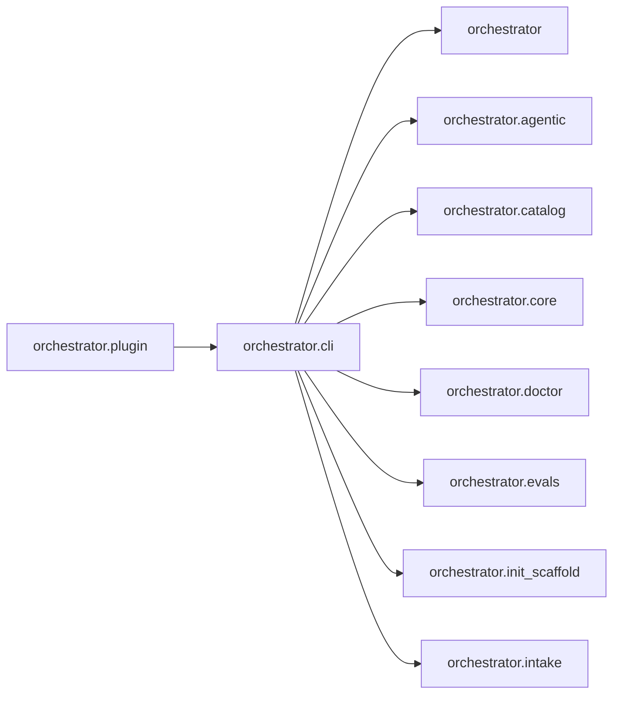

# `orchestrator.cli`
<!-- generated by `orchestrator understand`; the PKG is source of truth, edits here are advisory -->

[← Episteme](../README.md) · [Architecture](../architecture.md)

**`orchestrator.cli`** is one of 61 areas in this repo, in the `orchestrator` zone. It holds 11 modules — 1 types and 106 functions. It sits in the middle of the graph: 18 areas below it, 1 above. Changes here can reach both ways.

```mermaid
flowchart LR
  n0["orchestrator.cli"]
  n1["orchestrator.plugin"]
  n2["orchestrator"]
  n3["orchestrator.agentic"]
  n4["orchestrator.catalog"]
  n5["orchestrator.core"]
  n6["orchestrator.doctor"]
  n7["orchestrator.evals"]
  n8["orchestrator.init_scaffold"]
  n9["orchestrator.intake"]
  n1 --> n0
  n0 --> n2
  n0 --> n3
  n0 --> n4
  n0 --> n5
  n0 --> n6
  n0 --> n7
  n0 --> n8
  n0 --> n9
```

**In the diagram:** **`orchestrator.cli`** (this area) · [`orchestrator.plugin`](orchestrator.plugin.md) · `orchestrator` · [`orchestrator.agentic`](orchestrator.agentic.md) · [`orchestrator.catalog`](orchestrator.catalog.md) · [`orchestrator.core`](orchestrator.core.md) · `orchestrator.doctor` · [`orchestrator.evals`](orchestrator.evals.md) · `orchestrator.init_scaffold` · [`orchestrator.intake`](orchestrator.intake.md)

_Showing 9 of 19 neighbouring areas._

## Modules

- [`orchestrator.cli`](../../src/orchestrator/cli/__init__.py#L1)
- [`orchestrator.cli._app`](../../src/orchestrator/cli/_app.py#L1)
- [`orchestrator.cli._common`](../../src/orchestrator/cli/_common.py#L1)
- [`orchestrator.cli.build`](../../src/orchestrator/cli/build.py#L1)
- [`orchestrator.cli.change`](../../src/orchestrator/cli/change.py#L1)
- [`orchestrator.cli.media`](../../src/orchestrator/cli/media.py#L1)
- [`orchestrator.cli.pkg`](../modules/orchestrator.cli.pkg.md)
- [`orchestrator.cli.registry`](../modules/orchestrator.cli.registry.md)
- [`orchestrator.cli.sdlc`](../modules/orchestrator.cli.sdlc.md)
- [`orchestrator.cli.start`](../../src/orchestrator/cli/start.py#L1)
- [`orchestrator.cli.understand`](../../src/orchestrator/cli/understand.py#L1)

## Depends on

`orchestrator`, [`orchestrator.agentic`](orchestrator.agentic.md), [`orchestrator.catalog`](orchestrator.catalog.md), [`orchestrator.core`](orchestrator.core.md), `orchestrator.doctor`, [`orchestrator.evals`](orchestrator.evals.md), `orchestrator.init_scaffold`, [`orchestrator.intake`](orchestrator.intake.md), `orchestrator.ir`, [`orchestrator.knowledge`](orchestrator.knowledge.md), [`orchestrator.launch`](orchestrator.launch.md), [`orchestrator.mcp`](orchestrator.mcp.md), [`orchestrator.personas`](orchestrator.personas.md), [`orchestrator.pkg`](orchestrator.pkg.md), [`orchestrator.registry`](orchestrator.registry.md), [`orchestrator.sdlc`](orchestrator.sdlc.md), [`orchestrator.spine`](orchestrator.spine.md), [`orchestrator.temporal`](orchestrator.temporal.md)

## Depended on by

[`orchestrator.plugin`](orchestrator.plugin.md)
