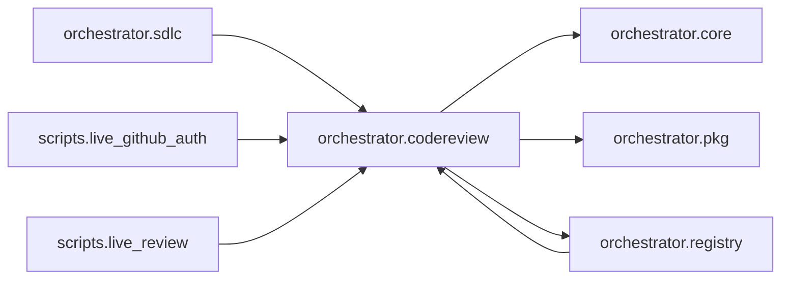

# `orchestrator.codereview`
<!-- generated by `orchestrator understand`; the PKG is source of truth, edits here are advisory -->

[← Episteme](../README.md) · [Architecture](../architecture.md)

**`orchestrator.codereview`** is one of 49 areas in this repo, in the `orchestrator` zone. It holds 11 modules — 32 types and 22 functions. It sits in the middle of the graph: 3 areas below it, 4 above. Changes here can reach both ways.

**In the diagram:** **`orchestrator.codereview`** (this area) · [`orchestrator.registry`](orchestrator.registry.md) · [`orchestrator.sdlc`](orchestrator.sdlc.md) · `scripts.live_github_auth` · `scripts.live_review` · [`orchestrator.core`](orchestrator.core.md) · [`orchestrator.pkg`](orchestrator.pkg.md)

## Modules

- [`orchestrator.codereview`](../../src/orchestrator/codereview/__init__.py#L1)
- [`orchestrator.codereview.auth`](../../src/orchestrator/codereview/auth.py#L1)
- [`orchestrator.codereview.config`](../../src/orchestrator/codereview/config.py#L1)
- [`orchestrator.codereview.diff_utils`](../../src/orchestrator/codereview/diff_utils.py#L1)
- [`orchestrator.codereview.github_client`](../../src/orchestrator/codereview/github_client.py#L1)
- [`orchestrator.codereview.grounding`](../../src/orchestrator/codereview/grounding.py#L1)
- [`orchestrator.codereview.models`](../../src/orchestrator/codereview/models.py#L1)
- [`orchestrator.codereview.reviewer`](../modules/orchestrator.codereview.reviewer.md)
- [`orchestrator.codereview.semgrep`](../../src/orchestrator/codereview/semgrep.py#L1)
- [`orchestrator.codereview.verifiers`](../modules/orchestrator.codereview.verifiers.md)
- [`orchestrator.codereview.webhook`](../../src/orchestrator/codereview/webhook.py#L1)

## Depends on

[`orchestrator.core`](orchestrator.core.md), [`orchestrator.pkg`](orchestrator.pkg.md), [`orchestrator.registry`](orchestrator.registry.md)

## Depended on by

[`orchestrator.registry`](orchestrator.registry.md), [`orchestrator.sdlc`](orchestrator.sdlc.md), `scripts.live_github_auth`, `scripts.live_review`
