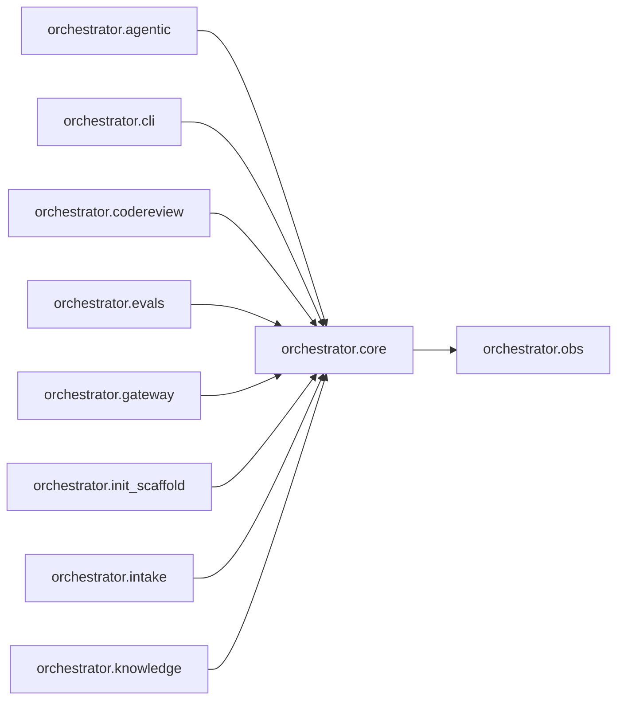

# `orchestrator.core`
<!-- generated by `orchestrator understand`; the PKG is source of truth, edits here are advisory -->

[← Episteme](../README.md) · [Architecture](../architecture.md)

**`orchestrator.core`** is one of 54 areas in this repo, in the `orchestrator` zone. It holds 15 modules — 30 types and 28 functions. It sits in the middle of the graph: 1 area below it, 24 above. Changes here can reach both ways.

**In the diagram:** **`orchestrator.core`** (this area) · [`orchestrator.agentic`](orchestrator.agentic.md) · [`orchestrator.cli`](orchestrator.cli.md) · [`orchestrator.codereview`](orchestrator.codereview.md) · [`orchestrator.evals`](orchestrator.evals.md) · [`orchestrator.gateway`](orchestrator.gateway.md) · `orchestrator.init_scaffold` · [`orchestrator.intake`](orchestrator.intake.md) · [`orchestrator.knowledge`](orchestrator.knowledge.md) · [`orchestrator.obs`](orchestrator.obs.md)

_Showing 9 of 25 neighbouring areas._

## Modules

- [`orchestrator.core`](../../src/orchestrator/core/__init__.py#L1)
- [`orchestrator.core.claim`](../../src/orchestrator/core/claim.py#L1)
- [`orchestrator.core.digest`](../../src/orchestrator/core/digest.py#L1)
- [`orchestrator.core.env`](../../src/orchestrator/core/env.py#L1)
- [`orchestrator.core.llm`](../../src/orchestrator/core/llm/__init__.py#L1)
- [`orchestrator.core.llm.budget`](../../src/orchestrator/core/llm/budget.py#L1)
- [`orchestrator.core.llm.catalog`](../../src/orchestrator/core/llm/catalog.py#L1)
- [`orchestrator.core.llm.client`](../../src/orchestrator/core/llm/client.py#L1)
- [`orchestrator.core.llm.litellm_client`](../../src/orchestrator/core/llm/litellm_client.py#L1)
- [`orchestrator.core.llm.mock`](../../src/orchestrator/core/llm/mock.py#L1)
- [`orchestrator.core.llm.recording`](../../src/orchestrator/core/llm/recording.py#L1)
- [`orchestrator.core.pinned_checkout`](../../src/orchestrator/core/pinned_checkout.py#L1)
- [`orchestrator.core.prompt_safety`](../../src/orchestrator/core/prompt_safety.py#L1)
- [`orchestrator.core.state`](../../src/orchestrator/core/state.py#L1)
- [`orchestrator.core.tool_client`](../../src/orchestrator/core/tool_client.py#L1)

## Depends on

[`orchestrator.obs`](orchestrator.obs.md)

## Depended on by

[`orchestrator.agentic`](orchestrator.agentic.md), [`orchestrator.cli`](orchestrator.cli.md), [`orchestrator.codereview`](orchestrator.codereview.md), [`orchestrator.evals`](orchestrator.evals.md), [`orchestrator.gateway`](orchestrator.gateway.md), `orchestrator.init_scaffold`, [`orchestrator.intake`](orchestrator.intake.md), [`orchestrator.knowledge`](orchestrator.knowledge.md), [`orchestrator.personas`](orchestrator.personas.md), [`orchestrator.planner`](orchestrator.planner.md), [`orchestrator.plugin`](orchestrator.plugin.md), [`orchestrator.registry`](orchestrator.registry.md), [`orchestrator.runtime`](orchestrator.runtime.md), [`orchestrator.sdlc`](orchestrator.sdlc.md), [`orchestrator.temporal`](orchestrator.temporal.md), `scripts.agentic_eval`, `scripts.audit_eval`, `scripts.codegen_ab`, [`scripts.codegen_benchmark`](scripts.codegen_benchmark.md), `scripts.intents_to_confluence`, `scripts.live_github_auth`, `scripts.live_review`, `scripts.live_sdlc_worker`, `scripts.skill_ab`
