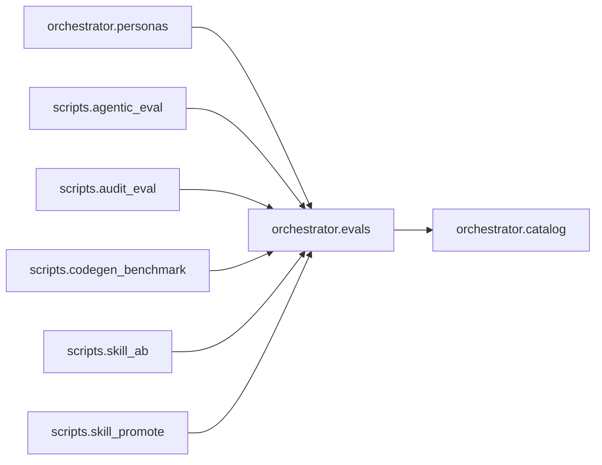

# `orchestrator.evals`
<!-- generated by `orchestrator understand`; the PKG is source of truth, edits here are advisory -->

[← Episteme](../README.md) · [Architecture](../architecture.md)

**`orchestrator.evals`** is one of 46 areas in this repo, in the `orchestrator` zone. It holds 7 modules — 7 types and 23 functions. It sits in the middle of the graph: 1 area below it, 6 above. Changes here can reach both ways.

**In the diagram:** **`orchestrator.evals`** (this area) · [`orchestrator.personas`](orchestrator.personas.md) · `scripts.agentic_eval` · `scripts.audit_eval` · [`scripts.codegen_benchmark`](scripts.codegen_benchmark.md) · `scripts.skill_ab` · `scripts.skill_promote` · [`orchestrator.catalog`](orchestrator.catalog.md)

## Modules

- [`orchestrator.evals`](../../src/orchestrator/evals/__init__.py#L1)
- [`orchestrator.evals.graders`](../../src/orchestrator/evals/graders.py#L1)
- [`orchestrator.evals.harness`](../../src/orchestrator/evals/harness.py#L1)
- [`orchestrator.evals.models`](../../src/orchestrator/evals/models.py#L1)
- [`orchestrator.evals.paths`](../../src/orchestrator/evals/paths.py#L1)
- [`orchestrator.evals.promotion`](../modules/orchestrator.evals.promotion.md)
- [`orchestrator.evals.skill_ab`](../../src/orchestrator/evals/skill_ab.py#L1)

## Depends on

[`orchestrator.catalog`](orchestrator.catalog.md)

## Depended on by

[`orchestrator.personas`](orchestrator.personas.md), `scripts.agentic_eval`, `scripts.audit_eval`, [`scripts.codegen_benchmark`](scripts.codegen_benchmark.md), `scripts.skill_ab`, `scripts.skill_promote`
