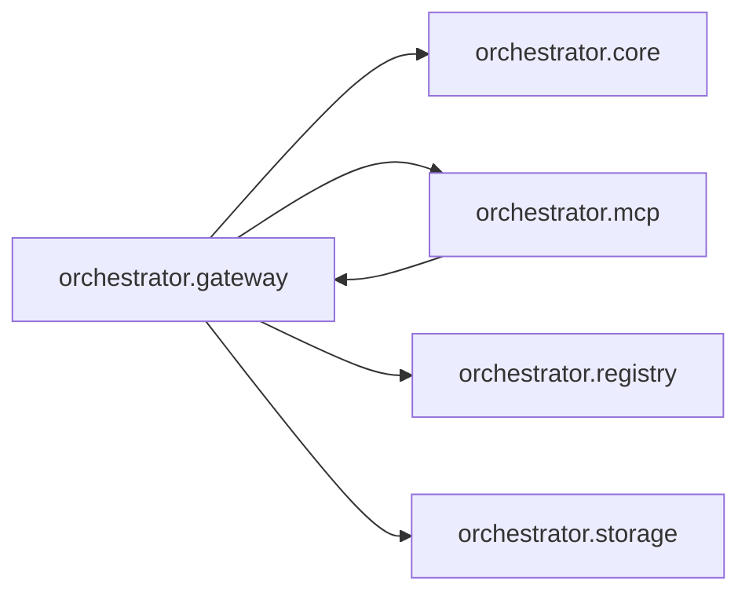

# `orchestrator.gateway`
<!-- generated by `orchestrator understand`; the PKG is source of truth, edits here are advisory -->

[← Episteme](../README.md) · [Architecture](../architecture.md)

**`orchestrator.gateway`** is one of 54 areas in this repo, in the `orchestrator` zone. It holds 19 modules — 25 types and 14 functions. It sits in the middle of the graph: 4 areas below it, 1 above. Changes here can reach both ways.

**In the diagram:** **`orchestrator.gateway`** (this area) · [`orchestrator.mcp`](orchestrator.mcp.md) · [`orchestrator.core`](orchestrator.core.md) · [`orchestrator.registry`](orchestrator.registry.md) · `orchestrator.storage`

## Modules

- [`orchestrator.gateway`](../../src/orchestrator/gateway/__init__.py#L1)
- [`orchestrator.gateway.api`](../../src/orchestrator/gateway/api/__init__.py#L1)
- [`orchestrator.gateway.api.app`](../../src/orchestrator/gateway/api/app.py#L1)
- [`orchestrator.gateway.api.routes`](../../src/orchestrator/gateway/api/routes.py#L1)
- [`orchestrator.gateway.auth`](../../src/orchestrator/gateway/auth.py#L1)
- [`orchestrator.gateway.handlers`](../../src/orchestrator/gateway/handlers.py#L1)
- [`orchestrator.gateway.invocation`](../../src/orchestrator/gateway/invocation.py#L1)
- [`orchestrator.gateway.loader`](../../src/orchestrator/gateway/loader.py#L1)
- [`orchestrator.gateway.rate_limit`](../../src/orchestrator/gateway/rate_limit.py#L1)
- [`orchestrator.gateway.tools`](../../src/orchestrator/gateway/tools/__init__.py#L1)
- [`orchestrator.gateway.tools.echo`](../../src/orchestrator/gateway/tools/echo.py#L1)
- [`orchestrator.gateway.tools.fetch_artifact`](../../src/orchestrator/gateway/tools/fetch_artifact.py#L1)
- [`orchestrator.gateway.tools.fetch_metric_definition`](../../src/orchestrator/gateway/tools/fetch_metric_definition.py#L1)
- [`orchestrator.gateway.tools.fetch_url`](../../src/orchestrator/gateway/tools/fetch_url.py#L1)
- [`orchestrator.gateway.tools.query_document_store`](../../src/orchestrator/gateway/tools/query_document_store.py#L1)
- [`orchestrator.gateway.tools.query_warehouse`](../../src/orchestrator/gateway/tools/query_warehouse.py#L1)
- [`orchestrator.gateway.tools.run_python_analysis`](../../src/orchestrator/gateway/tools/run_python_analysis.py#L1)
- [`orchestrator.gateway.tools.summarize_text`](../../src/orchestrator/gateway/tools/summarize_text.py#L1)
- [`orchestrator.gateway.tools.web_search`](../../src/orchestrator/gateway/tools/web_search.py#L1)

## Depends on

[`orchestrator.core`](orchestrator.core.md), [`orchestrator.mcp`](orchestrator.mcp.md), [`orchestrator.registry`](orchestrator.registry.md), `orchestrator.storage`

## Depended on by

[`orchestrator.mcp`](orchestrator.mcp.md)
