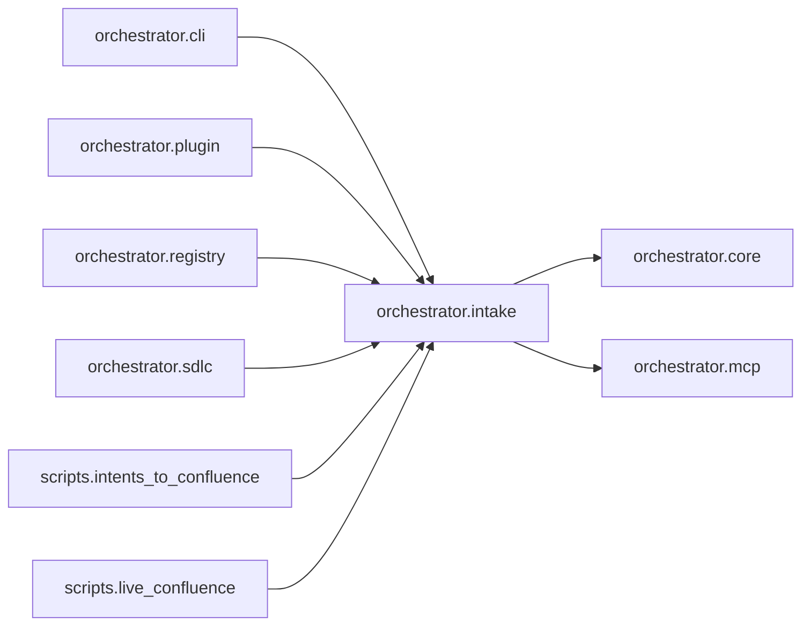

# `orchestrator.intake`
<!-- generated by `orchestrator understand`; the PKG is source of truth, edits here are advisory -->

[← Episteme](../README.md) · [Architecture](../architecture.md)

**`orchestrator.intake`** is one of 46 areas in this repo, in the `orchestrator` zone. It holds 21 modules — 42 types and 96 functions. It sits in the middle of the graph: 2 areas below it, 6 above. Changes here can reach both ways.

**In the diagram:** **`orchestrator.intake`** (this area) · [`orchestrator.cli`](orchestrator.cli.md) · [`orchestrator.plugin`](orchestrator.plugin.md) · [`orchestrator.registry`](orchestrator.registry.md) · [`orchestrator.sdlc`](orchestrator.sdlc.md) · `scripts.intents_to_confluence` · `scripts.live_confluence` · [`orchestrator.core`](orchestrator.core.md) · [`orchestrator.mcp`](orchestrator.mcp.md)

## Modules

- [`orchestrator.intake`](../../src/orchestrator/intake/__init__.py#L1)
- [`orchestrator.intake.adf`](../modules/orchestrator.intake.adf.md)
- [`orchestrator.intake.backlog_doc`](../../src/orchestrator/intake/backlog_doc.py#L1)
- [`orchestrator.intake.cache`](../modules/orchestrator.intake.cache.md)
- [`orchestrator.intake.confluence`](../../src/orchestrator/intake/confluence.py#L1)
- [`orchestrator.intake.factory`](../modules/orchestrator.intake.factory.md)
- [`orchestrator.intake.file_source`](../../src/orchestrator/intake/file_source.py#L1)
- [`orchestrator.intake.gaps`](../../src/orchestrator/intake/gaps.py#L1)
- [`orchestrator.intake.intents`](../../src/orchestrator/intake/intents.py#L1)
- [`orchestrator.intake.jira`](../../src/orchestrator/intake/jira.py#L1)
- [`orchestrator.intake.jira_source`](../../src/orchestrator/intake/jira_source.py#L1)
- [`orchestrator.intake.mcp_source`](../../src/orchestrator/intake/mcp_source.py#L1)
- [`orchestrator.intake.notion`](../../src/orchestrator/intake/notion.py#L1)
- [`orchestrator.intake.openspec_source`](../../src/orchestrator/intake/openspec_source.py#L1)
- [`orchestrator.intake.openspec_writer`](../../src/orchestrator/intake/openspec_writer.py#L1)
- [`orchestrator.intake.report`](../modules/orchestrator.intake.report.md)
- [`orchestrator.intake.service`](../../src/orchestrator/intake/service.py#L1)
- [`orchestrator.intake.source`](../../src/orchestrator/intake/source.py#L1)
- [`orchestrator.intake.specs`](../../src/orchestrator/intake/specs.py#L1)
- [`orchestrator.intake.web`](../../src/orchestrator/intake/web/__init__.py#L1)
- [`orchestrator.intake.web.app`](../../src/orchestrator/intake/web/app.py#L1)

## Depends on

[`orchestrator.core`](orchestrator.core.md), [`orchestrator.mcp`](orchestrator.mcp.md)

## Depended on by

[`orchestrator.cli`](orchestrator.cli.md), [`orchestrator.plugin`](orchestrator.plugin.md), [`orchestrator.registry`](orchestrator.registry.md), [`orchestrator.sdlc`](orchestrator.sdlc.md), `scripts.intents_to_confluence`, `scripts.live_confluence`
