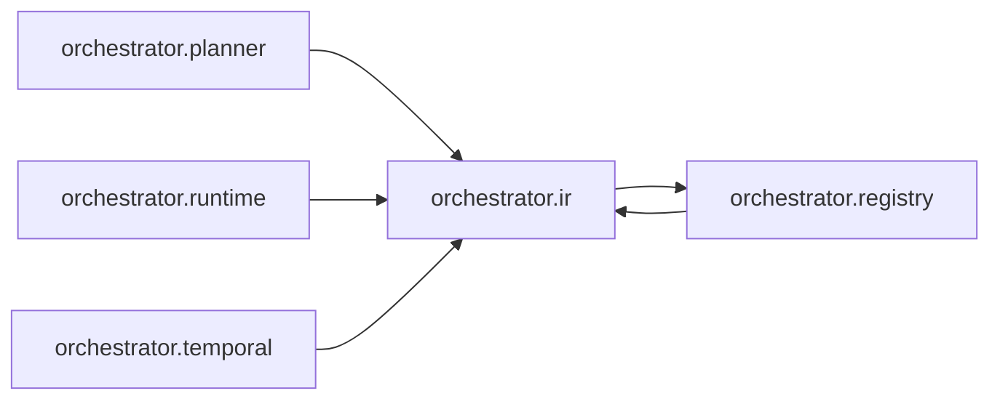

# `orchestrator.ir`
<!-- generated by `orchestrator understand`; the PKG is source of truth, edits here are advisory -->

[← Episteme](../README.md) · [Architecture](../architecture.md)

**`orchestrator.ir`** is one of 47 areas in this repo, in the `orchestrator` zone. It holds 3 modules — 12 types and 2 functions. It sits in the middle of the graph: 1 area below it, 4 above. Changes here can reach both ways.

**In the diagram:** **`orchestrator.ir`** (this area) · [`orchestrator.planner`](orchestrator.planner.md) · [`orchestrator.registry`](orchestrator.registry.md) · [`orchestrator.runtime`](orchestrator.runtime.md) · [`orchestrator.temporal`](orchestrator.temporal.md)

## Modules

- [`orchestrator.ir`](../../src/orchestrator/ir/__init__.py#L1)
- [`orchestrator.ir.graph`](../../src/orchestrator/ir/graph.py#L1)
- [`orchestrator.ir.validator`](../../src/orchestrator/ir/validator.py#L1)

## Depends on

[`orchestrator.registry`](orchestrator.registry.md)

## Depended on by

[`orchestrator.planner`](orchestrator.planner.md), [`orchestrator.registry`](orchestrator.registry.md), [`orchestrator.runtime`](orchestrator.runtime.md), [`orchestrator.temporal`](orchestrator.temporal.md)
