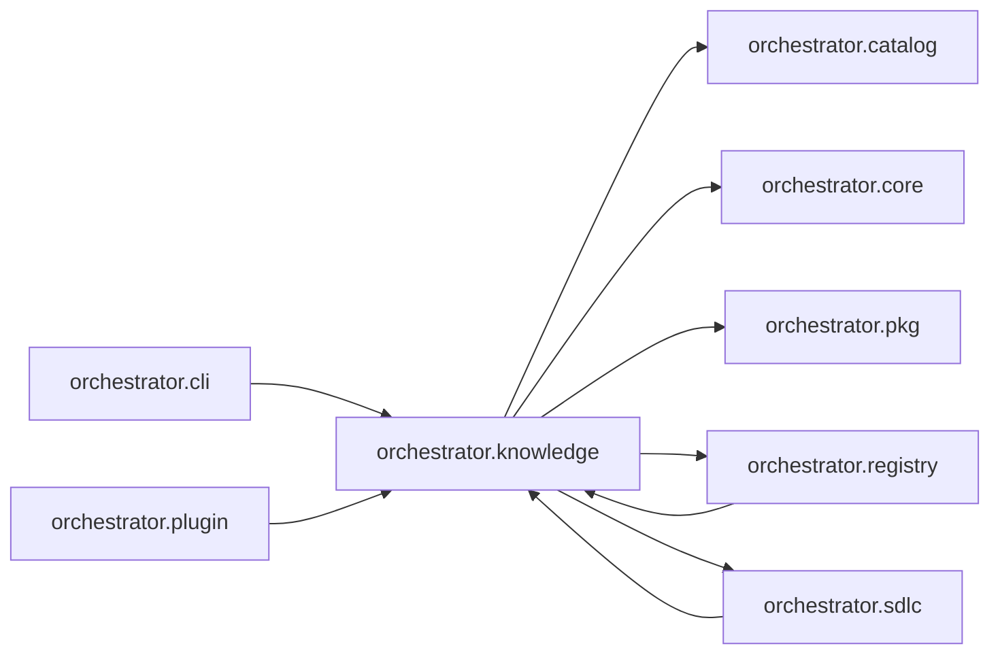

# `orchestrator.knowledge`
<!-- generated by `orchestrator understand`; the PKG is source of truth, edits here are advisory -->

[← Episteme](../README.md) · [Architecture](../architecture.md)

**`orchestrator.knowledge`** is one of 49 areas in this repo, in the `orchestrator` zone. It holds 14 modules — 13 types and 142 functions. It sits in the middle of the graph: 5 areas below it, 4 above. Changes here can reach both ways.

**In the diagram:** **`orchestrator.knowledge`** (this area) · [`orchestrator.cli`](orchestrator.cli.md) · [`orchestrator.plugin`](orchestrator.plugin.md) · [`orchestrator.registry`](orchestrator.registry.md) · [`orchestrator.sdlc`](orchestrator.sdlc.md) · [`orchestrator.catalog`](orchestrator.catalog.md) · [`orchestrator.core`](orchestrator.core.md) · [`orchestrator.pkg`](orchestrator.pkg.md)

## Modules

- [`orchestrator.knowledge`](../../src/orchestrator/knowledge/__init__.py#L1)
- [`orchestrator.knowledge.access`](../../src/orchestrator/knowledge/access.py#L1)
- [`orchestrator.knowledge.analysis`](../../src/orchestrator/knowledge/analysis.py#L1)
- [`orchestrator.knowledge.areas`](../../src/orchestrator/knowledge/areas.py#L1)
- [`orchestrator.knowledge.clustering`](../../src/orchestrator/knowledge/clustering.py#L1)
- [`orchestrator.knowledge.consolidate`](../../src/orchestrator/knowledge/consolidate.py#L1)
- [`orchestrator.knowledge.current_state`](../modules/orchestrator.knowledge.current_state.md)
- [`orchestrator.knowledge.infrastructure`](../../src/orchestrator/knowledge/infrastructure.py#L1)
- [`orchestrator.knowledge.insights`](../../src/orchestrator/knowledge/insights.py#L1)
- [`orchestrator.knowledge.renderers`](../modules/orchestrator.knowledge.renderers.md)
- [`orchestrator.knowledge.report_html`](../modules/orchestrator.knowledge.report_html.md)
- [`orchestrator.knowledge.report_svg`](../../src/orchestrator/knowledge/report_svg.py#L1)
- [`orchestrator.knowledge.understand`](../../src/orchestrator/knowledge/understand.py#L1)
- [`orchestrator.knowledge.wikilinks`](../../src/orchestrator/knowledge/wikilinks.py#L1)

## Depends on

[`orchestrator.catalog`](orchestrator.catalog.md), [`orchestrator.core`](orchestrator.core.md), [`orchestrator.pkg`](orchestrator.pkg.md), [`orchestrator.registry`](orchestrator.registry.md), [`orchestrator.sdlc`](orchestrator.sdlc.md)

## Depended on by

[`orchestrator.cli`](orchestrator.cli.md), [`orchestrator.plugin`](orchestrator.plugin.md), [`orchestrator.registry`](orchestrator.registry.md), [`orchestrator.sdlc`](orchestrator.sdlc.md)
