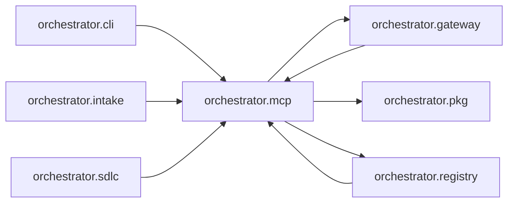

# `orchestrator.mcp`
<!-- generated by `orchestrator understand`; the PKG is source of truth, edits here are advisory -->

[← Episteme](../README.md) · [Architecture](../architecture.md)

**`orchestrator.mcp`** is one of 47 areas in this repo, in the `orchestrator` zone. It holds 10 modules — 11 types and 25 functions. It sits in the middle of the graph: 3 areas below it, 5 above. Changes here can reach both ways.

**In the diagram:** **`orchestrator.mcp`** (this area) · [`orchestrator.cli`](orchestrator.cli.md) · [`orchestrator.gateway`](orchestrator.gateway.md) · [`orchestrator.intake`](orchestrator.intake.md) · [`orchestrator.registry`](orchestrator.registry.md) · [`orchestrator.sdlc`](orchestrator.sdlc.md) · [`orchestrator.pkg`](orchestrator.pkg.md)

## Modules

- [`orchestrator.mcp`](../../src/orchestrator/mcp/__init__.py#L1)
- [`orchestrator.mcp.client`](../../src/orchestrator/mcp/client.py#L1)
- [`orchestrator.mcp.config`](../../src/orchestrator/mcp/config.py#L1)
- [`orchestrator.mcp.contract`](../../src/orchestrator/mcp/contract.py#L1)
- [`orchestrator.mcp.db`](../../src/orchestrator/mcp/db.py#L1)
- [`orchestrator.mcp.handler`](../../src/orchestrator/mcp/handler.py#L1)
- [`orchestrator.mcp.models`](../../src/orchestrator/mcp/models.py#L1)
- [`orchestrator.mcp.onboard`](../../src/orchestrator/mcp/onboard.py#L1)
- [`orchestrator.mcp.registry`](../../src/orchestrator/mcp/registry.py#L1)
- [`orchestrator.mcp.schema_types`](../../src/orchestrator/mcp/schema_types.py#L1)

## Depends on

[`orchestrator.gateway`](orchestrator.gateway.md), [`orchestrator.pkg`](orchestrator.pkg.md), [`orchestrator.registry`](orchestrator.registry.md)

## Depended on by

[`orchestrator.cli`](orchestrator.cli.md), [`orchestrator.gateway`](orchestrator.gateway.md), [`orchestrator.intake`](orchestrator.intake.md), [`orchestrator.registry`](orchestrator.registry.md), [`orchestrator.sdlc`](orchestrator.sdlc.md)
