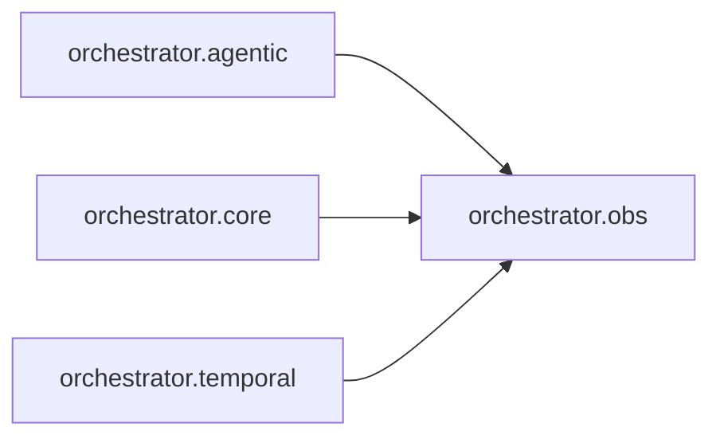

# `orchestrator.obs`
<!-- generated by `orchestrator understand`; the PKG is source of truth, edits here are advisory -->

[← Episteme](../README.md) · [Architecture](../architecture.md)

**`orchestrator.obs`** is one of 46 areas in this repo, in the `orchestrator` zone. It holds 2 modules — 2 types and 11 functions. Nothing here depends on other areas, but 3 areas depend on it — it's a foundation, so changes ripple outward.

**In the diagram:** **`orchestrator.obs`** (this area) · [`orchestrator.agentic`](orchestrator.agentic.md) · [`orchestrator.core`](orchestrator.core.md) · [`orchestrator.temporal`](orchestrator.temporal.md)

## Modules

- [`orchestrator.obs`](../../src/orchestrator/obs/__init__.py#L1)
- [`orchestrator.obs.tracing`](../modules/orchestrator.obs.tracing.md)

## Depended on by

[`orchestrator.agentic`](orchestrator.agentic.md), [`orchestrator.core`](orchestrator.core.md), [`orchestrator.temporal`](orchestrator.temporal.md)
