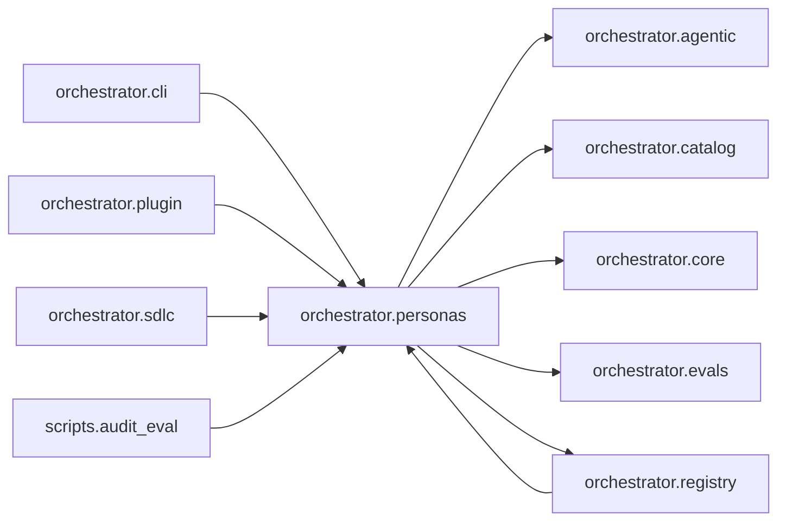

# `orchestrator.personas`
<!-- generated by `orchestrator understand`; the PKG is source of truth, edits here are advisory -->

[← Episteme](../README.md) · [Architecture](../architecture.md)

**`orchestrator.personas`** is one of 53 areas in this repo, in the `orchestrator` zone. It holds 5 modules — 5 types and 10 functions. It sits in the middle of the graph: 5 areas below it, 5 above. Changes here can reach both ways.

**In the diagram:** **`orchestrator.personas`** (this area) · [`orchestrator.cli`](orchestrator.cli.md) · [`orchestrator.plugin`](orchestrator.plugin.md) · [`orchestrator.registry`](orchestrator.registry.md) · [`orchestrator.sdlc`](orchestrator.sdlc.md) · `scripts.audit_eval` · [`orchestrator.agentic`](orchestrator.agentic.md) · [`orchestrator.catalog`](orchestrator.catalog.md) · [`orchestrator.core`](orchestrator.core.md) · [`orchestrator.evals`](orchestrator.evals.md)

## Modules

- [`orchestrator.personas`](../../src/orchestrator/personas/__init__.py#L1)
- [`orchestrator.personas.auditor`](../../src/orchestrator/personas/auditor.py#L1)
- [`orchestrator.personas.binding`](../../src/orchestrator/personas/binding.py#L1)
- [`orchestrator.personas.registry`](../../src/orchestrator/personas/registry.py#L1)
- [`orchestrator.personas.software_engineer`](../../src/orchestrator/personas/software_engineer.py#L1)

## Depends on

[`orchestrator.agentic`](orchestrator.agentic.md), [`orchestrator.catalog`](orchestrator.catalog.md), [`orchestrator.core`](orchestrator.core.md), [`orchestrator.evals`](orchestrator.evals.md), [`orchestrator.registry`](orchestrator.registry.md)

## Depended on by

[`orchestrator.cli`](orchestrator.cli.md), [`orchestrator.plugin`](orchestrator.plugin.md), [`orchestrator.registry`](orchestrator.registry.md), [`orchestrator.sdlc`](orchestrator.sdlc.md), `scripts.audit_eval`
