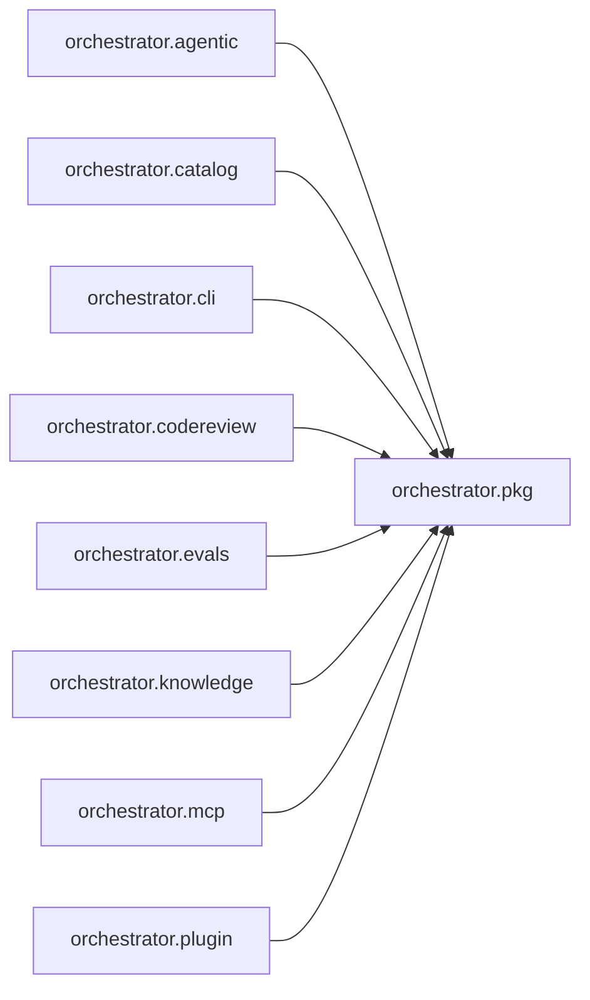

# `orchestrator.pkg`
<!-- generated by `orchestrator understand`; the PKG is source of truth, edits here are advisory -->

[← Episteme](../README.md) · [Architecture](../architecture.md)

**`orchestrator.pkg`** is one of 48 areas in this repo, in the `orchestrator` zone. It holds 38 modules — 79 types and 283 functions. Nothing here depends on other areas, but 11 areas depend on it — it's a foundation, so changes ripple outward.

**In the diagram:** **`orchestrator.pkg`** (this area) · [`orchestrator.agentic`](orchestrator.agentic.md) · [`orchestrator.catalog`](orchestrator.catalog.md) · [`orchestrator.cli`](orchestrator.cli.md) · [`orchestrator.codereview`](orchestrator.codereview.md) · [`orchestrator.evals`](orchestrator.evals.md) · [`orchestrator.knowledge`](orchestrator.knowledge.md) · [`orchestrator.mcp`](orchestrator.mcp.md) · [`orchestrator.plugin`](orchestrator.plugin.md)

_Showing 8 of 11 neighbouring areas._

## Modules

- [`orchestrator.pkg`](../../src/orchestrator/pkg/__init__.py#L1)
- [`orchestrator.pkg.accuracy`](../modules/orchestrator.pkg.accuracy.md)
- [`orchestrator.pkg.c_extractor`](../modules/orchestrator.pkg.c_extractor.md)
- [`orchestrator.pkg.capabilities`](../../src/orchestrator/pkg/capabilities.py#L1)
- [`orchestrator.pkg.cpp_extractor`](../../src/orchestrator/pkg/cpp_extractor.py#L1)
- [`orchestrator.pkg.csharp_extractor`](../modules/orchestrator.pkg.csharp_extractor.md)
- [`orchestrator.pkg.data_layer_link`](../../src/orchestrator/pkg/data_layer_link.py#L1)
- [`orchestrator.pkg.doc_link`](../../src/orchestrator/pkg/doc_link.py#L1)
- [`orchestrator.pkg.doc_source`](../modules/orchestrator.pkg.doc_source.md)
- [`orchestrator.pkg.docs`](../../src/orchestrator/pkg/docs.py#L1)
- [`orchestrator.pkg.export`](../../src/orchestrator/pkg/export.py#L1)
- [`orchestrator.pkg.extractor`](../../src/orchestrator/pkg/extractor.py#L1)
- [`orchestrator.pkg.facts`](../../src/orchestrator/pkg/facts.py#L1)
- [`orchestrator.pkg.go_extractor`](../modules/orchestrator.pkg.go_extractor.md)
- [`orchestrator.pkg.graph_export`](../../src/orchestrator/pkg/graph_export.py#L1)
- [`orchestrator.pkg.import_link`](../../src/orchestrator/pkg/import_link.py#L1)
- [`orchestrator.pkg.intent_link`](../../src/orchestrator/pkg/intent_link.py#L1)
- [`orchestrator.pkg.invention`](../../src/orchestrator/pkg/invention.py#L1)
- [`orchestrator.pkg.java_extractor`](../modules/orchestrator.pkg.java_extractor.md)
- [`orchestrator.pkg.media`](../../src/orchestrator/pkg/media.py#L1)
- [`orchestrator.pkg.media_asr`](../modules/orchestrator.pkg.media_asr.md)
- [`orchestrator.pkg.media_extract`](../modules/orchestrator.pkg.media_extract.md)
- [`orchestrator.pkg.migrations`](../../src/orchestrator/pkg/migrations.py#L1)
- [`orchestrator.pkg.overview`](../../src/orchestrator/pkg/overview.py#L1)
- [`orchestrator.pkg.persistence`](../modules/orchestrator.pkg.persistence.md)
- [`orchestrator.pkg.python_client`](../../src/orchestrator/pkg/python_client.py#L1)
- [`orchestrator.pkg.python_orm`](../modules/orchestrator.pkg.python_orm.md)
- [`orchestrator.pkg.python_routes`](../modules/orchestrator.pkg.python_routes.md)
- [`orchestrator.pkg.rdf`](../../src/orchestrator/pkg/rdf.py#L1)
- [`orchestrator.pkg.retrieval`](../../src/orchestrator/pkg/retrieval.py#L1)
- [`orchestrator.pkg.runtime_oracle`](../modules/orchestrator.pkg.runtime_oracle.md)
- [`orchestrator.pkg.schema`](../../src/orchestrator/pkg/schema.py#L1)
- [`orchestrator.pkg.sql_extractor`](../modules/orchestrator.pkg.sql_extractor.md)
- [`orchestrator.pkg.stats`](../../src/orchestrator/pkg/stats.py#L1)
- [`orchestrator.pkg.store`](../../src/orchestrator/pkg/store.py#L1)
- [`orchestrator.pkg.typescript_extractor`](../modules/orchestrator.pkg.typescript_extractor.md)
- [`orchestrator.pkg.verifier`](../../src/orchestrator/pkg/verifier.py#L1)
- [`orchestrator.pkg.verify`](../modules/orchestrator.pkg.verify.md)

## Depended on by

[`orchestrator.agentic`](orchestrator.agentic.md), [`orchestrator.catalog`](orchestrator.catalog.md), [`orchestrator.cli`](orchestrator.cli.md), [`orchestrator.codereview`](orchestrator.codereview.md), [`orchestrator.evals`](orchestrator.evals.md), [`orchestrator.knowledge`](orchestrator.knowledge.md), [`orchestrator.mcp`](orchestrator.mcp.md), [`orchestrator.plugin`](orchestrator.plugin.md), [`orchestrator.registry`](orchestrator.registry.md), [`orchestrator.sdlc`](orchestrator.sdlc.md), [`orchestrator.spine`](orchestrator.spine.md)
