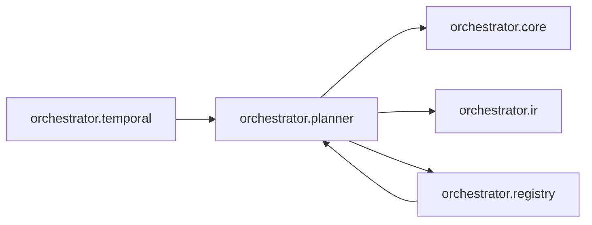

# `orchestrator.planner`
<!-- generated by `orchestrator understand`; the PKG is source of truth, edits here are advisory -->

[← Episteme](../README.md) · [Architecture](../architecture.md)

**`orchestrator.planner`** is one of 53 areas in this repo, in the `orchestrator` zone. It holds 3 modules — 8 types and 10 functions. It sits in the middle of the graph: 3 areas below it, 2 above. Changes here can reach both ways.

**In the diagram:** **`orchestrator.planner`** (this area) · [`orchestrator.registry`](orchestrator.registry.md) · [`orchestrator.temporal`](orchestrator.temporal.md) · [`orchestrator.core`](orchestrator.core.md) · [`orchestrator.ir`](orchestrator.ir.md)

## Modules

- [`orchestrator.planner`](../../src/orchestrator/planner/__init__.py#L1)
- [`orchestrator.planner.v0`](../../src/orchestrator/planner/v0.py#L1)
- [`orchestrator.planner.v1`](../modules/orchestrator.planner.v1.md)

## Depends on

[`orchestrator.core`](orchestrator.core.md), [`orchestrator.ir`](orchestrator.ir.md), [`orchestrator.registry`](orchestrator.registry.md)

## Depended on by

[`orchestrator.registry`](orchestrator.registry.md), [`orchestrator.temporal`](orchestrator.temporal.md)
