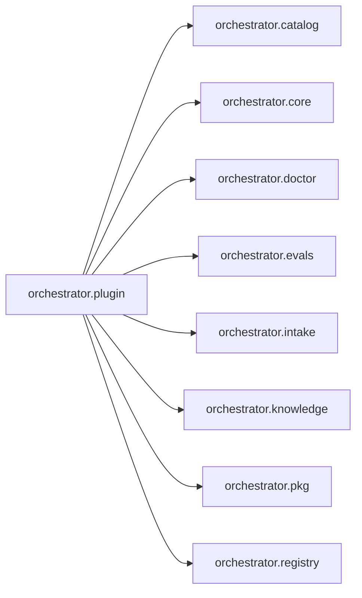

# `orchestrator.plugin`
<!-- generated by `orchestrator understand`; the PKG is source of truth, edits here are advisory -->

[← Episteme](../README.md) · [Architecture](../architecture.md)

**`orchestrator.plugin`** is one of 53 areas in this repo, in the `orchestrator` zone. It holds 5 modules — 6 types and 61 functions. No other area imports it, and it draws on 9 — nothing else in this repo depends on it. That's the shape of an entry point or a top-level application as much as a leaf utility, so it bounds the outward reach of a change here, not its difficulty.

**In the diagram:** **`orchestrator.plugin`** (this area) · [`orchestrator.catalog`](orchestrator.catalog.md) · [`orchestrator.core`](orchestrator.core.md) · `orchestrator.doctor` · [`orchestrator.evals`](orchestrator.evals.md) · [`orchestrator.intake`](orchestrator.intake.md) · [`orchestrator.knowledge`](orchestrator.knowledge.md) · [`orchestrator.pkg`](orchestrator.pkg.md) · [`orchestrator.registry`](orchestrator.registry.md)

_Showing 8 of 9 neighbouring areas._

## Modules

- [`orchestrator.plugin`](../../src/orchestrator/plugin/__init__.py#L1)
- [`orchestrator.plugin.__main__`](../../src/orchestrator/plugin/__main__.py#L1)
- [`orchestrator.plugin.auth`](../../src/orchestrator/plugin/auth.py#L1)
- [`orchestrator.plugin.registry_client`](../../src/orchestrator/plugin/registry_client.py#L1)
- [`orchestrator.plugin.server`](../modules/orchestrator.plugin.server.md)

## Depends on

[`orchestrator.catalog`](orchestrator.catalog.md), [`orchestrator.core`](orchestrator.core.md), `orchestrator.doctor`, [`orchestrator.evals`](orchestrator.evals.md), [`orchestrator.intake`](orchestrator.intake.md), [`orchestrator.knowledge`](orchestrator.knowledge.md), [`orchestrator.pkg`](orchestrator.pkg.md), [`orchestrator.registry`](orchestrator.registry.md), [`orchestrator.sdlc`](orchestrator.sdlc.md)
