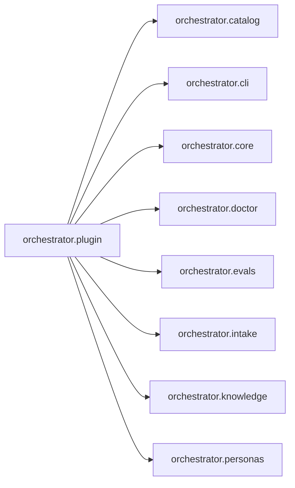

# `orchestrator.plugin`
<!-- generated by `orchestrator understand`; the PKG is source of truth, edits here are advisory -->

[← Episteme](../README.md) · [Architecture](../architecture.md)

**`orchestrator.plugin`** is one of 61 areas in this repo, in the `orchestrator` zone. It holds 12 modules — 76 types and 104 functions. No other area imports it, and it draws on 12 — nothing else in this repo depends on it. That's the shape of an entry point or a top-level application as much as a leaf utility, so it bounds the outward reach of a change here, not its difficulty.

```mermaid
flowchart LR
  n0["orchestrator.plugin"]
  n1["orchestrator.catalog"]
  n2["orchestrator.cli"]
  n3["orchestrator.core"]
  n4["orchestrator.doctor"]
  n5["orchestrator.evals"]
  n6["orchestrator.intake"]
  n7["orchestrator.knowledge"]
  n8["orchestrator.personas"]
  n0 --> n1
  n0 --> n2
  n0 --> n3
  n0 --> n4
  n0 --> n5
  n0 --> n6
  n0 --> n7
  n0 --> n8
```

**In the diagram:** **`orchestrator.plugin`** (this area) · [`orchestrator.catalog`](orchestrator.catalog.md) · [`orchestrator.cli`](orchestrator.cli.md) · [`orchestrator.core`](orchestrator.core.md) · `orchestrator.doctor` · [`orchestrator.evals`](orchestrator.evals.md) · [`orchestrator.intake`](orchestrator.intake.md) · [`orchestrator.knowledge`](orchestrator.knowledge.md) · [`orchestrator.personas`](orchestrator.personas.md)

_Showing 8 of 12 neighbouring areas._

## Modules

- [`orchestrator.plugin`](../../src/orchestrator/plugin/__init__.py#L1)
- [`orchestrator.plugin.__main__`](../../src/orchestrator/plugin/__main__.py#L1)
- [`orchestrator.plugin.audit`](../../src/orchestrator/plugin/audit.py#L1)
- [`orchestrator.plugin.auth`](../../src/orchestrator/plugin/auth.py#L1)
- [`orchestrator.plugin.outputs`](../modules/orchestrator.plugin.outputs.md)
- [`orchestrator.plugin.progress`](../../src/orchestrator/plugin/progress.py#L1)
- [`orchestrator.plugin.prompts`](../../src/orchestrator/plugin/prompts.py#L1)
- [`orchestrator.plugin.registry_client`](../../src/orchestrator/plugin/registry_client.py#L1)
- [`orchestrator.plugin.repo_access`](../../src/orchestrator/plugin/repo_access.py#L1)
- [`orchestrator.plugin.requirements_tools`](../../src/orchestrator/plugin/requirements_tools.py#L1)
- [`orchestrator.plugin.resources`](../../src/orchestrator/plugin/resources.py#L1)
- [`orchestrator.plugin.server`](../modules/orchestrator.plugin.server.md)

## Depends on

[`orchestrator.catalog`](orchestrator.catalog.md), [`orchestrator.cli`](orchestrator.cli.md), [`orchestrator.core`](orchestrator.core.md), `orchestrator.doctor`, [`orchestrator.evals`](orchestrator.evals.md), [`orchestrator.intake`](orchestrator.intake.md), [`orchestrator.knowledge`](orchestrator.knowledge.md), [`orchestrator.personas`](orchestrator.personas.md), [`orchestrator.pkg`](orchestrator.pkg.md), [`orchestrator.registry`](orchestrator.registry.md), [`orchestrator.sdlc`](orchestrator.sdlc.md), [`orchestrator.spine`](orchestrator.spine.md)
