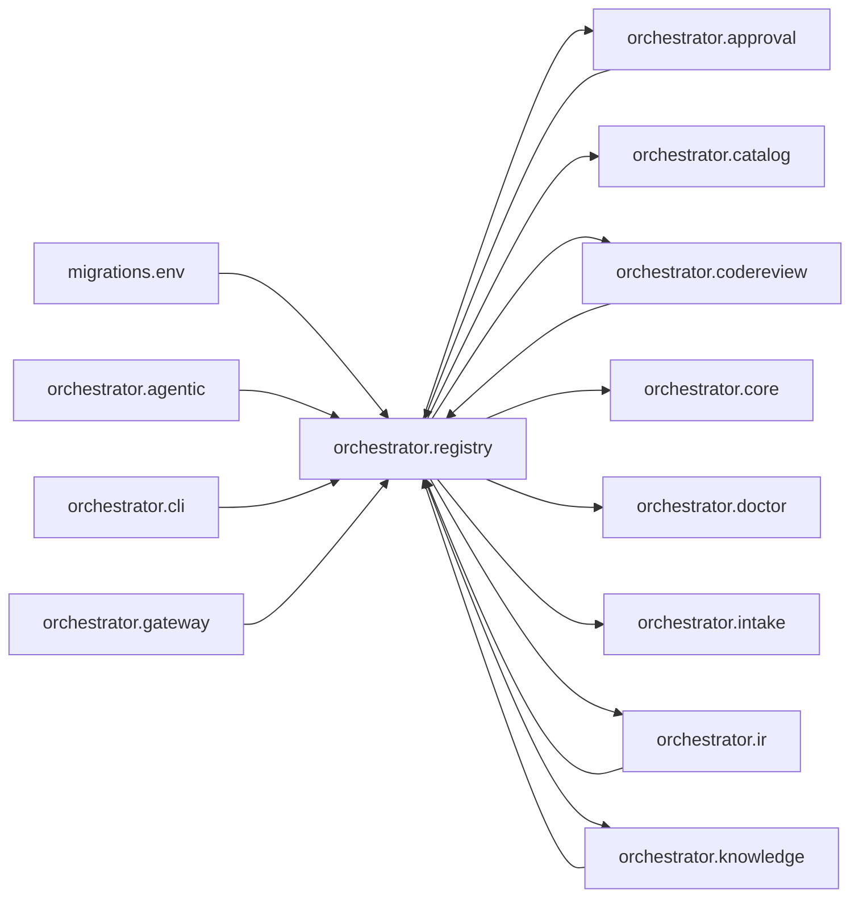

# `orchestrator.registry`
<!-- generated by `orchestrator understand`; the PKG is source of truth, edits here are advisory -->

[← Episteme](../README.md) · [Architecture](../architecture.md)

**`orchestrator.registry`** is one of 54 areas in this repo, in the `orchestrator` zone. It holds 50 modules — 94 types and 170 functions. It sits in the middle of the graph: 15 areas below it, 15 above. Changes here can reach both ways.

**In the diagram:** **`orchestrator.registry`** (this area) · `migrations.env` · [`orchestrator.agentic`](orchestrator.agentic.md) · `orchestrator.approval` · [`orchestrator.cli`](orchestrator.cli.md) · [`orchestrator.codereview`](orchestrator.codereview.md) · [`orchestrator.gateway`](orchestrator.gateway.md) · [`orchestrator.ir`](orchestrator.ir.md) · [`orchestrator.knowledge`](orchestrator.knowledge.md) · [`orchestrator.catalog`](orchestrator.catalog.md) · [`orchestrator.core`](orchestrator.core.md) · `orchestrator.doctor` · [`orchestrator.intake`](orchestrator.intake.md)

_Showing 16 of 30 neighbouring areas._

## Modules

- [`orchestrator.registry`](../../src/orchestrator/registry/__init__.py#L1)
- [`orchestrator.registry._common`](../../src/orchestrator/registry/_common.py#L1)
- [`orchestrator.registry.agent_template`](../../src/orchestrator/registry/agent_template.py#L1)
- [`orchestrator.registry.api`](../../src/orchestrator/registry/api/__init__.py#L1)
- [`orchestrator.registry.api.app`](../../src/orchestrator/registry/api/app.py#L1)
- [`orchestrator.registry.api.approvals`](../../src/orchestrator/registry/api/approvals.py#L1)
- [`orchestrator.registry.api.audit`](../modules/orchestrator.registry.api.audit.md)
- [`orchestrator.registry.api.backlog`](../../src/orchestrator/registry/api/backlog.py#L1)
- [`orchestrator.registry.api.capabilities`](../modules/orchestrator.registry.api.capabilities.md)
- [`orchestrator.registry.api.config`](../../src/orchestrator/registry/api/config.py#L1)
- [`orchestrator.registry.api.connections`](../modules/orchestrator.registry.api.connections.md)
- [`orchestrator.registry.api.console`](../../src/orchestrator/registry/api/console.py#L1)
- [`orchestrator.registry.api.deps`](../../src/orchestrator/registry/api/deps.py#L1)
- [`orchestrator.registry.api.fs`](../../src/orchestrator/registry/api/fs.py#L1)
- [`orchestrator.registry.api.inbox`](../../src/orchestrator/registry/api/inbox.py#L1)
- [`orchestrator.registry.api.jobs`](../modules/orchestrator.registry.api.jobs.md)
- [`orchestrator.registry.api.memory`](../../src/orchestrator/registry/api/memory.py#L1)
- [`orchestrator.registry.api.middleware`](../../src/orchestrator/registry/api/middleware.py#L1)
- [`orchestrator.registry.api.personas`](../../src/orchestrator/registry/api/personas.py#L1)
- [`orchestrator.registry.api.routes`](../../src/orchestrator/registry/api/routes.py#L1)
- [`orchestrator.registry.api.runs`](../../src/orchestrator/registry/api/runs.py#L1)
- [`orchestrator.registry.api.session`](../../src/orchestrator/registry/api/session.py#L1)
- [`orchestrator.registry.api.stream`](../../src/orchestrator/registry/api/stream.py#L1)
- [`orchestrator.registry.api.system`](../../src/orchestrator/registry/api/system.py#L1)
- [`orchestrator.registry.api.tasks`](../../src/orchestrator/registry/api/tasks.py#L1)
- [`orchestrator.registry.api.trace`](../../src/orchestrator/registry/api/trace.py#L1)
- [`orchestrator.registry.api.web`](../../src/orchestrator/registry/api/web/__init__.py#L1)
- [`orchestrator.registry.api.web.advanced`](../../src/orchestrator/registry/api/web/advanced.py#L1)
- [`orchestrator.registry.api.web.auth`](../../src/orchestrator/registry/api/web/auth.py#L1)
- [`orchestrator.registry.api.web.connections`](../../src/orchestrator/registry/api/web/connections.py#L1)
- [`orchestrator.registry.api.web.evals`](../../src/orchestrator/registry/api/web/evals.py#L1)
- [`orchestrator.registry.api.web.governance`](../../src/orchestrator/registry/api/web/governance.py#L1)
- [`orchestrator.registry.api.web.home`](../../src/orchestrator/registry/api/web/home.py#L1)
- [`orchestrator.registry.api.web.icons`](../../src/orchestrator/registry/api/web/icons.py#L1)
- [`orchestrator.registry.api.web.intake_studio`](../../src/orchestrator/registry/api/web/intake_studio.py#L1)
- [`orchestrator.registry.api.web.intelligence`](../../src/orchestrator/registry/api/web/intelligence.py#L1)
- [`orchestrator.registry.api.web.memory`](../../src/orchestrator/registry/api/web/memory.py#L1)
- [`orchestrator.registry.api.web.registry`](../../src/orchestrator/registry/api/web/registry.py#L1)
- [`orchestrator.registry.api.web.shell`](../../src/orchestrator/registry/api/web/shell.py#L1)
- [`orchestrator.registry.api.web.system`](../../src/orchestrator/registry/api/web/system.py#L1)
- [`orchestrator.registry.api.workspace`](../modules/orchestrator.registry.api.workspace.md)
- [`orchestrator.registry.calibration`](../../src/orchestrator/registry/calibration.py#L1)
- [`orchestrator.registry.db`](../../src/orchestrator/registry/db/__init__.py#L1)
- [`orchestrator.registry.db.models`](../../src/orchestrator/registry/db/models.py#L1)
- [`orchestrator.registry.db.session`](../../src/orchestrator/registry/db/session.py#L1)
- [`orchestrator.registry.glossary`](../../src/orchestrator/registry/glossary.py#L1)
- [`orchestrator.registry.loader`](../../src/orchestrator/registry/loader.py#L1)
- [`orchestrator.registry.repositories`](../../src/orchestrator/registry/repositories.py#L1)
- [`orchestrator.registry.tool_contract`](../../src/orchestrator/registry/tool_contract.py#L1)
- [`orchestrator.registry.validation`](../../src/orchestrator/registry/validation.py#L1)

## Depends on

`orchestrator.approval`, [`orchestrator.catalog`](orchestrator.catalog.md), [`orchestrator.codereview`](orchestrator.codereview.md), [`orchestrator.core`](orchestrator.core.md), `orchestrator.doctor`, [`orchestrator.intake`](orchestrator.intake.md), [`orchestrator.ir`](orchestrator.ir.md), [`orchestrator.knowledge`](orchestrator.knowledge.md), [`orchestrator.mcp`](orchestrator.mcp.md), [`orchestrator.personas`](orchestrator.personas.md), [`orchestrator.pkg`](orchestrator.pkg.md), [`orchestrator.planner`](orchestrator.planner.md), [`orchestrator.runtime`](orchestrator.runtime.md), [`orchestrator.sdlc`](orchestrator.sdlc.md), [`orchestrator.temporal`](orchestrator.temporal.md)

## Depended on by

`migrations.env`, [`orchestrator.agentic`](orchestrator.agentic.md), `orchestrator.approval`, [`orchestrator.cli`](orchestrator.cli.md), [`orchestrator.codereview`](orchestrator.codereview.md), [`orchestrator.gateway`](orchestrator.gateway.md), [`orchestrator.ir`](orchestrator.ir.md), [`orchestrator.knowledge`](orchestrator.knowledge.md), [`orchestrator.mcp`](orchestrator.mcp.md), [`orchestrator.personas`](orchestrator.personas.md), [`orchestrator.planner`](orchestrator.planner.md), [`orchestrator.plugin`](orchestrator.plugin.md), [`orchestrator.runtime`](orchestrator.runtime.md), [`orchestrator.sdlc`](orchestrator.sdlc.md), [`orchestrator.temporal`](orchestrator.temporal.md)
