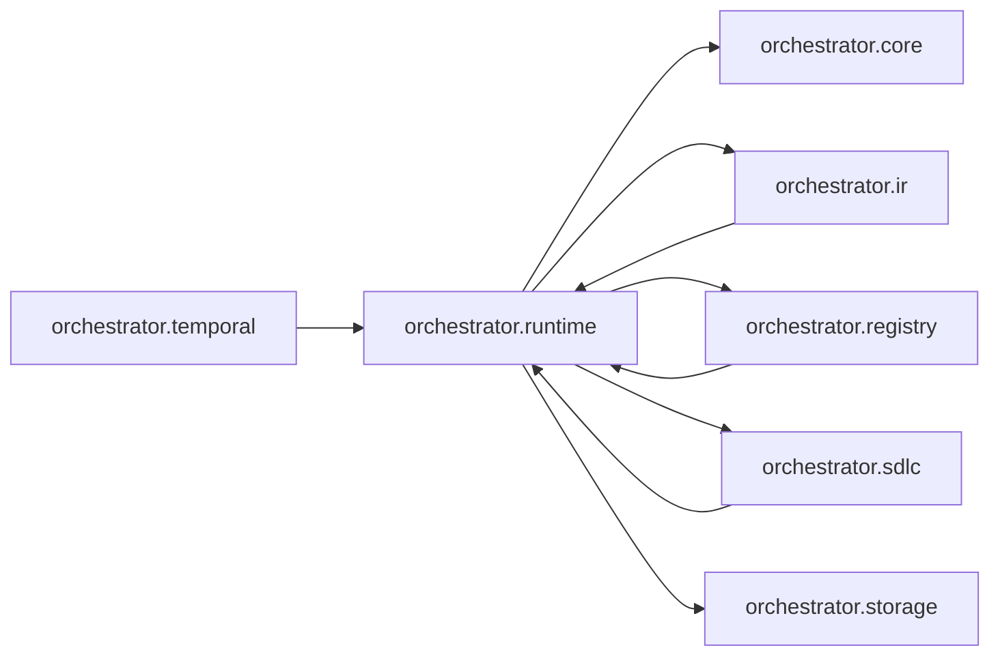

# `orchestrator.runtime`
<!-- generated by `orchestrator understand`; the PKG is source of truth, edits here are advisory -->

[← Episteme](../README.md) · [Architecture](../architecture.md)

**`orchestrator.runtime`** is one of 50 areas in this repo, in the `orchestrator` zone. It holds 20 modules — 52 types and 47 functions. It sits in the middle of the graph: 5 areas below it, 4 above. Changes here can reach both ways.

**In the diagram:** **`orchestrator.runtime`** (this area) · [`orchestrator.ir`](orchestrator.ir.md) · [`orchestrator.registry`](orchestrator.registry.md) · [`orchestrator.sdlc`](orchestrator.sdlc.md) · [`orchestrator.temporal`](orchestrator.temporal.md) · [`orchestrator.core`](orchestrator.core.md) · `orchestrator.storage`

## Modules

- [`orchestrator.runtime`](../../src/orchestrator/runtime/__init__.py#L1)
- [`orchestrator.runtime.agent_node`](../../src/orchestrator/runtime/agent_node.py#L1)
- [`orchestrator.runtime.artifacts`](../../src/orchestrator/runtime/artifacts.py#L1)
- [`orchestrator.runtime.chain_node`](../../src/orchestrator/runtime/chain_node.py#L1)
- [`orchestrator.runtime.checkpointer`](../../src/orchestrator/runtime/checkpointer.py#L1)
- [`orchestrator.runtime.failure_dispatch`](../../src/orchestrator/runtime/failure_dispatch.py#L1)
- [`orchestrator.runtime.graphs`](../../src/orchestrator/runtime/graphs.py#L1)
- [`orchestrator.runtime.manager_graph`](../modules/orchestrator.runtime.manager_graph.md)
- [`orchestrator.runtime.post_conditions`](../../src/orchestrator/runtime/post_conditions.py#L1)
- [`orchestrator.runtime.specialist`](../../src/orchestrator/runtime/specialist.py#L1)
- [`orchestrator.runtime.task_orchestration`](../modules/orchestrator.runtime.task_orchestration.md)
- [`orchestrator.runtime.tool_registry`](../../src/orchestrator/runtime/tool_registry.py#L1)
- [`orchestrator.runtime.verifier`](../../src/orchestrator/runtime/verifier.py#L1)
- [`orchestrator.runtime.verifiers`](../../src/orchestrator/runtime/verifiers/__init__.py#L1)
- [`orchestrator.runtime.verifiers.base`](../../src/orchestrator/runtime/verifiers/base.py#L1)
- [`orchestrator.runtime.verifiers.chain`](../../src/orchestrator/runtime/verifiers/chain.py#L1)
- [`orchestrator.runtime.verifiers.confidence`](../../src/orchestrator/runtime/verifiers/confidence.py#L1)
- [`orchestrator.runtime.verifiers.evidence`](../../src/orchestrator/runtime/verifiers/evidence.py#L1)
- [`orchestrator.runtime.verifiers.glossary`](../../src/orchestrator/runtime/verifiers/glossary.py#L1)
- [`orchestrator.runtime.verifiers.policy`](../../src/orchestrator/runtime/verifiers/policy.py#L1)

## Depends on

[`orchestrator.core`](orchestrator.core.md), [`orchestrator.ir`](orchestrator.ir.md), [`orchestrator.registry`](orchestrator.registry.md), [`orchestrator.sdlc`](orchestrator.sdlc.md), `orchestrator.storage`

## Depended on by

[`orchestrator.ir`](orchestrator.ir.md), [`orchestrator.registry`](orchestrator.registry.md), [`orchestrator.sdlc`](orchestrator.sdlc.md), [`orchestrator.temporal`](orchestrator.temporal.md)
