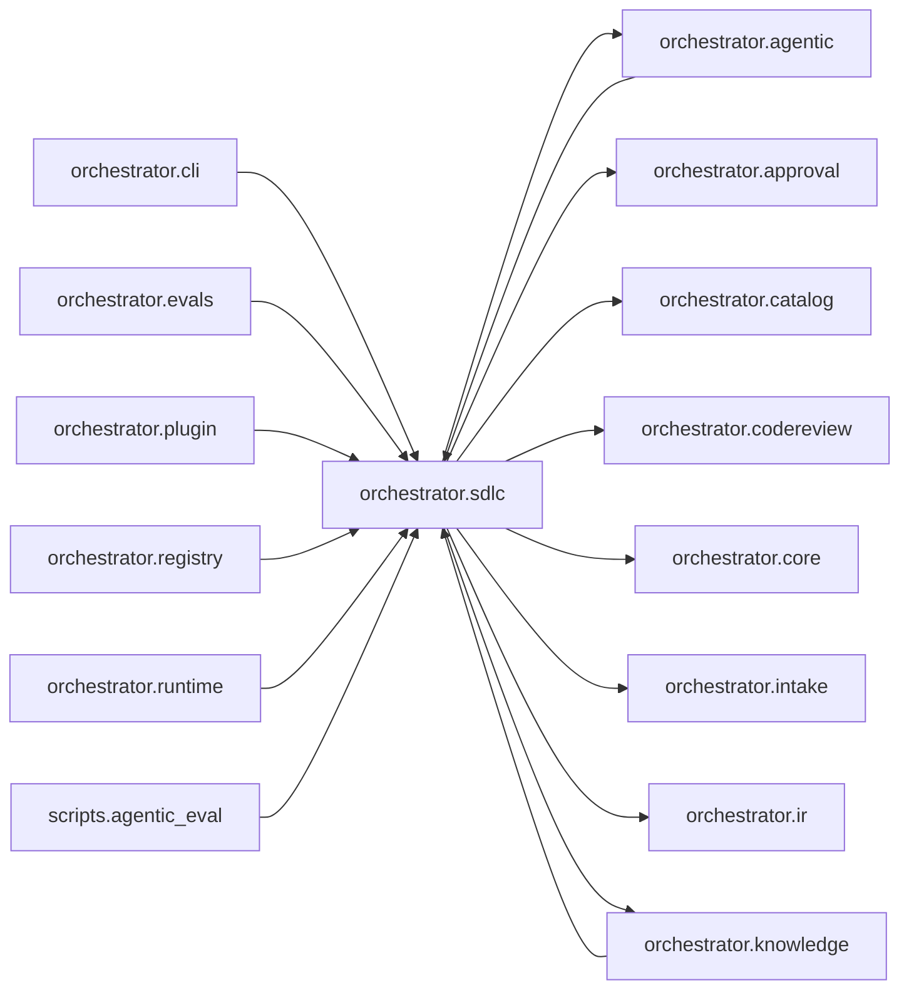

# `orchestrator.sdlc`
<!-- generated by `orchestrator understand`; the PKG is source of truth, edits here are advisory -->

[← Episteme](../README.md) · [Architecture](../architecture.md)

**`orchestrator.sdlc`** is one of 50 areas in this repo, in the `orchestrator` zone. It holds 45 modules — 116 types and 353 functions. It sits in the middle of the graph: 17 areas below it, 14 above. Changes here can reach both ways.

**In the diagram:** **`orchestrator.sdlc`** (this area) · [`orchestrator.agentic`](orchestrator.agentic.md) · [`orchestrator.cli`](orchestrator.cli.md) · [`orchestrator.evals`](orchestrator.evals.md) · [`orchestrator.knowledge`](orchestrator.knowledge.md) · [`orchestrator.plugin`](orchestrator.plugin.md) · [`orchestrator.registry`](orchestrator.registry.md) · [`orchestrator.runtime`](orchestrator.runtime.md) · `scripts.agentic_eval` · `orchestrator.approval` · [`orchestrator.catalog`](orchestrator.catalog.md) · [`orchestrator.codereview`](orchestrator.codereview.md) · [`orchestrator.core`](orchestrator.core.md) · [`orchestrator.intake`](orchestrator.intake.md) · [`orchestrator.ir`](orchestrator.ir.md)

_Showing 16 of 31 neighbouring areas._

## Modules

- [`orchestrator.sdlc`](../../src/orchestrator/sdlc/__init__.py#L1)
- [`orchestrator.sdlc.activities`](../../src/orchestrator/sdlc/activities.py#L1)
- [`orchestrator.sdlc.autorun`](../modules/orchestrator.sdlc.autorun.md)
- [`orchestrator.sdlc.builddoc`](../modules/orchestrator.sdlc.builddoc.md)
- [`orchestrator.sdlc.case`](../../src/orchestrator/sdlc/case.py#L1)
- [`orchestrator.sdlc.ci`](../../src/orchestrator/sdlc/ci.py#L1)
- [`orchestrator.sdlc.codegen`](../modules/orchestrator.sdlc.codegen.md)
- [`orchestrator.sdlc.comprehension`](../../src/orchestrator/sdlc/comprehension.py#L1)
- [`orchestrator.sdlc.conventions`](../../src/orchestrator/sdlc/conventions.py#L1)
- [`orchestrator.sdlc.coverage`](../../src/orchestrator/sdlc/coverage.py#L1)
- [`orchestrator.sdlc.criteria_binding`](../../src/orchestrator/sdlc/criteria_binding.py#L1)
- [`orchestrator.sdlc.deps`](../../src/orchestrator/sdlc/deps.py#L1)
- [`orchestrator.sdlc.design`](../modules/orchestrator.sdlc.design.md)
- [`orchestrator.sdlc.design_validator`](../../src/orchestrator/sdlc/design_validator.py#L1)
- [`orchestrator.sdlc.escalate`](../../src/orchestrator/sdlc/escalate.py#L1)
- [`orchestrator.sdlc.escalation`](../../src/orchestrator/sdlc/escalation.py#L1)
- [`orchestrator.sdlc.evidence`](../modules/orchestrator.sdlc.evidence.md)
- [`orchestrator.sdlc.excerpt`](../../src/orchestrator/sdlc/excerpt.py#L1)
- [`orchestrator.sdlc.feature_runner`](../modules/orchestrator.sdlc.feature_runner.md)
- [`orchestrator.sdlc.forge`](../../src/orchestrator/sdlc/forge.py#L1)
- [`orchestrator.sdlc.gitauth`](../../src/orchestrator/sdlc/gitauth.py#L1)
- [`orchestrator.sdlc.grounding`](../../src/orchestrator/sdlc/grounding.py#L1)
- [`orchestrator.sdlc.impact`](../../src/orchestrator/sdlc/impact.py#L1)
- [`orchestrator.sdlc.investigate`](../../src/orchestrator/sdlc/investigate.py#L1)
- [`orchestrator.sdlc.layout`](../modules/orchestrator.sdlc.layout.md)
- [`orchestrator.sdlc.localize`](../../src/orchestrator/sdlc/localize.py#L1)
- [`orchestrator.sdlc.preflight`](../../src/orchestrator/sdlc/preflight.py#L1)
- [`orchestrator.sdlc.profiles`](../../src/orchestrator/sdlc/profiles/__init__.py#L1)
- [`orchestrator.sdlc.rca`](../../src/orchestrator/sdlc/rca.py#L1)
- [`orchestrator.sdlc.review`](../../src/orchestrator/sdlc/review.py#L1)
- [`orchestrator.sdlc.review_response`](../../src/orchestrator/sdlc/review_response.py#L1)
- [`orchestrator.sdlc.reviewloop`](../../src/orchestrator/sdlc/reviewloop.py#L1)
- [`orchestrator.sdlc.run_control`](../../src/orchestrator/sdlc/run_control.py#L1)
- [`orchestrator.sdlc.runstate`](../../src/orchestrator/sdlc/runstate.py#L1)
- [`orchestrator.sdlc.scaffold`](../modules/orchestrator.sdlc.scaffold.md)
- [`orchestrator.sdlc.spec_file`](../../src/orchestrator/sdlc/spec_file.py#L1)
- [`orchestrator.sdlc.sql_build`](../../src/orchestrator/sdlc/sql_build.py#L1)
- [`orchestrator.sdlc.telemetry`](../../src/orchestrator/sdlc/telemetry.py#L1)
- [`orchestrator.sdlc.testenv`](../modules/orchestrator.sdlc.testenv.md)
- [`orchestrator.sdlc.testrunner`](../modules/orchestrator.sdlc.testrunner.md)
- [`orchestrator.sdlc.types`](../../src/orchestrator/sdlc/types.py#L1)
- [`orchestrator.sdlc.validity`](../modules/orchestrator.sdlc.validity.md)
- [`orchestrator.sdlc.worker`](../modules/orchestrator.sdlc.worker.md)
- [`orchestrator.sdlc.workflows`](../../src/orchestrator/sdlc/workflows.py#L1)
- [`orchestrator.sdlc.workspace`](../../src/orchestrator/sdlc/workspace.py#L1)

## Depends on

[`orchestrator.agentic`](orchestrator.agentic.md), `orchestrator.approval`, [`orchestrator.catalog`](orchestrator.catalog.md), [`orchestrator.codereview`](orchestrator.codereview.md), [`orchestrator.core`](orchestrator.core.md), [`orchestrator.intake`](orchestrator.intake.md), [`orchestrator.ir`](orchestrator.ir.md), [`orchestrator.knowledge`](orchestrator.knowledge.md), [`orchestrator.mcp`](orchestrator.mcp.md), `orchestrator.notify`, [`orchestrator.obs`](orchestrator.obs.md), [`orchestrator.personas`](orchestrator.personas.md), [`orchestrator.pkg`](orchestrator.pkg.md), [`orchestrator.registry`](orchestrator.registry.md), [`orchestrator.runtime`](orchestrator.runtime.md), [`orchestrator.spine`](orchestrator.spine.md), [`orchestrator.temporal`](orchestrator.temporal.md)

## Depended on by

[`orchestrator.agentic`](orchestrator.agentic.md), [`orchestrator.cli`](orchestrator.cli.md), [`orchestrator.evals`](orchestrator.evals.md), [`orchestrator.knowledge`](orchestrator.knowledge.md), [`orchestrator.plugin`](orchestrator.plugin.md), [`orchestrator.registry`](orchestrator.registry.md), [`orchestrator.runtime`](orchestrator.runtime.md), `scripts.agentic_eval`, `scripts.audit_eval`, `scripts.codegen_ab`, [`scripts.codegen_benchmark`](scripts.codegen_benchmark.md), `scripts.live_sdlc_worker`, `scripts.phase2a_parity_gate`, `scripts.skill_ab`
