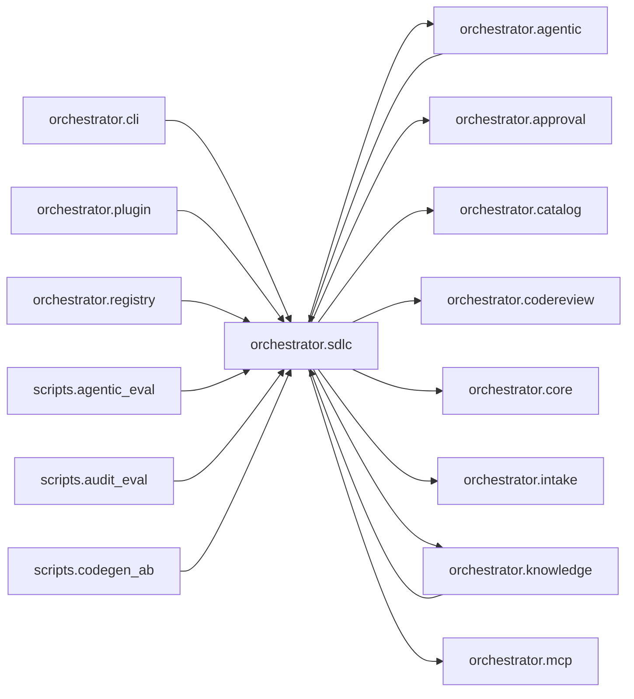

# `orchestrator.sdlc`
<!-- generated by `orchestrator understand`; the PKG is source of truth, edits here are advisory -->

[← Episteme](../README.md) · [Architecture](../architecture.md)

**`orchestrator.sdlc`** is one of 46 areas in this repo, in the `orchestrator` zone. It holds 31 modules — 83 types and 195 functions. It sits in the middle of the graph: 15 areas below it, 11 above. Changes here can reach both ways.

**In the diagram:** **`orchestrator.sdlc`** (this area) · [`orchestrator.agentic`](orchestrator.agentic.md) · [`orchestrator.cli`](orchestrator.cli.md) · [`orchestrator.knowledge`](orchestrator.knowledge.md) · [`orchestrator.plugin`](orchestrator.plugin.md) · [`orchestrator.registry`](orchestrator.registry.md) · `scripts.agentic_eval` · `scripts.audit_eval` · `scripts.codegen_ab` · [`orchestrator.approval`](orchestrator.approval.md) · [`orchestrator.catalog`](orchestrator.catalog.md) · [`orchestrator.codereview`](orchestrator.codereview.md) · [`orchestrator.core`](orchestrator.core.md) · [`orchestrator.intake`](orchestrator.intake.md) · [`orchestrator.mcp`](orchestrator.mcp.md)

_Showing 16 of 26 neighbouring areas._

## Modules

- [`orchestrator.sdlc`](../../src/orchestrator/sdlc/__init__.py#L1)
- [`orchestrator.sdlc.activities`](../../src/orchestrator/sdlc/activities.py#L1)
- [`orchestrator.sdlc.ci`](../../src/orchestrator/sdlc/ci.py#L1)
- [`orchestrator.sdlc.codegen`](../modules/orchestrator.sdlc.codegen.md)
- [`orchestrator.sdlc.comprehension`](../../src/orchestrator/sdlc/comprehension.py#L1)
- [`orchestrator.sdlc.conventions`](../../src/orchestrator/sdlc/conventions.py#L1)
- [`orchestrator.sdlc.coverage`](../../src/orchestrator/sdlc/coverage.py#L1)
- [`orchestrator.sdlc.deps`](../../src/orchestrator/sdlc/deps.py#L1)
- [`orchestrator.sdlc.design`](../../src/orchestrator/sdlc/design.py#L1)
- [`orchestrator.sdlc.escalation`](../../src/orchestrator/sdlc/escalation.py#L1)
- [`orchestrator.sdlc.feature_runner`](../../src/orchestrator/sdlc/feature_runner.py#L1)
- [`orchestrator.sdlc.forge`](../../src/orchestrator/sdlc/forge.py#L1)
- [`orchestrator.sdlc.gitauth`](../../src/orchestrator/sdlc/gitauth.py#L1)
- [`orchestrator.sdlc.grounding`](../../src/orchestrator/sdlc/grounding.py#L1)
- [`orchestrator.sdlc.impact`](../modules/orchestrator.sdlc.impact.md)
- [`orchestrator.sdlc.investigate`](../../src/orchestrator/sdlc/investigate.py#L1)
- [`orchestrator.sdlc.layout`](../modules/orchestrator.sdlc.layout.md)
- [`orchestrator.sdlc.localize`](../../src/orchestrator/sdlc/localize.py#L1)
- [`orchestrator.sdlc.preflight`](../../src/orchestrator/sdlc/preflight.py#L1)
- [`orchestrator.sdlc.rca`](../../src/orchestrator/sdlc/rca.py#L1)
- [`orchestrator.sdlc.review`](../../src/orchestrator/sdlc/review.py#L1)
- [`orchestrator.sdlc.review_response`](../../src/orchestrator/sdlc/review_response.py#L1)
- [`orchestrator.sdlc.run_control`](../../src/orchestrator/sdlc/run_control.py#L1)
- [`orchestrator.sdlc.scaffold`](../modules/orchestrator.sdlc.scaffold.md)
- [`orchestrator.sdlc.sql_build`](../../src/orchestrator/sdlc/sql_build.py#L1)
- [`orchestrator.sdlc.testenv`](../modules/orchestrator.sdlc.testenv.md)
- [`orchestrator.sdlc.testrunner`](../modules/orchestrator.sdlc.testrunner.md)
- [`orchestrator.sdlc.types`](../../src/orchestrator/sdlc/types.py#L1)
- [`orchestrator.sdlc.worker`](../modules/orchestrator.sdlc.worker.md)
- [`orchestrator.sdlc.workflows`](../../src/orchestrator/sdlc/workflows.py#L1)
- [`orchestrator.sdlc.workspace`](../../src/orchestrator/sdlc/workspace.py#L1)

## Depends on

[`orchestrator.agentic`](orchestrator.agentic.md), [`orchestrator.approval`](orchestrator.approval.md), [`orchestrator.catalog`](orchestrator.catalog.md), [`orchestrator.codereview`](orchestrator.codereview.md), [`orchestrator.core`](orchestrator.core.md), [`orchestrator.intake`](orchestrator.intake.md), [`orchestrator.knowledge`](orchestrator.knowledge.md), [`orchestrator.mcp`](orchestrator.mcp.md), `orchestrator.notify`, [`orchestrator.personas`](orchestrator.personas.md), [`orchestrator.pkg`](orchestrator.pkg.md), [`orchestrator.registry`](orchestrator.registry.md), [`orchestrator.runtime`](orchestrator.runtime.md), [`orchestrator.spine`](orchestrator.spine.md), [`orchestrator.temporal`](orchestrator.temporal.md)

## Depended on by

[`orchestrator.agentic`](orchestrator.agentic.md), [`orchestrator.cli`](orchestrator.cli.md), [`orchestrator.knowledge`](orchestrator.knowledge.md), [`orchestrator.plugin`](orchestrator.plugin.md), [`orchestrator.registry`](orchestrator.registry.md), `scripts.agentic_eval`, `scripts.audit_eval`, `scripts.codegen_ab`, [`scripts.codegen_benchmark`](scripts.codegen_benchmark.md), `scripts.live_sdlc_worker`, `scripts.skill_ab`
