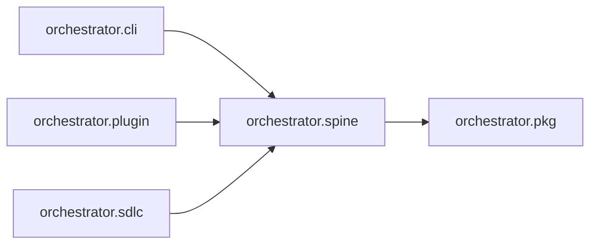

# `orchestrator.spine`
<!-- generated by `orchestrator understand`; the PKG is source of truth, edits here are advisory -->

[← Episteme](../README.md) · [Architecture](../architecture.md)

**`orchestrator.spine`** is one of 53 areas in this repo, in the `orchestrator` zone. It holds 14 modules — 33 types and 19 functions. It sits in the middle of the graph: 1 area below it, 3 above. Changes here can reach both ways.

**In the diagram:** **`orchestrator.spine`** (this area) · [`orchestrator.cli`](orchestrator.cli.md) · [`orchestrator.plugin`](orchestrator.plugin.md) · [`orchestrator.sdlc`](orchestrator.sdlc.md) · [`orchestrator.pkg`](orchestrator.pkg.md)

## Modules

- [`orchestrator.spine`](../../src/orchestrator/spine/__init__.py#L1)
- [`orchestrator.spine.benchmark`](../../src/orchestrator/spine/benchmark.py#L1)
- [`orchestrator.spine.drift`](../../src/orchestrator/spine/drift.py#L1)
- [`orchestrator.spine.entity_key`](../../src/orchestrator/spine/entity_key.py#L1)
- [`orchestrator.spine.execute`](../../src/orchestrator/spine/execute.py#L1)
- [`orchestrator.spine.grounder`](../../src/orchestrator/spine/grounder.py#L1)
- [`orchestrator.spine.grounding`](../../src/orchestrator/spine/grounding.py#L1)
- [`orchestrator.spine.lineage`](../../src/orchestrator/spine/lineage.py#L1)
- [`orchestrator.spine.mapper`](../../src/orchestrator/spine/mapper.py#L1)
- [`orchestrator.spine.ontology`](../../src/orchestrator/spine/ontology.py#L1)
- [`orchestrator.spine.ontomesh_client`](../../src/orchestrator/spine/ontomesh_client.py#L1)
- [`orchestrator.spine.remediation`](../../src/orchestrator/spine/remediation.py#L1)
- [`orchestrator.spine.shipment`](../../src/orchestrator/spine/shipment.py#L1)
- [`orchestrator.spine.store`](../../src/orchestrator/spine/store.py#L1)

## Depends on

[`orchestrator.pkg`](orchestrator.pkg.md)

## Depended on by

[`orchestrator.cli`](orchestrator.cli.md), [`orchestrator.plugin`](orchestrator.plugin.md), [`orchestrator.sdlc`](orchestrator.sdlc.md)
