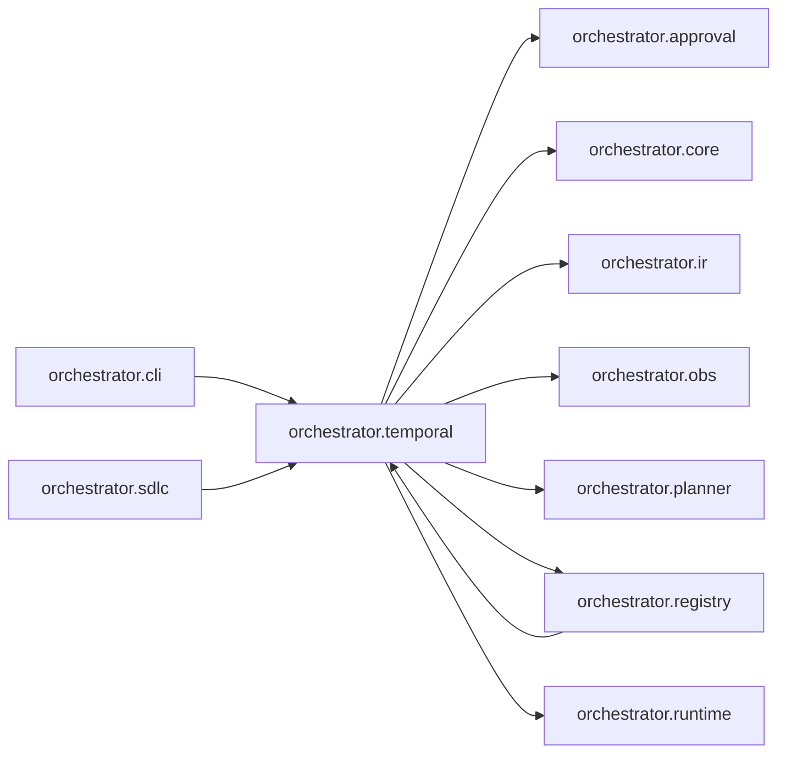

# `orchestrator.temporal`
<!-- generated by `orchestrator understand`; the PKG is source of truth, edits here are advisory -->

[← Episteme](../README.md) · [Architecture](../architecture.md)

**`orchestrator.temporal`** is one of 53 areas in this repo, in the `orchestrator` zone. It holds 6 modules — 7 types and 11 functions. It sits in the middle of the graph: 7 areas below it, 3 above. Changes here can reach both ways.

**In the diagram:** **`orchestrator.temporal`** (this area) · [`orchestrator.cli`](orchestrator.cli.md) · [`orchestrator.registry`](orchestrator.registry.md) · [`orchestrator.sdlc`](orchestrator.sdlc.md) · `orchestrator.approval` · [`orchestrator.core`](orchestrator.core.md) · [`orchestrator.ir`](orchestrator.ir.md) · [`orchestrator.obs`](orchestrator.obs.md) · [`orchestrator.planner`](orchestrator.planner.md) · [`orchestrator.runtime`](orchestrator.runtime.md)

## Modules

- [`orchestrator.temporal`](../../src/orchestrator/temporal/__init__.py#L1)
- [`orchestrator.temporal.activities`](../../src/orchestrator/temporal/activities.py#L1)
- [`orchestrator.temporal.config`](../../src/orchestrator/temporal/config.py#L1)
- [`orchestrator.temporal.deps`](../../src/orchestrator/temporal/deps.py#L1)
- [`orchestrator.temporal.worker`](../../src/orchestrator/temporal/worker.py#L1)
- [`orchestrator.temporal.workflow`](../../src/orchestrator/temporal/workflow.py#L1)

## Depends on

`orchestrator.approval`, [`orchestrator.core`](orchestrator.core.md), [`orchestrator.ir`](orchestrator.ir.md), [`orchestrator.obs`](orchestrator.obs.md), [`orchestrator.planner`](orchestrator.planner.md), [`orchestrator.registry`](orchestrator.registry.md), [`orchestrator.runtime`](orchestrator.runtime.md)

## Depended on by

[`orchestrator.cli`](orchestrator.cli.md), [`orchestrator.registry`](orchestrator.registry.md), [`orchestrator.sdlc`](orchestrator.sdlc.md)
