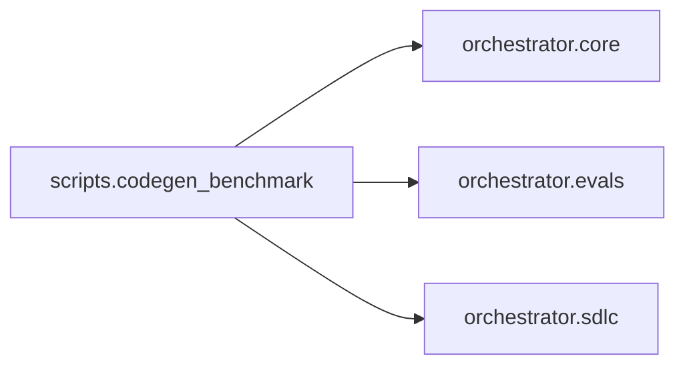

# `scripts.codegen_benchmark`
<!-- generated by `orchestrator understand`; the PKG is source of truth, edits here are advisory -->

[← Episteme](../README.md) · [Architecture](../architecture.md)

**`scripts.codegen_benchmark`** is one of 46 areas in this repo, in the `scripts` zone. It holds 1 module — 1 types and 10 functions. No other area imports it, and it draws on 3 — it's a leaf, so it's the safer place to change.

**In the diagram:** **`scripts.codegen_benchmark`** (this area) · [`orchestrator.core`](orchestrator.core.md) · [`orchestrator.evals`](orchestrator.evals.md) · [`orchestrator.sdlc`](orchestrator.sdlc.md)

## Modules

- [`scripts.codegen_benchmark`](../modules/scripts.codegen_benchmark.md)

## Depends on

[`orchestrator.core`](orchestrator.core.md), [`orchestrator.evals`](orchestrator.evals.md), [`orchestrator.sdlc`](orchestrator.sdlc.md)
